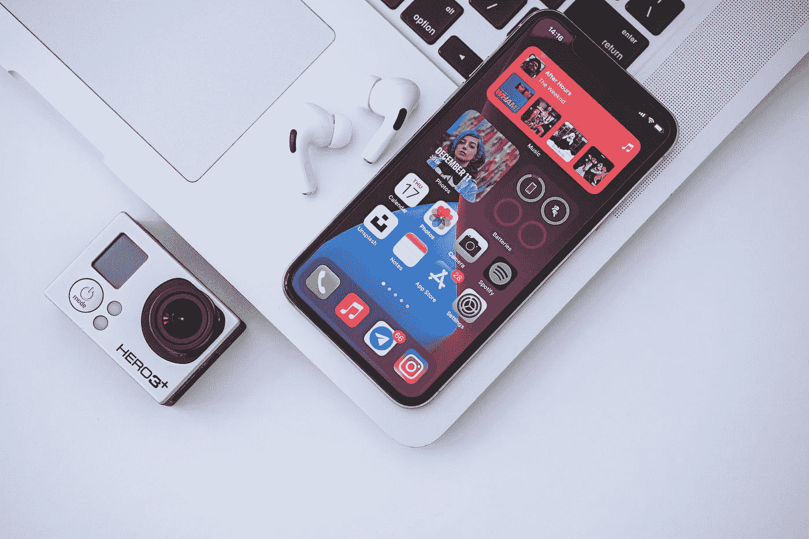

# 使用 SwiftUI 在 iOS 14 Widgets 中实现可访问性

> 原文：<https://betterprogramming.pub/accessibility-in-ios-14-widgets-with-swiftui-83656bdb68e2>

## 为你的用户创建授权部件



[奥米德·阿明](https://unsplash.com/@omidarmin?utm_source=medium&utm_medium=referral)在 [Unsplash](https://unsplash.com?utm_source=medium&utm_medium=referral) 拍摄的照片

# 介绍

今年夏天，苹果宣布了 iOS 14 的小工具，你可以在主屏幕上与现有的应用程序放在一起。窗口小部件可以帮助你个性化屏幕，预先显示相关数据。

本文涵盖了使用 SwiftUI 为您的小部件创建良好的画外音、语音控制和自适应显示体验的基础调整。

# SwiftUI 中的可访问性

令人耳目一新的是，使用 SwiftUI 使您的应用程序易于访问。向设置图标添加辅助功能标签非常简单:

```
.accessibilityLabel(“Settings“)
```

开发者可以利用这些简单的 API，并在他们的应用中实现它们。

还有小部件。

因此，让我们来看看一些关于可访问性的主题，以及如何在小部件中实现它们！

# 画外音和 Widgets

VoiceOver 是 iOS 中内置的屏幕阅读器，允许盲人和弱视用户使用触摸屏，当他们在触摸屏上平移或滑动时，通过声音描述屏幕的元素。

我将重点介绍一些通用的辅助功能 API，您可以将它们应用到您的应用程序中，为 VoiceOver 用户提供出色的体验。

*   `**accessibilityLabel(_:)**` 你通常会用这种方法给图片和 logos 提供标签。你可以在小工具上有你的应用的标志，你可能希望用户听到，而不是`logo_image`或类似的东西。

```
Image("logo_image").accessibilityLabel(model.appName)
```

*   `**accessibilityValue(_:)**` 如果你的小部件有带静态标签的动态值，你应该使用这个方法。例如，在一个读书跟踪器小部件中，可以使用这种方法定义动态阅读的书籍数量。

```
Text("Number of books read")
  .accessibilityValue("\(model.booksRead)")
```

*   提示用于向用户传达在他们对可访问性元素执行操作后会发生什么。这有助于提供主`**accessibilityLabel**` 本身无法容纳的信息。例如，在一堆小工具上，系统提供的提示是——“上下滑动以选择一个自定义操作，然后双击以激活。”当您在堆栈中的 widget 中的元素上向上或向下滑动时，自定义操作将是“下一个 Widget”和“上一个 Widget”虽然，小部件要么是静态数据，要么是深层链接，告诉用户它是一个按钮。我还没有遇到过苹果创建的提供自定义提示的小部件，因为在这种情况下不需要它。
*   `**accessibilityAction(_:_:)**`**widget 上的一个动作要么对简略数据来说什么都不是，要么直接通过点击某个元素的深层链接打开 app。因此可能不需要自定义操作。**
*   **`**accessibilityElement(children:)**` 这种实例方法在你可能想组合大量文本一次阅读时特别有用。例如，播客应用程序将播客的名称、作者、数据和描述组合成一个元素。**

```
VStack {
  Text("\(model.date)")
  Text(model.author)
  Text(model.title)
  Text(model.description)
}
.accessibilityElement(children: .combine)
```

*   **`**accessibilityHidden(_:)**` 有些情况下，您可能想要在 VoiceOver 阅读元素时完全隐藏图像。在这种情况下，你应该使用这种方法。例如，在天气小部件中，用于描述天气的图标不是由阅读器读出的。请注意`Image`还有一个初始化器，阅读器可以跳过读取图像元素。**

```
Image(decorative: model.imageName)
```

*   **`**accessibilityAddTraits(_:)**` 为了最好地描述可访问性元素及其特征，使用了这个方法。例如，您的应用程序中可能有标题文本，为了将其与其他文本区分开来，您可以为其使用`isHeader`类型属性。**

```
VStack {
  Text("Gradient Game").accessibilityAddTraits(.isHeader)
  ForEach(model.histories, id: \.self, content: HistoryView.init)
}
```

**除此之外，要使用 intents 配置小部件，用户可以长按两下来编辑小部件并打开配置菜单。在我的一般观察中，菜单中的列表本身就具有可访问性优势。**

**比如在`INObjectSection`中提供标题时，它会自动用 header trait 来配置。**

```
INObjectSection(title: "Categories", items: categories)
```

**这个话题就要结束了，希望你为 VoiceOver 用户创造美好的体验！**

# **语音控制和小工具**

**语音控制是一项辅助功能，可让您仅使用语音来控制 iPhone、iPad 和 Mac。它使用户能够输入文本、启动应用程序，以及做他们原本用手指做的任何事情。特别是对于有严重运动障碍的用户来说，这是一个改变生活的工具。**

**如果您的 widget 可以通过 VoiceOver 访问，它通常也可以通过语音控制访问。可以改进的部分是给标签添加替换名称，这在`systemMedium`或`systemLarge`小部件中会变得冗长且重复。**

**输入标签方法`accessibilityInputLabels(_:)`在使用语音控制和全键盘访问时给出一个替代标签。**

**我花了大约两个小时的时间在最新版本的 Xcode 上试着让它工作，但不幸的是，它还不能与 widgets 一起工作，尽管它在应用程序上工作得非常好。这是一个错误，我已经提交了反馈。**

**当这在未来工作时，代码可能看起来类似于这样，VoiceOver 将所有元素作为一个整体读取，而 Voice Control 只显示标题，以减少屏幕上的混乱，同时使用户更容易说出标题，以便 Voice Control 处理该命令。**

```
VStack {
  Text("\(model.date)")
  Text(model.author)
  Text(model.title)
  Text(model.description)
}
.accessibilityElement(children: .combine)
.accessibilityInputLabels([model.title])
```

# **显示/文本大小和小部件**

**动态类型是帮助用户根据他们的偏好改变系统文本大小的一个特征。对许多人来说，这可能只是一种选择，但对一些人来说，这是一种必然。**

**SwiftUI 的另一个优点是开箱即可支持该特性。如果您正在使用普通的`Font`并且没有硬编码大小，SwiftUI 将根据系统偏好自动缩放文本大小。这也适用于小部件。**

```
.font(.caption2)
```

**支持这个特性的最好方法是测试它。如果您发现您的设计脱离了小部件，甚至在非辅助功能类别尺寸中，您可能需要以一种面向辅助功能的方式重新考虑您的设计，因为小部件在 iPod Touch (4 英寸显示屏)和 SE(4.7 英寸显示屏)上也受支持，并且它应该在所有设备上都看起来不错。**

**支持辅助功能文本大小**

**但我理解。小部件很小，您可能会发现很难支持可访问性类别的大小。甚至是 xxxLarge/xxLarge 的尺寸。在这种情况下，您可以尝试用完全不同的设计来处理这些情况。**

**支持大文本尺寸**

**除了可缩放字体，如果你进入设置>显示和文本大小，你会发现用户可以设置几个偏好，如降低透明度，增加对比度，无颜色区分等。**

**为了尊重用户的偏好，SwiftUI 为我们提供了强大的环境值，您可以从中读取并相应地在小部件中添加条件。**

**我简单列举一个，怎么用。**

*   **`**legibilityWeight**`这反映了粗体文本显示设置的值。默认情况下，视图会自动适应它。但是如果你已经指定了一个字体粗细，你可以添加条件来考虑`legibilityWeight`的值。**

**支持粗体文本**

**整个列表可以在`[EnvironmentValues](https://developer.apple.com/documentation/swiftui/environmentvalues)`文档中找到，它列出了你可以在你的小部件中修改的主要列表。它们中的大多数都可以通过提供一个条件视图或修饰符来配置，就像在`sizeCategory`和`legibilityWeight`的情况下一样。**

*   **`**accessibilityDifferentiateWithoutColor**`在这种情况下，使用不同的形状和符号设计来传达意思，而不是仅仅依靠颜色。**
*   **`**accessibilityReduceTransparency**`如果该条件为真，背景不应透明或模糊，而应不透明。一个很好的例子是 Batteries 小部件，它有一个半透明的背景，但是当这个布尔值被设置为`true`时，它就变得不透明了。**
*   **`**colorSchemeContrast**`您可以通过提供交替的高对比度图像和颜色来增加对比度，从而调整您的 UI 来处理`ColorSchemeContrast` `increased`的情况。**

**有一个关于[让你的应用可视化的 WWDC 2020 会议](https://developer.apple.com/videos/play/wwdc2020/10020/)，我推荐你观看。德鲁·哈斯的一句话让我印象深刻:**

> **“开发的早期阶段是开始考虑视觉无障碍设施的最佳时机，但深入研究永远不会太晚。”**

# **结论**

**微件非常适合在用户不打开应用程序的情况下呈现给用户的相关信息。**

**让每个人都能接触到它们是蛋糕上的樱桃。您可能已经开始开发自己的小部件，或者已经发布了一些很棒的小部件。但是如果你还没有，这是一个从易访问性角度思考和设计的好时机！**

**我希望您能从这篇文章中获得一些价值，并在您的小部件中实现它。**