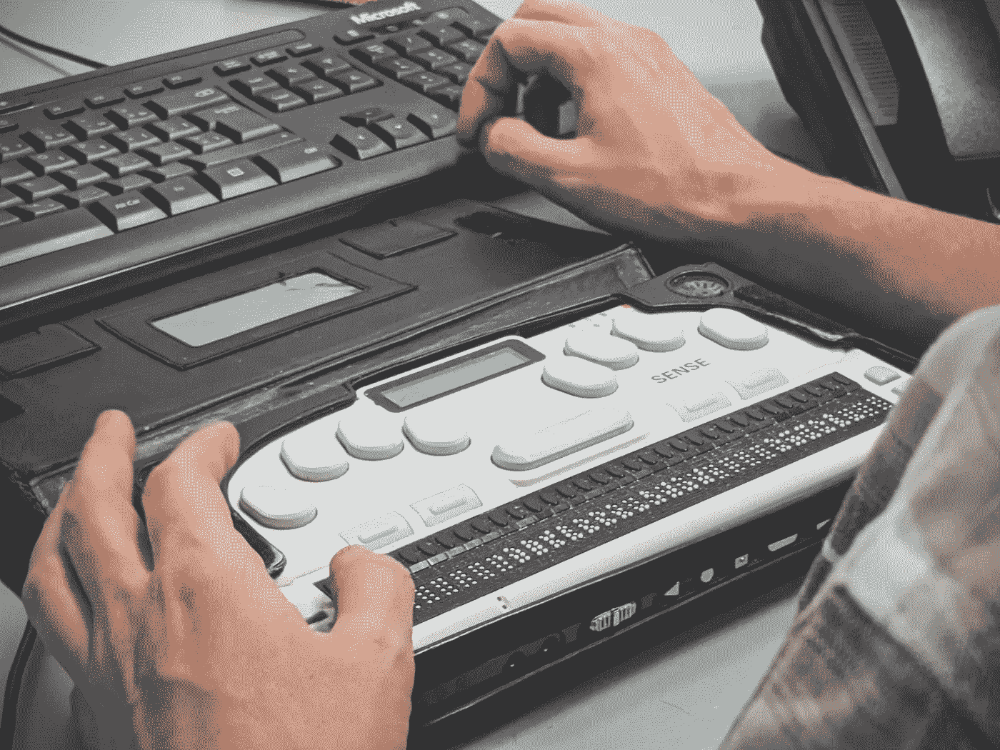
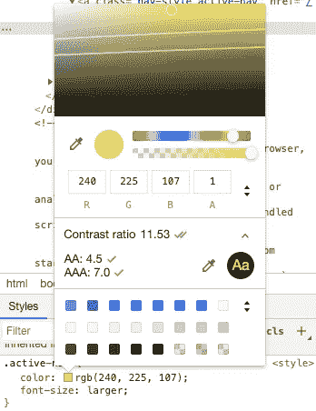
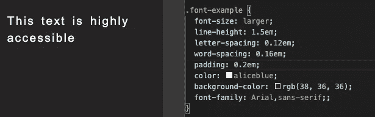

# Web 应用程序中的可访问性

> 原文：<https://betterprogramming.pub/accessibility-in-web-applications-a5b933537283>

## 照顾好你的用户

照片由[西格蒙德](https://unsplash.com/@sigmund?utm_source=unsplash&utm_medium=referral&utm_content=creditCopyText)在 [Unsplash](https://unsplash.com/s/photos/accessibility?utm_source=unsplash&utm_medium=referral&utm_content=creditCopyText) 上拍摄

这篇文章关注的是前端设计的可访问性标准——这是我最近一直在研究的一个话题。我不会对这个主题进行广泛、深入的介绍，我的目标是向您介绍一些简单的方法，让您开始将 WCAG 标准融入到任何应用中。

对于大多数人来说，可访问性可能是一个熟悉的术语，但它与 web 开发的相关性可能不是——这并不意味着我们不应该关心！作为开发人员，我们的工作是确保每个能访问我们产品的人也能使用它们。首先，这很重要*，因为这是做一个正派人的一部分*。除此之外，更好的可访问性是提高网站潜在流量的一种简单方法，[避免](https://www.boia.org/blog/is-there-a-legal-requirement-to-implement-wcag) [法律](https://www.w3.org/WAI/policies/) [问题](https://www.searchenginejournal.com/website-accessibility-law/285199/) *，*并迫使我们使用最佳实践，让我们都成为更好的开发者。

正如这里的[所解释的](https://www.w3.org/WAI/standards-guidelines/wcag/)，WCAG 代表网页内容可访问性指南。由 W3C 的可访问性指南工作组开发，作为网页可访问性倡议的一部分，WCAG 提供了关于标准的[文档](https://www.w3.org/WAI/standards-guidelines/wcag/docs/)“使网页内容对残疾人来说更容易访问”这些指导原则分为四类:

*   可知觉的
*   可操作的
*   可理解的
*   粗野的

每个部分都涵盖了各种各样的主题，并针对网站可能达到的不同等级或[评级](https://www.w3.org/TR/UNDERSTANDING-WCAG20/conformance.html)提供了解释和建议。在本文中，我将集中讨论这些标准的一个非常狭窄的范围——这个主题对我来说还是相当新的，而且太大了，无法在一篇文章中涵盖。

相反，我将讨论可访问性的一些视觉方面，如颜色对比和字体可读性，以及屏幕阅读器的适当 HTML 和标签。

# **颜色对比**

在你的设计中保持适当的颜色对比非常简单，可以在 Chrome 开发者工具中管理，或者通过一些不同的扩展来管理。根据 WCAG 的说法，保持高可读性的理想对比度是 4.5:1。这使得非盲人但患有视觉障碍的人更容易访问内容，这些视觉障碍可能使颜色更难区分。这可以应用于网页的任何元素，比如字体、按钮、图像等等。

正如数字设计和营销机构 Happy Cog 的[视频中所解释的，要在 Chrome 中检查你的颜色比例，打开你的开发者工具并选择你想要检查的元素。在“样式”选项卡中，找到应用于元素的颜色，然后单击色样。您应该会看到一个弹出窗口，该窗口将为您提供有关颜色的详细信息，包括对比度。](https://www.happycog.com/accessibility-and-you/)

在那里，您还可以探索不同的颜色，并获得对比度的实时更新。

# **字体可读性**

确保网站上的文本易于阅读是另一种让所有用户都能访问您的内容的简单方法。已经有一些很棒的文章和视频深入探讨了字体大小，比如 Matej Latin 的[这篇文章](https://betterwebtype.com/articles/2019/06/16/5-keys-to-accessible-web-typography/)，我强烈推荐阅读。就我而言，我只打算总结一下这个问题的一些关键方面。其中一些直接引自 WCAG:

*   保持与上述相同的对比度规则。
*   使用简单易读的字体。
*   使用可缩放的字体大小，如命名大小、百分比或 em/rem。
*   行高(行距)至少为字体大小的 1.5 倍。
*   段落间距至少是字体大小的两倍。
*   字母间距(跟踪)至少为字体大小的 0.12 倍。
*   字间距至少为字体大小的 0.16 倍。

下面是我整理的一些文本的例子，我认为它们符合这些准则:

# **屏幕阅读器:HTML 和 JavaScript**

使用正确的 HTML 显然是我们都应该尝试去做的事情，但是我知道我犯了一个错误，在不同的元素上抛出了一个 click 事件处理程序，并把它们当作按钮，而实际上没有使用 button 元素。我知道这不是最佳实践，但我不认为这有什么真正的危害——直到我了解了屏幕阅读器。

屏幕阅读器是在 HTML 中运行的工具，它获取正在显示的文本，并读给用户听。他们依赖开发人员使用语义 HTML 来准确传达每个元素的用途，这样他们就可以与用户共享这些信息。换句话说，如果我不使用实际的按钮元素，屏幕阅读器将无法告诉用户我的按钮实际上是一个按钮。

出于同样的原因，使用语义 HTML 很重要，同样重要的是，我们不能偷懒，忽略图像和其他非文本媒体的替代文本属性。这可以通过可用的内置 alt 属性以及 ARIA 标签来实现。

Gary Simon 的这个视频是一个很好的例子，展示了视障用户在使用网站时可能会遇到的问题。该视频还介绍了 ARIA，“可访问的富互联网应用程序 web 标准套件”，我不会深入介绍，但鼓励您仔细阅读。

# **前进**

我不知道你们所有人的情况，但研究这个课题让我明白，我有很多工作要做，才能让我的项目跟上进度。也就是说，一旦我完成了这些，我计划进一步挖掘其他的可访问性问题，比如键盘遍历、布局标准和内置选项，让用户定制他们的体验。

感谢您的阅读！如果您对其他工具或资源有任何建议，请在评论中分享。

## 额外资源

*   [网络无障碍标准介绍](https://www.youtube.com/watch?v=20SHvU2PKsM)，来自 W#C 的视频
*   我应该从哪里开始？ — WCAG
*   [WCAG 2 号文件](https://www.w3.org/WAI/standards-guidelines/wcag/docs/)
*   [快乐齿轮](https://www.happycog.com/accessibility-and-you/)视频演示
*   [咏叹调简介](https://www.youtube.com/watch?v=0hqhAIjE_8I)，聚焦穿越手风琴，来自加里·西蒙
*   反应中的可及性——尼韦迪塔的一次演讲

工具

*   [可访问性检查器](https://chrome.google.com/webstore/detail/axe-web-accessibility-tes/lhdoppojpmngadmnindnejefpokejbdd?hl=en-US) Chrome 扩展
*   [视觉模拟器](https://chrome.google.com/webstore/detail/nocoffee/jjeeggmbnhckmgdhmgdckeigabjfbddl?hl=en-US)镀铬扩展
*   [附加工具](https://www.softwaretestinghelp.com/accessibility-testing-tools/)