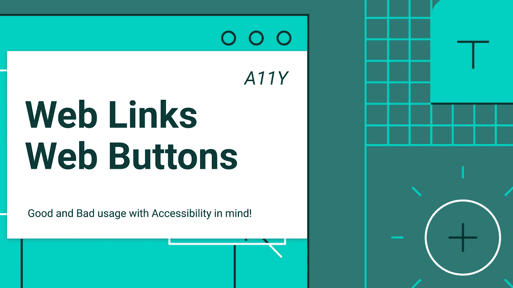

# 可访问性:网页链接应该是链接，网页按钮应该是按钮

> 原文：<https://betterprogramming.pub/accessibility-web-links-should-be-links-and-web-buttons-should-be-buttons-182ff042d087>

## 帮助每个人让网络变得更好

混合链接和按钮在 web 开发领域非常普遍。

很多时候你使用一个没有`href`的链接，并且你设置了自定义的`onclick`函数。或者对按钮进行同样的操作，创建一个充当链接的按钮。

我们将阐明链接和按钮的用法，并为您提供提高网站可访问性的技巧，同时也提高 Google SEO 的质量。

# 链接不应该是按钮

链接是用来去别的地方的。

当用户导航到网站上的新页面时，你应该使用链接。

但是屏幕阅读器、网络浏览器甚至谷歌都不允许用户关注没有`href`属性的`<a>`元素。

我再重复一遍:[谷歌只能关注那些带有`href`属性的](https://support.google.com/webmasters/answer/9112205) `[<a>](https://support.google.com/webmasters/answer/9112205)` [标签](https://support.google.com/webmasters/answer/9112205)的链接。

没有`href`标签的链接或者因为脚本事件而使用其他标签作为链接的做法对于 SEO 和可访问性来说是行不通的。

以下是谷歌和屏幕阅读器可以关注和不可以关注的链接示例。

这意味着点击链接不应该在后端添加、更改或删除任何数据(除了使用统计，这是不同的)。所以删除操作不应该是链接，也不应该是保存操作。

# 按钮不应该是链接

按钮用于改变应用程序的状态。除了表单的提交按钮之外，它们不应该把你移动到不同的页面。

它们可以在动态页面上使用，以改变从服务器获取的一些信息的设置状态，而无需重新加载或改变网站页面。

# 咏叹调角色

对于 ARIA 字段，所有 HTML 元素都引入了 role 属性。

这个属性`aria-role`可以用于将一个元素从它的类型转换为屏幕阅读器的另一种特定类型。

在这种情况下，我创建了一个 div，它变得像屏幕阅读器的[按钮](https://www.w3.org/TR/wai-aria-practices/examples/button/button.html)，然后我构建了一个[链接](https://www.w3.org/TR/wai-aria-practices/examples/link/link.html)，它转化为一个按钮。

## **tabindex="0"**

`tabindex="0"`是否需要让用户用屏幕阅读器聚焦并选择那些元素。`tabindex`告诉浏览器将这些元素添加到可以通过按 tab 键选择的元素中。

# 测试您的网站的可访问性问题！

有许多定制产品可以做到这一点，如 [Husable](http://bit.ly/accessibility_test_blind) 将为您的网站提供[真人测试评估](http://bit.ly/accessibility_test_blind)，以发现自动工具无法发现或发现的真正问题，因为[您只需要一个人](http://bit.ly/accessibility_test_blind)！

# 参考资料和资源

*   [bit.ly/accessibility_test_blind](http://bit.ly/accessibility_test_blind)
*   [http://we B- accessibility . Carnegie museums . org/content/buttons/](http://web-accessibility.carnegiemuseums.org/content/buttons/)
*   [https://support.google.com/webmasters/answer/9112205](https://support.google.com/webmasters/answer/9112205)
*   [https://www . w3 . org/TR/wai-aria-practices/examples/link/link . html](https://www.w3.org/TR/wai-aria-practices/examples/link/link.html)
*   [https://www . w3 . org/TR/wai-aria-practices/examples/button/button . html](https://www.w3.org/TR/wai-aria-practices/examples/button/button.html)
*   [https://developer . Mozilla . org/en-US/docs/Web/HTML/Global _ attributes/tabindex](https://developer.mozilla.org/en-US/docs/Web/HTML/Global_attributes/tabindex)