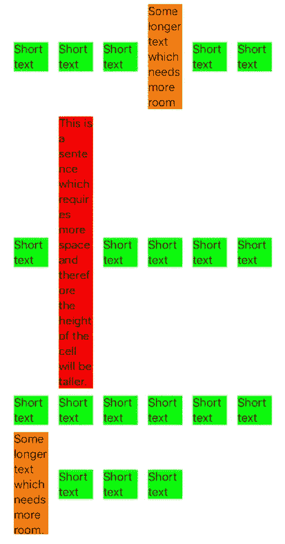
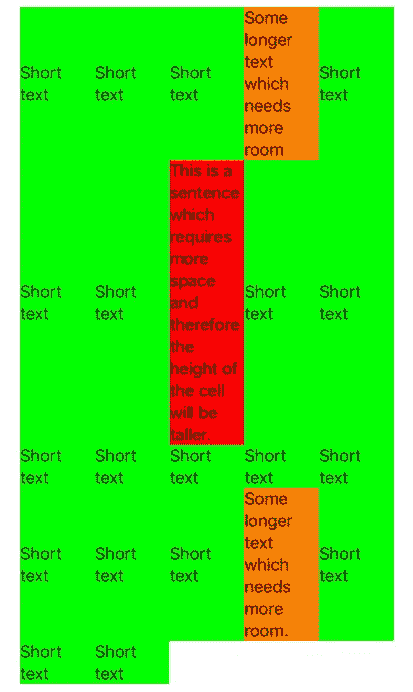
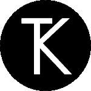

# 具有动态类型和自调整单元格大小的可访问 UICollectionViews

> 原文：<https://betterprogramming.pub/accessible-uicollectionviews-with-dynamic-type-and-self-sizing-cells-b06330c14c4c>

## 通过确保 UICollectionViews 随着用户文本大小首选项的更改而调整大小，使您的应用程序具有可访问性


*动态字体是 iOS 7 中引入的一项功能，允许用户更改 iOS 中使用的默认字体大小。它主要是为了支持视障用户，但在实践中，有许多 iOS 用户出于各种原因只喜欢较小/较大的阅读尺寸。*

在 iOS 的后续版本中，苹果进行了大量改进，以帮助开发人员实现辅助功能。每年在 [WWDC](https://developer.apple.com/wwdc19/) 上，苹果都会举办关于无障碍改进的会议，并推动开发者通过实施辅助技术来开发更具包容性的体验。例如，为 VoiceOver 用户提供出色体验的应用程序经常成为[苹果设计奖](https://developer.apple.com/design/awards/)的一部分。在 iOS 提供的所有辅助技术中，动态类型无疑是最重要的技术之一，它允许用户通过设置中的滑块来增加或减少设备上的文本大小。

尽管苹果推动开发包容性和可访问的体验，尽管动态类型早在 iOS 7 中就已经引入，但许多知名应用程序仍然缺乏对它的支持。这有许多原因:

*   缺乏对自定义字体的支持。大型组织开发的应用程序通常使用自定义字体来支持组织的视觉标识。在 iOS 11 中引入`UIFontMetrics`之前，根据`UIContentSizeCategory`中的变化缩放自定义字体是一项不小的工作量。大型组织开发的应用程序经常需要支持旧版本的 iOS，这意味着他们可能无法使用`UIFontMetrics`。
*   监听文本大小的变化限制了定制。自从引入`UIContentSizeCategoryAdjusting`协议以来，从 iOS 10 开始，使用`UILabel`、`UITextField`和`UITextView`观察文本大小的变化变得更加容易。在这些 UIKit 元素上实现的协议声明了一个`Bool`属性`adjustsFontForContentSizeCategory`，当设置为 true 时，允许这些 UIKit 元素根据用户在设置应用程序中的文本大小偏好自动调整其文本大小。然而，缺点是该协议仅在这三个 UIKit 元素上实现，它不支持属性文本，并且为了使用它，您必须从 11 个预定义的 UIFontTextStyles 中选择一个，这意味着您必须使用系统字体(当前为 San Francisco)和与这些样式相关联的预定字体大小。尽管人们通常对实现动态类型抱有很大的善意，但相关的约束条件(只能使用预先确定的字体和字号)往往是导致它从未被实现的因素。
*   在 iOS 上实现动态类型的最大挑战是确保当 UIKit 元素的文本大小增加时，其父视图的内容大小也增加，并且兄弟视图以一种不会使设计感觉破碎和不可用的方式布置在调整大小的视图周围。自动布局提供了实现这一点的方法，但是在选择约束时需要仔细考虑，以确保界面在更大的内容尺寸下仍然看起来很好。很容易出现自动布局需要打破约束以满足布局的情况，导致一个或多个元素以错误的大小结束，甚至出现在错误的位置。

当在 UITableView 或 UICollectionView 中显示文本内容时，我们可以使用自调整大小的单元格(在 iOS 8 中引入),以确保内容正确匹配，不会被挤压或截断。当单元格文本是动态的，或者当本地化一个应用程序以适应不同的语言，可能会占用不同的空间来表达相同的情感时，这也很方便。

# 自行调整大小的 UITableViewCells

当谈到 UITableViews 时，实现自调整单元格相对简单——事实上，从 iOS 11 开始，只要您以自动布局可以确定单元格高度的方式设置约束，那么这就是您需要做的全部工作。通常，这意味着在实现灵活的单元格高度时，通过显式设置宽度约束或设置前沿和后沿约束来确保视图具有受约束的宽度，因为如果单元格子视图可以具有无限的宽度，那么就没有办法计算单元格的高度。相反，当实现灵活的单元格宽度时，您会希望确保可以使用约束来具体确定单元格的高度。实现自调整单元格最困难的部分是确定要添加的约束条件，以便可以计算单元格的高度(或宽度)而不会产生歧义。

如果您的单元格包含任何 UILabel 元素，那么您需要将 Interface Builder 中的`Lines`属性设置为`0`，这表示标签可以根据需要使用任意多的行来适应文本内容。您还需要将`Line Break`属性设置为`Word Wrap`，这样就不会截断内容，内容会换行到下一行。当以编程方式配置一个`UILabel`时，同样的事情可以如下实现:

`label.[lineBreakMode](https://developer.apple.com/documentation/uikit/uilabel/1620525-linebreakmode) = .byWordWrapping`

`label.[numberOfLines](https://developer.apple.com/documentation/uikit/uilabel/1620539-numberoflines) = 0`

如果您需要支持 11 之前的 iOS 版本，那么您需要将`estimatedRowHeight`属性设置为一个值，以便启用单元格自调整。通常将该属性的值设置为`44.0`，因为这是 UITableViewCell 的默认高度。苹果人机界面指南还指出，您应该尝试[为所有控件保持 44pt x 44pt 的最小可点击区域](https://developer.apple.com/design/human-interface-guidelines/ios/visual-design/adaptivity-and-layout/#general-layout-considerations)。大多数教程都会建议将`estimatedRowHeight`属性和`rowHeight`属性设置为`UITableView.automaticDimension`，这表示 UITableView 应该尝试根据单元格的约束来确定它们的高度。

`tableView.estimatedRowHeight = 44.0`

`tableView.rowHeight = .automaticDimension`

实际上，应该只需要设置`estimatedRowHeight`(在 iOS 11 之前),因为`rowHeight`属性的默认值已经是`automaticDimension.`。从[苹果开发者文档](https://developer.apple.com/documentation/uikit/uitableview/1614925-estimatedrowheight)中还可以注意到以下关于`estimatedRowHeight`的内容:

> 默认值是`[automaticDimension](https://developer.apple.com/documentation/uikit/uitableview/1614961-automaticdimension)`，这意味着表格视图选择一个代表您的估计高度。将该值设置为`0`会禁用估计高度，这会导致表格视图请求每个单元格的实际高度。如果您的表格使用自行调整大小的单元格，则该属性的值不得为`0`。

如果您只需要调整某些单元格的大小，那么您可以在`UITableViewDelegate`中实现`[tableView(_:heightForRowAt:)](https://developer.apple.com/documentation/uikit/uitableviewdelegate/1614998-tableview)`，只为您希望调整大小的单元格返回`automaticDimension`。您还可以为`[tableView(_:estimatedHeightForRowAt:)](https://developer.apple.com/documentation/uikit/uitableviewdelegate/1614926-tableview)`提供一个实现，以便为每个单元格返回不同的估计行高。

# 自行调整 UICollectionView 单元格的大小

实现自调整大小的 UICollectionViewCells 稍微复杂一些，但遵循的模式基本相同。我们需要配置单元格的约束，以便 UICollectionView 布局可以代表我们确定单元格的高度。提供的`UICollectionViewLayout`是在网格中布局单元格的`[UICollectionViewFlowLayout](https://developer.apple.com/documentation/uikit/uicollectionviewflowlayout)`，具有`itemSize`属性和`estimatedItemSize`属性。我们可以将`itemSize`属性设置为一个 CGSize 值(默认值为`(50.0, 50.0)`)，但是这将导致所有单元格具有相同的尺寸。为布局提供项目大小的另一种方法是实现可选的委托方法`[collectionView(_:layout:sizeForItemAt:)](https://developer.apple.com/documentation/uikit/uicollectionviewdelegateflowlayout/1617708-collectionview)`。

在此方法的实现中，您可以基于每个单元格计算所提供的 IndexPath 的单元格的 CGSize，这意味着单元格可以具有不同的大小。这包括计算 UIKit 子视图(标签、图像等)的宽度和高度。)在细胞内。使用 NSString 方法`[boundingRect(with:options:attributes:context:)](https://developer.apple.com/documentation/foundation/nsstring/1524729-boundingrect).`可以计算 UILabel 中文本的高度

使用`intrinsicContentSize`属性可以获得图像的高度。如果你的视图以水平或垂直的方式排列在一个堆栈中，那么 UIStackView 可以让你的工作变得更加轻松。通过将视图添加为 UIStackView 的排列子视图，您可以访问堆栈视图的`intrinsicContentSize`属性，以确定其高度。

如果您的 UICollectionViewCell 包含任何 UILabel 元素，请记住设置`numberOfLines`属性和`lineBreakMode`作为表格视图单元格，以确保文本换行和标签能够随着文本内容的增加而增加高度。

使用前面提到的方法，我们可以通过允许我们的单元格具有单独的大小并根据其内容改变高度来支持动态类型，但是单元格还不能自我调整大小。要启用自调整单元格大小，我们需要通过设置 UICollectionViewFlowLayout 上的`estimatedItemSize`属性来提供一个非零的单元格大小估计值。

> 该属性的默认值是`[CGSizeZero](https://developer.apple.com/documentation/coregraphics/cgsizezero)`。将它设置为任何其他值都会导致集合视图使用单元格的`[preferredLayoutAttributesFitting(_:)](https://developer.apple.com/documentation/uikit/uicollectionreusableview/1620132-preferredlayoutattributesfitting)`方法查询每个单元格的实际大小。

在 iOS 10 之前，需要将`itemSize`属性设置为`UICollectionViewFlowLayout.automaticSize`并将`estimatedItemSize`设置为一个估计值，以尽可能精确地确定小区的大小。

从 iOS 10 开始，我们只需要将`estimatedItemSize`属性设置为`UICollectionViewFlowLayout.automaticSize`:

如果在 nib 或故事板中定义您的集合视图，您可能希望为您的 UICollectionViewLayout 创建一个出口，然后利用`didSet`观察器来设置`estimatedItemSize`。

一旦布局意识到它应该尝试根据单元格的约束自动调整单元格的大小，接下来我们需要做的就是在单元格的内容视图中禁用自动调整大小的掩码。

在引入 Auto Layout 之前，iOS 使用了一个名为 *springs 和 struts* 的系统来确定 UIView 的框架如何根据其 superview 的框架变化进行更新。弹簧代表 UIView 的宽度和高度如何拉伸或压缩，而支柱代表 UIView 从其超级视图和相邻视图的插入。本质上，springs 允许子视图随着其超级视图的增大而增大，而 struts 允许从兄弟视图和父视图定义一致的边距。

一个[自动调整大小掩码](https://developer.apple.com/documentation/uikit/uiview/1622559-autoresizingmask)是一个整数位掩码，代表一个视图的弹簧和支柱。当引入自动布局时，为了保持与旧的 springs 和 struts 系统的向后兼容性，默认情况下，UIView 的自动调整大小掩码被转换为约束。不幸的是，视图的弹簧和支柱到约束的自动转换并不总是给出想要的结果，因此一种禁用自动转换的方法以名为`translatesAutoresizingMaskIntoConstraints`的属性的形式存在。如果设置为`false`，那么视图的自动调整大小遮罩将不再被转换为自动布局约束。

根据`[translatesAutoresizingMaskIntoConstraints](https://developer.apple.com/documentation/uikit/uiview/1622572-translatesautoresizingmaskintoco):`的文档

> 请注意，自动调整大小掩码约束完全指定了视图的大小和位置；因此，如果不引入冲突，就无法添加额外的约束来修改此大小或位置。如果您想使用自动布局来动态计算视图的大小和位置，您必须将该属性设置为`false`，然后为视图提供一组明确、无冲突的约束。

所有集合视图单元格都有一个名为内容视图的子视图，您的标签、图像视图等都显示在内容视图中。已添加。不幸的是，默认情况下，内容视图的自动调整大小掩码被转换为约束，并且当这种情况发生时，由于作为具体指定视图大小的转换的一部分而添加的约束，内容视图的尺寸可能不再调整大小。因此，为了允许我们的单元格自行调整大小，我们需要禁用自动调整大小掩码的转换，并添加我们自己的约束，以便指定单元格内容视图在单元格内的大小和位置，如下所示:

以上将禁用约束转换，并添加新的约束，以在从故事板或 nib 展开单元时将内容视图的每个边缘固定到父单元的相应边缘。如果你以编程方式实例化一个单元，那么你可能希望在单元的初始化器中这样做。

只要您在单元格的内容视图及其子视图中提供了足够的约束，以允许 AutoLayout 系统确定单元格的高度(或宽度，如果您正在水平调整大小)，那么您的单元格现在应该会自动调整大小。

如果布局不尽如人意，UICollectionViewCell 子类可以通过提供方法`preferredLayoutAttributesFitting(_:)`的实现来修改其布局属性。

> 此方法的默认实现调整大小值，以适应自调整大小单元格所做的更改。子类可以覆盖这个方法，并使用它来调整其他布局属性。如果您覆盖这个方法并想要调整单元格大小，首先调用`super`并对返回的属性进行自己的修改。

因此，通过将实现作为 UICollectionViewCell 子类的一部分提供，您可以在 UICollectionView 将布局属性用于布局单元格之前，调整由集合视图布局创建的布局属性，如下所示:

在上面的例子中，我们指出需要通过调用`setNeedsLayout()`然后调用`layoutIfNeeded()`来布局单元格，以便根据对它们定义的约束来定位内容视图的子视图。

单元格布局正确后，我们调用`systemLayoutSizeFitting(_:)`来确定单元格的最佳大小，它尽可能接近我们作为参数传递给该方法的大小(在本例中，我们传递的大小是由布局返回的大小— UICollectionViewFlowLayout ),同时仍然满足单元格子视图的所有约束。值得注意的是，也可以分别使用`[layoutFittingCompressedSize](https://developer.apple.com/documentation/uikit/uiview/1622568-layoutfittingcompressedsize)`或`[layoutFittingExpandedSize](https://developer.apple.com/documentation/uikit/uiview/1622532-layoutfittingexpandedsize)`获得满足单元格约束的最小尺寸或最大尺寸，例如

```
let size = contentView.systemLayoutSizeFitting(UIView.layoutFittingCompressedSize)
```

只有在单元格内定义的约束没有提供足够的信息来允许 AutoLayout 明确计算单元格的高度/宽度时，才需要调整单元格的布局属性。有时候，为那些支持旧版本的 iOS 的用户提供一个`preferredLayoutAttributesFitting(_:)`的实现可能会很有用，因为旧版本的 iOS 可能会有布局上的问题。



UICollectionViewFlowLayout 中的自调整单元格大小导致同一行中的单元格大小不同。

单元格现在应该根据其内容的大小自动调整大小。在上面的截图中，我为每个单元格的内容视图添加了背景色，这样就可以看到每个单元格的高度根据其中包含的文本量进行了调整。

每个单元格都有背景色或边框，但是你可能会注意到事情看起来有点奇怪。尽管每个单元格都根据其内容自行调整大小，但这些单元格与其同一行中的相邻单元格大小不同，这看起来很不协调。

为了解决这个问题，我们可以使用名为[FlexibleRowHeightGridLayout](https://github.com/rwbutler/FlexibleRowHeightGridLayout)的开源 UICollectionViewLayout。它的目的很大程度上像一个流布局，除了每一行的大小适合该行中最高的单元格，以便您最终得到适合其内容的真正的网格，而不是上面显示的不和谐的表示。使用 FlexibleRowHeightGridLayout，我们可以获得更好看的网格，如下图所示:



FlexibleRowHeightGridLayout 中的单元格，其中所有行都适合其内容。

这种布局也是专门为支持动态类型而创建的，因此当用户在设置应用程序中调整他们的文本大小偏好时，这种布局会自动重新布局其内容，以适应新的文本大小偏好，这与 UICollectionViewFlowLayout 不同。

## FlexibleRowHeightGridLayout

就像 UICollectionViewFlowLayout 一样，FlexibleRowHeightGridLayout 设计用于在网格中布局单元格，也像 UICollectionViewFlowLayout 一样，它支持节页眉和页脚。利用它相对简单，包括两个步骤:

*   实例化布局并将其分配给 UICollectionView 的`collectionViewLayout`属性。
*   实现布局的委托 flexiblerowheightgridlayout . delegate。

如果以编程方式创建 UICollectionView，则可以同时实例化布局，如下所示:

否则，如果您的 UICollectionView 是从故事板或 XIB 实例化的，那么只需将布局分配给 UICollectionView 的`collectionViewLayout`属性:

如果上面的代码被添加到你的 UIViewController 的`viewDidLoad`实现中，那么这就是你所需要的。但是，如果您在数据加载后将布局分配给 UICollectionView，那么您可能需要调用 UICollectionView 上的`invalidateLayout`,以确保布局被 UICollectionView 查询到新的布局属性。如果底层数据也发生了变化，那么您可能需要调用`reloadData`。

第二步涉及实现布局的 delegate-flexiblerowheightgridlayout . delegate。如果您对 UICollectionView 中的页眉或页脚不感兴趣，那么只需要实现两个方法:

*   `func collectionView(_ collectionView: UICollectionView, layout: FlexibleRowHeightGridLayout, heightForItemAt indexPath: IndexPath) -> CGFloat`
*   `func numberOfColumns(for size: CGSize) -> Int`

为了正确布局 UICollectionViewCells，布局需要两条信息。首先，它需要知道每个单元格中的内容有多高——使用这些信息，布局就能够确定每行的高度。其次，布局需要知道您的网格应该有多少列——允许布局确定每个单元格的可用宽度。当设备方向是横向而不是纵向时，您可能希望您的布局具有不同的列数，因此，每当设备方向发生变化时，都会调用此委托方法。

为了帮助您确定内容的高度，FlexibleRowHeightGridLayout 提供了一些有用的方法，比如`textHeight(_ text: String, font: UIFont)`，来帮助您计算显示使用指定字体呈现的`String` 所需的高度。如果您的单元格包含一个固定到单元格的内容视图的每个边缘的标签，则单元格内容的高度可以很容易地计算如下:

这些助手方法对于已经在使用[排版工具](https://github.com/rwbutler/typographykit)的开发人员特别有用。如果您对它不熟悉的话，那么 TypographyKit 是一个框架，它也支持动态类型，当用户在他们的设备上更改文本大小首选项时，它会自动更新 UIKit 元素(UILabel、UIButton 等)上的文本大小，并且允许开发人员在可以远程更新的 JSON 配置文件中定义他们的应用程序所需的所有文本和颜色样式。更多信息见我之前的帖子[*iOS 上的动态类型带排版字体*](https://medium.com/@rwbutler/dynamic-type-in-ios-with-typographykit-9ed0ac5dbf64) 。对于那些已经熟悉字体大小的人来说，计算包含单个标签的单元格的高度可以按如下方式实现:

或者，如果您的单元格是在 nib 中定义的，则可以膨胀单元格以计算单元格高度，尽管这是一个开销更大的操作，因为它涉及到从文件中读取:

如果您还希望在您的`UICollectionView`中包含页眉和/或页脚，那么还有两个委托方法需要根据需要实现:

*   `@objc optional func collectionView(_ collectionView: UICollectionView, layout: FlexibleRowHeightGridLayout, referenceHeightForHeaderInSection section: Int) -> CGFloat`
*   `@objc optional func collectionView(_ collectionView: UICollectionView, layout: FlexibleRowHeightGridLayout, referenceHeightForFooterInSection section: Int) -> CGFloat`

这些方法查询您的布局中`UICollectionView`每一部分的页眉/页脚的高度。如果您从这些方法中的任何一个返回一个高度`0`，那么将不会添加页眉/页脚。

完整的演示可以在项目的 [GitHub 库](https://github.com/rwbutler/flexiblerowheightgridlayout)中作为示例应用的一部分找到。

# 摘要

使用自调整大小的单元格有助于我们适应内容大小的变化，特别是支持动态类型的文本大小的变化。这有助于我们开发对所有人都更容易访问和包容的应用程序。虽然用 UITableView 实现自调整单元格总体上要容易一些，但是对于 UITableViews 和 UICollectionViews 来说，这个过程基本上是相同的——特别是在 iOS 的最新版本上。无论使用哪种方法，实现单元格自动调整大小都需要一些技巧，例如选择约束来明确地布局单元格内容，以便自动布局能够确定单元格的高度。

为 UICollectionView 提供的默认 UICollectionViewLayout 是 UICollectionViewFlowLayout，它使用可选的节页眉和页脚在网格中布局内容，但是这可能会导致行中的内容不对齐，因为每个单元格可能具有不同的高度。

FlexibleRowHeightGridLayout 是一个开源的 UICollectionViewLayout，它被设计用来在一个带有页眉和页脚的网格中布局内容，就像 UICollectionViewFlowLayout 一样，并且支持动态类型。在这种布局中，行高是灵活的，即每一行可以具有不同的高度，由此行高由该行中最高的单元格确定，从而行高将总是适合该行中的内容。该布局还设计为随着设备上文本大小的变化(UIContentSizeCategory)或设备方向的变化而自动重新布局。

通过根据文本大小的变化自动调整 UIKit 元素的大小，以及允许开发人员在可远程更新的配置文件中定义文本样式，排版工具支持动态类型。FlexibleRowHeightGridLayout 通过提供助手方法来帮助开发人员计算特定排版样式的文本高度，对于已经在使用排版工具的开发人员特别有用。

如需更多指导，请查看 [GitHub](https://github.com/rwbutler/FlexibleRowHeightGridLayout#exampleapp) 资源库中随 FlexibleRowHeightGridLayout 提供的示例应用程序。

[*FlexibleRowHeightGridLayout*](https://github.com/rwbutler/flexiblerowheightgridlayout)*和* [*印刷体 Kit*](https://github.com/rwbutler/TypographyKit) *都可以在 MIT 许可下的*[*GitHub*](https://github.com/rwbutler/flexiblerowheightgridlayout)*上找到，并且都兼容*[*Cocoapods*](https://cocoapods.org/pods/FlexibleRowHeighgtGridLayout)*和 Carthage。*

