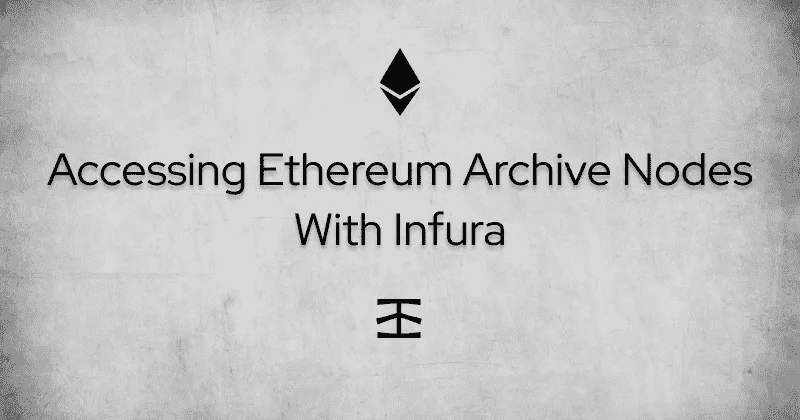
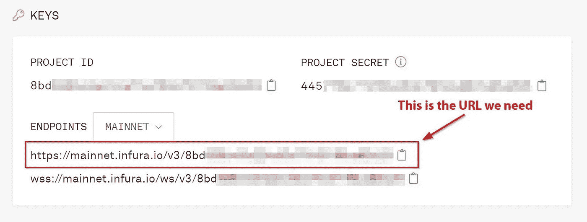
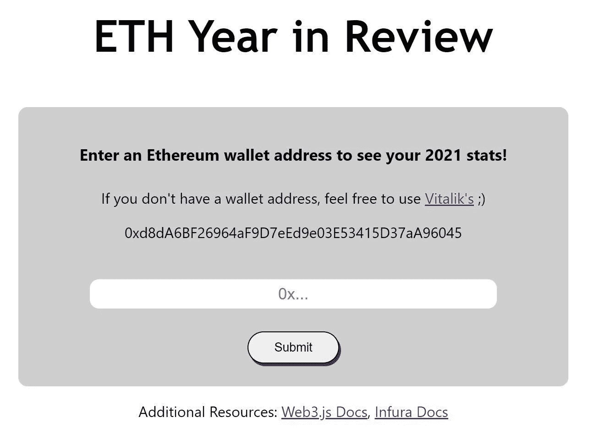
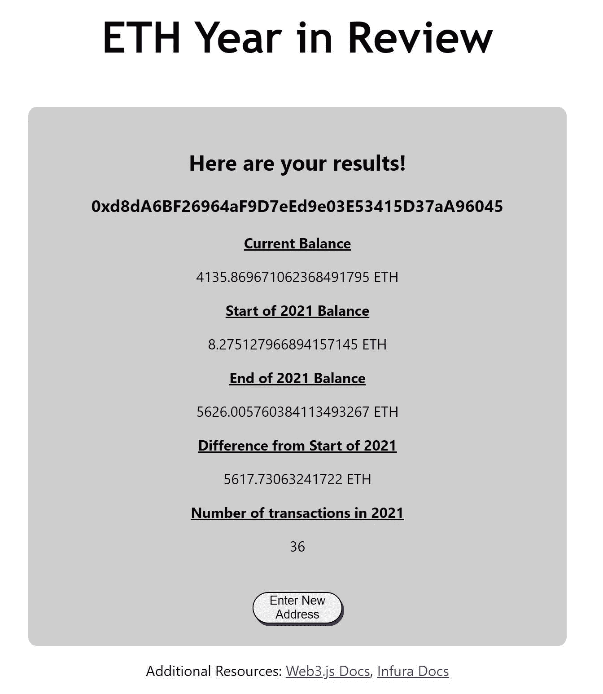

# 使用 Infura 访问以太坊归档节点

> 原文：<https://betterprogramming.pub/accessing-ethereum-archive-nodes-with-infura-f40b46a04f15>

## 如何使用 Infura RPC 端点 URL 读取历史区块链数据



# 介绍

存档节点是以太坊网络上存储历史区块链数据的特定节点。因为它们提供了这些历史信息，所以当您需要审计过去的交易历史或收集数据时，它们会很有帮助。像 [Etherscan](https://etherscan.io/) 和 [Dune Analytics](https://docs.dune.xyz/) 这样的服务使用存档节点，但是任何人都可以自己运行一个。

在本文中，我们将回顾不同类型的以太坊节点，深入探讨归档节点，并介绍 Infura 的新归档节点功能。然后，我们将通过一个真实的项目展示如何将 Infura API 和 web3.js 连接到一个预构建的 react 前端。一旦完成，用户将能够查询一个归档节点，以获得给定以太坊钱包地址的一些统计信息。

# 目录

*   以太坊节点是什么？
*   以太坊节点的类型
*   存档节点
*   存档节点提供程序
*   该项目
*   结论

# 以太坊节点是什么？

简单来说，节点就是网络中的一个连接点。然而，在以太坊的情况下，不同类型的节点对网络负有不同的责任。

以太坊区块链在所谓的[以太坊虚拟机](https://ethereum.org/en/developers/docs/evm/) (EVM)上运行，这是一种分散式[全球](https://etherscan.io/nodetracker)计算机。在这种情况下，节点为这台计算机提供处理能力。它们提供请求的数据，创建和验证块，存储交易数据或智能合约代码，等等。任何拥有所需硬件的人都可以下载一个[以太坊客户端](https://ethereum.org/en/developers/docs/nodes-and-clients/#execution-clients)并旋转他们自己的节点来加入网络。这也防止了任何单个实体控制整个网络，并有助于以太坊的去中心化。

以太坊节点主要有四种类型，每一种对网络的贡献都不同。它们一起将信息中继到其他节点，验证交易和 EVM 状态，并提供保持以太坊网络高效运行所需的基础设施。它们相互通信以确保它们都同意网络的状态。因此，拥有更多的节点使网络更强大，对攻击更有弹性。

# 以太坊节点的类型

## 完整节点

完整节点验证事务和 EVM 状态，验证块，启动和执行智能合约代码，并可以在请求时提供网络数据。他们还存储以太坊区块链的状态，直到最近的 128 个区块，但可以根据需要建立历史状态的档案。

## 挖掘节点(通常称为“挖掘器”)

Miner 是运行[挖掘客户端](https://ethereum.org/en/developers/docs/consensus-mechanisms/pow/mining/)的完整节点。在目前的状态下，以太坊通过[工作证明](https://ethereum.org/en/developers/docs/consensus-mechanisms/pow/)算法提供共识。总而言之，这意味着一个挖掘节点与其他挖掘节点在计算竞赛中竞争创建下一个块。创建后，新数据块会广播到网络，由其他节点进行验证，并附加到区块链的末尾。

## 光节点

轻型节点是完整节点的“轻型”版本，它只包含块头数据，如前一个块的哈希和时间戳，而不是完整的块数据。它们向完整节点发出按需请求，并且只根据用户的要求验证某些状态。示例用途是检查余额、验证交易是否已确认、检查事件日志以及执行其他轻型任务。轻型节点可以很容易地由低容量设备运行，如移动电话或 RaspberryPi。

## 存档节点

归档节点是一种在“归档模式”下运行的完整节点。它们包含与完整节点相同的所有数据，但也包含自[创世纪区块](https://etherscan.io/block/0)以来整个区块链的所有历史状态数据。在本文的剩余部分，我们将重点关注归档节点。

# 关于归档节点的更多信息

尽管完整节点可以重建历史区块链状态数据，但这个过程是缓慢且低效的。根据不同的用例，这些数据可能需要快速提供。这就是归档节点的用武之地。因为存档节点包含从第一个数据块开始的历史数据，所以它们可以随时轻松地跟踪任何任意事务。

## 为什么要访问归档节点？

如果在最近的 128 个区块之前，有你需要从以太坊区块链获取的信息，那么最高效的获取方式就是通过一个存档节点。其中一些信息可能包括帐户余额、智能合约代码、交易计数或特定存储位置的价值。它们还支持测试智能合约代码，而无需在区块链上创建交易。

## 运行归档节点的规格

运行自己的节点意味着对与区块链共享的信息有更多的控制。你可以创建更加安全和私密的 dApps(去中心化应用)，你的地址和余额不会泄露给网络上的随机节点。运行归档节点还意味着无需注册任何第三方服务即可快速访问历史区块链数据。

这些是您需要能够[运行您自己的以太坊存档节点](https://ethereum.org/en/run-a-node/)的规范:

*   至少有四个内核的 CPU
*   16 GB 或更多内存
*   至少有 6 TB 空间的固态硬盘
*   至少 25 兆比特/秒的带宽

正如您所看到的，启动归档节点的要求使其具有合理的可访问性。虽然不算便宜，但对个人来说还是可以承受的。它确实需要一些技术知识和持续的维护。如果您没有时间、驱动器或设备来运行自己的，节点提供商是一个很好的替代选择。

# 存档节点提供程序

节点提供商通过其易于使用的 API，使任何人都可以轻松访问以太坊区块链并与之交互。你需要做的就是创建一个新项目，然后用它们提供的 URL 轻松调用 [JSON RPC](https://www.wallarm.com/what/what-is-json-rpc) 方法。

## Infura

Infura 可以说是该领域最受欢迎的节点提供商。它是由 ConsenSys，MetaMask 和松露区块链开发框架背后的团队创建的。他们已经存在了一段时间，他们的服务对于初学者和希望扩大规模的组织来说非常好。

*   现在可以免费访问归档节点
*   伟大的[自由定价层](https://infura.io/pricing)
*   提供对第 2 层扩展解决方案的访问
*   许多其他附件可满足您的需求
*   优秀的[文档](https://docs.infura.io/infura)

# 用例

根据您正在构建的项目类型，有几种不同的技术可以连接到节点提供者。

## 块菌/安全帽

如果您正在编写与历史数据交互的智能契约，那么 Truffle 或 Hardhat 等开发套件将满足您的需求。它们都有各种各样的内置工具，使您的 dApp 的整个开发生命周期变得更加容易。在这种情况下，连接到归档节点就像将提供的 API URL 端点设置为要在前端代码中使用的变量一样简单。

## 加纳切

如果您需要快速访问归档节点进行本地开发或测试，Truffle 提供了一个个人区块链，可以很好地完成这一任务。这个区块链叫做[加纳切](https://trufflesuite.com/docs/ganache/index.html)。从 [Ganache 版本 7.0](https://blog.infura.io/fork-ethereum-replay-historical-transactions-with-ganache-7-archive-support/) 开始，启动以太坊区块链的本地实例并访问存档就像一个命令一样简单:

```
ganache --fork
```

然后，您可以使用 URL:[http://localhost:8545](http://localhost:8545/)，或者任何您设置的端口，与它进行类似的交互。

## 直接集成

如果您不需要一套区块链工具，那么您可以在前端代码中直接使用您的节点提供者 URL，并通过一个 JavaScript 库(如 ethers.js 或 web3.js)连接到它。这是我们将在下面的项目中探索的选项。

# 该项目

正如本文开头提到的，我们将制作一个简单的“年度回顾”类型的应用程序来显示 2021 年以来的一些钱包统计数据。我们将克隆一个预构建的前端，因此我们所要担心的只是查询一个归档节点，然后很好地显示数据。

**我们将要学习的内容:**

*   如何获得具有归档访问权限的 Infura API URL
*   如何使用 Infura API URL 和 web3.js 收集归档数据
*   从区块链收集数据所需的 JavaScript
*   如何将数据放在一起，并在应用程序中很好地显示出来

**完成项目需要什么:**

*   [一个不真实的账户](https://infura.io/)
*   [Git](https://git-scm.com/downloads)
*   [节点/ npm](https://nodejs.org/en/)
*   [一个代码编辑器](https://code.visualstudio.com/)

**附加资源**

*   [信息文件](https://docs.infura.io/infura)
*   [Web3.js 文档](https://web3js.readthedocs.io/en/v1.7.0/web3.html)

## Infura API URL

我们项目的第一步是设置我们的 Infura 帐户并获取我们的 API 端点 URL。前往[https://infura.io/](https://infura.io/)，创建一个新账户或登录。

创建一个新项目来获取我们将在项目中用到的 API 端点 URL。



获取 Infura RPC 端点 URL

由于存档访问现在对所有用户都是免费的，我们不需要用我们的 Infura 帐户完成任何其他步骤。

解决了这个问题，让我们开始在前端工作吧！

## 前端

我们将为这个项目的其余部分建立在一个预制的 React 前端之上。如果你以前从未使用过 React，没关系。我们将一起完成剩下的步骤。

为了正确安装项目，我们将使用 **git** 和**节点包管理器** (npm)。要查看它们是否已经安装，我们可以在命令行中检查版本号:

```
npm --versiongit --version
```

如果仍然需要在您的计算机上安装它们，您可以通过以下链接获得它们:

*   节点/NPM:[https://nodejs.org/en/](https://nodejs.org/en/)
*   **吉特**:[https://git-scm.com/downloads](https://git-scm.com/downloads)

安装完成后，我们准备开始项目的其余部分:

1.  在命令行中，导航到您想要处理的文件夹，并克隆我们项目的存储库:

```
git clone [https://github.com/paul-mcaviney/archive-node-project-frontend.git](https://github.com/paul-mcaviney/archive-node-project-frontend.git)
```

2.将目录更改到新的项目文件夹中，并安装所需的依赖项:

```
cd archive-node-project-frontendnpm i
```

3.在依赖项安装完成后，让我们运行项目，以确保它目前工作正常:

```
npm start
```

如果一切安装正确，我们现在将拥有一个运行在[**http://localhost:3000**](http://localhost:3000/)上的前端，如下所示:



我们的项目前端

我们将使用一个文本字段来输入钱包地址。点击提交按钮，我们将进入结果页面。我们也可以从这里按下**输入新地址**按钮返回输入页面。

4.在我们开始编码之前，我们需要再安装一个依赖项。我们将使用 **web3.js** 通过我们的 Infura URL 访问一个归档节点。要安装 web3.js，请在我们项目的目录中键入以下命令:

```
npm install web3
```

5.我们将在 **src** 文件夹下的 **App.js** 文件中完成我们所有的编码。我们需要编写的第一段代码是将 web3 导入到我们的项目中，并将其连接到我们的 Infura URL。在 import 语句下，在 **App** 函数之前，添加以下代码:

```
const Web3 = require('web3'); 
const infuraURL = 'YOUR_INFURA_URL_HERE'; 
const web3 = new Web3(new Web3.providers.HttpProvider(infuraURL));
```

**注意**:不要在没有隐藏你真实的 Infura URL 之前将这个项目上传到公共库。您可以为此使用环境变量。

6.我们将使用 **useState** React 钩子来更新我们的 UI。您会注意到它已经被导入到我们文件的顶部。接下来，让我们添加一些 React 状态变量，以便更容易地显示我们从归档节点收集的数据。在**结果**状态变量下，添加以下内容:

```
const [address, setAddress] = useState(''); 
const [currentBalance, setCurrentBalance] = useState(0); 
const [startOfYearBalance, setStartOfYearBalance] = useState(0); 
const [endOfYearBalance, setEndOfYearBalance] = useState(0); 
const [balanceDifference, setBalanceDifference] = useState(0); 
const [transactionCount, setTransactionCount] = useState(0);
```

7.现在我们需要更新`handleInput`函数，将用户输入分配给我们的地址状态变量，而不是记录注释:

```
const handleInput = event => { 	
    setAddress(event.target.value); 
};
```

**注意**:你会注意到我们没有在这里做任何检查来确保用户输入的实际上是一个以太坊钱包地址。这是为了保持本教程简单。如果公开部署，您将希望以不同的方式处理此问题。

8.JavaScript 的最后一部分是一个异步函数，它将从归档节点收集数据，将其转换为更可读的值，并设置我们的状态变量。在注释*您的 JavaScript 代码将放在这里*下，键入以下代码:

```
// Access and process data from Ethereum blockchain
const accessEthereum = async () => { // 2021 Start and End Block variables 
    const START_2021_BLOCK = 11565019;
    const END_2021_BLOCK = 13916165;

    // Get current balance of address 
    const balance = await web3.eth.getBalance(address); // Convert balance from wei to ETH and set state variable
    setCurrentBalance(await web3.utils.fromWei(balance.toString(), 'ether'));

    // Get wallet balance at the start of 2021 (Block #11565019)
    const startBalance = await web3.eth.getBalance(address, START_2021_BLOCK); // Get wallet balance at the end of 2021 (Block #13916165)
    const endBalance = await web3.eth.getBalance(address, END_2021_BLOCK);

    // Convert startBalance to ETH and set state variable
    const startBalanceAsETH = await web3.utils.fromWei(startBalance.toString(), 'ether');
    setStartOfYearBalance(startBalanceAsETH); // Convert endBalance to ETH and set state variable
    const endBalanceAsETH = await web3.utils.fromWei(endBalance.toString(), 'ether');
    setEndOfYearBalance(endBalanceAsETH); // Set balanceDifference from start to end of 2021
    setBalanceDifference(endBalanceAsETH - startBalanceAsETH); // Get transaction count at start of 2021 (Block #11565019)
    let startTransactions = await web3.eth.getTransactionCount(address, START_2021_BLOCK); // Get transaction count at end of 2021 (Block #13916165)
    let endTransactions = await web3.eth.getTransactionCount(address, END_2021_BLOCK); // Set total transaction count in 2021
    setTransactionCount(endTransactions - startTransactions); // Received results, condition met to show them on screen
    setResults(true); };
```

9.转到 HTML，我们需要做的第一件事是用我们刚刚编写的新函数替换按钮函数。改变*下按钮的功能调用改变该按钮功能*注释:

```
<button onClick={accessEthereum} className='form-button' type='submit' name='submit' id='submit'>
```

10.我们需要的最后一点代码是 HTML，它将显示我们从归档节点收集的数据。在 **return** 语句中，向下滚动到注释*您的 HTML 代码将在此处*并添加以下内容:

```
<h3>{address}</h3><p className='result-heading'>Current Balance</p>
<p>{currentBalance} ETH</p><p className='result-heading'>Start of 2021 Balance</p>
<p>{startOfYearBalance} ETH</p><p className='result-heading'>End of 2021 Balance</p>
<p>{endOfYearBalance} ETH</p><p className='result-heading'>Difference from Start of 2021</p>
<p>{balanceDifference} ETH</p><p className='result-heading'>Number of transactions in 2021</p>
<p>{transactionCount}</p>
<br />
```

要查看完整的项目代码，请查看这个 [Github 库](https://github.com/paul-mcaviney/archive-node-project-complete)。

11.现在让我们测试一下我们的应用程序，看看它是否有效！首先，启动应用程序:

```
npm start
```

在文本字段中输入以太坊钱包地址，然后点击**提交**。如果你没有在 2021 年激活的钱包地址，你可以使用 [Vitalik 的。](https://twitter.com/VitalikButerin)



我们的最终结果！

厉害！我们的结果显示正确，可以看到 2021 年钱包地址的所有活动！

# 结论

通过学习本教程，您使用 Infura API 端点 URL 访问了归档节点上的数据，然后在一个简单的 *ETH Year in Review* 应用程序中很好地显示了这些数据。

在最近的 128 个块之前，需要一个归档节点来访问以太坊块链中的数据。它们存储第一个数据块的所有历史状态数据，并且比完整节点更快、更高效地提供这些数据。现在，Infura 向所有用户提供免费的存档节点访问，收集历史区块链数据从未如此简单！