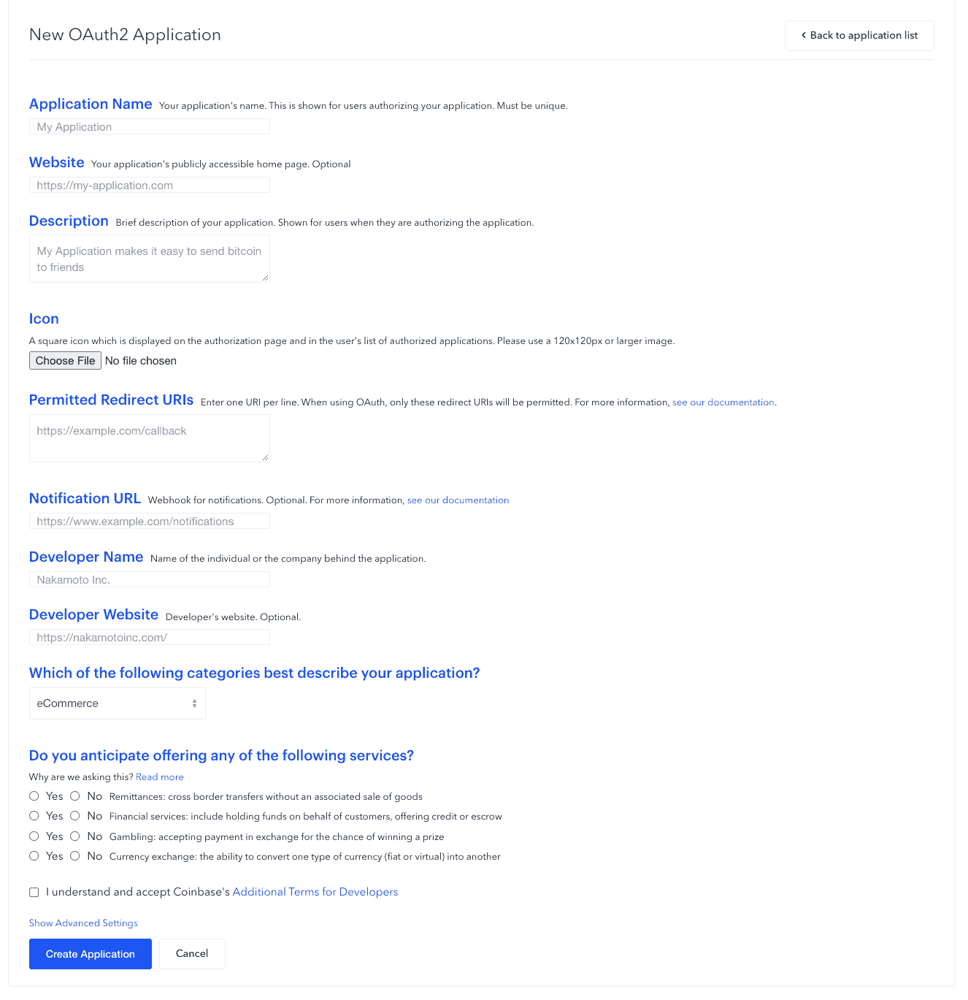
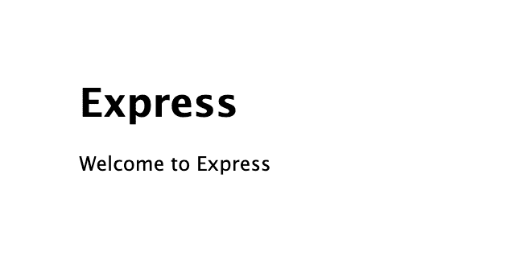
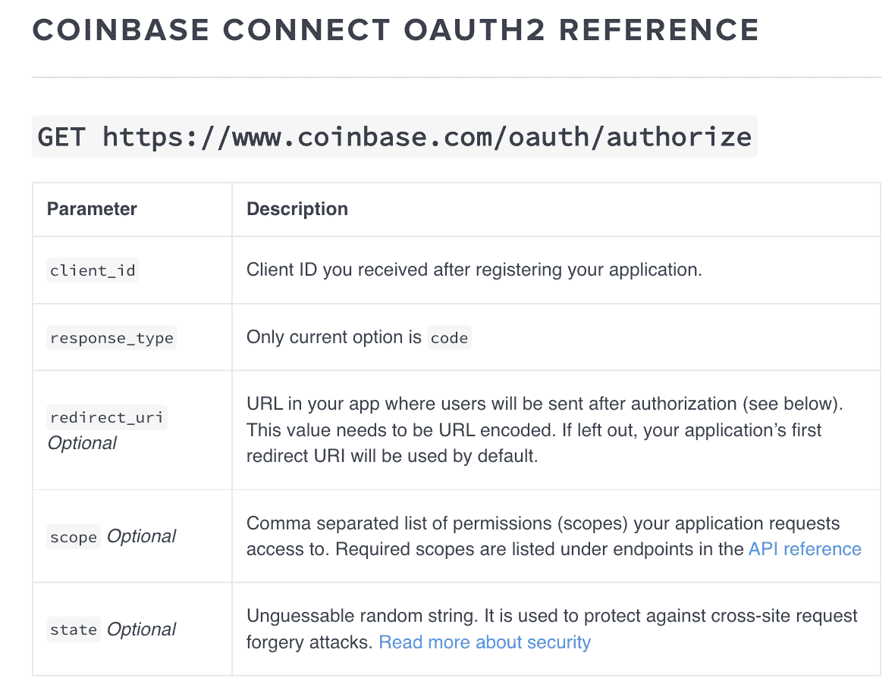
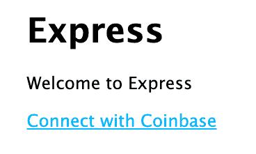
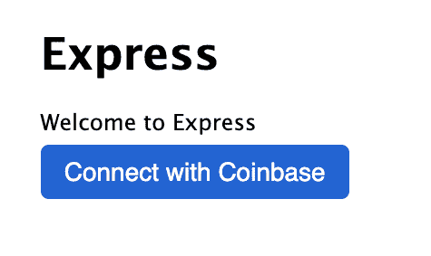
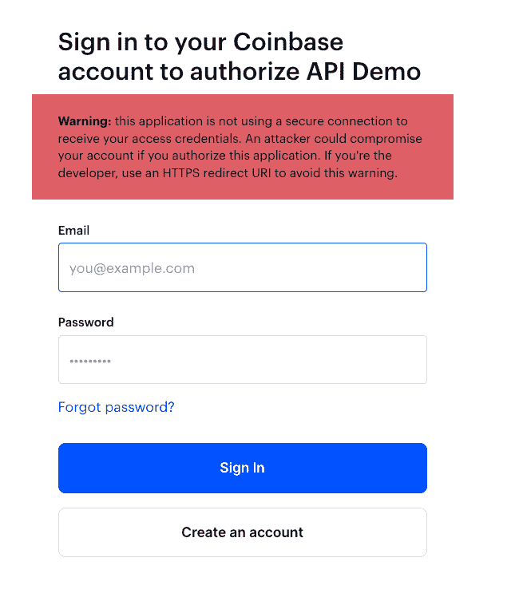
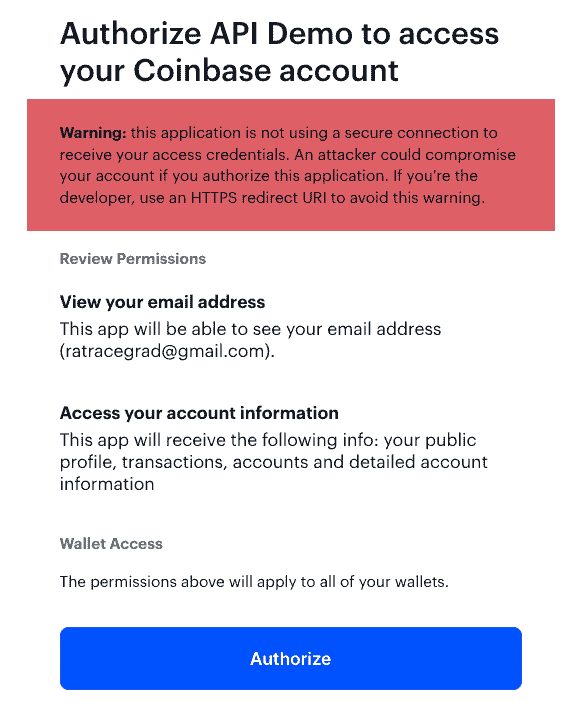
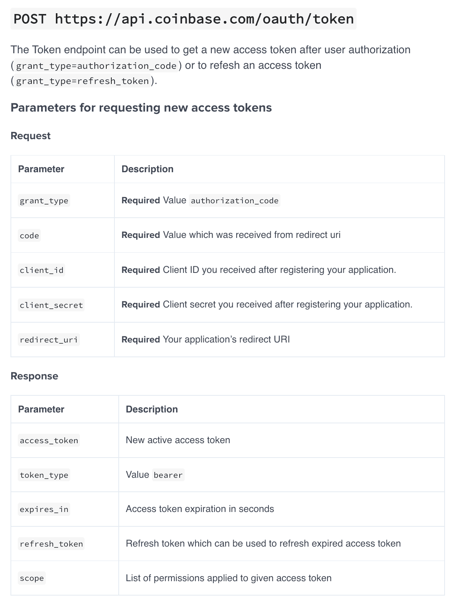
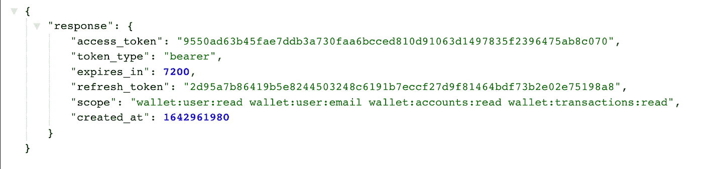

# 如何访问比特币基地 API

> 原文：<https://betterprogramming.pub/accessing-the-coinbase-api-b62a38469066>

## 使用 OAuth2


Pierre Borthiry 在 [Unsplash](https://unsplash.com?utm_source=medium&utm_medium=referral) 上拍摄的照片

比特币基地是一个加密货币交易所，你可以在那里购买比特币和以太坊等流行的货币。

在这一系列文章中，我将向您展示如何利用比特币基地 API 来查看您持有的密码列表以及特定加密硬币的所有交易。

我们将创建一个 Node.js 应用程序来访问比特币基地 API。

# 比特币基地 API 选项

你可以在这里访问比特币基地 API [。比特币基地有两种 API](https://developers.coinbase.com/)

API 密钥用于访问您在比特币基地的账户。OAuth2 API 用于对任何用户进行 coinbase 认证，然后访问所有 API 功能。

对于这个演示，我想让每个人都可以使用它，而不仅仅是我自己，所以我们将使用 OAuth2 API。

# 创建开发者帐户

要使用比特币基地 API，你需要创建一个免费的开发者账户。我不会带您完成创建帐户的步骤。

创建好账户后，点击右上角的`My Apps`按钮。


点击`New OAuth2 Application button`。你会得到这张表格来完成你的申请。



对于`Application Name`，我放“API Demo”。

对于`Description`，我放了“比特币基地 API 演示”。

对于`Permitted Redirect URIs`，我放[http://localhost:3000/callback](http://localhost:3000/callback)。注意:如果你在某个地方托管你的网站，那么你需要用你的主机的 URI 替换上面的 URI。

表单底部是一系列单选按钮。我为所有人选择了**否**。

选中复选框以接受面向开发者的比特币基地条款。

完成表格后，点击`Create Application`按钮。

在比特币基地创建您的应用程序后，您将看到您的`Client ID`和`Client Secret`。保存这些，因为我们将在我们的应用程序中使用它。

# 创建节点应用程序

我使用 express-generator 来搭建 Node.js 应用程序。在终端中，使用以下命令创建节点应用程序:

```
npx express-generator -e --view=ejs coinbase-demo
```

我将使用 EJS 作为我的视图和模板引擎，所以我已经包括了它的选项。我的申请是`coinbase-demo`。

使用以下命令切换到包含应用程序的目录:

```
cd coinbase-demo
```

接下来安装所有依赖项:

```
npm install
```

在我们开始编辑之前，我想安装 3 个额外的软件包，我们将使用。您可以使用以下命令安装它们:

```
npm install axios nodemon qs
```

在编辑器中打开应用程序。

# 配置启动脚本

express-generator 应用程序会在启动时验证您给它的端口值。这在文件`bin/www`中完成。我不喜欢这样做，所以我要完全绕过它。

打开`package.json`文件。更新启动脚本，使其看起来像这样:

```
"start": "nodemon app.js"
```

接下来，打开`app.js`文件。在记录器行之后添加以下两行:

```
const axios = require('axios'); 
const port = process.env.PORT || 3000;
```

注意:端口必须与您在比特币基地应用程序中用于重定向 URI 的值相匹配。

因为我们将把我们所有的路线放在一个文件中，所以你可以删除`usersRouter`行和在应用程序使用部分设置的行。您也可以删除 routes 目录中的`users.js`文件。

我们将不再导出 app.js 文件，因此删除导出它的最后一行。将其替换为以下内容:

```
app.listen(port, '0.0.0.0', function () { 
  console.log("Server starting on localhost:" + port); 
});
```

您现在可以删除`bin`目录和其中包含的文件`www`。

通过在终端中输入以下命令来启动服务器:

打开你的浏览器，输入 URI `localhost:3000`。您应该看到以下内容:



# 向比特币基地认证 2

我们将使用比特币基地 OAuth2 来验证任何想要使用我们的应用程序的用户。你可以在这里找到[细节](https://developers.coinbase.com/docs/wallet/coinbase-connect/reference)。



在我们应用程序的主页上，我们需要添加一个按钮来调用比特币基地端点，并传入我们想要添加的任何参数。

打开视图文件夹中的`index.js`文件。在带有欢迎行的段落下方添加以下按钮:

```
<a href="https://www.coinbase.com/oauth/authorize?response_type=code&client_id=2240e80398486d147c6a3e2e48e63b3d9a562497ad85bcd3300b7dda67eae42d&redirect_uri=http://localhost:3000/callback&state=MY_SECRET_KEY&scope=wallet:user:read,wallet:user:email,wallet:accounts:read,wallet:transactions:read&account=all" class="btn"> Connect with Coinbase </a>
```

你可能会注意到这是一个非常非常长的`a`标签。

它的正上方是欢迎消息，显示一个传递到文件中的`title`。让我们通过传入适当的值来简化我们的按钮。

打开 routes 文件夹中的`index.ejs`文件。在 router 变量后添加以下行。确保输入您的`client_id`并从您的比特币基地 OAuth2 应用程序中回拨 URI:

```
const SECRET = "MY_SECRET_KEY"; 
const REDIRECT_URI = "http://localhost:3000/callback"; 
const CLIENT_ID = "2240e80398486d147c6a3e2e48e63b3d9a562497ad85bcd3300b7dda67eae42d"; const SCOPE = "wallet:user:read,wallet:user:email,wallet:accounts:read,wallet:transactions:read";
```

在`router.get`中，它传入一个对象，该对象当前有一个值给`title`。添加以下内容，以便它们被传入:

```
router.get('/', function(req, res, next) { 
  res.render('index', { 
    title: 'Express', 
    CLIENT_ID: CLIENT_ID, 
    REDIRECT_URI: REDIRECT_URI, 
    SECRET: SECRET, SCOPE: SCOPE, 
  }); 
});
```

现在我们可以更新按钮，使用按钮中的值。返回并打开 views 文件夹中的`index.ejs`文件。将您的按钮更新为:

```
<a href="https://www.coinbase.com/oauth/authorize?response_type=code&client_id=<%= CLIENT_ID %>&redirect_uri=<%= REDIRECT_URI %>&state=<%= SECRET %>&scope=<%= SCOPE %>&account=all" > Connect with Coinbase </a>
```

现在，当您在浏览器中查看应用程序时，您应该会看到:



我不太喜欢这个按钮的外观。给按钮添加一个`class="btn"`。打开 public/stylesheets 目录中的文件`style.css`。添加以下 CSS:

```
.btn { 
  width: 100%; 
  background: #2364d2; 
  border: none; 
  border-radius: 5px; 
  font-size: 16px; 
  font-weight: 500; 
  padding: 8px 15px; 
  font-family: "Source Sans Pro", sans-serif; 
  color: #fff; 
  cursor: pointer; 
  text-decoration: none; 
}
```

现在我们的按钮看起来像这样:



现在点击按钮。你应该会看到一个登录你的比特币基地账户的屏幕



输入您的比特币基地`userid`和`password`登录您的账户。登录后，您将看到一个选项，授权我们的应用程序访问您的帐户:



在您授权应用程序后，您将得到一个 404 错误页面。这是因为比特币基地重定向回重定向 URI 是`http://localhost:3000/callback`。这就是你看到错误信息的原因。

# 处理回拨路由

让我们回到比特币基地 API 文档。在授权您的应用程序之后，它要求您必须调用令牌端点来为用户获取新令牌。



当比特币基地调用我们的重定向 URI 时，我们将调用令牌端点。

打开 routes 目录中的`index.js`文件。添加以下代码来处理回调路由:

```
// User gets redirected to this endpoint on successful login router.get("/callback", async (req, res) => { 
  const { code, state } = req.query; 
  if (state === SECRET) { 
    const data = qs.stringify({ 
      'grant_type': 'authorization_code', 
      'code': code, 
      'client_id': CLIENT_ID, 
      'client_secret': CLIENT_SECRET, 
      'redirect_uri': REDIRECT_URI 
    }); 
    const config = { 
      method: 'post', 
      url: 'https://api.coinbase.com/oauth/token', 
      headers: { 
        'Content-Type': 'application/x-www-form-urlencoded' 
      }, 
      data 
    }; 
    try { 
      const response = await axios(config); 
      res.send({ response: response?.data }); 
    } catch (e) { 
      console.log("Could not trade code for tokens", e) 
    } 
  } 
});
```

让我们浏览一下这段代码。

在我们的应用程序被授权后，比特币基地调用我们的重定向 URI 并传递给它两个查询参数——code 和 secret。我们把它们分解成变量。

当我们最初调用比特币基地时，我们传递了一个返回给我们的秘密短语。这证明电话来自比特币基地。我们检查以确保返回的值是我们最初发送给比特币基地的值。

接下来，我们将对发送到比特币基地的数据进行字符串化，以获取用户的令牌。我们将使用创建应用程序时安装的`qs`包。在文件顶部添加以下行以导入它:

```
const qs = require('qs');
```

我们将字符串化的对象具有以下值:

1.  `grant_type`必须有值`authorization_code`。
2.  `code`具有从查询参数中析构的代码值。
3.  `client_id`具有来自`CLIENT_ID`变量的值。
4.  `client_secret`具有来自`CLIENT_SECRET`变量的值。该变量不存在，因此在变量中为其添加一个条目，并将其值设置为比特币基地应用程序中的`CLIENT_SECRET`。
5.  `redirect_uri`具有来自`REDIRECT_URI`变量的值。

接下来，我们创建一个将被传入 axios 的`config`对象。我们将使用 axios 向比特币基地发出`POST`呼叫，以获取令牌。我们还没有定义 Axios，所以将其导入添加到文件顶部:

```
let axios = require('axios');
```

现在，我们将在浏览器中显示从比特币基地返回的内容，代码如下:

```
res.send({ response: response?.data });
```

让我们测试一切。打开浏览器，导航至 URI `[http://localhost:3000](http://localhost:3000.)` [。](http://localhost:3000.)

点击按钮连接到比特币基地。如果需要，请登录。授权您的应用程序。您应该会在浏览器中看到一个与此类似的对象:



现在，我们有了一个访问令牌，可以在访问比特币基地 API 时使用它来获取这个帐户的信息。

# 下一步是什么

在下一篇文章中，我们将详述我们迄今为止已经创建的内容。我们将探索比特币基地 API 来显示用户在其比特币基地帐户中拥有的所有加密令牌的列表。然后，我们将显示每个加密令牌的所有事务。点击这里查看下一篇文章。

*最初发表于*[*https://www.jenniferbland.com*](https://www.jenniferbland.com/access-coinbase-api-using-oauth2/)