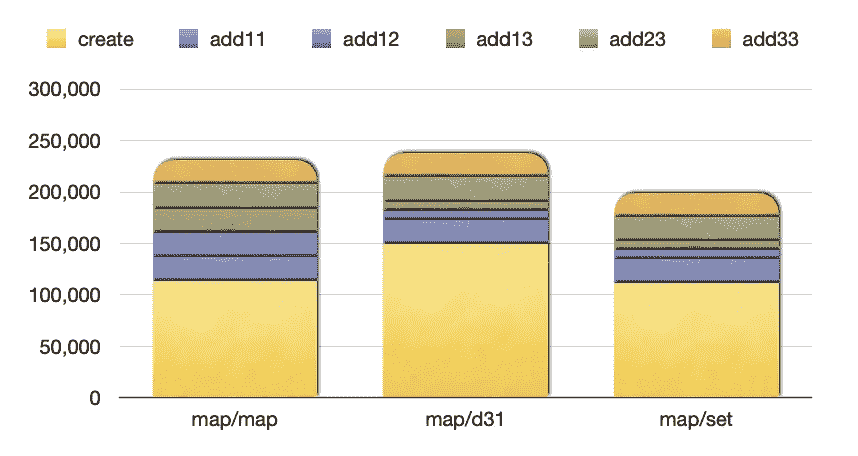
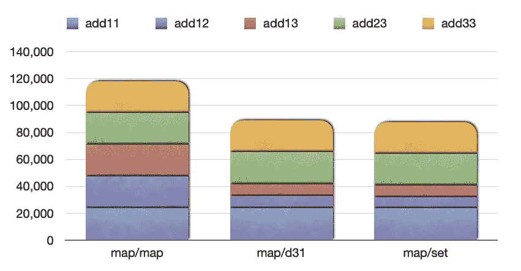
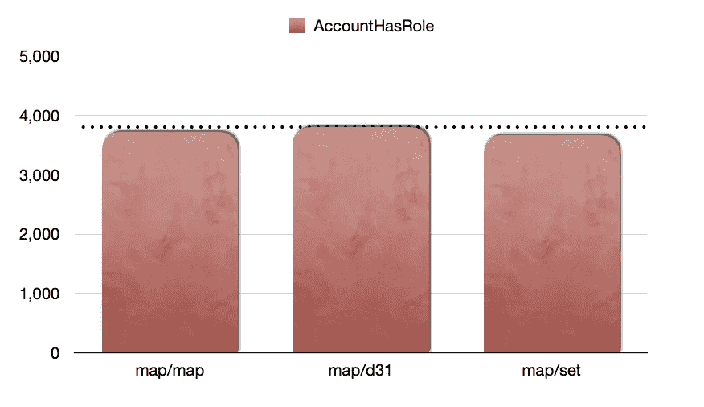

# Solidity 中的客户和角色

> 原文：<https://betterprogramming.pub/accounts-and-roles-in-solidity-48da6845038d>

## 我们需要智能合约来处理具有多种角色的客户。做那件事最有效的方法是什么？


照片由[普里西拉·杜·普里兹](https://unsplash.com/@priscilladupreez?utm_source=medium&utm_medium=referral)在 [Unsplash](https://unsplash.com?utm_source=medium&utm_medium=referral) 拍摄

# 客户和角色—背景

在开发和测试 Datona Lab 的[Solidity](https://solidity.readthedocs.io/en/v0.7.0/)smart data access contracts(S-DAC)的过程中，我们经常需要处理多个角色的帐户，例如合同所有者和数据所有者，或者数据审计员和数据监管员。

在本文的例子中，我们研究了使用动态值数组或集合是否比使用实性映射更有效。

# 讨论

根据文章“[Solidity](https://medium.com/coinmonks/state-machines-in-solidity-9e2d8a6d7a11)中的状态机”，我们的 Solidity 智能合约通常包含状态机每当用户试图将智能合约从一种状态转换到另一种状态时，它都会检查用户是否有权限这样做。该权限基于机器的当前状态和用户的角色。

```
 ... function startVerification() public {
        require(currentState == State.READY_FOR_VERIFICATION);
        require(**accountHasRole**(msg.sender, Role.VERIFIER));
        currentState = State.VERIFYING;
    } ...
```

本文的重点是智能合约提供的`accountHasRole` 的高效实现。

我们考虑这些可能的实现:

```
**Name       Description**map/map    account mapping and role mapping
map/d31    account mapping and dynamic value-array of 31 bytes
map/set    account mapping and set
```

动态值数组在作者的文章[Solidity](https://medium.com/better-programming/dynamic-value-arrays-in-solidity-8e9b44015833)中描述。

在下面的智能合约中，为了简化，我们使用常数而不是枚举。

# 智能合同实施

我们在基类中有效地提供了功能。它被设计为可继承的，以便提供所需的功能。这实际上是劫持继承作为对象合成的替代品。

## 地图/地图

下面是一个有用的导入文件，它提供了一个基础契约，该契约提供了添加和检查功能:

```
contract BaseAccountRoles { // an account has many roles
    mapping(address => mapping(uint => bool)) accountRoles;

    function accountAddRole(address account, uint role) internal {
        accountRoles[account][role] = true;
    } function accountHasRole(address account, uint role) internal 
    view returns (bool) {
        return accountRoles[account][role];
    }
}
```

这个契约使用 Solidity 优秀的[映射](https://solidity.readthedocs.io/en/latest/types.html#mapping-types)特性，从给定的地址映射到每个给定的角色，进而映射到一个 bool，指示帐户地址是否提供角色。

## 地图/d31

下面是另一个有用的导入文件，它提供了一个基础契约，该契约提供了添加和检查功能:

```
import "Bytes31fun.sol"contract BaseAccountRoles31 { // an account has many roles
    using Bytes31fun for bytes32;

    mapping(address => bytes32) accountRoles;

    function addAccountRole(address account, uint role) internal {
        accountRoles[account] = accountRoles[account].**push**(role);
    } function confirmAccountRole(address account, uint role) internal 
    view returns (bool) {
        return accountRoles[account].**find**(role);
    }
}
```

这个契约使用一个库来扩展 Solidity bytes32 类型，以提供 **push()** 和 **find()** 。作者在文章《Solidity 中的动态值数组[中描述了这种方法。](https://medium.com/better-programming/dynamic-value-arrays-in-solidity-8e9b44015833)

Solidity 的映射特性用于从给定地址映射到 bytes32 变量，该变量保存地址提供的每个给定角色的复合。

如果使用该实现的智能协定试图向任何一个帐户添加超过 31 个角色，该实现将引发异常。这在我们的特定实现中是不可能的，但是如果您使用这种技术，请注意它的局限性。

## 地图/设置

下面是最后一个有用的导入文件，它提供了一个提供添加和检查功能的基础契约:

```
contract BaseAccountRolesSet { // an account has many roles
    mapping(address => uint) accountRoleSet;

    function addAccountRole(address account, uint role) internal {
        accountRoleSet[account] |= 1 << role;
    } function confirmAccountRole(address account, uint role) internal 
    view returns (bool) {
        return (accountRoleSet[account] & (1 << role)) != 0;
    }
}
```

Solidity 的映射特性用于从给定的地址映射到一个变量，该变量用作一个集合来保存地址提供的每个给定的角色。

如果使用它的智能契约试图向任何一个帐户添加超过 256 个角色，这个实现将*而不是*抛出异常。在这种情况下，我对这种可能性很放松。

神秘的图片机会:


詹姆斯·科尔曼在 [Unsplash](https://unsplash.com?utm_source=medium&utm_medium=referral) 上拍摄的照片

# 测试

我们将测试中的所有功能*公之于众*，以便测量构建成本，并创建了一个测试工具，用于测量以下各项的气体消耗:

1.  创建基础合同
2.  添加帐户 1，角色 1
3.  添加帐户 1，角色 2
4.  添加帐户 1，角色 3
5.  添加帐户 2，角色 3
6.  添加帐户 3，角色 3

Solidity 智能合同代码遵循以下原则:

```
import "GasCost.sol"contract GasAccountRolesSet is GasCost {
    using StringLib for string; uint constant ROLE1 = 0;
    uint constant ROLE2 = 1;
    uint constant ROLE3 = 2; address constant ACCOUNT1 = 0x1111111111...1111111111;
    address constant ACCOUNT2 = 0x2222222222...2222222222;
    address constant ACCOUNT3 = 0x3333333333...3333333333; BaseAccountRolesSet con; function _create() private {
        con = new BaseAccountRolesSet();
    }
    function create() public {
        gasCostFun("constructor", _create);
    } function gasCost(string memory name, address account, uint role)
    internal {
        uint u0 = gasleft();
        con.addAccountRole(account, role);
        uint u1 = gasleft();
        name = name.concat(" add: ", (u0 - u1).niceDecimal()); u0 = gasleft();
        require(con.confirmAccountRole(account, role));
        u1 = gasleft();
        name = name.concat(" has: ", (u0 - u1).niceDecimal());
        report(name);
    } function add11() public {
        gasCost("add11", ACCOUNT1, ROLE1);
    }

    function add12() public {
        gasCost("add12", ACCOUNT1, ROLE2);
    }

    function add13() public {
        gasCost("add13", ACCOUNT1, ROLE3);
    }

    function add23() public {
        gasCost("add23", ACCOUNT2, ROLE3);
    }

    function add33() public {
        gasCost("add33", ACCOUNT3, ROLE3);
    }
}
```

# 燃气流量

在编写了智能合同解决方案和测试之后，我们使用作者在文章[固体功能的气体成本](https://medium.com/coinmonks/gas-cost-of-solidity-library-functions-dbe0cedd4678)中描述的技术来测量气体消耗。

编译器是伊斯坦布尔版本 0.6.12。

## 创建合同和添加记录



使用不同解决方案创建和添加帐户和角色的能耗

从图中可以看出，特别是动态值数组，为了在处理动态值数组的库中创建额外的代码，消耗了大量的气体。

## 添加记录

假设建造成本是不相关的(如果您的解决方案继续追加数据，它可能是不相关的)，示例操作的气体消耗为:



使用不同解决方案添加帐户和角色的气体消耗

毫不奇怪，地图/地图解决方案消耗的汽油最多。这是因为新的存储槽用于为每个帐户添加每个角色。

在为每个帐户分配第一个存储槽后，其他解决方案消耗的气体要少得多(蓝色、绿色和金色区块)。

## 检查记录

数据最可能的用途(在我们的解决方案中)是不断检查帐户是否有适当的角色来支持状态转换。

这是汽油消耗量:



使用不同解决方案的支票账户和角色的气体消耗

他们之间没什么可选择的。从 map/map 解决方案中读取比动态值数组消耗的气体少一些，检查机器字中的一个位比查找另一个存储槽消耗的气体少一些。

# 其他可能性

我们可以考虑使用 userIDs 和动态值数组来避免使用第一个映射，而不是使用帐户地址。但是这需要额外存储和检查帐户地址来确定用户标识。

如果您的解决方案需要生成帐户地址，这是一种可行的可能性。

或者，您可以考虑折叠帐户地址，以便压缩它们，从而将几个帐户地址放入一个机器字中。这带来了账户冲突的极小可能性。

# 结论

Solidity 出色的贴图功能非常高效。

但是，如果关联数据包含的条目不超过 256 个，则可以通过使用映射到集合来改进映射到映射。