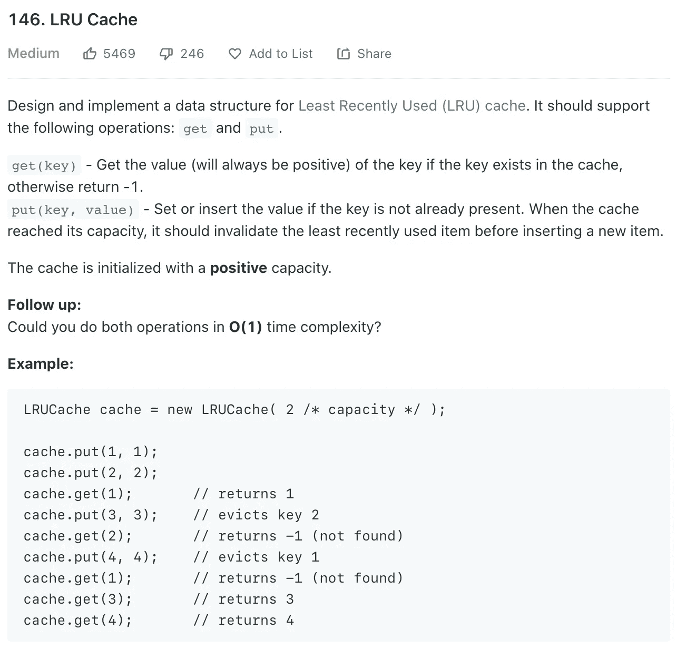
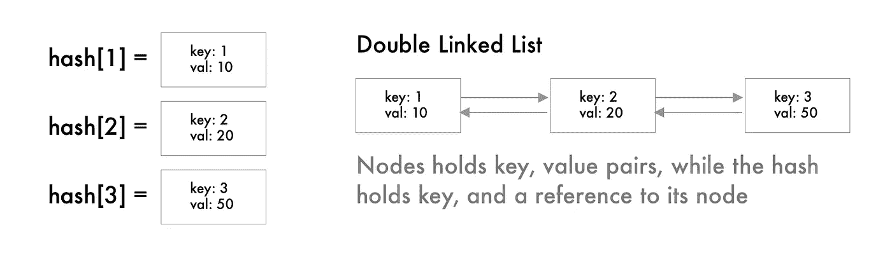
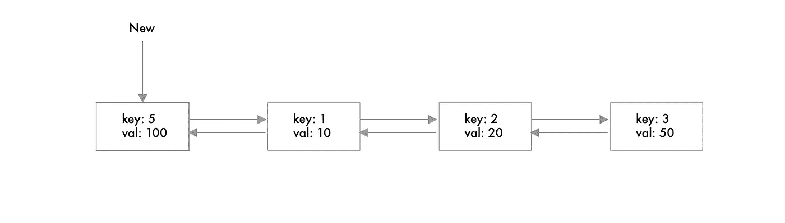
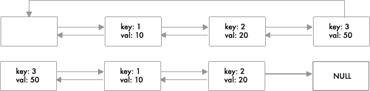
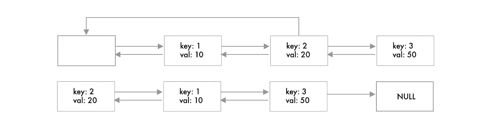

# 在你的下一次编码面试中，Ace 这个计算机科学难题

> 原文：<https://betterprogramming.pub/ace-this-hard-computer-science-question-in-your-next-coding-interview-4760b535c05c>

## 提示:它需要组合多种数据结构

约翰·福南德在 [Unsplash](https://unsplash.com?utm_source=medium&utm_medium=referral) 上拍摄的照片

在一些面试中，面试官会要求你设计一个数据结构，以满足一定的标准，并在特定的内存和速度限制下完成任务。

我事先没有解决这个问题，所以我们将一起解决它。几天来，这个问题一直萦绕在我的脑海中，我突然有了一个难以捉摸的顿悟时刻。

这些类型的问题比普通问题更难，如果你以前用过 leetcode.com 的，这个特定的问题属于中等类型。

不是非常难，但也绝不容易；这些问题通常需要更深入的思考，并结合两个或更多现有的数据结构来完成。

我们开始吧。

由[凯利·西克玛](https://unsplash.com/@kellysikkema?utm_source=medium&utm_medium=referral)在 [Unsplash](https://unsplash.com?utm_source=medium&utm_medium=referral) 上拍摄的照片

# 这个问题

这是直接从 leetcode.com 取出的

[https://leetcode.com/problems/lru-cache/](https://leetcode.com/problems/lru-cache/)

## 理解问题

这个问题要求我们做几件事。

*   首先，我们知道需要将项目存储为键:值对。如果它们存在，我们就返回值。如果不是，我们返回-1。
*   如果键已经存在，我们还需要能够插入新的键-值对或更新值。
*   我们知道缓存有一个指定的*容量*，所以我们必须以某种方式跟踪最近最少使用的(LRU)项，并在插入新项之前删除它。

## 做出假设(并提出问题)

我们可以从这些陈述中推断出一些东西，但无论如何，我们可以要求面试来确认我们确实走对了路。

1.  当我们添加一个新值或更新它时，我们把它移到列表的前面，使它成为最近使用的。
2.  每当我们到达一个当前值时，我们就把它移到列表的前面。

现在我们已经解决了这个问题，让我们更深入地挖掘，并找出我们如何才能做到这一点。

照片由[你好我是尼克](https://unsplash.com/@helloimnik?utm_source=medium&utm_medium=referral)在 [Unsplash](https://unsplash.com?utm_source=medium&utm_medium=referral)

# 分解它

## 存储数据

为了将数据存储为键值对，我们可以使用哈希表。

在某些语言中通常称为地图或字典。它在 O(1)时间或常数时间内解决了我们的存储和检索问题。

## 跟踪 LRU 项目

真正的问题是弄清楚如何跟踪哈希表中最近最少使用的项，并在空间用完时将其删除。

接下来的问题可能会要求您在固定时间内解决这两种方法，这种情况并不少见。

> 如果您不熟悉大 O 符号，这意味着存储、访问和删除 LRU 项应该总是在一个常量操作中执行，不管输入是什么。

我们知道我们可以在固定时间内访问项目，但是我们可以使用什么数据结构来控制项目的顺序呢？

# 一个链表！

准确地说，是一个双向链表。

如果您不熟悉这种数据结构，请查看下面的文章。

 [## 用 JavaScript 实现一个链表

### 今天我们将创建一个二叉查找树的实现，但是在我们写一行代码之前，它…

medium.com](https://medium.com/javascript-in-plain-english/implementing-a-linked-list-in-javascript-717d2ab5d9a9) 

我们需要每个节点的上一个和下一个指针来从列表中删除它们。

搜索一个链表需要 O(n)次运算，其中 n 是链表的大小。

添加和删除值就像修改一两个指针一样简单。

照片由[穆罕默德·诺哈西](https://unsplash.com/@coopery?utm_source=medium&utm_medium=referral)在 [Unsplash](https://unsplash.com?utm_source=medium&utm_medium=referral) 上拍摄

# 两全其美

这就是神奇之处，因为我们使用一种数据结构的优势来弥补另一种数据结构的不足。

## 对于链接列表

链表不太适合查找值，但是如果你知道位置的话，它很适合修改顺序。

## 对于哈希表

哈希表很棒，可以快速找到值，但是它们通常是无序的，我们没有权限修改底层结构。

# 这将如何工作？

首先，创建一个哈希表，其中的值引用 LinkedList 中的节点。

键将是相同的数字，但是链表将保存键和值。

## 为什么我们需要节点内部的密钥？

如果我们想要删除 LRU 值——它将位于列表的末尾——我们还必须从哈希表中删除它。

LinkedList 知道哪个项目是 LRU，但是哈希表不知道。

> 通过将键存储在列表中，我们知道应该删除哈希表中的哪一项。

# 跟踪链表中的 LRU

在我们的列表中添加或删除项目时，我们必须执行某些操作。

1.  **在清单前面加上**(如果我们有空间的话)

2.**在 get()调用后，将现有项目移动到列表的前面**

3.**删除列表中的最后一项(最近最少使用的)**

> **重要提示:**我将提供一个可视化的表示，但是因为这部分更多的是关于链表，所以作为一个挑战，尝试自己解决它们。

# 添加到列表的前面

这个不会给你带来任何麻烦，因为它非常简单。但是，请记住更新所有受影响的节点！

# 将现有项目移到前面

这里我们需要考虑三种情况。

## 1.该项目已经在列表的最前面

在这种情况下，我们什么都不做。

## 2.这个项目在列表的末尾

如果该项位于列表的末尾，我们必须更新受此操作影响的所有节点。

## 3.该项目位于其他节点之间

这里我们必须考虑上一个节点、下一个节点和节点的头。

小心点。这个是最棘手的！

# 移除最后一个项目

删除最后一项很容易，因为我们只需要更新前一个节点以指向 null。

唷，有太多东西需要接受，但希望你能够迎接挑战。到目前为止，您的自定义双向链表的实现应该如下所示。

# 实现 Get 方法

## 这里有两种可能。

1.  该键存在，所以我们返回值并将该项移到列表的前面。
2.  值不存在，所以我们返回-1；

这个很简单，应该是这样的。

# 实现 Set 方法

这是一个棘手的问题，但是我们已经实现了大部分繁重的工作，所以这应该不是问题。

## 这里有三种可能性。

1.  这个键已经存在，所以我们更新了这个值，并把它移到列表的前面。
2.  值不存在，我们仍然有空间——我们仍然有空间，所以我们将该项添加到列表和散列的前面。
3.  价值不存在，我们也没有空间。所以我们还需要从链表中删除最后一个值，并使用键将其从哈希表中删除。然后，我们可以将新项目添加到前面。

# 最终结果

在这里，所有这些都放在一起，并从另一个文件导入 DLinkedList。

# 测试

让我们通过添加和删除值并打印结果来测试我们的数据结构。

如果您将 console.log 添加到 get 函数中，您可以看到当我们试图调用`get(2)`时，结果将是-1，因为我们正好在传递容量之前调用了`get(1)`。

一个将是列表中 5 之后的第二个元素，因此，当我们添加 5 时，2 是 LRU 项，所以我们删除了它。

如果您显示该列表，您还可以看到它现在显示的是`5 → 1 →4 →3` ，因为 2 是 LRU，因此被删除了——因为容量是 4。

# 结论

如果一切顺利，您现在可以体会到数据结构可以带来的价值。

但更重要的是，将它们结合在一起可以给你力量，用一方的力量来弥补另一方的弱点。

然而，总会有权衡，在这种情况下，我们使用额外的空间来优化速度。

> N 注:[完整的代码可以在这里找到](https://github.com/pacosw1/datastructures-ts/tree/master/LRU)，但是我强烈推荐你在阅读文章的同时解决它。