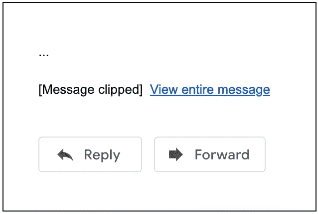
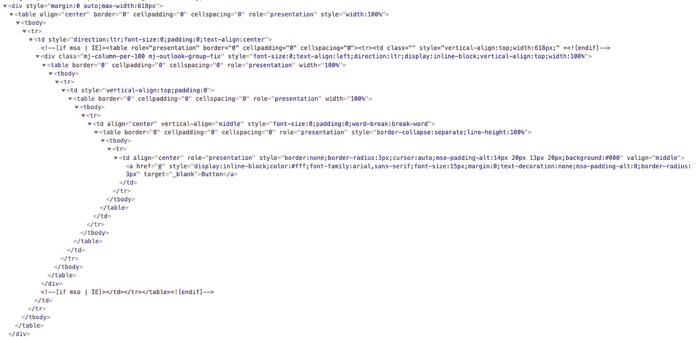
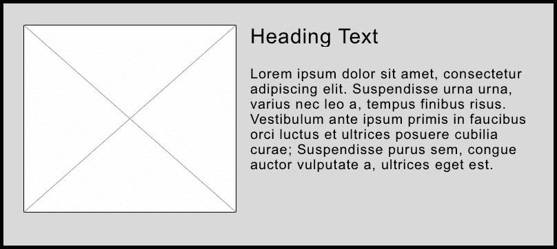

# 如何优化您的电子邮件以避免 Gmail 剪辑

> 原文：<https://betterprogramming.pub/ack-gmail-clipped-my-email-what-should-i-do-c36c940a7d40>

## 分解 Gmail 剪辑对开发者、设计者和时事通讯编辑的意义



Womp。Gmail 剪辑了邮件，因为它“太大了”(作者照片)。

如果你从事电子邮件工作，你肯定遇到过 Gmail 剪辑。重要的是要记住，这是 Gmail 的一项功能，如果您的邮件文件大于 102 KB，它会自动[剪切](https://mailchimp.com/help/gmail-is-clipping-my-email/)您的邮件。这意味着剪辑是你的电子邮件中大量 HTML 代码的结果。每个字符是一个或两个字节，它们全部加起来。

根据您是开发人员、设计师还是时事通讯编辑，Gmail 剪辑可能对您的工作和工作方式有不同的含义。使用这些链接跳到与您相关的部分(或阅读全文):

1.  [我是一名开发者。这对我的代码意味着什么？](#e12d)
2.  我是一名设计师。这对我的设计意味着什么？
3.  我是一名时事通讯编辑。这对我的内容意味着什么？
4.  [附录:HTML 和 Gmail 剪辑的技术探讨](#7fb3)

# 我是开发商。这对我的代码意味着什么？

如果裁剪对你的产品来说很重要(很可能是因为很多原因，包括纯粹的市场份额)，那么你需要考虑你正在编写的 HTML 和 CSS 是否值得它们所花费的字节。这意味着思考这样的问题:

## 我是不是写的风格太多了？我可以使用速记声明吗？

例如，您可以写:

```
font: normal 17px/25px Arial, sans-serif;
```

而不是等价的:

```
font-weight: normal;
font-size: 17px;
line-height: 25px;
font-family: Arial, sans-serif;
```

这为您节省了不少字符。

## 我能用其他一些使用较少标记的方法达到同样的效果吗？

例如，考虑是否真的需要将代码嵌套在另一个表中(我知道，有时另一个表是唯一的办法。叹气。).为了呈现适用于所有与您相关的电子邮件客户端的设计，您能写的最简单的表格是什么？如果你的团队只关心比 Outlook 更宽容的 Gmail 和 Apple Mail，你可能不需要超表格化的 HTML。

## **这些 URL 和属性能不能短一点？**

如果你有一个看起来像`https://www.very-long-url.com/its-long/for-some-reason/like-with-alphanumeric-stuff`的 URL，使用一个 URL 缩短器(比如 Bitly)将其缩短为类似`https://very.long/stuff`的东西可能是值得的。

另外，想想你的类名。也许`class="footer-container-wrapper"`可以改为`class="ft-wrapper"`？类会被多次使用，所以尽量避免使用长名字。

## **简化 HTML 邮件构建的标记语言怎么样？**

像 [MJML](https://mjml.io/documentation/) 这样的标记语言使得创建电子邮件变得容易，因为它们做了确保电子邮件在所有客户端上尽可能正确和一致地显示的艰苦工作。他们真的很擅长这个。但是，这些标记语言仍然需要编译成普通的 HTML。例如，使用 MJML，您可以编写:

```
<mj-section padding="0">
  <mj-column padding="0">
    <mj-button href="#" padding="0" color="#ffffff" font-family="arial, sans-serif" font-size="15px">
      Button
    </mj-button>
  </mj-column>
</mj-section>
```

这看起来很简单，但实际上编译成一个非常长的高度嵌套的 HTML 字符串，如:



所有这些标记很快就会累积起来。

本质上，这里的目标是编写尽可能少的 HTML**——特别是如果你正在构建动态电子邮件组件，比如组件库或模板服务。不过，作为一条经验法则，在你深入研究电子邮件的编码和样式之前，先检查一下你想要使用的样式是否得到了很好的支持。[运动监控器](https://www.campaignmonitor.com/css/)在这方面有很好的指导。此外，在电子邮件测试服务中检查你的工作，如 [Litmus](https://www.litmus.com/) 或 [Email on Acid](https://www.emailonacid.com/) ，这将验证你的风格是否有效，并显示你的电子邮件是否会被删减。**

# **我是一名设计师。这对我的设计意味着什么？**

**设计越复杂，需要编写的代码就越多。这意味着要考虑这样的事情:**

## ****拥有另一个断点的好处是否超过了字节成本？****

**断点越多，需要编写的 CSS 就越多，文件就越大。**

## **我们可以使用单列布局吗？**

**两栏布局很复杂，需要大量的标记，尤其是如果您想要两栏用于桌面，一栏用于移动。**

## **一整块内容需要是可点击的吗？**

**电子邮件是在表格中完成的。与 web 不同，我们不能简单地将一个链接包裹在整个内容块中。相反，我们必须在块的每个子块周围包装一个链接，使它看起来像整个东西是可点击的。例如，如果您有一个如下所示的链接块:**

****

**它有三个组成部分——图像、标题和段落——开发人员可能需要编写三次链接标记。此外，每个 URL 都可能很长，你可能有许多这样的块，这可能会大大有助于剪辑。**

# **我是时事通讯编辑。这对我的 C*content*意味着什么？**

**我们可以使设计和代码尽可能的简单和最小化，但是最终，电子邮件中的内容越多，你被删减的就越多。**

**有时候，这很难理解。你已经减少了链接的数量，实际上你没有那么多单词。你可能会想，“为什么我还是被夹住了？”**

**正如本文开头提到的，关键是要明白产生你所拥有的内容需要多少 HTML。如果你使用 Mailchimp 等基于模板的服务或由组件库支持的内部服务来编写电子邮件，这一点尤其重要，因为作为编辑，你可能看不到在幕后编写电子邮件的代码。**

**把你邮件中的每一部分内容想象成一座冰山——作为一名编辑，你能看到并与之互动的只是水面上的冰山一角。但是在表面之下还有冰山的其余部分，这是开发人员编写的 HTML，所以它看起来像设计者计划的那样。对于每一个冰山一角，下面都有更多的冰山支撑着它。由于一封电子邮件会包含许多这样的冰山，你可以想象在表面之下有许多你看不到的东西。因此，每次你创建一个新的内容块，你实际上是在创建一座完整的冰山——而不仅仅是表面上的东西。**

***注:完整的技术性、非隐喻性解释，参见附录**[*。*](#7fb3)***

***基于此，作为一名编辑，记住以下几点很重要:***

*   ***我是不是写了太多内容了？***
*   ***我能巩固其中的一些吗？***
*   ***如果我使用更简单、更直接的模板或布局，我能有效地传达我的意图吗？***

***HTML 格式的电子邮件很难处理。它很挑剔，而且[不使用网络标准](https://www.campaignmonitor.com/dev-resources/guides/coding-html-emails/#one)。希望有一天会！Gmail 剪辑给已经很难做到的事情又增加了一层复杂性。尽管如此，我希望这已经阐明了 Gmail 剪辑对你的意义，无论你的角色是什么！***

# ***附录:HTML 和 Gmail 剪辑的技术探讨***

***为了真正理解为什么你的电子邮件会被删减，我们要稍微深入一下 HTML。如果你对 HTML 不熟悉，请多包涵！***

***假设您有一段包含 390 个字符(包括空白，空白也是一个字符)的文本，如下所示:***

> ***这是一个段落。Lorem Ipsums 只是印刷和排版行业的虚拟文本。自 16 世纪以来，Lorem Ipsum 一直是行业的标准虚拟文本，当时一个不知名的印刷商拿走了一条铅字，并将其打乱，制成了一本铅字样本书。它不仅经历了五个世纪，而且经历了电子排版的飞跃，基本上保持不变。***

***让我们假设您的电子邮件服务通过用以下 HTML 包装文本来创建段落块:***

***段落块的 HTML 标记长度为 106 个字符(不包括占位符内容)。因此，对于我们之前拥有的一个内容块，我们实际上总共有 390 + 106 = 496 个字符。***

***如果我们把同一块内容分成三个更小的段落会怎么样？***

> ***这是一个段落。Lorem Ipsums 只是印刷和排版行业的虚拟文本。***
> 
> ***自 16 世纪以来，Lorem Ipsum 一直是行业的标准虚拟文本，当时一个不知名的印刷商拿走了一条铅字，并将其打乱，制成了一本铅字样本书。***
> 
> ***它不仅经历了五个世纪，而且经历了电子排版的飞跃，基本上保持不变。***

***它们中的每一个都将被段落 HTML 所包裹，这意味着在幕后，内容实际上是这样的:***

***哇哦。这比以前的价格高出很多！第一段的字符数是 98，第二段是 170，第三段是 120。如果你一直记着，那就是 388，比我们原来的少两个。这是因为我们不再需要分隔句子的两个空格，这些空格将成为我们的新段落。因此，HTML 的总字符数是(3 × 106) + (98 + 170 + 120) = 706，比以前多了 210 个字符(大约 42%)。***

***这表明，尽管*内容*的数量基本相同，但每块内容所需的 HTML 数量会增加。你有越多的 HTML，你就会被剪得越多。***