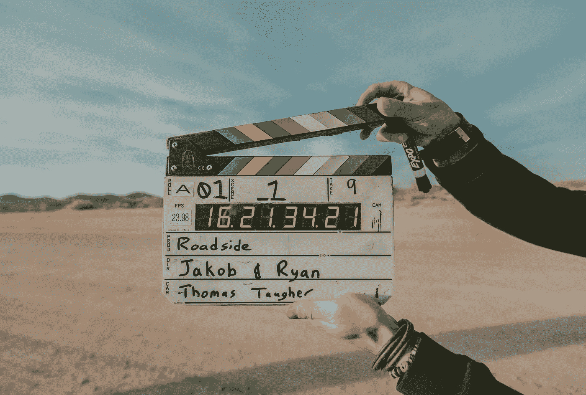
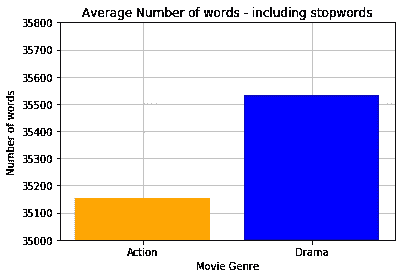
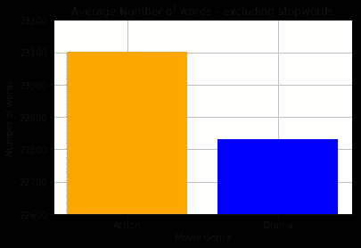
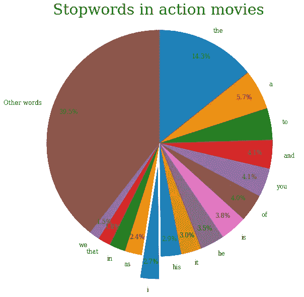
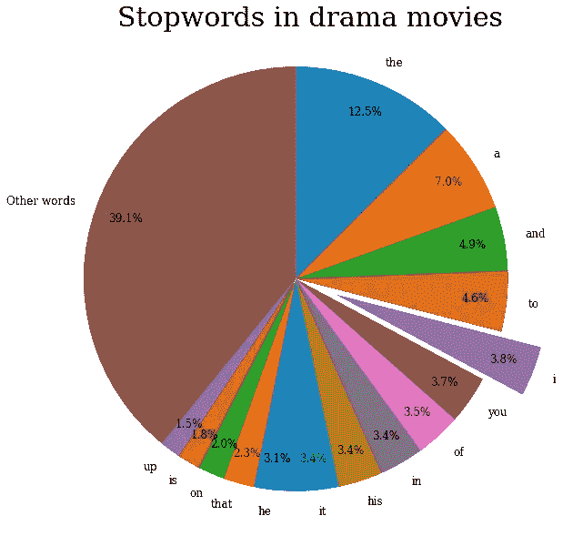
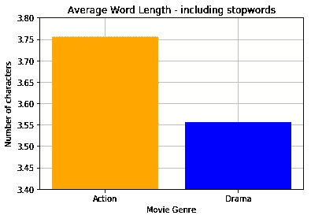
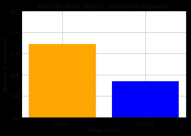
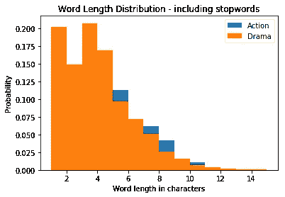
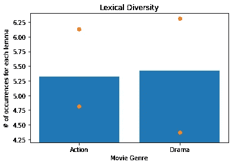

# 动作片和电视剧:它们的剧本有什么不同？

> 原文：<https://betterprogramming.pub/action-movies-vs-dramas-how-do-their-scripts-differ-f6ee21ee1dde>

## 使用 Python 和自然语言工具包(NLTK)分析动作电影和戏剧之间的差异

雅各布·欧文斯在 [Unsplash](https://unsplash.com/search/photos/film?utm_source=unsplash&utm_medium=referral&utm_content=creditCopyText) 上的照片

我喜欢电影，我想学习更多关于自然语言处理的知识，所以将两者结合起来似乎是一个完美的选择。

我决定使用 Python 和[自然语言工具包](https://www.nltk.org/) (NLTK)对两种类型的电影——动作片和剧情片——之间的差异做一些非常基本的分析。目标是更熟悉 NLTK、单词标记化、频率分布和其他类似的概念。我想回答下面这个问题:**动作片的剧本和剧情片的剧本有什么不同？**

# 摘要

*   我分析了十个动作片剧本和十个剧情片剧本。
*   如果我们包括停用词，动作剧本比戏剧剧本多 1.2%的单词。如果排除停用词，话剧剧本多 1.1%的词。
*   戏剧剧本中出现“我”这个词的次数要多 40%。
*   动作剧本中的单词比戏剧剧本中的单词平均长 6%到 9%。这种差异是由于动作脚本有更多的长词。
*   词汇多样性是对文本中独特词汇数量的一种度量。经过词汇化后，戏剧剧本的词汇多样性略高。

# 数据

我必须决定的第一件事是我会考虑每个类别中有多少部电影。我的分析中包含的电影越多越好，但这更多的是一个文本处理练习。我对玩 NLTK 更感兴趣，所以我决定每个类别只看十部电影，所以十部剧情片和十部动作冒险片。

我决定包括哪十部电影的过程一点也不科学。我决定选取我最熟悉的十部电影，我认为它们构成了过去四五十年中这一类型的代表性样本。

我分析的电影包括:

## 动作冒险

1.  黑暗骑士
2.  黑客帝国
3.  复仇者联盟
4.  星球大战第五集
5.  电影《阿凡达》
6.  加勒比海盗 1
7.  终结者 2
8.  印第安纳·琼斯和夺宝奇兵
9.  星际迷航
10.  死硬

## 戏剧

1.  肖申克的救赎
2.  《阿甘正传》
3.  《教父》
4.  教父第二部
5.  辛德勒的名单
6.  绿色一英里
7.  低俗小说
8.  《心灵捕手》
9.  好家伙
10.  12 个愤怒的男人

现在，我的数据收集程序的一个明显问题是我看的电影数量太少。小样本意味着任何发现都不能代表整个电影类型。另一个问题是，电影选择过程完全是主观的，容易受到个人偏见的影响。

我承认小样本是一个问题。我决定继续下去，因为我对熟悉 NLTK 和 NLP 更感兴趣，而不是生成一个有统计学意义的结果。关于第二个问题，将电影放入桶中是一个固有的主观过程。更有趣的是，我和 T4 看到了这些流派之间的差异。将来，我会考虑创建一个包含大量电影剧本的数据集，以便进行更可靠的分析。

对于我选择的电影，我手动在谷歌上搜索它们的剧本，并将它们保存到一个文本文件中。

## 平均字数

我首先想看的是电影剧本的长度。我的假设是动作电影剧本会有更少的词，因为它们往往会有更少的对话。

我用`nltk.tokenize`把剧本分解成文字。然后我计算了一部动作电影剧本和一部剧情电影剧本的平均长度。我使用并排除了停用词来执行这个计算。停用词是在句子中主要用作粘合剂的词。它们通常是任何句子或大型作品中最常见的单词，但它们本身没有特殊意义。例如“of”、“the”、“in”、“a”。

在 NLTK 中，可以使用`stopwords.words('english')`访问停用词。根据 NLTK，这将返回所有停用词的列表，但是因为它们都是小写的，所以我在遍历剧本中的单词时使用了`.lower()`函数。

结果是:

停用词对剧本的平均长度有很大的影响

如果我们从分析中排除停用词，动作电影剧本比戏剧剧本平均多 270 个词。这大约是 1.2%的差异——不算太大，但也不为零。如果我们包括停用词，就会出现角色颠倒。现在剧情片比动作片多 380 字左右(1.1%)。所以我的假设是正确的，但前提是我们要包含停用词——我认为在这种情况下包含停用词是合理的，因为我是从整体上看剧本的长度。

由于停用词的存在足以让一种类型的剧本比另一种类型的剧本更长，我很有兴趣看看哪个特定的停用词在这种情况下发挥了作用。让我们看看这两种文体中最常见的停用词是什么。

“我”这个词在戏剧中更常见

我使用`FreqDist`为每个停用词创建一个出现次数的计数。我们可以看到这两种文体有非常相似的分布——“the”、“and”、“to”、“a”是两者中最常见的词。但有趣的是，剧里‘我’出现的次数更多。事实上，电视剧中的“我”比动作片多 40%。一个原因可能是戏剧中可能有更多的对话，所以角色更可能用“我”来指代自己。

## 平均单词长度

接下来，我想看看这两种体裁之间的单词长度是否有差异。我使用了上一节中的内置单词标记器，并计算了每种体裁的平均单词长度。

动作片往往有稍微长一点的单词

如果你包括停用词，动作电影中的单词比戏剧中的单词长 6%，如果不包括停用词，则长 9%。没有明显的原因说明为什么会这样，事实上，如果你找到两种情况下的平均单词长度，这种差异就消失了。如果把停用词计算在内，这两种类型的单词长度中值是三个字符，如果把它们排除在外，则是四个字符。因此，很可能是一些异常值导致了这种差异。

让我们来看看两种文体的单词长度分布:

较长的单词在动作片中比在戏剧中更常见。这很有意思，因为我认为戏剧电影更倾向于对话，更有可能使用更长的单词。

## 词汇多样性

我想看的最后一件事是词汇多样性，这是一种在特定文本中使用多少不同单词的量度。

词汇多样性概念的重要内容是词汇化的概念，它本质上是将一个词的各种形式转换成词根形式的过程。例如:单词*跑，跑，*和*跑*是三个不同的单词，但我们可以看到它们是单词*跑的变体。*词汇化会将这些单词中的每一个转换成 *run。*在没有词汇化或其姐妹过程词干化的情况下计算词汇多样性将给出不准确的度量，因为它将一个单词的不同形式(比如 run)视为完全不同的单词，而实际上它们是同一单词的变体。

NLTK 带有一个内置的 Lemmatizer，可以通过使用下面的 import 语句`from nltk.stem import WordNetLemmatizer()`然后执行`lemmatizer = WordNetLemmatizer()`来访问它。要获得单词的词根形式，只需将该单词传递给 lemmatize()函数，例如:`lemmatizer.lemmatize('flying', pos='v')`将返回单词“fly”。“pos”参数代表“词性”。给定单词的 lemmatizer 的结果取决于该单词的词性，因为不同的词性可能有不同的词根形式。事实上，如果你在最后一个例子中省略了“pos”参数，它会假设你给它的单词是一个名词，它实际上会返回“flying”作为词根形式。

为了将每个单词与其正确的词性标签相关联，我使用了`nltk.pos_tag()`。这个函数获取一个单词列表，并为每个单词创建一个如下形式的元组:(word，pos tag)。然后，我遍历这些元组中的每一个，并将 pos 标记传递给 lemmatizer 以获得适当的 lemma。最后，我通过将词条总数除以不同词条的数量来计算词汇多样性，得出每个唯一词条在特定文本中被发现的平均次数。例如，《虎胆龙威》剧本的词汇多样性得分为 4.82，这意味着平均而言，《虎胆龙威》中每个独特的单词被使用了 4.82 次，略少于 5 次。词汇多样性得分越高，该文本中的语言多样性就越多。

让我们看看这两种流派有什么不同。我的假设是，对话是剧本中大量不同词汇背后的驱动因素，由于动作片较少受对话驱动，因此它们的词汇多样性也较低。

一般的动作剧本和一般的话剧剧本的词汇多样性略有不同(动作 5.32 vs 话剧 5.42)。这只有大约 2%的差异，而且由于我所采取的样本量很小，我不能说这种差异在整个流派中是否成立。这可能是我选择的特定脚本的功能。

最后有趣的一点:剧情片似乎比动作片有更广泛的多样性。上图中的橙色圆点表示每个流派的最低和最高多样性分数。我们可以看到，话剧的范围比动作片更广。同样，这种差异可能是由于样本大小，但它仍然很有趣。

我希望你觉得这很有趣。感谢阅读！有问题随时留言回复！