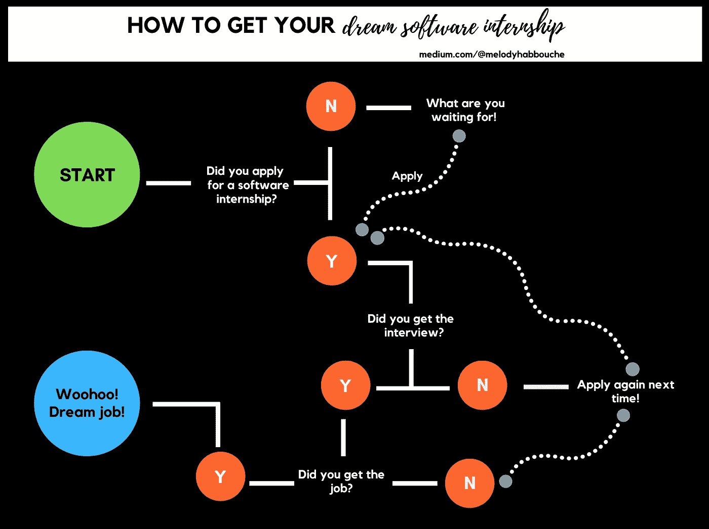

# 如何从“失败”的技术面试中获益

> 原文：<https://betterprogramming.pub/actionable-steps-after-coding-interview-2e904c0cc3af>

## 一次不成功的编码面试后该做什么

邦妮·凯特在 [Unsplash](https://unsplash.com/s/photos/woman-computer-people?utm_source=unsplash&utm_medium=referral&utm_content=creditCopyText) 上的照片

技术编程面试就像是技术领域的心碎——没有人喜欢它们，但我们都必须经历它们。

它们很长，没完没了，有时让我们走出去，心想:“那是什么？”

我们都有过这样的经历，漫漫长夜复习 [*破解编码面试*](https://www.goodreads.com/book/show/25707092-cracking-the-coding-interview) ，解决我们在 [HackerRank](https://www.hackerrank.com/) 上可能遇到的所有问题，只为了参加一个面试，被问一个让我们完全不知所措和慌乱的问题。*果然如此。*

除了告诉自己下次会做得更好，你还可以做更多的事情。事实上，如果在你的技术面试之后，你能从这次经历中受益的话，有一个行动——嗯，也许是几个——那就是！

# 1.复习面试中不太顺利的问题

所以你沮丧地离开了，你没有很好地解决这个挑战，留给面试官几行令人失望的代码。

这不是一次好的经历，但在接下来的几天里，你唯一应该做的事情就是花时间自己解决它。你可以吸取这次不成功的经验，并因此成为更好的问题解决者。

以下是我喜欢做的事情(类似于 [CTCI](https://www.goodreads.com/book/show/25707092-cracking-the-coding-interview) 的方法):

*   面试结束后，写下你记得的关于这个问题的任何细节。
*   去吧慢慢来解决。如果你需要资源，或者你需要一些谷歌搜索，去吧！你这么做是为了学习！使用你在面试官面前使用的相同方法(阐明、分析、计划、实施、测试)。
*   一旦你觉得你找到了一个足够好的解决方案，确定时间和空间的复杂性。然后，确定一些可能的改进(一些谷歌搜索也会有所帮助！).
*   尽你所能做些改进。你对你的解决方案满意吗？

# 2.识别故障点(坏的)

在你想出一个新的更好的解决方案后，它会让你在面试中犯的错误更加明显。

写下你认为不太顺利的事情:

*   你是否以有效的方式向面试官大声表达了你的想法和过程？
*   你写了一个对所有给定输入都有效的算法吗？或者，您是否需要经常重复您的解决方案，以使其适用于所有情况？
*   你在给变量命名时小心了吗？你的代码是干净和集中的，还是混乱和重复的？

通过识别面试中出现的这些障碍，你可以解决它们并加以改进。

# 3.回忆一下面试官可能教给你的任何东西(好的)

既然你已经发现了不好的地方，那就利用它变得更好。

所有最好的面试官都会在面试过程中指导你如何更好地编程。

让我们通过一个例子来理解这种方法:

你在给变量命名时小心了吗？你的代码是干净和集中的，还是混乱和重复的？

我以前也遇到过这种情况。面试官指出我的代码没有包含有意义的名字，给了我改正的机会！我没有意识到糟糕的命名对我所写代码的理解有多大影响，例如，在不同变量之间混淆。

面试官让我做的这个给变量取有意义的名字的小练习花了两分钟，但可能会伴随我一生！

## 一个 ***坏例子***

下面是使用 Python 获得一个数的阶乘的代码块，其中我们对变量和函数名使用随机命名。

这是一个不好的例子，因为在一个小程序中，命名缺乏精确性可能看起来不那么糟糕，但是当你的程序变得稍微复杂一点的时候，可能会变得难以识别哪个变量指的是什么。

我们可能会混淆“a”和“I ”,我们甚至可能会混淆函数名“fact”和变量“fact ”,因为它们具有相同的名称。

这是一个向你的面试官展示的不好的做法的例子，甚至可以作为你不被其他候选人选中的标志，因为这是编程中一个如此基本但重要的概念。

## 一个 ***更好的例子***

我们可以通过给出与我们的意图相关的有意义的名字来改进我们的代码。我们也可以避免两次使用同一个名字。

你可以在[*Clean Code:A Handbook of Agile Software crafts*](https://www.goodreads.com/book/show/3735293-clean-code)中阅读更多关于 cleaner practices 的内容，这是一本非常详细的书，一定会训练你成为一名更好的程序员。

# 4.了解这个过程教会了你关于公司本身的什么

面试官说了很多关于公司本身的事情。任何时候你去面试，你都是在面试他们。面试官可能是你的下一任导师或经理。

这可以有两个方向:

1.  面试官是否用难题拷问你，导致你不可避免的失败？面试官没有以任何方式帮助或引导你找到解决方案吗？他们没有提供任何改进反馈吗？
2.  面试官是否以积极的方式挑战你，并在你陷入困境很久的时候继续帮助你？他们提供了正面强化吗？

面试官在整个面试过程中如何与你沟通、提供指导和表现出导师风范，与他们在日常工作中如何真正帮助他人有着很大的关联。

这是需要寻找的东西，可以帮助你评估公司的流程和文化，以及你是否想为他们工作。

# 5.用另一种语言解决这个挑战

你“失败了”，你学会了，你做得更好。

现在怎么办？更进一步，用另一种你已经很久没用过的编程语言来解决问题！

# 结论

重要的是从每一次经历中学习，无论是好是坏。在多次编码面试后，这些步骤会成为你的第二天性，你会重复这个过程，直到你掌握了这些面试！

归根结底，技术面试就是这样。*面试。*不适合所有人的有点缺陷的流程。

它也不能决定你作为程序员的能力或价值，所以不要把自己累垮了。有些事情是你无法控制的，但是决心和努力绝对对你得到梦想中的工作有作用！

