# SwiftUI 中的活动指示器

> 原文：<https://betterprogramming.pub/activity-indicators-in-swiftui-17b66e6c0137>

## 使用 SwiftUI 加载屏幕实现

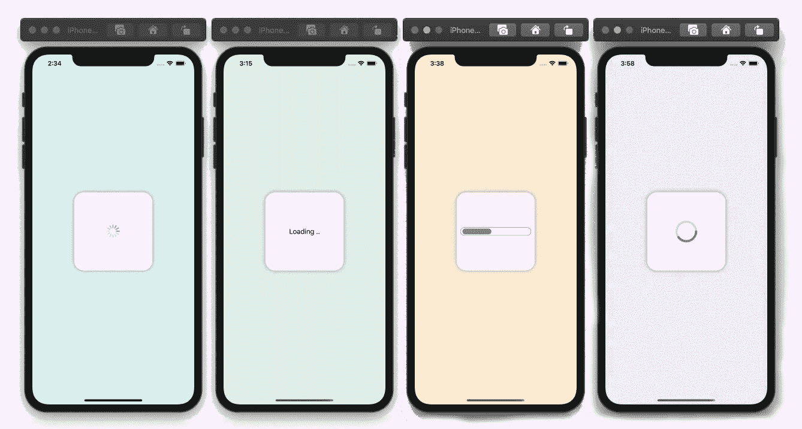

代码片段结果(作者照片)

下面的一些例子使用定时器来控制加载屏幕。在现实生活的场景中，您可能需要使用下载或上传的字节数，或者对您有意义并适用于您的项目的任何值。

我们将从基本活动指标开始。

# **基本活动指示器**

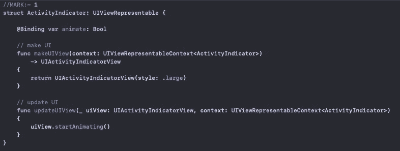

基本活动指示器代码

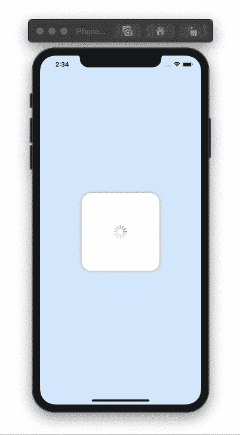

基本活动指示器

# 旋转活动指示器

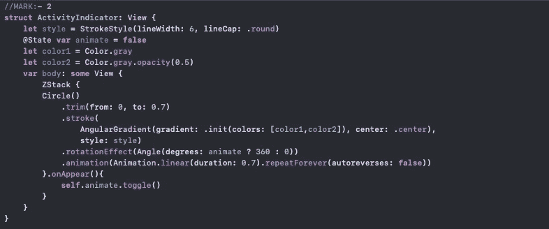

旋转器—活动指示器

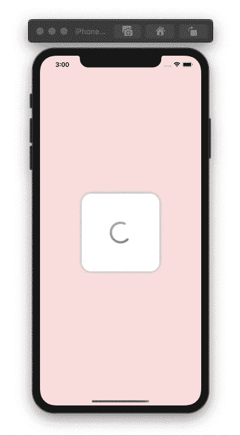

旋转器—活动指示器

# 加载文本

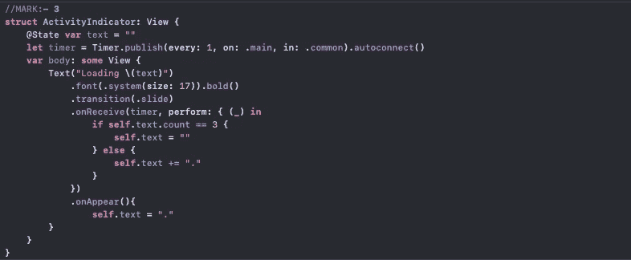

加载文本代码—活动指示器

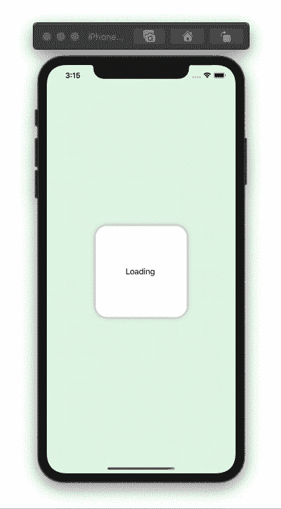

加载文本—活动指示器

# 装载杆

加载条形码—活动指示器

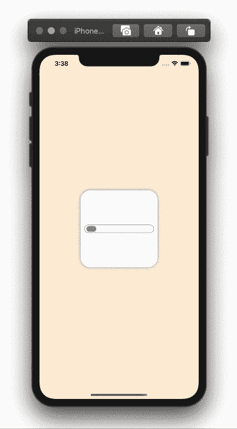

装载栏—活动指示器

# 半圆旋转器

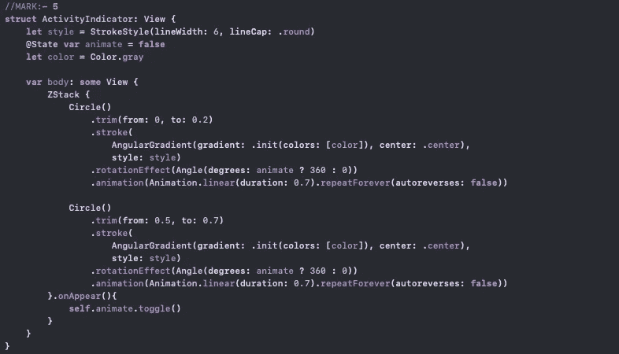

半圆旋转器代码—活动指示器

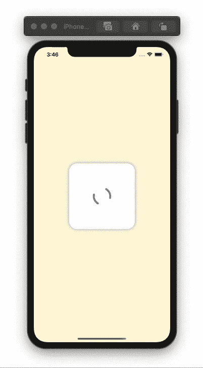

半圆旋转器—活动指示器

# 装载圆

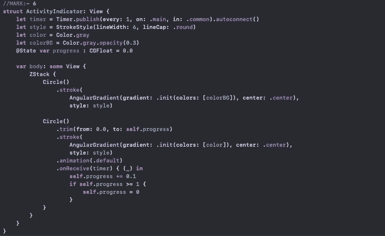

装载循环代码—活动指示器

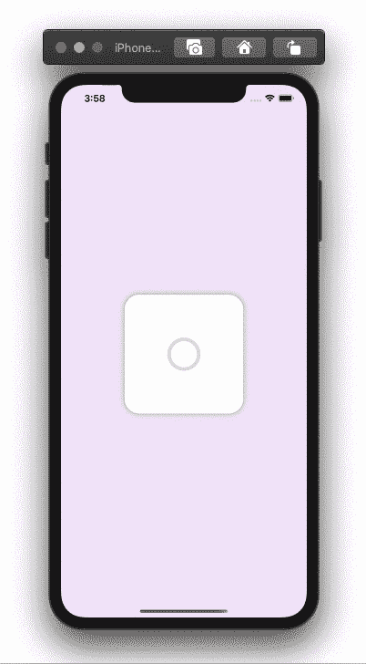

装载圈—活动指示器

感谢阅读！