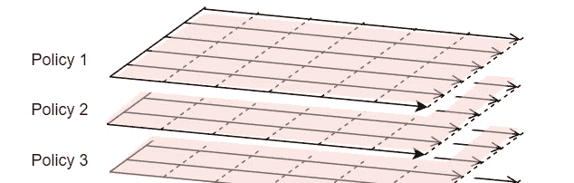
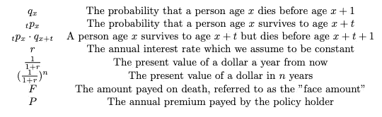
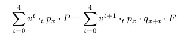
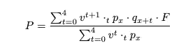
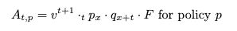

# 基于 Python 的 GPU 精算模型

> 原文：<https://betterprogramming.pub/actuarial-models-on-the-gpu-with-python-ff21c2d994aa>

## 快速计算数百万份保单的保险数量



经滨村文人许可使用的图表

# 问题陈述

对于一份在死亡年度结束时支付 100，000 美元的保险合同，什么是公平的年度支付额？如果支付的预期现值等于未来收益的预期现值，我们说支付是公平的。

# 必备领域知识

如果上一节中的粗体语句有意义，请跳过这一节。否则，请从以下资源中了解内容:

*   [现值](https://www.investopedia.com/terms/p/presentvalue.asp)
*   [期望值](https://openstax.org/books/statistics/pages/4-2-mean-or-expected-value-and-standard-deviation)

现值和期望值是两个独立的概念，但它们在保险中经常一起出现，因为

*   死亡时间是一个随机变量(使用期望值来处理)
*   现金流存在于未来(贴现未来现金流以获得现值)

## 一些符号

[国际精算符号](https://www.casact.org/sites/default/files/database/proceed_proceed49_49123.pdf)有死亡率和贴现因子等符号。相关符号如下所示:



公式来自[这个背页的文档](https://www.overleaf.com/read/dzpcggvvmqqs)

对于持续五年的[定期寿险](https://www.investopedia.com/terms/t/termlife.asp)合同，我们可以通过将投保人支付的保费的预期现值(左)与保险人支付的福利(右)相等来确定公允价格。



求解磷产量—



折扣系数不同，因为保费在年初支付，而索赔在年底支付。

# 为什么用 Python 做精算建模？

这不是关于 Python 语言本身，而是关于 Python 深度学习生态系统，它为我们提供了运行在 GPU 上的张量库。我们将使用谷歌的 JAX。

[JAX 快速入门](https://jax.readthedocs.io/en/latest/notebooks/quickstart.html)指出

> JAX 在 CPU，GPU 和 TPU 上是 NumPy，在高性能机器学习研究方面有很大的自动差异化。

精算建模通常是令人尴尬的并行，涉及许多我们可以并行的政策或经济情景。JAX 提供了熟悉的 NumPy API，同时允许 GPU 加速我们高度并行的精算工作负载。

足够的背景知识。我们开始吧！

# 计算合同的公平价格

## 加载死亡率表

我们需要死亡概率来进行计算。精算师协会(T4)维护着一个死亡率表(T6)的集合。我发布了一个名为 [pymort](https://github.com/actuarialopensource/pymort) 的 Python 包，可以轻松地将这些表加载到张量格式中。

下面的代码加载了十种不同风险的死亡率表集合，这就是为什么主要维度的大小为`10`。

“选择”和“最终”的含义将在下一节讨论

## 死亡率表中的比率查找

传统的精算模型是递归定义的，调用栈的每一层都代表一个新的时间步。相比之下，我们同时计算所有时间点。这允许在 GPU 上对时间维度进行并行化。

被保险人必须接受[医疗承保](https://www.aigdirect.com/about-life/applying-for-life-insurance/what-is-medical-underwriting)，该承保针对那些身患绝症的人。这降低了最初的死亡率，也是为什么有一个降低死亡率的`select`表过渡到`ultimate`表，这是针对一般人群的。

## 现金流量的预期现值

我们创建一个张量来表示每个保单在每个时间步中索赔的期望现值。

上述张量可以用矩阵符号来描述



## 获得公平的价格

这是公式(再次)


看到下面的代码解决了这个问题。

P.S .如果保险公司有费用的话这个保费不公平！这个模型是一个简化，但希望它是有指导意义的。

非常感谢您花时间阅读这篇文章。我尽力让它值得你花时间。

```
LinkedIn group for open source actuarial discussion — [https://www.linkedin.com/groups/13937070/](https://www.linkedin.com/groups/13937070/)
```