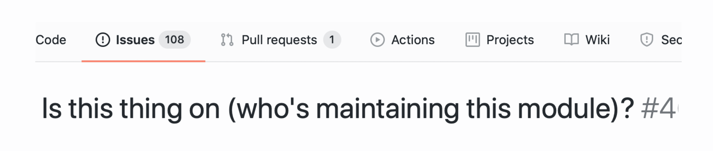
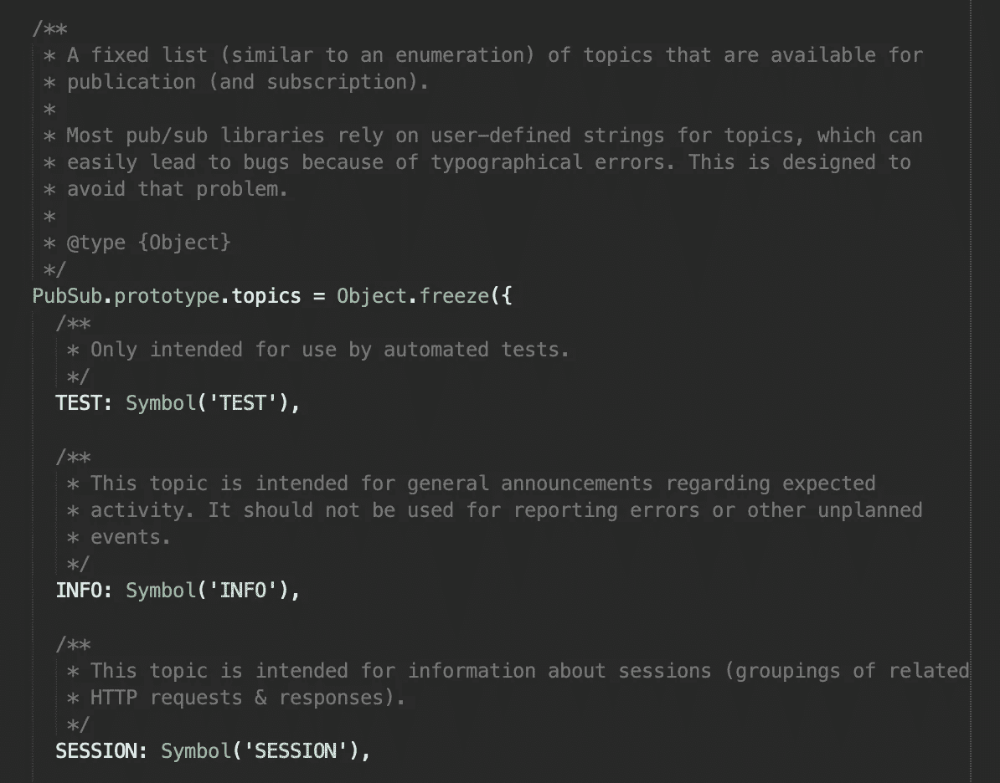

# “适应”你对开源模块的使用

> 原文：<https://betterprogramming.pub/adapt-your-use-of-open-source-modules-cae0dd75128d>

## 如何降低依赖第三方软件的一些风险

在 [Unsplash](https://unsplash.com?utm_source=medium&utm_medium=referral) 上[丹娘·卢诺赫德](https://unsplash.com/@loonohod?utm_source=medium&utm_medium=referral)的照片

在[如何选择满足您需求的最佳开源模块](https://medium.com/better-programming/how-to-choose-the-best-open-source-module-for-your-needs-a205c1defd62)中，我谈到了我们可以用来为我们的软件项目选择“最佳”开源模块的一些原则。然而，这个过程并不是完全安全的，还可以采取一些额外的防御措施。这篇文章描述了我成功使用的一种方法。我们将首先看看为什么它是必要的，并考虑一些限制。我希望它也能让你受益，或者至少激发一些新的想法。

我最不喜欢的 GitHub 问题之一

如果你花了一些时间在开源模块上，或者依赖于开源模块，那么你已经意识到事情会发生多么剧烈的变化。在任何一天，一个模块可能是自切片面包以来最好的东西，或者完全被抛弃，或者介于两者之间。它可能看起来很完美，直到更好的出现，或者它可能只是权宜之计，直到你有机会推出自己的产品。也许它已经被忽视了，您很担心，因为它的依赖项已经过时，或者它不再通过 CI，或者它在您使用的平台的最新版本上不再受支持。不管原因是什么，关键是我们必须接受某种程度的不确定性，并欣赏不断变化的现实。

当我们有一个高度依赖于特定模块的大型代码库，或者如果我们的代码库打算存在很长时间时，处理这种变化对我们来说尤其痛苦。事实上，我们的代码库存在的时间越长，它所依赖的模块发生变化、失去支持或被更好的东西取代的可能性就越大。

有些人可能会主张，解决这个问题的最好方法是分叉所有的依赖项，并将它们完全置于自己的控制之下。这可能行得通，除了:

*   你的代码库变得更大了。
*   最有可能的是，这些新代码都不是您创建的，并且它可能需要一个重要的学习曲线来进行未来的维护。
*   这种方法本身并不能真正降低风险，它只是推迟了不可避免的事情。

# 那么我们应该怎么做呢？

我建议的方法有两个组成部分，这两个部分对于降低风险都至关重要:

1.  为模块创建一个[适配器](https://lmgtfy.com/?q=adapter+design+pattern)(也称为*包装器*)，它将作为代码和模块之间的接口。
2.  为适配器编写一个测试套件，该套件将快速验证其预期行为，从而在需要时为您提供更改底层实现的自由和信心。

你可以试着说服自己，你真的只需要这些组件中的一个。但是，我不建议那样。如果您打算花时间创建一个适配器，那么只需多花一点时间并编写一些测试代码(反之亦然)。你未来的自己会为此感谢你，自从我开始实践 TDD 并遵循良好的软件设计实践以来，这已经发生在我身上很多次了。

# 案例研究:发布/订阅

在我选择的编程语言(JavaScript)中，目前在 NPM 上有大约[1300 个不同的模块声称与发布/订阅有关。有些是为了在 web 上发布数据，有些是为了在单个应用程序中使用，有些是特定于特定的框架或平台，但无论如何，有很多选择，并且新的选择不断出现。](https://www.npmjs.com/search?q=pubsub)

去年，我在为一个客户做项目时遇到了这个小难题。这不是我在那个项目中处理的最大问题，但我认为它为我们的讨论提供了一个很好的例子。

## 第一步。从尽可能小的接口开始

当您开始创建适配器类时，添加许多方法或属性可能很有诱惑力，因为您可以这样做。我们需要保持专注，以免落入 YAGNI 陷阱。

(巧合的是，这也是严格遵循 Kent Beck 在他的书《测试驱动开发:举例》中提倡的 TDD 方法的好处之一。如果你想最小化你的测试代码，那么你也应该最小化你的应用程序代码。)

以下是我所遵循的决策过程:

1.  我的适配器应该返回一个函数(例如，一个对象构造函数)还是只返回一个对象？我决定它应该是一个对象，所以我的第一个测试检查这个。
2.  返回的对象应该是单例的吗？在这种情况下，我决定它应该是。我的应用程序的不同部分依赖于发布/订阅适配器，并且假设它们都需要引用同一个实例。这是我的第二个测试。
3.  共享实例需要一个发布方法。测试 3 检查它是否存在。
4.  订阅也一样。
5.  现在，当订阅特定主题时，回调应该在调用 publish 时执行。无论发布什么数据，回调都应该接收到(测试 5 和 6)。(您可能想将这些合并到一个测试中，但是我强烈建议不要这样做。每个测试应该只有一个断言。)
6.  此时，适配器中的代码非常基本，甚至没有引用任何实际实现了 pub/sub 的第三方模块。我只是硬编码了所有的东西以通过测试，但是现在是时候选择一个模块并连接它了。我重新做了测试，继续前进。

## 第二步。针对您的特定用例进行改进

在这一点上，我真的想补充一些东西。首先，我不喜欢*发布*和*订阅*。我更喜欢*说*和*听*作为方法名，所以我改变了每一个，一路重新运行测试。

第二，我不想在出版物主题中使用字符串值。我认为它为印刷错误留下了太多的空间，这些错误在应用程序投入生产之前永远不会被发现。所以我的适配器包含了一个属性，它是一个带有许多符号属性的冻结对象。这创建了一种不可变的枚举，使我更容易编写(更重要的是，读取)依赖于我的发布/订阅适配器的代码:

这是我的出版主题“列举”的一部分。

## 第三步。避免实现你不需要的特性

这是步骤 1 的延伸。大多数发布/订阅实现都包含取消订阅的方法。在我创建的应用程序中，所有的订阅者都与应用程序本身具有相同的生命周期，所以没有必要将他们包含在我的适配器中。YAGNI。

## 第四步。在剩下的代码中引用您的适配器

这应该是不言自明的，但是您可能需要在将来的代码审查中包括这样的检查。确保团队中的每个人都知道这个适配器，并且正在使用它。定期搜索对适配器外部的第三方模块的引用，并检查您的项目清单，以确保没有类似的*(提供相同功能并与您的适配器并行存在的其他项目依赖)。*

# *适应所有的事情？*

*这种方法不一定是一刀切的解决方案。它确实涉及额外的工作，而且这项工作应该有合理的正当理由。以下是我用来决定何时为第三方模块创建适配器的标准列表:*

## *模块是我的应用程序的关键组件吗？*

*如果替换一个模块会导致整个应用程序的大量返工，那么创建一个适配器可能是有意义的。正如本文开头所提到的，与更改模块相关的痛苦越多，我们通过包装它获得的收益就越多。*

## *模块的 API 有多大或者多复杂？*

*具有大型 API 的模块，有许多不同的类、方法等。，可能不适合这种方法。我们不希望投入太多的时间和精力来创建一个适配器，就像从零开始构建我们自己的模块版本一样。*

*但是，从另一个角度来看，这可能是创建适配器的一个好理由:包装器会显著改进或简化模块的 API 吗？或者它能使模块更容易地在多个项目中共享吗？绝对值得考虑。*

## *是否有大量已发布的模块都提供相同的功能？*

*用于给定目的的模块越多，我们越不确定选择哪一个，那么创建一个适配器就越好。我们的第一选择很有可能不是最好的，有一个包装器可以使转换到另一个更容易。*

## *我之前的经历教会了我什么？*

*从过去的经验中学习也应该是一种指导。如果你已经知道或者有一种直觉，这将是一个好主意，那么，无论如何，听从你的直觉。*