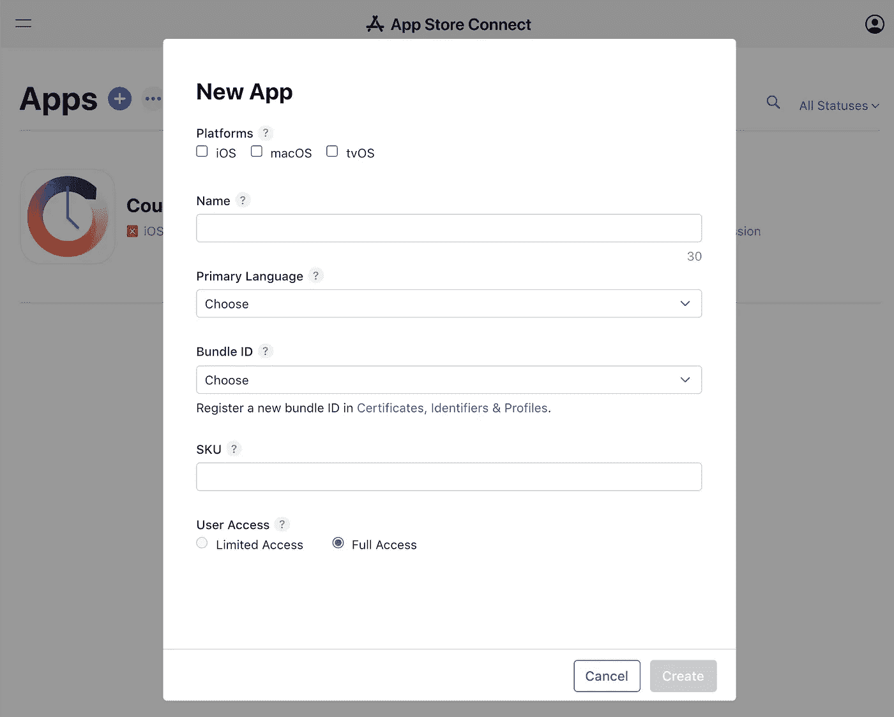
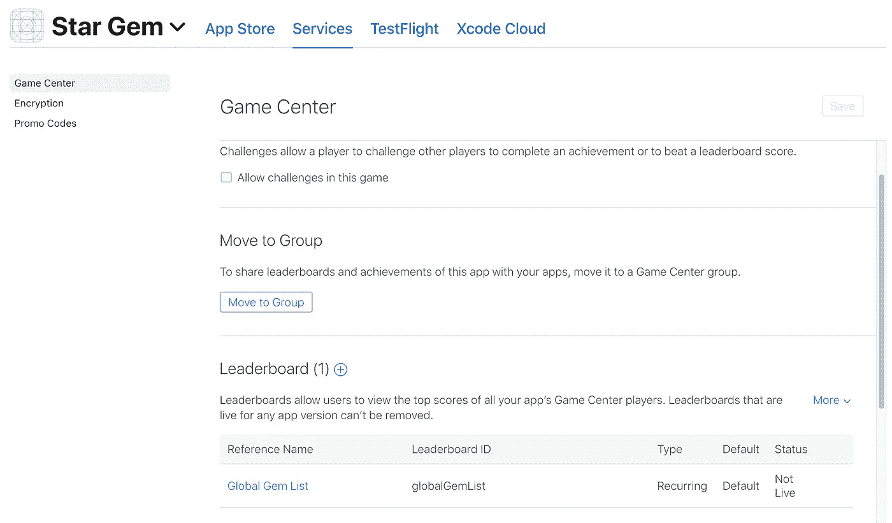
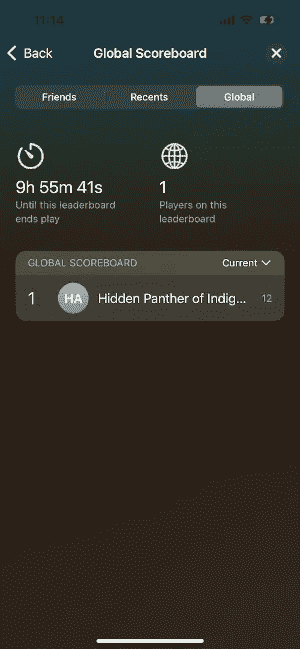

# 向您的 iOS 应用程序添加排行榜

> 原文：<https://betterprogramming.pub/add-a-leaderboard-to-your-ios-app-d457697f4616>

## 将 Game Center 排行榜集成到 iOS 应用程序的分步指南

照片由 [Element5 数码](https://unsplash.com/@element5digital?utm_source=unsplash&utm_medium=referral&utm_content=creditCopyText)在 [Unsplash](https://unsplash.com/s/photos/scoreboard?utm_source=unsplash&utm_medium=referral&utm_content=creditCopyText) 上拍摄

排行榜通常在在线游戏中用来表示玩家在全球级别上的排名。这鼓励了友好的竞争，同时为玩家提供了提高和参与游戏的动机。

幸运的是，苹果游戏中心可以轻松创建排行榜，并将这一功能直接集成到 iOS 应用程序中。苹果游戏中心是苹果的社交游戏网络平台，允许玩家访问全球排行榜、多人游戏功能并展示他们的成就。

下面是创建排行榜并将其完全集成到使用 Swift 5 构建的 iOS 应用程序中的分步指南。

# **1。创建排行榜**

虽然没有有效的 Apple 开发人员帐户也可以完成大多数 iOS 开发功能，但创建和访问游戏中心功能却可以。必须首先在[https://developer.apple.com/support/app-account/](https://developer.apple.com/support/app-account/)创建一个开发者账户。创建开发者账户后，进入 [Apple Connect 主页](https://appstoreconnect.apple.com/apps)并创建一个新的应用程序，该应用程序将连接到当前正在开发的应用程序。

创建新应用程序

设置应用程序时，请确定出现在“通用信息”下的“捆绑包 ID”与 Xcode 中应用程序项目的 ID 相匹配。

Game Center 排行榜设置现在可以在新创建的应用主页中进行设置。在应用程序主页中，选择水平选项卡“服务”和垂直选项卡“游戏中心”以访问游戏中心设置。

游戏中心设置

在“排行榜”下，点击`+`创建新的排行榜。选择一个“经典”**或“循环”排行榜，并填写其余提示。**

# **2.用户认证**

**应用程序初始化后，用户需要通过身份验证才能访问 Game Center 排行榜及其个人资料。在本例中，在应用程序启动时显示的第一个 ViewController 上验证身份验证。`[GKLocalPlayer::authenticateHandler](https://developer.apple.com/documentation/gamekit/gklocalplayer/1515399-authenticatehandler)`负责认证本地玩家并确定默认排行榜 ID。此排行榜 ID 将在更新和查看默认排行榜时使用。**

**验证用户**

# **3.更新排行榜**

**游戏中可能会有一些逻辑需要更新排行榜。也许这发生在玩家赢得一场游戏，收集更多的硬币，或者解锁一个成就的时候。排行榜可以通过调用`[GKLeaderboard::submitScore(_:context:player:completionHandler:)](https://developer.apple.com/documentation/gamekit/gkleaderboard/3577544-submitscore)`来更新。**

**更新排行榜**

# **4.展示排行榜仪表盘**

**用户将需要一种方法来访问应用程序内的排行榜仪表板。实现这一点的一种方法是在主屏幕上创建一个按钮，显示 Game Center 排行榜仪表板。Swift 为游戏中心仪表盘提供的视图控制器叫做`[GKGameCenterViewController](https://developer.apple.com/documentation/gamekit/gkgamecenterviewcontroller)`。**

**这个类提供了自定义玩家登陆的主面板的选项。在我们的例子中，我们只想显示默认排行榜的历史全球排名。以下示例包含连接到“排行榜”按钮的回拨代码。**

**展示 GameCenter 视图控制器**

**在我们将`gameCenterDelegate`设置为当前视图控制器的情况下，主视图控制器类也需要从[GKGameCenterControllerDelegate](https://developer.apple.com/documentation/gamekit/gkgamecentercontrollerdelegate)继承。添加这个类还需要完成`gameCenterViewCOntrollerDidFinish`存根。这个存根需要包含关闭仪表板的逻辑。**

**从 GKGameCenterControllerDelegate 继承主类**

**从应用程序查看排行榜仪表板将如下所示:**

****

**排行榜仪表板**

# **结论**

**使用 Apple Game Center 库和功能，可以轻松地为您的 iOS 应用程序设置全球排行榜。本教程分解了在 iOS 应用程序中更新和查看排行榜所需的最少步骤。**

**虽然它利用内置的视图控制器来显示排行榜，但就 Swift 的外观而言，几乎任何事情都是可能的。**

**排行榜仪表板可能需要进一步定制，以保持与您的应用程序的外观和感觉一致。这将在以后的文章中讨论！**