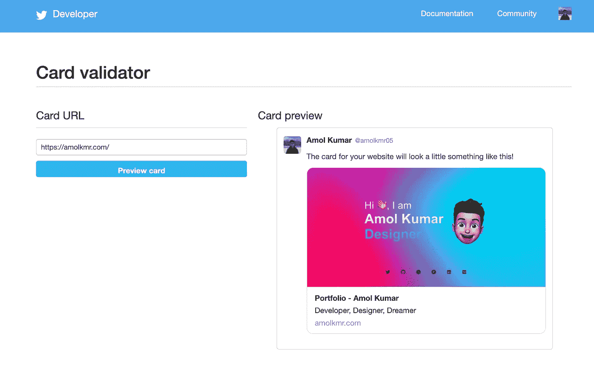

# 如何在你的网站上添加一张 Twitter 卡片

> 原文：<https://betterprogramming.pub/add-a-twitter-card-to-your-website-69f7d53b68a8>

## 更新您网站的元数据以支持 Twitter 上的预览卡


你一定遇到过有人在 Twitter 上分享带有丰富预览图片、标题和描述的网站链接。但是当你在你自己的网站上尝试同样的方法时，你得到的只是一张没有图片和简单描述的乏味的卡片。

本教程将带您了解如何通过添加几行代码来为您的网站添加该功能。

# [计]元数据

Twitter 使用该网站的元数据来获取相关信息，如 [Twitter 卡](https://developer.twitter.com/en/docs/twitter-for-websites/cards/guides/getting-started)的标题和描述。该元数据还存储了指向网站预览图像的链接。

转到项目的根文件，添加以下 meta 标签

第一个 meta 标记指定了 Twitter 卡的类型，因为它们有 4 种类型

*   [概要卡](https://developer.twitter.com/content/developer-twitter/en/docs/tweets/optimize-with-cards/overview/summary-card-with-large-image):标题、描述、缩略图。
*   [大图摘要卡](https://developer.twitter.com/en/docs/tweets/optimize-with-cards/overview/summary-card-with-large-image.html):与摘要卡类似，但有突出的特色图片。
*   [App 卡](https://developer.twitter.com/content/developer-twitter/en/docs/tweets/optimize-with-cards/overview/app-card):直接下载到手机 App 的卡。
*   [播放器卡](https://developer.twitter.com/content/developer-twitter/en/docs/tweets/optimize-with-cards/overview/player-card):可以显示视频/音频/媒体的卡。

在本教程中，我们将使用带有大图像类型的**摘要卡。第二个 meta 标签对应于您的 Twitter 句柄。第三和第四个分别用于网站的标题和描述。**

# 预览图像

此时，剩下要做的就是添加一个带有预览图像的 meta 标记。但在此之前，我们需要将图像托管在云存储上，以便为其生成一个可下载的链接。你可以使用像 [Google Drive](https://drive.google.com/) 、 [Dropbox](https://www.dropbox.com/) 或 [OneDrive](https://onedrive.live.com/) 这样的服务来托管图片。

上传到存储器后，生成可共享链接并粘贴到[这里](https://syncwithtech.blogspot.com/p/direct-download-link-generator.html)。该网站会将链接转换为可下载的链接。回到代码文件，添加下面的 meta 标记。

```
<meta name="twitter:image" content="Downloadable link here."/>
```

# 卡片验证器

一旦你有了所有的元标签，推送你的代码，等待网站上线运行。之后，前往[卡验证器](https://cards-dev.twitter.com/validator)粘贴你的网址。它会给你一个卡片将如何出现在 Twitter 上的预览。



# 包裹

就是这样！！您只需添加几行代码，就可以在您的网站上添加一张 Twitter 卡片。如果您的卡没有按预期出现在验证器中，请检查验证器控制台是否有错误，并尝试再次执行上述步骤。

```
**Want to Connect?**As always if you have any further questions, you can always reach out to me on [Twitter](https://twitter.com/amolkmr05).
```