# 使用 Node.js、Discord.js 和 OpenAI GPT-3 构建一个 Discord Bot

> 原文：<https://betterprogramming.pub/add-an-ai-to-your-discord-server-with-node-js-and-gpt-3-198b538cc05b>

## 给你的不和谐服务器添加一个人工智能

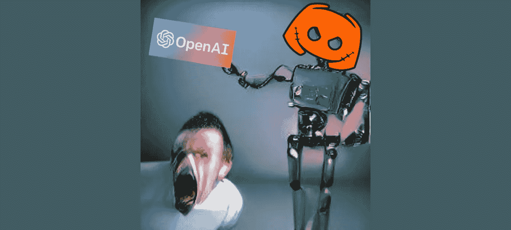

人工智能生成的机器人追逐尖叫男子的照片蒙太奇

人工智能现在正在蓬勃发展，许多开发人员希望开始用它创建项目。然而，训练你自己的人工智能在你的项目中使用它对初学者来说是相当具有挑战性的。

幸运的是，近年来与人工智能的交互变得容易得多，这要归功于 OpenAI 等公司发布的 API，用于与他们大型的预训练神经网络进行交互。

在本教程中，我们将构建一个 genius Discord bot，它可以回答复杂的问题并完成有用的任务。为了创建这个机器人，我们将使用 Node.js、Discord.js 和 GPT-3 的 OpenAI API，这是有史以来最大、最智能的神经网络之一。

所以事不宜迟，让我们开始体验一下人工智能吧！

更新:与此同时，Discord API 和 Discord.js 有了突破性的变化。在本教程的最后找到 bot.js 的更新代码。

# 你需要什么(先决条件)

要创建我们的项目，您需要几个帐户，并安装必要的软件，如下所示:

账户:

*   OpenAI beta 账户(在此注册)
*   不和谐账号(此处下载并注册)

软件安装:

*   Node.js(从[这里](https://nodejs.org/en/)下载安装)
*   VS 代码(从[这里](https://code.visualstudio.com/)下载安装)。如果您还没有代码编辑器

# 不和谐准备

## **第一步:登录 Discord 并创建一个服务器**

如果你还没有的话。请注意，您必须拥有服务器或认识有权在后续步骤中添加 bot 帐户的人。您可以通过单击左侧菜单中的“+”图标来创建新的服务器。

## **步骤 2:添加新的开发者应用**

转到[https://discord.com/developers/applications](https://discord.com/developers/applications)并点击右上角的“新建应用程序”按钮创建一个新应用程序。

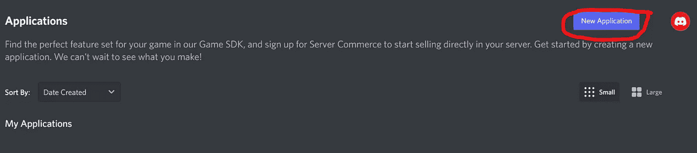

点击左上方的“新建应用程序”按钮，添加一个新的开发者应用程序。

## **第三步:为应用程序命名**

比如“AiBot”然后点击“创建”

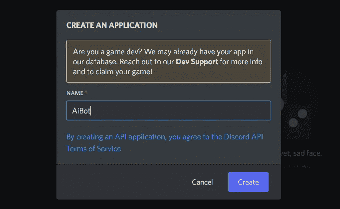

为应用程序命名，然后单击“创建”

## **第四步:创建一个机器人**

转到左侧菜单中的“机器人”部分，然后单击屏幕右侧的“添加机器人”。

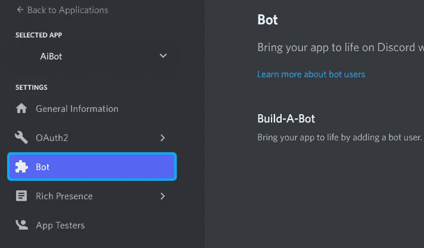

转到应用程序的 bot 部分。

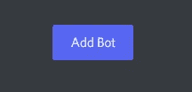

通过点击按钮添加一个机器人。

## 第五步:创建一个机器人令牌

单击“重置令牌”按钮创建新的 bot 令牌。此令牌是秘密的，不应与其他人共享。将其保存在文本文件中以备后用(令牌仅显示一次)。

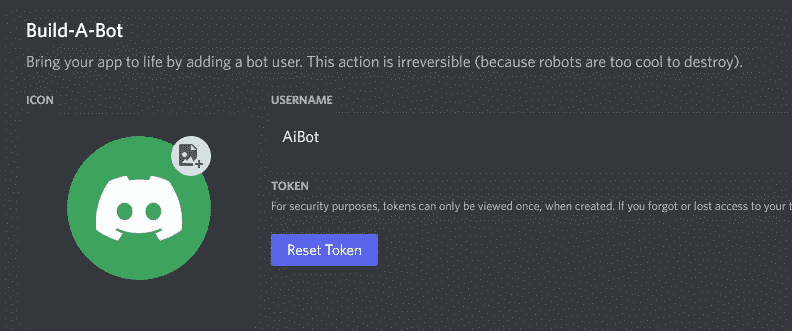

## **第六步:设置 bot 的作用域和权限。**

转到设置菜单的 OAuth2 >URL 生成器部分。

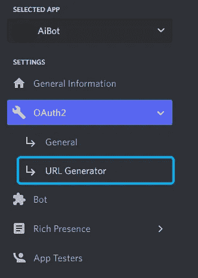

转到 OAuth2 > URL 生成器

将范围设置为“bot”，并将权限设置为“阅读消息/查看频道”和“发送消息”这将使机器人能够在服务器聊天中读写消息。


将范围设置为“bot”

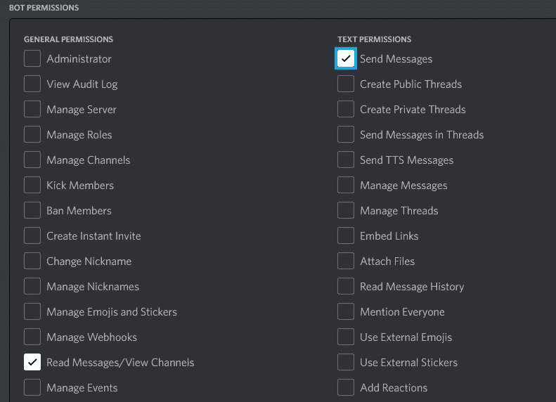

设置权限，使机器人能够在聊天中读写。

## **第七步:复制邀请网址并粘贴到浏览器中**

继续向下滚动，找到“生成的 URL”它看起来会像这样:

```
[https://discord.com/api/oauth2/authorize?client_id={YOUR_CLIENT_ID}&permissions=3072&scope=bot](https://discord.com/api/oauth2/authorize?client_id=989592867871801434&permissions=3072&scope=bot)
```

将此 URL 粘贴到浏览器的搜索栏中。选择要授权 bot 的服务器，然后单击“下一步”(“Weiter”)。

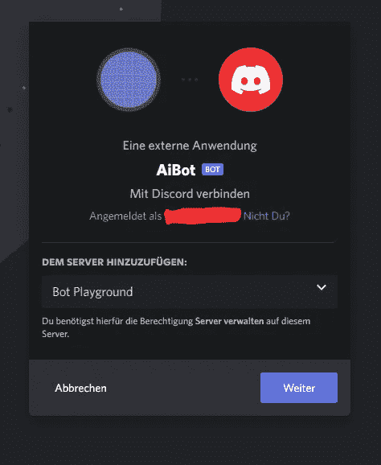

为您的服务器授权您的 bot

接受必要的权限并点击“授权”完成

## **第八步:在服务器上欢迎你新创建的 bot！**

关闭选项卡并返回到您的服务器。如果一切顺利，你会在服务器成员中找到你的机器人。

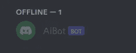

如果一切顺利，您应该能够在服务器上找到这个机器人

# 将人工智能机器人带入生活

现在这个机器人在我们的服务器中是可见的，让我们用代码让它做一些事情。

## **步骤 9:初始化一个新项目**

创建一个新文件夹，并在计算机上的首选位置将其命名为类似“aiBot”的名称。我在桌面上创建了我的。

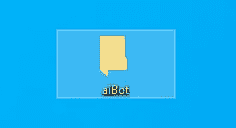

在您的首选位置创建一个新文件夹来保存代码

现在，在 File > Open Folder 下打开 VSCode 应用程序和新创建的文件夹。

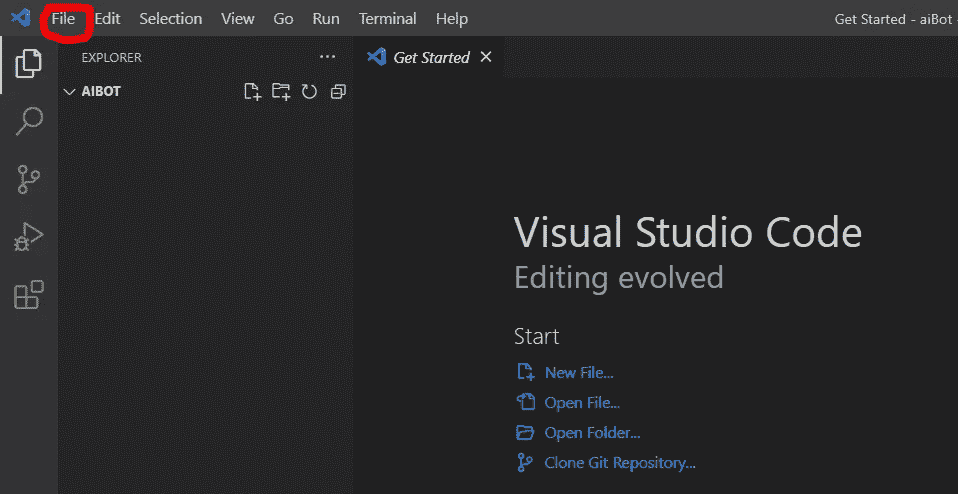

在代码编辑器中打开文件夹

现在，在菜单栏中的终端>新终端下打开一个新的终端。一个新的终端应该从底部弹出。

在终端中，使用以下命令初始化新的 Node.js 应用程序:

```
npm init -y
```

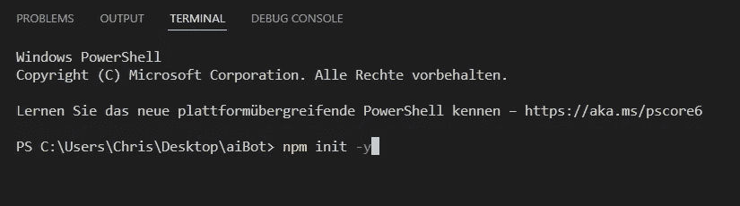

初始化新的节点应用程序

然后按回车。在左边的文件浏览器中，您会看到执行该命令创建了一个新的`package.json`文件。

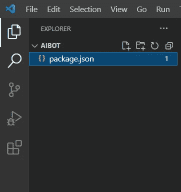

创建了一个新的 package.json 文件

## **步骤 10:创建一个包含僵尸代码的新文件**

编辑`package.json`文件，在启动时执行这个 bot 代码文件中的脚本。

单击“新建文件”图标创建一个新的节点脚本。然后将文件命名为`bot.js`，并在文件中编写一些 hello world 代码。别忘了保存。

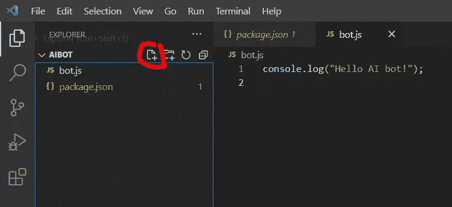

创建一个新文件，给它一个名字，用 hello world 代码填充这个文件

然后转到`package.json`文件，编辑如下:

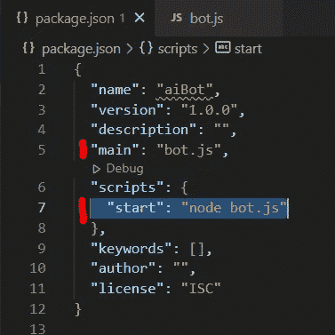

像截图中一样，用“main”和“scripts”下面的代码行进行修改

现在，您可以执行以下命令:

```
npm start
```

在终端，它应该打印“你好人工智能机器人。”

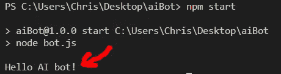

运行上面的命令会打印出“Hello AI bot！”到终端

## **步骤 11:安装 Discord.js 依赖项**

现在我们可以运行`bot.js`脚本了，让我们安装 Discord.js 库来与 Discord 交互。

在终端中，运行:

```
npm install discord.js
```


安装 discord.js 库

这将安装 Discord.js 库，以便轻松地与 Discord API 交互。如果您只收到警告，应该没有问题。但是，如果有错误，请在线搜索解决方案。

## **第 12 步:编写让你的人工智能机器人活起来的代码**

打开`bot.js`文件。在那里，编写以下代码:

将`<YOUR_SAVED_BOT_TOKEN>`替换为您在本教程的步骤 5 中保存以备后用的令牌，并将其放在引号内。然后保存文件。

这个令牌不应该和任何人分享，所以不要把这个教程的代码直接推送给 GitHub。可以选择将“dotenv”软件包与“dotenv”结合使用。gitignore”文件来安全地存储您的令牌，但是对于本教程，我想把重点放在简单性而不是安全性上。

## **第十三步:是(一)直播！**

在终端中运行以下命令，并查看您的 Discord 服务器。这个机器人现在应该在线了。

```
npm start
```

**故障排除:**如果您收到类似“错误:找不到模块‘节点:事件’”的错误，请确保您安装的 Node.js 版本高于版本 16.6.0。您可以使用以下命令检查当前的节点版本:

```
node -v
```

如果您的版本低于 16.6.0 版本，请访问 [Node.js](https://nodejs.org) 网站并安装一个更新的版本。您可以随时使用以下命令关闭卡在终端中的命令:

```
[Ctrl + C] (on Windows) or [Cmd + C] on MacOS
```

尝试重新运行“npm start”命令，并再次检查您的 Discord 服务器。你现在应该看到你的 AI 机器人在线了！

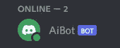

感到高兴，因为你的人工智能机器人现在在线:D

## **步骤 14:让 AI 机器人在服务器上回答消息**

编辑`bot.js`文件，使用下面的代码来回答包含感叹号("！")作为第一个角色。

保存您的更改。通过在终端中按“Ctrl + C”并再次运行“npm start”来重新启动应用程序。

现在在服务器上发送一条以感叹号作为第一个字符的消息。人工智能机器人现在应该回应“你好，来自人工智能机器人。”它不应该响应不具有所需格式的消息。

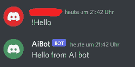

机器人对以感叹号开头的消息的回复

# 准备 OpenAI 的 GPT-3

既然我们已经让机器人响应消息，让我们让它变得智能。为此，我们必须从 OpenAI 网站获得一个令牌。

## **步骤 15:获取一个 OpenAI API 令牌**

去[https://beta.openai.com/account/api-keys](https://beta.openai.com/account/api-keys)。在创建本教程时，GPT-3 服务仍处于测试阶段。如果您稍后按照教程操作，上述 URL 可能已经更改。如果是这样的话，登录你的 OpenAI 账户，进入网站右上角的个人页面。在那里，点击“个人”并选择一个选项，如“查看 API 密钥”


在 API 密钥 URL 发生变化的情况下查找 API 密钥

你会看到这样一个部分:

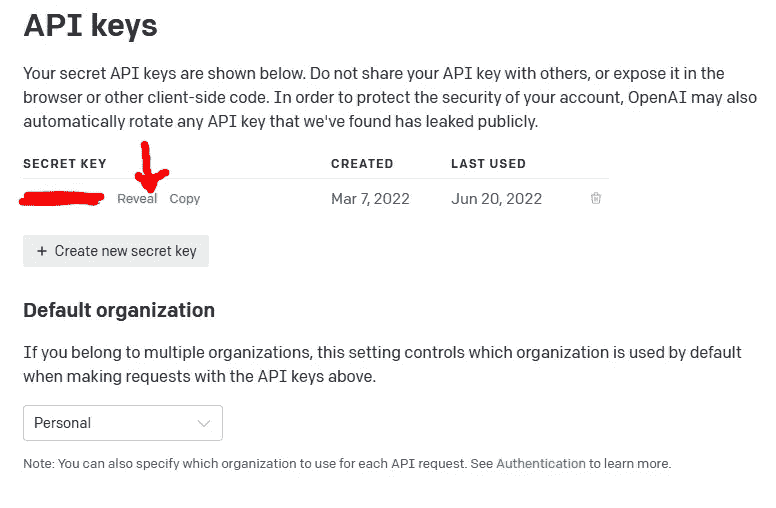

OpenAI 网站上的 API 密钥部分

单击“显示”并将 API 密钥保存在安全的位置。再次强调…你不应该与任何人分享这些 API 密匙，或者把它们上传到你的 GitHub。如果还没有密钥，单击“创建新的密钥”来创建一个新的 API 密钥。

请注意，有了免费帐号，你可以问 AI 的问题的大小(可能还有数量)会有限制。

# 连接 OpenAI 的 GPT 3 号

现在，您已经从 OpenAI 网站获得了必要的令牌，让我们编写代码来与 GPT-3 进行交互。

## **第十六步:安装 OpenAI 库**

前往 VSCode。如果 bot 当前正在运行，请在终端中键入`Ctrl + C`将其停止。

现在，在终端中使用以下命令安装 Node.js 的 OpenAI 库:

```
npm install openai
```

## **第 17 步:创建一个脚本与 GPT-3 互动**

在 VSCode 中，创建一个名为`ai.js`的新文件。

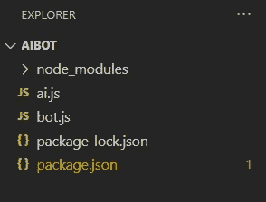

创建一个名为“ai.js”的新脚本文件

现在把下面的代码粘贴进去，用第 15 步中的 API 令牌替换掉`<YOUR_OPENAI_API_KEY>`部分，并确保把它放在双引号内。

## **步骤 18:测试与 OpenAI 的 GPT3 的连接**

保存文件，前往终端。在那里，运行以下命令:

```
node ai.js
```

如果一切正常，你应该会看到人工智能的答案被打印到终端上。

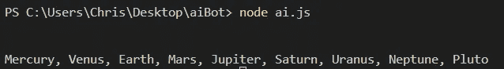

在执行“node ai.js”之后，您应该会得到来自 GPT-3 的响应

# 现在让你的 AI 机器人超级智能！

快好了！祝贺您在教程中走到这一步！你真棒！现在，让我们把所有的部分粘在一起，让你的人工智能机器人达到一个超级天才的水平。

## **第 19 步:将你的不和谐机器人连接到 GPT-3**

转到你的`ai.js`文件。在那里，删除“ask”函数的示例调用，并使用`module.exports`导出该函数。此外，删除控制台日志并在“询问”功能中返回答案。

现在转到`bot.js`文件，应用以下更改:

不要忘记保存您的更改。现在，最后一次，用`Ctrl + C`停止你的机器人运行，然后用:

```
npm start
```

然后，前往你的不和谐服务器，检查是否一切正常。在聊天中用一个问题或任务写一条消息，并在开头加上感叹号。

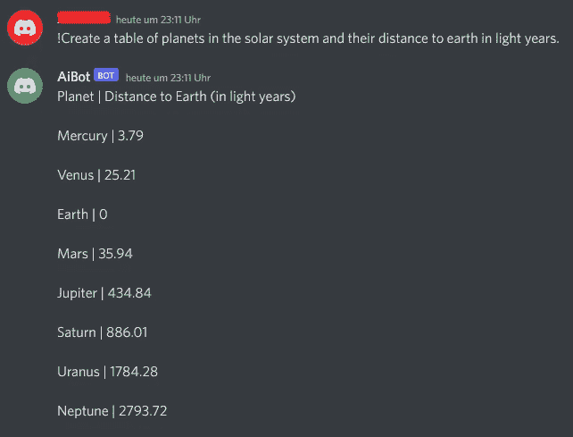

提示人工智能机器人创建一个包含有用信息的表格，并查看结果

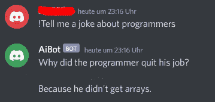

悲伤却真实。不过，我希望在完成这个教程后能加薪

# 恭喜你！

你成功了！您使用 Node.js、Discord.js 和 OpenAI API 创建了第一个 AI Discord Bot。现在你可以向你的朋友炫耀你的机器人，或者随便问他们你感兴趣的问题！

我希望你能从这篇(冗长的)教程中获得乐趣！如果您在代码中遇到任何问题或 bug，请随时联系我。

如果你喜欢这个教程，我也很高兴收到你的反馈！它给了我创造更多像这样的教程的能量！:)

干杯！

# 更新

与此同时，Discord API 和 Discord.js 得到了更新，带来了突破性的变化。如果您的不和谐机器人没有回复，请按照以下步骤操作:

**更新至较新版本的 discord.js:**

要获得我测试的版本，用`npm uninstall discord.js`卸载 discord.js，然后运行`npm install discord.js@14.6.0`。

**启用特权网关意图:**

在 Discord 开发人员门户中，转到:应用程序↦设置↦ Bot ↦特权网关意图，并设置消息内容意图的标志。否则，您将不会收到发送到服务器的消息内容。

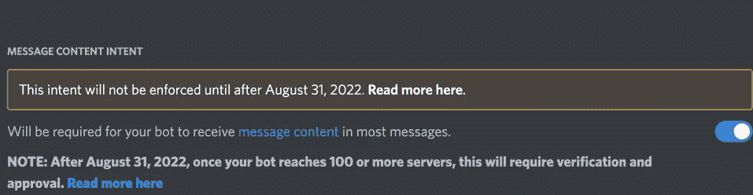

**更新 bot.js 代码:**

```
//in bot.js

const { ask } = require("./ai.js"); //import the "ask" function from the "ai.js" file
const { Client, Events, GatewayIntentBits } = require('discord.js'); //v14.6.0
const token = "<YOUR_BOT_TOKEN>";

// Create a new client instance
const client = new Client({
  intents:
    [GatewayIntentBits.Guilds,
    GatewayIntentBits.GuildMessages,
    GatewayIntentBits.MessageContent]
});

client.once(Events.ClientReady, c => {
  console.log(`Ready! Logged in as ${c.user.tag}`);
});

client.on(Events.MessageCreate, async message => {
  if (message.content.substring(0, 1) === "!") {
    const prompt = message.content.substring(1); //remove the exclamation mark from the message
    const answer = await ask(prompt); //prompt GPT-3
    client.channels.fetch(message.channelId).then(channel => channel.send(answer));
  }
});

// Log in to Discord with your client's token
client.login(token);
```

**注意:**这可能不是最佳的代码，但它是从今天(2022 年 11 月 19 日)开始为我工作的代码。我希望这将解决你们中的一些人对机器人没有反应的问题！编码快乐！