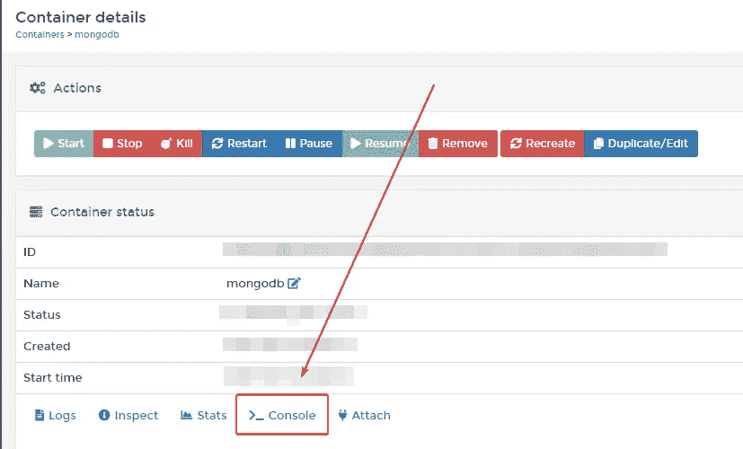
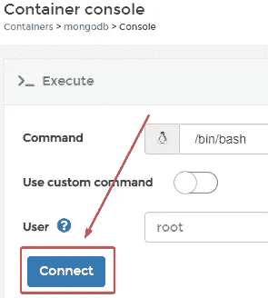
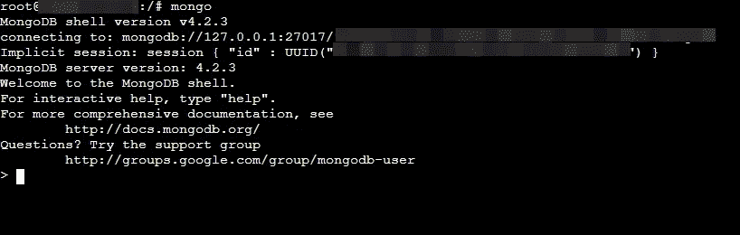
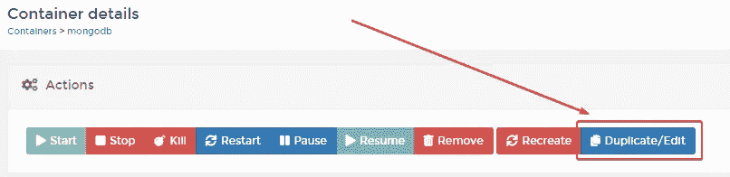
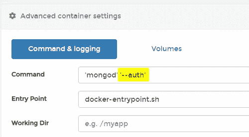

# 如何在 Portainer (Docker)中向 MongoDB 添加身份验证

> 原文：<https://betterprogramming.pub/add-authentication-to-mongodb-in-portainer-docker-30a60ab7858a>

## 默认情况下，MongoDB **不使用任何认证**。在生产中使用数据库之前，请确保对此进行了更改。


照片由[羊角面包](https://unsplash.com/@getcroissant?utm_source=unsplash&utm_medium=referral&utm_content=creditCopyText)在 [Unsplash](https://unsplash.com/collections/764827/work?utm_source=unsplash&utm_medium=referral&utm_content=creditCopyText) 上拍摄

[MongoDB](https://www.mongodb.com/) 默认情况下不使用任何认证。当将数据库打开到 internet 时，应该更改这一点。

在本文中，我将描述如何在[Portainer](https://www.portainer.io/)——Docker 的 web 接口中为 MongoDB 启用身份验证。

# 向 MongoDB 添加身份验证

1.  打开您的 Portainer 界面。
2.  如果您还没有，请安装 MongoDB。(你可以通过 Portainer 上的应用模板来完成。)
3.  进入 MongoDB 容器的控制台。



4.将`mongo`写入控制台。



5.转到`admin`数据库。

```
> use admin
```

6.创建新用户。

```
> db.createUser(
  {
    user: "**nameHere**",
    pwd: "**passwordHere**",
    roles: [ { role: "root", db: "admin" } ]
  }
)
```

如果你想粘贴上面的代码片段，先把它复制到一个编辑器中，然后填写那里的字段——这会容易得多。此外，如果您想将其粘贴到 Portainer 控制台中，您必须右键单击并选择 paste。

现在已经创建了 root 用户。

# 告诉 MongoDB 从认证开始

1.转到 MongoDB 容器的`Duplicate/Edit`部分。



2.将您的命令设置为`'mongod' '--auth'`。



3.部署容器。


# 结论

您的整个 MongoDB 现在使用用户名/密码认证！

感谢阅读。