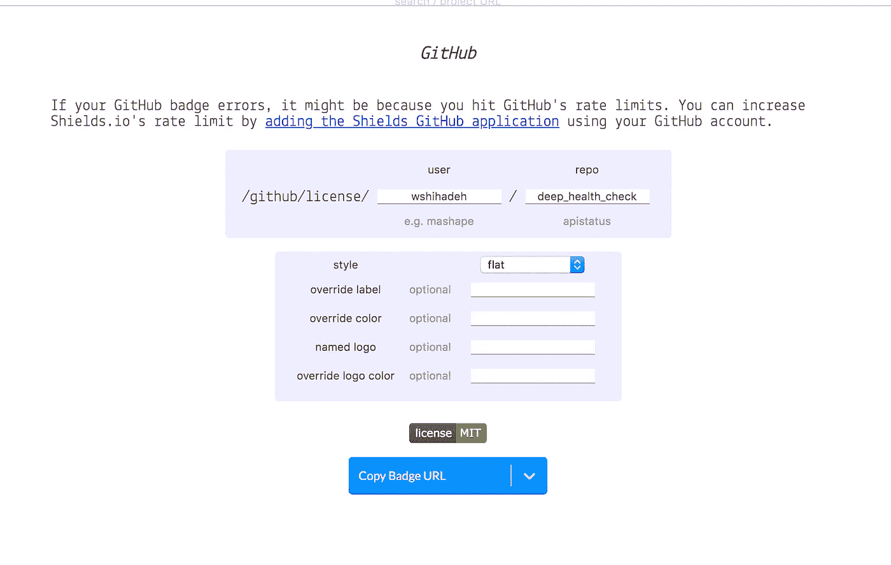
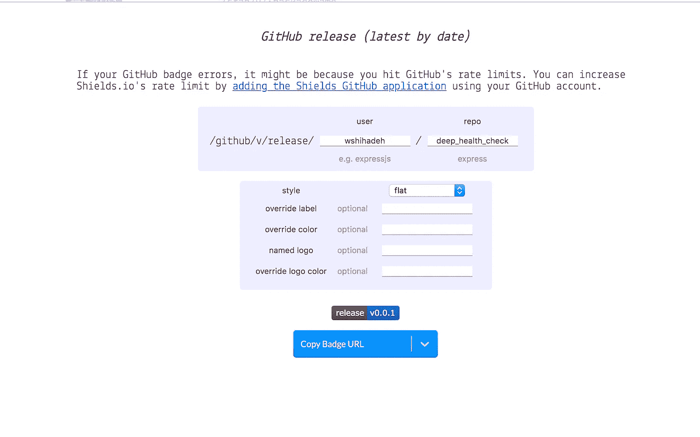
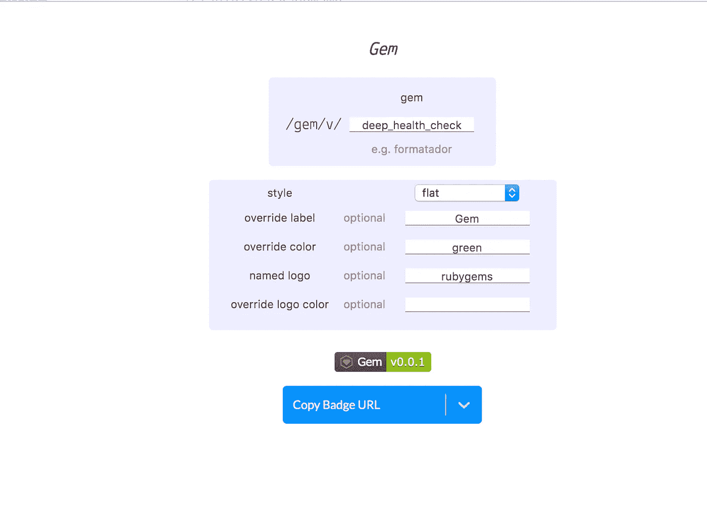
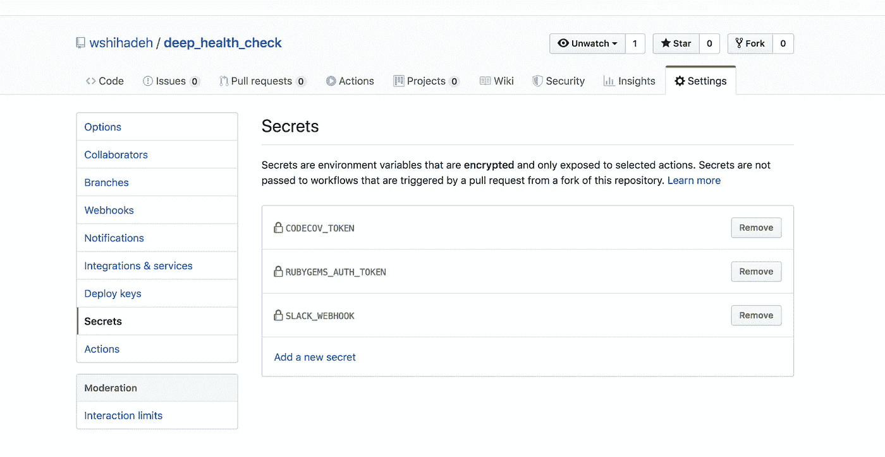
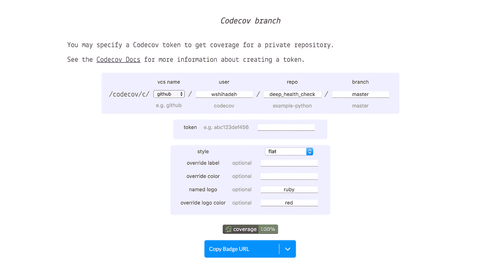
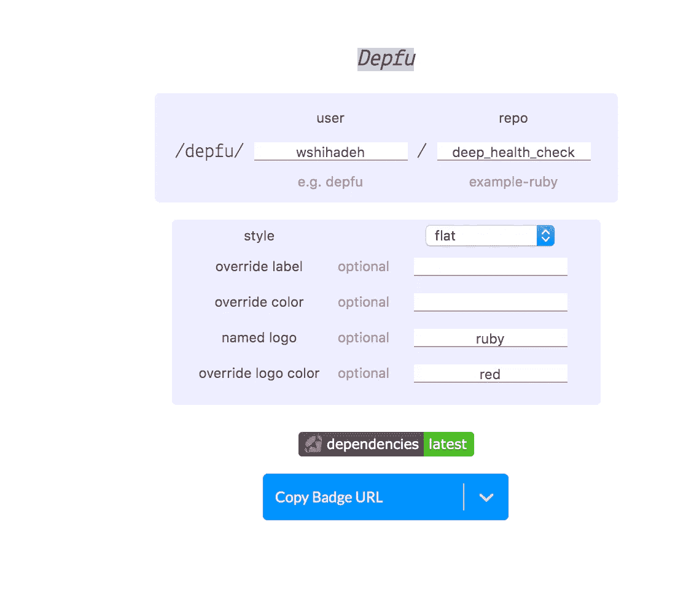

# 如何向 GitHub 库添加徽章

> 原文：<https://betterprogramming.pub/add-badges-to-a-github-repository-716d2988dc6a>

## 通过添加徽章来提高自述文件的质量


由[斯坦尼斯拉夫·康德拉蒂耶夫](https://unsplash.com/@technobulka?utm_source=medium&utm_medium=referral)在 [Unsplash](https://unsplash.com?utm_source=medium&utm_medium=referral) 上拍摄的照片。

向 GitHub 存储库的 readme 文件添加徽章是几乎每个新存储库的共同任务。这些标记有助于提高自述文件的可读性，因为它们提供了一些关于存储库的 KPI 或指标。因此，读者通过扫描附带的徽章，可以很快对知识库有一个清晰的了解。

可以添加到存储库中的徽章涵盖了几个主题和领域，从项目的许可到项目的开放问题计数。

在本文中，我将使用 [shields.io](https://shields.io/) 展示一些对 Ruby GitHub 库最有用的徽章(其中一些也适用于其他编程语言)。这个应用程序是一个 web 服务，可以用来在 SVG 中生成简洁、一致、易读的徽章。

# 许可证

您可以使用下面的链接[为您的 GitHub 库生成一个许可证徽章。你需要做的就是打开 GitHub 链接并填写你的存储库信息，如下图所示:](https://shields.io/category/license)



# 版本

如果您的存储库是针对 Ruby gem 或其他库的，比如 NPM 库，您可以使用下面的链接添加一个带有包版本的徽章。最有趣的选项是:

*   我们可以为给定的红宝石创建一个版本徽章。
*   `Github release`:我们可以根据存储库版本生成版本标记。

下图显示了我们如何为这两个选项定制这些徽章。



[fury.io](https://badge.fury.io/) 是为您的存储库生成版本标记的替代方法。

# 构建状态

构建状态徽章可以告诉我们项目的最后一次构建状态(例如，构建是成功的还是失败的？).这一类别中有几个选项。根据项目类型和用于 CI/CD 管道的工具，可以选择一个可用选项。一些最常用的徽章是`Github workfolw Status`、`Jenkins`、`Tracis ci`和`CircleCI`。所有这些 CI/CD 工具的徽章都可以通过[此链接](https://shields.io/category/build)添加。

# 代码覆盖率

在您可以将代码覆盖添加到您的存储库之前，您必须将代码覆盖 gem 集成到您的应用程序中，并确保覆盖信息在每次新的提交被推送到`master`分支时都被更新。为了将代码覆盖率与您的存储库集成，请执行以下操作:

*   将`[codecov](https://github.com/apps/codecov)`应用程序安装到您的 GitHub 存储库中。
*   将`CODECOV_TOKEN`添加到您的 GitHub 回购机密中。



*   将`codecov`宝石添加到您的宝石文件中:

```
gem 'codecov', '~> 0'
```

*   用以下内容更新`spec_helper.rb`:

```
require 'simplecov'
SimpleCov.startrequire 'codecov'
SimpleCov.formatter = SimpleCov::Formatter::Codecov
```

*   将下面的 GitHub 工作流添加到您的存储库下面的路径中:`${repo}/.github/workflows/codecov.yml`。一旦您将 PRs 与 master 合并并将结果推送到`codecov`服务，此工作流将运行`rspec`(您也可以使用其他 CI/CD 工具(如 Jenkins 和 Travis)来执行此步骤)。

```
name: Codecovon:
  push:
    branches:
      - masterjobs:
  build:
    name: Run rspec to generate code coverage
    runs-on: ubuntu-lateststeps:
    - uses: actions/checkout@master
    - name: Set up Ruby 2.6
      uses: actions/setup-ruby@v1
      with:
        version: 2.6.x- name: Run test cases
      run: |
        bundle exec rspec
      env:
        CODECOV_TOKEN: ${{secrets.CODECOV_TOKEN}}
```

一旦实现了上面的所有步骤，您就可以使用[下面的链接](https://shields.io/category/coverage)为您的存储库生成 coverage badge，如下所示:



# 属国

Depfu 是一个很棒的工具，可以帮助保持项目的依赖关系是最新的。它会扫描您的项目依赖项，并自动创建 PRs 来更新这些依赖项。要为您的项目生成徽章，您首先需要将 [Depfu](https://depfu.com/) 应用添加到您的 GitHub 帐户，然后访问[此链接](https://shields.io/category/dependencies)来生成徽章，如下图所示:



生成所有需要的徽章后，您可以复制 URL 或徽章的降价文本，并将其添加到自述文件的顶部。

# 结论

徽章可以提高 GitHub 存储库的可读性，因为它们为用户提供了一种快速收集存储库指标的方法。

前面提到的徽章不是您可以包含在存储库中的唯一徽章。还有很多其他的徽章可能更适用于你的项目，比如`Github issues, Coveralls github, Jenkins Coverage, Docker Build Status`等等。你可以在 [shields.io](https://shields.io/category/size) 或[badgen.net](https://badgen.net/)上查看所有这些。此外，您可以创建自己的[徽章](https://img.shields.io/badge/AL--waleed-Shihadeh-blue)，上面印有您的名字。