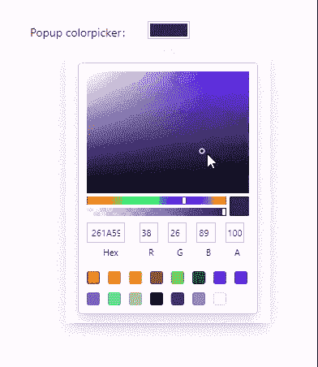

# 将颜色选择器添加到 Ant 设计表单

> 原文：<https://betterprogramming.pub/add-colorpicker-to-ant-design-form-50b26bec38f1>

## 这是 npm 包 [antd-colorpicker](https://github.com/gapon2401/antd-colorpicker) 的概述


作者图片

蚂蚁设计是一个非常方便的设计系统，用于构建高效的用户界面。

在使用它时，我不得不在表单中添加一个颜色选择器。可惜没有这个成分。

Antd 文档建议使用第三方库来创建颜色选择器。

最终，我决定，这将有助于为每个人编写 npm 包，他们将面临和我一样的问题。

# **NPM antd-colorpicker**



怎么用？

1.  使用以下命令安装软件包:

```
yarn add -D antd-colorpicker
```

2.将`Colorpicker`添加到`Form.Item`中的表单:

这将是一个简单的颜色选择器。

# **例题**

*   弹出窗口

```
<Colorpicker popup />
```


*   更改触发弹出窗口的块。

*   从 13 种类型的拣选器中选择一种:

您可以使用以下选项之一:`BlockPicker`|`ChromePicker`|`CirclePicker`|`CompactPicker`|`GithubPicker`|`GooglePicker`|`HuePicker`|`MaterialPicker`|`PhotoshopPicker`|`SketchPicker`|`SliderPicker`|`SwatchesPicker`|`TwitterPicker`

```
<Colorpicker picker={'CirclePicker'} />
```

*   自定义颜色的结果值。

默认情况下，您将获得以下颜色结果:

让我们试着改变它来得到我们想要的:

```
<Colorpicker onColorResult={(color) => color.rgb} />
```

结果值将是:

## **如何使用表单外的组件？**

你得定义`value`和`onChange`(或者`onChangeComplete`)道具。

您的组件可能是这样的:

这就是了。尽情享受吧！