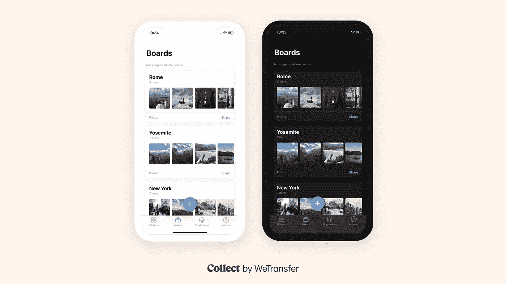
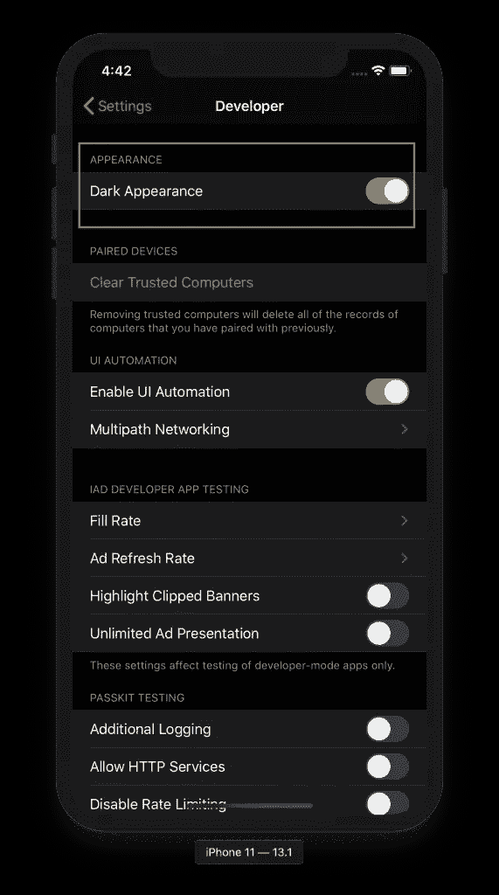
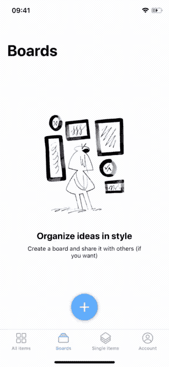
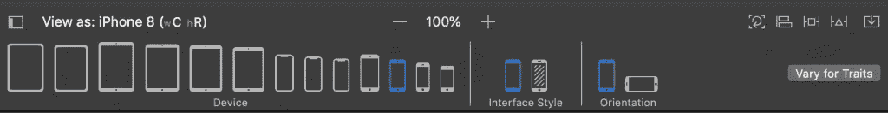
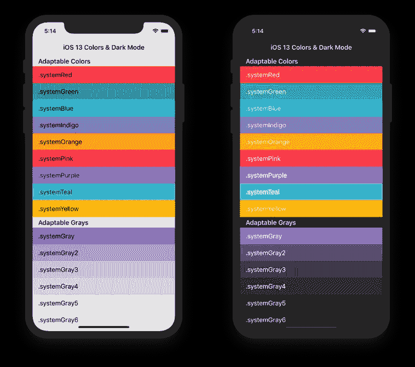
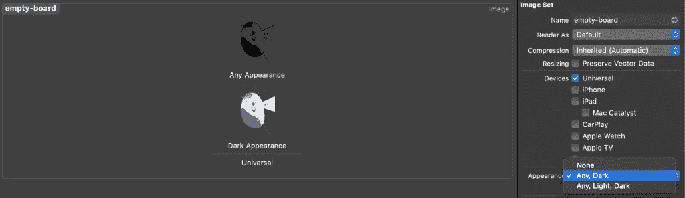
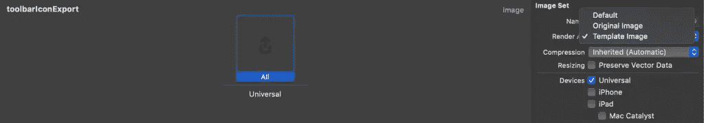

# 在 Swift 中为您的应用程序添加黑暗模式支持

> 原文：<https://betterprogramming.pub/add-dark-mode-support-to-your-app-in-swift-21d7e4d54440>

## 测试并有效地将黑暗模式支持添加到您的应用程序的提示



黑暗模式是在 iOS 13 中引入的，并在 2019 年 WWDC 上宣布。它为 iOS 添加了一个更黑暗的主题，并允许你为你的应用程序做同样的事情。这是给你的用户的一个很好的补充，这样他们就可以体验你的应用程序的深色设计。

在这篇文章中，我将与您分享我在我们为 WeTransfer 应用程序的 [Collect 添加黑暗模式支持后的体验。](https://collect.bywetransfer.com)

# 退出并禁用黑暗模式

在我们开始采用黑暗界面风格之前，我想告诉你如何选择退出。当您开始使用 Xcode 11 构建应用程序时，您会注意到默认情况下启用了较暗的外观。

如果你没有时间添加对黑暗模式的支持，你可以简单地通过添加`UIUserInterfaceStyle`到你的`Info.plist`并设置为`Light`来禁用它。

## 覆盖每个视图控制器的黑暗模式

您可以使用以下代码覆盖每个视图控制器的用户界面样式，并将其设置为亮或暗:

```
class ViewController: UIViewController {
    override func viewDidLoad() {
        super.viewDidLoad()
        overrideUserInterfaceStyle = .dark
    }
}
```

## 覆盖每个视图的黑暗模式

您可以对单个`UIView`实例做同样的事情:

```
let view = UIView()
view.overrideUserInterfaceStyle = .dark
```

## 覆盖每个窗口的黑暗模式

如果您想以编程方式禁用黑暗模式，则覆盖每个窗口的用户界面样式会很方便:

```
UIApplication.shared.windows.forEach { window in
    window.overrideUserInterfaceStyle = .dark
}
```

请注意，我们在这里使用的是 windows 数组，因为从 iOS 13 开始，共享的`UIApplication`上的`keyWindow`属性已被弃用。现在不鼓励使用它，因为应用程序支持多个场景，每个场景都有一个附加的窗口。

# 启用黑暗模式进行测试

如果你开始在你的应用程序中实现更暗的外观，有一个好的测试方法是很重要的。有多种方法可以启用和切换外观模式，每种方法都有自己的优点。

## 在模拟器中启用黑暗模式

导航到模拟器上设置应用程序中的开发者页面，打开黑暗外观开关:



在模拟器上启用黑暗模式

## 在设备上启用黑暗模式

在设备上，您可以通过导航到“设置”应用程序中的“显示与亮度”页面来启用黑暗模式。然而，在开发过程中，为控制中心添加一个选项来快速在黑暗和光明模式之间切换要容易得多:



从控制中心快速切换黑暗和光明模式

## 从调试菜单切换黑暗模式

在模拟器打开的情况下使用 Xcode 时，您可能想要使用环境覆盖窗口。这允许您在调试时快速切换外观:


“环境覆盖”窗口允许更改界面样式

*注意:如果您没有看到此选项，您可能正在 iOS 12 或更低版本的设备上运行。*

## 在故事板中启用黑暗模式

在故事板内部处理视图时，将故事板内部的外观设置为暗会很有用。您可以在底部的设备选项旁边找到此选项:



将故事板的外观更新为黑色

## 在视图、视图控制器和窗口中覆盖黑暗模式

上一节介绍了使用`Info.plist`在整个应用程序中启用和禁用灯光模式，或者禁用每个视图、视图控制器或窗口的灯光模式。如果你想暂时强制使用黑暗模式进行测试，这是一个很好的方法。

# 调整深色模式的颜色

随着 iOS 13 上的黑暗模式，苹果引入了自适应和语义颜色。这些颜色会根据几个因素自动调整，比如它们是否在模态演示中。

## 自适应颜色解释

自适应颜色会自动适应当前外观。自适应颜色为不同的界面样式返回不同的值，并且还会受到呈现样式的影响，比如表单中的模态呈现样式。

## 语义颜色解释

语义颜色描述他们的意图，也是适应性的。一个例子是应该用于标签的语义颜色。很简单，不是吗？

当您将它们用于预期目的时，它们将正确渲染当前外观。`label`示例会自动将文本颜色改为黑色(亮模式)和白色(暗模式)。

最好探索所有可用的颜色，并利用你真正需要的颜色。

## 探索适应性和语义色彩

如果可能的话，如果你能在你的项目中实现语义和自适应颜色，采用深色模式会容易得多。为此，我强烈推荐由 [Aaron Brethorst](https://twitter.com/aaronbrethorst) 开发的 [SemanticUI](https://github.com/aaronbrethorst/SemanticUI) 应用程序，它可以让你看到两种外观中所有可用颜色的概览。



Aaron Brethorst 开发的 SemanticUI 应用程序有助于探索语义和适应性色彩

## 支持 iOS 12 及更低版本，带有语义色彩

一旦你开始使用语义颜色，你就会意识到它们只支持 iOS 13 及以上版本。为了解决这个问题，我们可以利用`UIColor.init(dynamicProvider: @escaping (UITraitCollection) -> UIColor)`方法创建我们自己的定制 UIColor 包装器。这允许你为 iOS 12 和更低版本返回不同的颜色。

```
public enum DefaultStyle {

    public enum Colors {

        public static let label: UIColor = {
            if #available(iOS 13.0, *) {
                return UIColor.label
            } else {
                return .black
            }
        }()
    }
}

public let Style = DefaultStyle.self

let label = UILabel()
label.textColor = Style.Colors.label
```

这种方法的另一个好处是，您可以定义自己的自定义样式对象。这允许主题化，但也使整个应用程序的颜色更加一致。

## 创建自定义语义颜色

可以使用前面解释的`UIColor.init(dynamicProvider: @escaping (UITraitCollection) -> UIColor)`方法创建自定义语义颜色。

通常，你的应用程序有自己相同的色调。可能这种颜色在亮模式下效果很好，但在暗模式下效果不太好。为此，您可以根据当前的界面样式返回不同的颜色。

```
public static var tint: UIColor = {
    if #available(iOS 13, *) {
        return UIColor { (UITraitCollection: UITraitCollection) -> UIColor in
            if UITraitCollection.userInterfaceStyle == .dark {
                /// Return the color for Dark Mode
                return Colors.osloGray
            } else {
                /// Return the color for Light Mode
                return Colors.dataRock
            }
        }
    } else {
        /// Return a fallback color for iOS 12 and lower.
        return Colors.dataRock
    }
}()
```

黑暗模式可以通过使用当前特征集合上的`userInterfaceStyle`属性来检测。当它被设置为`dark`时，你知道当前的外观被设置为黑色。

## 深色模式下边框颜色不会动态更新

当您将自适应颜色用于 CALayers 时，您会注意到在应用程序中实时切换外观时，颜色不会更新。你可以用`traitCollectionDidChange(_:)`的方法解决这个问题。

```
override func traitCollectionDidChange(_ previousTraitCollection: UITraitCollection?) {
    super.traitCollectionDidChange(previousTraitCollection)
    /// Border color is not automatically catched by trait collection changes. Therefore, update it here.
    layer.borderColor = Style.Colors.separator.cgColor
}
```

# 为黑暗模式更新资产和图像

更新完所有颜色后，就该更新应用程序中的资源了。

最简单的方法是使用图像资产目录。您可以为每个外观添加一个额外的图像。



为图像资源添加额外的外观

这也使你的图像自适应，并根据当前的界面风格相应地调整图像。

## 将淡色应用于图像和图标

为每次出场增加额外的资产并不总是最好的选择。最终，它增加了你的应用程序的大小。

一个好的替代方法是寻找可以使用浅色的图像。这尤其适用于工具栏和标签栏中使用的图标。

首先，您需要将资源渲染为模板:



将要渲染的图像设置为模板

您可以在代码中做同样的事情:

```
let iconImage = UIImage()
let imageView = UIImageView()
imageView.image = iconImage.withRenderingMode(.alwaysTemplate)
```

之后，您可以简单地设置图像视图色调颜色，使图标根据当前外观调整其颜色:

```
imageView.tintColor = Style.Colors.tint
```

## 反转颜色作为图像的解决方案

反转颜色是节省应用程序大小的另一种方法。这并不总是适用于每个映像，但它可以是一个防止您向捆绑包中添加其他资产的解决方案。

您可以通过使用下面的`UIImage`扩展来完成这项工作:

```
extension UIImage {
    /// Inverts the colors from the current image. Black turns white, white turns black etc.
    func invertedColors() -> UIImage? {
        guard let ciImage = CIImage(image: self) ?? ciImage, let filter = CIFilter(name: "CIColorInvert") else { return nil }
        filter.setValue(ciImage, forKey: kCIInputImageKey)

        guard let outputImage = filter.outputImage else { return nil }
        return UIImage(ciImage: outputImage)
    }
}
```

当外观更新时，您需要手动更新您的图像，因此建议使用此方法:

```
// MARK: - Dark Mode Support
private func updateImageForCurrentTraitCollection() {
    if traitCollection.userInterfaceStyle == .dark {
        imageView.image = originalImage?.invertedColors()
    } else {
        imageView.image = originalImage
    }
}

override func traitCollectionDidChange(_ previousTraitCollection: UITraitCollection?) {
    super.traitCollectionDidChange(previousTraitCollection)
    updateImageForCurrentTraitCollection()
}
```

# 结论

我们讨论了很多在你的应用中适应黑暗模式的技巧。我们还解释了使用语义和适应性颜色的好处。希望这能帮助你更有效地实现黑暗模式！

当您忙于处理资产时，您可能也想直接[清理您未使用的资产](https://www.avanderlee.com/optimization/unused-images-clean-up/)！如果你想继续提高你的 Xcode 知识，请查看 [Xcode 类别页面](https://www.avanderlee.com/category/swift/)。

谢谢