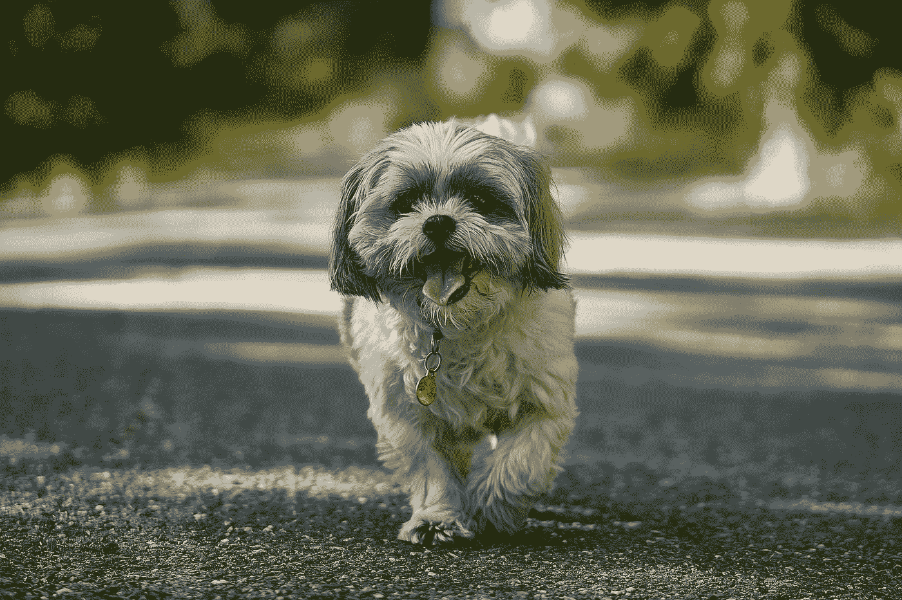
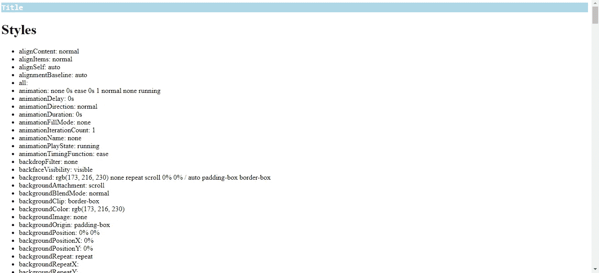
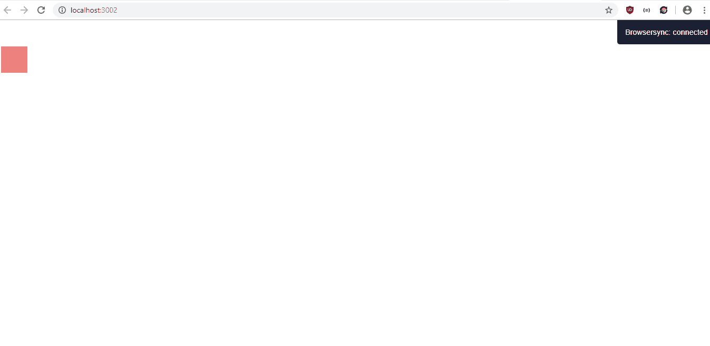
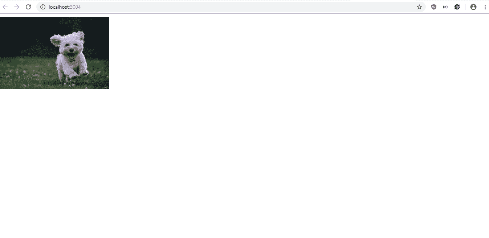
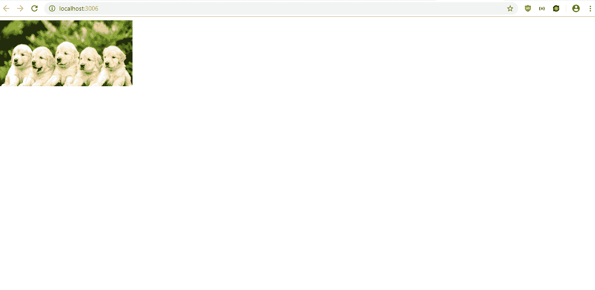
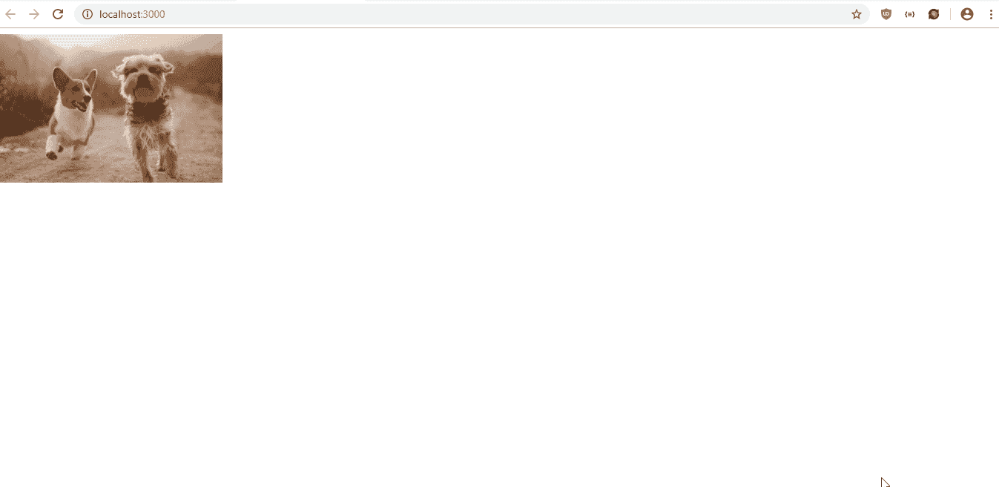

# 用 JavaScript 为 HTML 元素添加动态样式

> 原文：<https://betterprogramming.pub/add-dynamic-styling-to-html-elements-with-javascript-997f4a026fbb>

## 把你的静态页面变成动态应用



Nikolay Tchaouchev 在 [Unsplash](https://unsplash.com?utm_source=medium&utm_medium=referral) 上拍摄的照片

将静态网页转换成动态 web 应用程序的一个重要部分是动态地改变页面上元素的样式。JavaScript 通过将元素中的 CSS 属性公开为我们可以获取或设置的 JavaScript 属性，让我们可以做到这一点。

DOM 元素有`style`对象，我们可以用它来改变 DOM 对象的样式。我们可以用`style`对象改变一些事情，包括改变文本颜色，改变背景颜色，动画对象，改变大小，显示/隐藏页面的部分，创建弹出框来显示东西，等等。

`style`和其他 DOM 对象一样，它有许多属性和方法，我们可以用它们来设计样式。这些属性是 CSS 属性，只是所有的 CSS 属性都被转换为骆驼大小写，而不是 CSS 中使用的 kebab 大小写。

`style`对象返回元素的内嵌样式。如果你想让你的元素看起来像你想要的样子，你还必须考虑所选元素的内嵌样式之外的 CSS，比如外部 CSS 文件和`style`元素中的样式。

下面是一些常见的`style`对象属性和它们的 CSS 等价物:

*   `backgroundColor`:与 CSS 中的 background‐color 属性相同，获取或设置元素的背景色
*   `borderWidth`:与 CSS 中的 border-width 属性相同，它获取或设置元素的边框
*   `fontFamily`:与 CSS 中的 font-family 属性相同，获取或设置元素的字体
*   `lineHeight`:与 CSS 中的 line-height 属性相同，该属性获取或设置元素的行间高度
*   `textAlign`:与 CSS 中的 text-align 属性相同，该属性获取或设置元素的水平对齐方式

要获取一个元素的所有 CSS 属性，我们应该使用`window.` `getComputedStyle`方法来获取一个元素的所有 CSS 属性。它包括所有内联 CSS、外部 CSS 和`style`标签中的 CSS。这将获取所有的 CSS 并将它们合并到一个对象中，该对象实际上包含了元素的正确 CSS 样式。我们可以如下使用它…

在`index.html`中，我们添加:

```
<html>
  <head>
    <title>Get Styles</title>
    <link href="styles.css" rel="stylesheet" type="text/css" />
  </head>
  <body>
    <h1 id="title">Title</h1>
    <h1>Styles</h1>
    <ul id="styles-list"></ul>
    <script src="script.js"></script>
  </body>
</html>
```

然后在`script.js`中，我们有:

```
window.onload = () => {
  const title = document.getElementById("title");
  const stylesList = document.getElementById("styles-list");
  const titleStyles = window.getComputedStyle(title);
  Object.keys(titleStyles).forEach(key => {
    const li = document.createElement("li");
    if (isNaN(+key)) {
      li.innerHTML = `${key}: ${titleStyles[key]}`;
      stylesList.appendChild(li);
    }
  });
};
```

在`styles.css`中，我们加上:

```
#title {
  color: white;
  background-color: lightblue;
  font-family: Arial;
  margin-bottom: 20px;
  font-size: 18px;
  font-family: monospace;
}
```

有了这些代码，我们应该得到:



如您所见，我们拥有 ID 为`title`的元素的完整样式列表。向下滚动，你会看到`fontFamily`、`fontSize`等。与我们在`styles.css`中设置的一致。

# 改变风格

要改变一个元素的样式，我们只需用通常的函数获取该元素，如`getElementById`，然后设置`style`对象的属性，如下所示:

```
document.getElementById('square').style.padding = '10px';
```

在上面的例子中，我们获得了 square 元素，然后将 ID 为`square`的元素的填充设置为 10px。请注意，我们必须在末尾添加`px`来应用样式。

# 用 JavaScript 制作动画样式

如果我们想在 JavaScript 中制作一个元素的动画，我们可以像以前一样应用相同的 CSS 样式变化。

我们所要做的就是在样式改变的执行过程中增加一个定时器延迟，这样我们就可以看到元素的样式被应用了。为了延迟 JavaScript 中一段代码的执行，我们可以使用`setTimeout`函数。

例如，如果我们想让一个盒子移动，那么我们可以编写下面的代码。在`index.html`中，我们添加:

```
<html>
  <head>
    <title>Animation</title>
    <link href="styles.css" rel="stylesheet" type="text/css" />
  </head>
  <body>
    <div id="box"></div>
    <script src="script.js"></script>
  </body>
</html>
```

然后在`script.js`中，我们添加:

```
const animate = () => {
  const box = document.getElementById("box");
  for (let i = 0; i < 10000; i++) {
    (i => {
      setTimeout(() => {
        const left = window.getComputedStyle(box).left;
        box.style.left = `${(+left.replace("px", "") + i * 2) %
          window.innerWidth}px`;
      }, 1000);
    })(i);
  }
};window.onload = () => {
  animate();
};
```

在`styles.css`中，我们添加了:

```
#box {
  background-color: lightcoral;
  width: 50px;
  height: 50px;
  position: absolute;
  top: 50px;
  left: 10px;
}
```

我们使用`setTimeout`函数将 ID 为`box`的元素的样式更改延迟 1000 毫秒，也就是一秒钟。

在我们传递给`setTimeout`函数的函数内部，我们通过获取现有的`left` CSS 属性然后向其添加`i*2`来设置`left`属性。然后我们把余数除以`window.innerWidth`。这让我们可以在浏览器窗口中左右滑动盒子。

结果如下:



# 翻滚效应

翻转效果是一种动态效果，当您将鼠标悬停在某个元素上时，图像会发生变化，当您将鼠标从同一元素上移开时，会显示不同的图像。

当用户将鼠标悬停在元素上，然后将鼠标从元素上移开时，这是显示不同信息的常见效果。它也用于其他类型的切换。为了创造这种效果，我们必须修改一个图像元素，当鼠标悬停在它上面和鼠标关闭时，显示不同的东西。

图像对象具有以下属性:

*   `alt` —图像的 alt 属性
*   `complete` — `true`图像加载完成后
*   `height` —图像的高度
*   `isMap` —指示图像是否是图像映射的一部分
*   `naturalHeight` —图像的原始高度
*   `naturalWidth` —图像的原始宽度
*   `src` —图像的`src`属性
*   `width` —图像元素的宽度

要创建翻转效果，我们可以做以下事情。在`index.html`中，我们添加:

```
<html>
  <head>
    <title>Get Styles</title>
    <link href="styles.css" rel="stylesheet" type="text/css" />
  </head>
  <body>
    
    <script src="script.js"></script>
  </body>
</html>
```

然后在`script.js`中，我们放入:

```
window.onload = () => {
  const dog = document.getElementById("dog");
  dog.addEventListener("mouseover", () => {
    if (dog.src.includes("images/dog1.jpg")) {
      dog.src = "images/dog2.jpg";
    } else {
      dog.src = "images/dog1.jpg";
    }
  }); dog.addEventListener("mouseout", () => {
    if (dog.src.includes("images/dog1.jpg")) {
      dog.src = "images/dog2.jpg";
    } else {
      dog.src = "images/dog1.jpg";
    }
  });
};
```

最后，在`styles.css`中，我们有:

```
#dog {
  width: 300px;
}
```

我们把图像缩小到 300 像素宽。然后在`script.js`中，当我们将鼠标放在图像上时，我们将其切换到不同的图像。

然后，当用户将鼠标移出元素时，我们切换到另一个图像。当我们在图像内外来回移动鼠标时，这两个事件处理程序将一起创建切换翻转效果。

或者，如果您将图像添加到包含上述文件的文件夹中，我们应该会看到这样的内容:



# 增长图像

要使图像在鼠标悬停时变大，然后在鼠标移出图像时缩回到原始大小，我们只需处理图像的`mouseover`和`mouseout`事件。

当我们将鼠标悬停在它上面时，我们会放大图像；当鼠标移出时，我们将它缩小到原来的大小。

为此，我们将以下内容放入`index.html`:

```
<html>
  <head>
    <title>Get Styles</title>
    <link href="styles.css" rel="stylesheet" type="text/css" />
  </head>
  <body>
    
    <script src="script.js"></script>
  </body>
</html>
```

然后在`script.js`中，我们放入:

```
window.onload = () => {
  const dog = document.getElementById("dog");
  dog.addEventListener("mouseover", () => {
    dog.style.width = "500px";
  }); dog.addEventListener("mouseout", () => {
    dog.style.width = "300px";
  });
};
```

在`styles.css`中，我们添加:

```
#dog {
  width: 300px;
}
```

`script.js`中的代码正是我们刚刚描述的。当用户将鼠标悬停在它上面时，它会将图像大小更改为 500 像素，当我们将鼠标移出时，它会缩小到 300 像素。

有了这些代码，我们应该得到类似于:



# 幻灯片

我们可以操纵我们的图像来创建一个简单的幻灯片。我们所要做的就是用 JavaScript 内置的`setInterval`函数在设定的时间间隔内旋转我们拥有的图像。

在`index.html`，我们有:

```
<html>
  <head>
    <title>Get Styles</title>
    <link href="styles.css" rel="stylesheet" type="text/css" />
  </head>
  <body>
    
    <script src="script.js"></script>
  </body>
</html>
```

然后在`script.js`中，我们放入:

```
window.onload = () => {
  const dog = document.getElementById("dog");
  const dogImgPaths = ["images/dog1.jpg", "images/dog2.jpg", "images/dog3.jpg"];
  let index = 0;
  setInterval(() => {
    index = (index + 1) % dogImgPaths.length;
    dog.src = dogImgPaths[index];
  }, 3000);
};
```

在`styles.css`中，我们输入:

```
#dog {
  width: 300px;
}
```

我们所做的就是通过在`dogImgPaths`中设置图像的路径，每三秒钟旋转到我们收藏中的不同图像。要旋转图像，我们只需将`index`增加 1，然后用`dogImgPaths.length`取模数。这样，`index`总是在 0 和 2 之间，所以我们不会试图得到一个不存在的图像。

最后，如果我们在`dogImgPaths`数组中列出了所有的图像，我们应该得到:



# 便捷的动画属性

JavaScript 有一些动画属性，让我们通过在 CSS 中定义关键帧来创建动画，然后使用 JavaScript 来控制关键帧的变化，以创建我们的动画。

JavaScript 提供了以下属性来控制动画:

*   `animation` —获取或设置除`animationPlayState`之外的所有动画属性
*   `animationDelay` —获取或设置动画开始前的延迟
*   `animationDirection` —获取或设置动画运行的方向
*   `animationDuration` —获取或设置动画的长度
*   `animationFillMode` —获取或设置动画不运行时发生的情况
*   `animationIterationCount` —获取或设置动画播放的次数
*   `animationName` —使用 CSS 关键帧 at 规则获取或设置动画列表
*   `animationTimingFunction` —获取或设置一段时间内动画的运行速度
*   `animationPlayState` —获取或设置动画是否正在运行

为了在 CSS 中设置动画的关键帧，我们使用了`keyframes`属性。

用 JavaScript 制作简单的动画以及获取和改变元素的样式并不太难。我们不用写太多代码就可以做很多事情。

如果我们使用`setTimeout`和`setInterval`定时器功能，以便在更改代码时延迟执行或重复执行样式，那么动画制作就很容易。