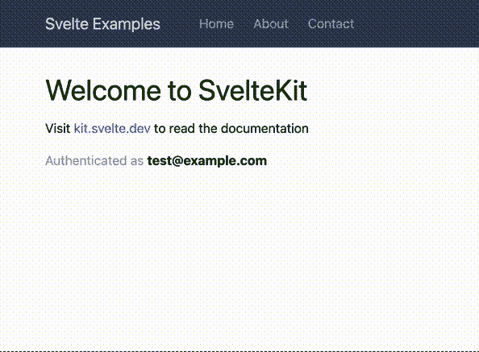

# 给一个苗条的应用添加 Firebase 认证

> 原文：<https://betterprogramming.pub/add-firebase-authentication-to-an-svelte-app-6807f7527860>

## 用 Firebase 和 Svelte 实现 SSR 认证


我开始寻找苗条，我喜欢它至今。然而，我很难做一些事情。我猜这是因为社区比 React 小，所以没有太多的资源涵盖一切。这是缓解这种情况的一种尝试。

我今天想要实现的是拥有一个应用程序，它可以使用 Firebase 处理身份验证，并且仍然是服务器端呈现。

这里有一个小小的免责声明，我在一步一步的指南中叙述了这篇文章，但是每一步都是功能性的。这意味着我创建一个工作示例，只在客户端工作，然后修改它，直到获得 SSR 版本。如果你想要的是完美的版本，我建议你直接进入总结部分。

我在这里提供了一些代码片段，你可以去复制粘贴，但我也建议看看[我的资源库](https://github.com/JavoByte/svelte-examples)。特别是第一个 PR ，因为它有这篇文章的所有必要代码。

介绍够了，让我们开始吧。

# 将 Firebase 添加到我们的项目中

我会假设你已经有一个 Firebase 项目，你多少知道你的仪表板周围的方式。

我们将从单个电子邮件/密码认证开始。Firebase 还通过 OAuth 提供与脸书和谷歌等提供商的集成，但我们不会在这里讨论这些。

首先，进入 Firebase 中的身份验证面板，然后转到登录方法选项卡。启用电子邮件/密码登录。*(这也支持注册，但超出了本文的范围)*

现在添加一个 WebApp，如果你还没有的话，把 firebase 添加到你的项目中。这里我将使用`yarn`

```
yarn install firebase
```

Firebase 还提供了一个代码片段来初始化 Firebase。复制到`src/lib/client/firebase.ts`中。

但是，这个文件会在导入时初始化 firebase，而且这个文件也可以添加到服务器端。这是有问题的，因为这个文件只针对客户端。`getAnalytics`举个会失败的例子。那么我们需要更多的控制。我们可以把它包装成一个函数，在命令下初始化 Firebase。但是，如果实例是预先创建的，我们也想重用它。这可以通过记忆功能来解决。为此，我将使用`lodash`。

让我们同时初始化`auth`模块。考虑到这一点，我们将如下重写初始化:

```
import { memoize } from 'lodash';
import { initializeApp } from 'firebase/app';
import { getAnalytics } from 'firebase/analytics';
import { getAuth } from 'firebase/auth';

// ... Firebase Config ...
// Initialize Firebase
export const initFirebase = memoize(() => {
 const app = initializeApp(firebaseConfig);
 const analytics = getAnalytics(app);
 const auth = getAuth(app);
 return { app, analytics, auth }
})
```

注意，我已经在添加`auth`。为此，我们需要`import { getAuth } from 'firebase/auth';`

有了这个，我们现在有办法在我们的应用程序中的其他地方配置`firebase`。现在我们只需要导入这个文件。我们将在主布局中这样做。打开(或者创建，如果还没有创建话)文件`src/routes/+layout.svelte`并添加这个代码片段

```
<script>
  import { onMount } from 'svelte';
  import { initFirebase } from '$lib/client/firebase';

  onMount(initFirebase);
</script>
```

由于`onMount`只在客户端运行，我们可以确定现在 firebase 只在客户端初始化。

现在我们需要存储用户的地方。让我们继续创建`src/stores/auth.ts`文件来存储我们的用户对象。

```
import { writable } from 'svelte/store';

type User = {
 uid: string;
 email: string;
};
export const auth = writable<User | null>(null);
```

现在，我们只需要一种在用户更新时更新商店的方法。现在很容易了，回到`+layout.svelte`并加上这个:

```
// ...
import { auth as authStore } from '../stores/auth'

// ...
onMount(() => {
  const { auth } = initFirebase();
  onAuthStateChanged(auth, authStore.set)
}) 
```

现在，每当 firebase 更新认证用户时，我们都会将它存储在我们的存储中。现在我们可以在任何需要的时候从那里得到它。

# 实现登录

***最终*** 件只是实际的签到和签退。让我们继续创建一个简单的登录页面。我将使用`src/routes/login/+page.svelte`我不会详细介绍创建表单的细节，以避免这篇文章变得混乱，但是你可以随时去提供的存储库[全面检查](https://github.com/JavoByte/svelte-examples/pull/1/files#diff-5a64e959a03d9659634f86b910a2a444e7d662b17a748f0d352d20ddd7fc6c38)。我将只提到重要的部分。

我添加了一个简单的`onMount`函数，用于在登录成功时将用户重定向到主页。

```
import { goto } from "$app/navigation";
import { onMount } from "svelte";

onMount(() => {
  return auth.subscribe((user) => {
    if (user) {
      goto('/')
    }
  });
});
```

为了进行实际的登录，我使用了来自`firebase/auth`的方法`signInWithEmailAndPassword`，该方法接收一个`auth`实例*(我们已经可以从我们的初始化器或者使用*`*getAuth*`*)*`email`和`password`来获得它)。那些我们需要从表单中获取的。

最后，每当用户登录时，我们都需要更新我们的存储。为此，我将在我们的布局上使用另一个`onMount`回调，监听 auth 状态。这将在授权状态改变时在我们的存储中设置用户。

然而，这种方法存在一些问题。为了更好地展示它们，我在`src/components`下创建了组件`AuthStatus.svelte`。该组件仅显示某人是否经过身份验证。如果您签出[这个版本](https://github.com/JavoByte/svelte-examples/pull/1/commits/4accc86786563a750741b7bba163aeef4c3a636d)，您会注意到在登录后，页面的后续刷新会显示 ***没有人被认证*** 一秒钟，并在几毫秒后变为 ***认证为…*** 。发生这种情况是因为当我们从服务器获取页面时，我们没有获得任何授权数据。服务器不知道某人实际上已经过身份验证，因此返回页面，就像一个客人正在访问一样。



由于缺少 SSR，在显示“无人通过身份验证”图例后，立即显示“身份验证为”

# 添加 SSR 成分

那么，我们如何给服务器一些我们在客户机上创建的会话的上下文呢？

firebase 用户内置了获取令牌的方法，稍后可以在服务器端进行验证。因此，我将编写一个动作，从客户端接收令牌，并要求浏览器将其存储在 cookie 中:

```
// src/routes/login/+page.server.ts
export const actions: Actions = {
  default: async ({ request, cookies }) => {
    const formData = await request.formData();
    const token = formData.get('token')?.valueOf();
    if (!token || typeof token !== 'string') {
      return fail(400, { message: 'Token is a required field and must be a string' });
    }
    cookies.set(SESSION_COOKIE_NAME, token, {
      httpOnly: true,
      path: '/',
      secure: true
    });
    return { success: true };
  }
};
```

因此，在从 firebase 获取用户后，我们将获取令牌并将其发送给此操作:

```
formData.set('token', await user.getIdToken());
const response = await fetch(this.action, {
  method: 'POST',
  body: formData,
});

const result = deserialize(await response.text());

if (result.type === 'success') {
  await invalidateAll();
}
```

在这个片段中，我已经包含了对`invalidateAll`的调用。这是因为，潜在地，当我们是(未)认证用户时加载的所有数据都不再有效，比如用户数据、偏好等。这一点过一会儿会变得更有用。

到目前为止，我们在服务器上接收每个请求的令牌，但是我们不验证它或对它做任何事情。因此，是时候编写一个服务器钩子，并开始在服务器端填充用户了。

为了在服务器端验证来自 firebase 的令牌，我将使用包`firebase-admin`。安装它与

```
yarn add firebase-admin
```

要开始使用它，我们需要给服务器凭证。为此，进入您的 firebase 仪表板→项目设置→服务帐户选项卡。在这里，您可以选择为 Firebase SDK 生成一个新的私钥。

这将下载一个 JSON 文件。保持这个 JSON 文件中的数据安全尤其重要，因此不建议您直接将它添加到存储库中。我不会在这里讨论如何保证它的安全，所以为了这篇文章，我将把它字符串化并保存在`.env.local`。这个文件不是 git 跟踪的，这里的变量在`$env/static/private`中自动可用

从客户端的例子和你在 firebase 页面上看到的下载你的私钥，你可以想象如何在服务器上初始化 firebase，所以我不会把代码放在这里。

除了初始化，我们还需要一个函数来解码来自 firebase 的令牌。我们将使用带有一个小包装器的`admin.auth().verifyIdToken(token)`来捕捉错误，并在错误发生时返回`null`,因此如果令牌过期，体验不会受到影响。

```
export async function decodeToken(
  token: string
): Promise<DecodedIdToken | null> {
   if (!token) {
     return null;
   }
  try {
    initializeFirebase();
    return await admin.auth().verifyIdToken(token);
  } catch (err) {
    console.error('An error occurred validating token', (err as Error).message);
    return null;
  }
}
```

现在我们有了这个函数，我们只需要在每次请求时从 cookie 中解码令牌。正如我提到的，我将使用服务器钩子。

```
export const handle = (async ({ event, resolve }) => {
  const cookies = cookie.parse(event.request.headers.get('cookie') || '');
  const token = cookies[SESSION_COOKIE_NAME];
  if (token) {
    const decodedToken = await decodeToken(token);
    if (decodedToken) {
      event.locals.user = decodedToken;
    }
  }
  return resolve(event);
}) satisfies Handle;
```

请注意，我正在将`user`添加到`event.locals`对象中。像其他挂钩和加载器一样，本地对象是一种跨服务器端函数共享数据的方式。如果你把它复制粘贴到你的`hooks.server.ts`文件中，你会得到一个错误，说`user`不是`Locals`对象的有效属性。要解决这个问题，覆盖`app.d.ts`下的`Locals`接口。我将按如下方式覆盖它:

```
declare namespace App {
	// interface Error {}
	interface Locals {
		user: null | {
			uid: string;
			email?: string;
		};
	}
	// interface PageData {}
	// interface Platform {}
}
```

# 为授权商店补水

现在，对服务器的每个调用都会解码令牌并设置`event.locals.user`。最后一块是使用这个解码的用户。我将开始在主布局文件的加载器中提供它，这样每个人都可以重用它。所以，在`src/routes/+layout.server.ts`下我们把这个:

```
import type { LayoutServerLoad } from './$types';
export const load = (async (event) => {
  const user = event.locals.user;
  return { user }
}) satisfies LayoutServerLoad;
```

最后，您还记得我们将用户存储在商店中吗？这个存储很奇怪，因为它只是保存一个对象，代表用户，但实际上没有逻辑，但现在，我们在页面存储中有了用户。这听起来更像是我的衍生商店。让我们像这样更新授权存储:

```
import { page } from '$app/stores';
import { derived } from 'svelte/store';

type User = {
  uid: string;
  email?: string;
};
export const auth = derived<typeof page, User | null>(
  page,
  ($page, set) => {
    const { user } = $page.data;
    if (!user) {
      set(null);
      return;
    }
    set(user);
   },
   null
);
```

这将自动开始使用我们存储的会话中的用户。现在，尝试刷新应用程序或查看服务器返回的普通 HTML。您会注意到，现在，我们有效地实现了从服务器返回的认证数据，因此我们有了完整的 SSR。

# 注销

不过还有一件小事。我们现在不能退出。为此，我现在将添加文件`src/routes/logout/+server.ts`,并执行一个简单的`POST`操作来删除 cookie

```
import { SESSION_COOKIE_NAME } from '$lib/constants';
import type { RequestHandler } from '@sveltejs/kit';
import cookie from 'cookie';

export const POST = (async () => {
 return new Response('', {
  headers: {
   'set-cookie': cookie.serialize(SESSION_COOKIE_NAME, '', {
    path: '/',
    httpOnly: true,
    maxAge: -1,
   })
  }
 });
}) satisfies RequestHandler;
```

每当用户点击*退出*按钮时，我就用`fetch`调用它

```
const logout = async () => {
  const firebaseAuth = getAuth();
  await signOut(firebaseAuth);
  await fetch('/logout', { method: 'POST' });
  await invalidateAll();
}
```

现在，调用`invalidateAll`更有意义，因为您会注意到，调用它将重新获取用户数据，而不使用令牌。因此，所有数据将在没有会话的情况下重新加载，并相应地更新页面。

# 考虑

*   现在，登录的唯一方法是通过登录页面，输入用户的电子邮件和密码。如果您想从其他地方登录，比如 navbar，和/或与第三方集成，您可能需要更新如何向服务器发送令牌的逻辑。
*   我们存储的用户直接来自服务器！现在是 firebase 返回的任何内容，但是如果需要，您也可以从任何需要的来源向它加载额外的数据。你在别的地方有存储的头像吗？没问题，只要把它加载到服务器钩子中，客户端就会自动得到它。

我希望这篇文章能帮助你开始使用 Firebase 和 Svelte。我也开始使用 Svelte，到目前为止，体验非常好。我将会写一些文章来分享我在 Svelte 和其他 web 应用程序开发方面的学习和知识。敬请期待！