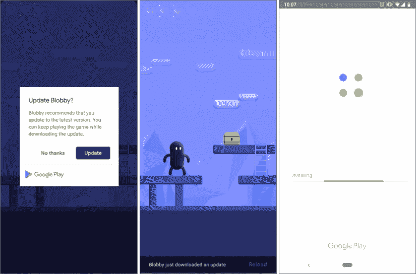

# 如何在你的 Android 应用中实现新的应用内更新功能

> 原文：<https://betterprogramming.pub/add-in-app-updates-to-your-android-app-in-just-5-lines-of-code-655440abc8e8>

## 涵盖这一有用功能的快速操作指南

你有没有发现自己通宵工作来修复一个 bug 或者为你的 Android 应用添加一个突破性的功能，却发现只有少数用户真正更新了他们的应用？不用担心，Android 现在已经发布了一个名为[应用内更新](https://developer.android.com/guide/app-bundle/in-app-updates)的新功能，你可以提示用户更新应用。

来源:[*https://developer . Android . com/guide/app-bundle/in-app-updates*](https://developer.android.com/guide/app-bundle/in-app-updates)

> 虽然有些用户在其设备连接到未计量的连接时会启用后台更新，但可能需要提醒其他用户进行更新。应用内更新是 Play 核心库的一项功能，它引入了一个新的请求流来提示活跃用户更新您的应用。
> 
> *—*[*https://developer . Android . com/guide/app-bundle/in-app-updates*](https://developer.android.com/guide/app-bundle/in-app-updates)

作为一名 Android 开发人员，把所有这些代码添加到我的应用程序中是很累的！因此，我开发了一个实现应用内更新功能的库，将整个过程缩减为五行代码。

我们开始吧！

# 履行

照片由[妮可·沃尔夫](https://unsplash.com/@joeel56?utm_source=medium&utm_medium=referral)在 [Unsplash](https://unsplash.com?utm_source=medium&utm_medium=referral) 拍摄

**步骤 1** :将 jitpack 添加到您的根级别`build.gradle`，在存储库的末尾。

**第二步**:将依赖关系添加到 app 级`build.gradle`。

**第三步**:初始化活动的`onCreate`方法中的`UpdateManager`。

有两种更新模式—灵活和即时:

*   **灵活(** `UpdateManagerConstant.FLEXIBLE` **)** *【默认】* —用户可以在更新下载和安装期间使用该应用。重启需要由用户触发。
*   **立即(** `UpdateManagerConstant.IMMEDIATE` **)** —用户将被阻止，直到下载和安装完成。自动触发重启。

**此外**您还可以获得更新的可用版本代码，以及自用户通过 Google Play 获得更新通知以来已经过去的天数。你只需要添加 *UpdateInfoListener* 。

你可以在[演示应用](https://github.com/SanojPunchihewa/InAppUpdater/tree/master/app)中找到以上所有代码，如果你想抢先一步，就去看看吧！

[瓦西里·科洛达](https://unsplash.com/@napr0tiv?utm_source=medium&utm_medium=referral)在 [Unsplash](https://unsplash.com?utm_source=medium&utm_medium=referral) 上拍照

就是这样！现在，您的 android 应用程序中有了应用内更新。

## **资源**

Github 库:[https://github.com/SanojPunchihewa/InAppUpdater](https://github.com/SanojPunchihewa/InAppUpdater)

演示 App:[https://github . com/SanojPunchihewa/inapp updater/tree/master/App](https://github.com/SanojPunchihewa/InAppUpdater/tree/master/app)