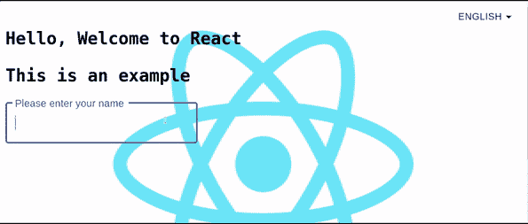

# 向 React 应用程序添加多语言支持

> 原文：<https://betterprogramming.pub/add-multi-language-support-in-react-js-a771c9ab31c3>

## 如何让您的 React 应用国际化


由 [Chigabiga](https://www.youtube.com/watch?v=PM3SrgdYvrw) 通过 [unDraw](https://undraw.co/illustrations) 拍摄的图像

我从 Angular 转向 React，并且已经在这上面花了很长时间。我喜欢 React 每天都在发展，并且正在成为 UI 开发的强大库。

大多数开发人员更喜欢 React 进行前端开发。比较简单，容易掌握。其性能；虚拟 DOM 和灵活、基于组件的方法使它与众不同。我在 React 工作时参与了多个项目。其中一个项目需要多种语言的国际化特性。

# react-i18 接下来

我碰到了国际化的 i18next 框架，它是用 JavaScript 写的。它为您的产品本地化提供了完整的解决方案。

为了在 React 中添加国际化，我们在 i18next 的基础上使用了[React-i18 next](https://react.i18next.com/)*。该模块提供了多个组件，用于在语言发生变化时呈现内容翻译。*

*我们可以在任何 UI 框架上使用它(Angular，React，Vue 等。)以及服务器端(例如 Node.js)。*

# *简单演示*

**

# *React 中的实现*

*首先你要通过 npm 或者 yarn 安装 i18next:*

*`npm install react-i18next i18next — save`*

*`npm install i18next-http-backend i18next-browser-languagedetector — save`*

*通过`http-backend`和`browser-languagedetector`，它将检测用户语言并加载翻译。*

*安装后，您必须在`index.js`旁边创建一个`i18nextConf.js`文件，以便添加 i18next 的配置，它将检测并加载翻译内容。*

```
*import ***i18n*** from 'i18next';
import { ***initReactI18next*** } from 'react-i18next';
import Backend from 'i18next-xhr-backend';
import LanguageDetector from 'i18next-browser-languagedetector';

const fallbackLng = ['en'];
const availableLanguages = ['en', 'ar', 'fr'];

***i18n*** .use(Backend) // load translations using http (default                                               public/assets/locals/en/translations)
  .use(LanguageDetector) // detect user language
  .use(***initReactI18next***) // pass the i18n instance to react-i18next.
  .init({
    fallbackLng, // fallback language is english.

    detection: {
      checkWhitelist: true, // options for language detection
    },

    debug: false,

    whitelist: availableLanguages,

    interpolation: {
      escapeValue: false, // no need for react. it escapes by default
    },
  });

export default ***i18n***;*
```

*将这些配置导入到您的`index.js`文件中。*

*`import ‘./i18nextConf’;`*

*有了这个初始化，您现在可以使用下拉菜单、单选按钮或其他任何可以用来转换多种语言并相应地更改翻译的东西。为了改变语言，我们使用`i18next.changeLanguage(‘en’)` ( `‘en’`只是一个例子)和`onClick()`来改变基于选择的语言。*

*我们也可以通过选择的语言将方向设置为从右向左。*

# *使用*

*在功能组件中，您可以使用`useTranslation`钩子来翻译您的内容。*

```
*import { useTranslation } from 'react-i18next';

function MyComponent() {
  const { t } = useTranslation();// this_is_an_example is the key against translation in locales/en/translation.json file. return <h1>{t('this_is_an_example')}</h1> 
}*
```

*在类组件中，您可以使用`withTranslation` HOC 来翻译您的内容。*

```
*import { withTranslation } from 'react-i18next';class MyComponent extends Component {
render() {
  const {t} = this.props
     return (<h1>{t('this_is_an_example')}</h1>)
   }
}
export default withTranslation()(MyComponent)*
```

*我在 CodeSandbox 上创建了示例代码，以帮助您了解支持多语言的 react-i18next 实现。*

## *优势*

*   *检测用户语言的插件*
*   *加载翻译*
*   *可选地缓存翻译*
*   *支持多种翻译的项目的可伸缩性*

# *结论*

*i18next 是一个强大且可扩展的国际化框架。它对大型和小型项目都很灵活。上面的文章是它在 React.js 中的实现。*

*这是我的观点。希望有帮助。*

*感谢您的阅读。*

# *参考*

*   *[react-i18 下一篇文档](https://react.i18next.com/)*