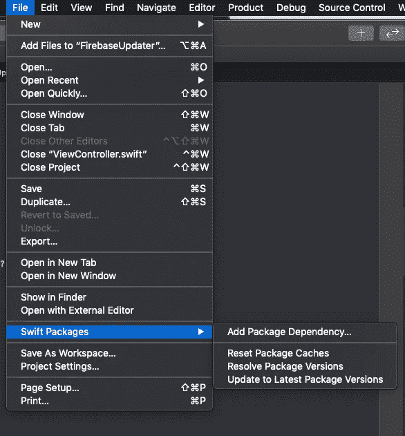
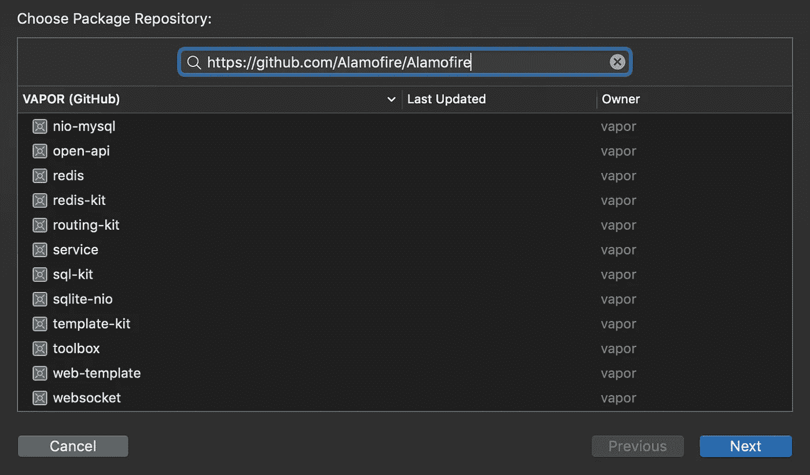
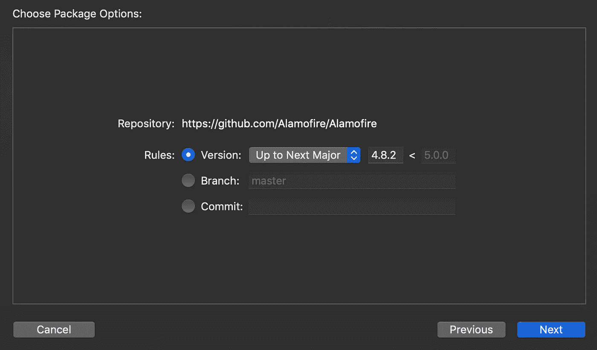
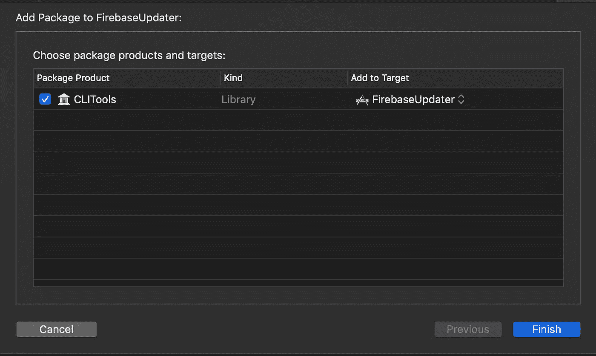

# 使用 Xcode 11 将 Swift 包依赖性添加到 iOS 项目中

> 原文：<https://betterprogramming.pub/add-swift-package-dependency-to-an-ios-project-with-xcode-11-remote-local-public-private-3a7577fac6b2>

## 远程、本地、公共、私有和自定义

我们曾经使用 [CocoaPods](https://cocoapods.org/) 或 Carthage 来将第三方库添加到 iOS 项目中。但是现在，由于 [Xcode 11](https://developer.apple.com/xcode/whats-new/) ，我们可以直接从 Xcode 菜单中添加一个 [Swift](https://developer.apple.com/swift/) 包。

# **添加新的 Swift 包**

进入*文件> Swift 包>添加包依赖*。

## 浏览您的 GitHub 资源库

当你添加一个新的包时，它会提示一个*选择包仓库*界面，只要你在 Xcode 里面登录 [GitHub](https://github.com/) ，你就会看到你所有的 Swift 包仓库。

## 获取自定义存储库

但是您也可以手动指定 URL 只需在搜索栏中输入即可。

当您输入了手动 URL，或者当您选择了所需的存储库时，请轻按“下一步”。

## 选择正确的规则来获取存储库

现在您已经选择了项目，您需要选择您想要查看的代码部分。您可以选择版本号、分支或特定提交。

当你点击“下一步”时，Xcode 将尝试从分支获取项目，一个特定的版本或修订提交。

## 选择要添加框架的目标

如果一切正常，您将看到最后一个屏幕，在该屏幕中您可以选择添加 Swift 产品包的位置。

就是这样！您刚刚使用 Swift package manager 向您的 iOS 项目添加了一个 Swift 框架。

# 获取计算机上的存储库

也可以将本地存储库添加到您的 iOS 项目中。由于*选择包库*接口支持 URI，您可以**添加包含您的 Swift 框架的本地文件夹**的路径，前缀为`file://` 。请记住，您需要在想要添加的文件夹中初始化一个 Git 存储库。

## 使用 SPM 创建您的 iOS 库

如果你想知道如何创建一个可以在 iOS 项目中使用的新 Swift 包:[https://medium . com/better-programming/creating-a-library-for-your-iOS-app-using-SPM-Swift-Package-manager-60db 6880748 c](https://medium.com/better-programming/creating-a-library-for-your-ios-app-using-spm-swift-package-manager-60db6880748c)