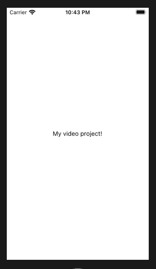
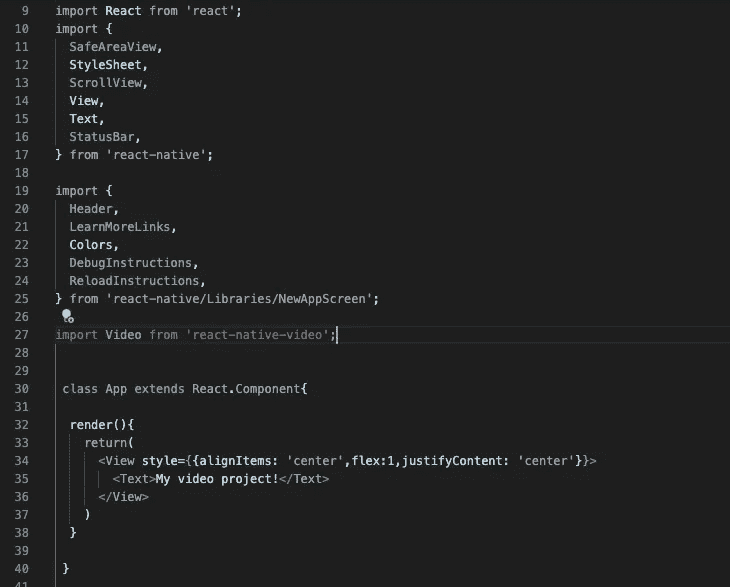
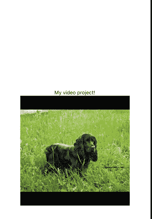
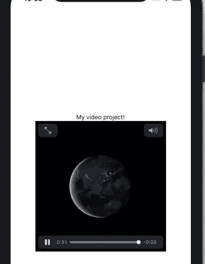

# 使用 react-native-video 将视频添加到 React 本机应用程序中

> 原文：<https://betterprogramming.pub/add-video-to-your-react-native-app-using-react-native-video-f020e90059de>

## 在 React 原生应用中使用本地和基于 URL 的视频


照片由[多诺万·席尔瓦](https://unsplash.com/@donofunk?utm_source=medium&utm_medium=referral)在 [Unsplash](https://unsplash.com?utm_source=medium&utm_medium=referral) 上拍摄

# 开始

您需要做的第一件事是在系统上的任意位置创建一个文件夹。我喜欢使用下载或桌面文件夹。创建一个名为`rnvideoproject`的文件夹。

完成后，打开终端/命令提示符，导航到刚刚创建的文件夹。一旦你完成了这些，输入命令`react-native init rnvideoproject`。

这将开始创建 React 本地项目和所有必要的文件/文件夹。完成后(可能需要几分钟),在您喜欢的代码编辑器中打开文件夹。我一直用 [Visual Studio 代码](https://code.visualstudio.com/)。完成此操作后，在 Visual Studio 代码中打开终端，并确保您位于文件夹的根位置。一旦你确定你是，输入下面的命令。

```
react native run ios 
```

这将打开一个模拟 iOS 手机，展示我们的 React 原生项目。

接下来要做的就是安装 react-native-video 这个包。

```
npm install --save react-native-video
```

react-native-video 基本上是一个允许在 React Native 中显示/使用视频组件的包。它提供了各种功能，例如能够静音视频，只播放音频而不播放视频，以及当通知在屏幕前面时暂停或播放视频。

[](https://www.npmjs.com/package/react-native-video) [## 反应-原生-视频

### react-native 的一个组件，参见 react-native-login！版本 5.x 建议 Android 的 react-native > = 0 . 60 . 0…

www.npmjs.com](https://www.npmjs.com/package/react-native-video) 

下一步是在代码编辑器终端中运行下面的命令。

```
cd ios && pod install
```

这将为 react-native-video 包安装必要的 pod 依赖项。

下一步，请打开文件`App.js`，用以下内容替换`const`或`class` app。

现在你的应用应该看起来像你下面看到的。



# **远程视频网址**

下一步是从 react-native-video 包中导入视频组件。为此，输入下面的代码，在这里导入`App.js`文件中的其余组件。



```
import Video from ‘react-native-video’
```

对于视频组件，有一些很重要的属性。下面是一个在 React 本机模拟器上正确显示的视频组件的示例。

所以我们将`source`属性设置为来自一个网站的样本 mp4 文件(一只非常可爱的动画兔子，如果我可以这么说的话)。

我们已经将视频组件的宽度和高度设置为 300。

`controls`属性是`true`，这意味着用户可以看到视频的控件，比如暂停和全屏。默认情况下这是`true`。如果我们将属性设置为`false`，那么控件将不会显示给用户。


还有一个名为`audioOnly`的属性，当设置为`true`时，将只播放音频轨道而不播放视频轨道。但是，为了实现这一点，还必须设置视频组件的`poster`属性。`poster`属性是一个字符串，它指示当音频正在播放而视频没有播放时应该显示的图像。如果没有设置`poster`属性，那么`audioOnly`将不工作。

下面是一个我如何使用`audioOnly`属性的例子。

我已经将`audioOnly`设置为`true`，并将`poster`属性设置为一张可卡犬的图片。



还有其他一些很酷的属性，比如`paused`和`muted`，它们设置为`true`可以暂停或静音视频。

一个重要的属性是`ref`属性，它基本上存储了一个视频组件的引用，因此您可以在没有道具/状态的情况下对视频组件进行更改。

你可以使用下面的代码作为参考。

`onBuffer`是视频缓冲时运行的属性。您可以将该属性设置为一个函数，以便在视频缓冲时向用户显示某些内容。例如，您可能希望在远程 URL 上显示一个大型视频，这可能需要一段时间来缓冲。您可以将这个值传递给 state，如果`onBuffer`值是`true`，那么将向用户显示一个加载图标。在这种情况下，这可能很方便。

上面是一个如何使用`onBuffer`的例子。您只需要传入函数名，参数将包含从`onBuffer`返回的对象，该对象包含一个`isBuffering`和一个`target`属性。

# **本地视频文件**

下面我将向你展示如何使用 react-native-video 添加一个本地视频文件来显示在你的 React Native 应用上。我们将在以下 URL 使用 mp4 文件。

[https://file-examples-com . github . io/uploads/2017/04/file _ example _ MP4 _ 480 _ 1 _ 5mg . MP4](https://file-examples-com.github.io/uploads/2017/04/file_example_MP4_480_1_5MG.mp4)

打开上面的网址后，点击视频右边的三个点，然后点击下载。

下载文件后，将视频复制到项目文件夹的根目录下。现在，您需要在`render`方法中创建一个变量，该变量是 mp4 文件。

从上面可以看出，我们需要名为`earth.mp4`的文件，并且已经将视频组件的源设置为等于变量`earthVideo`。现在视频看起来如下，而不是显示动画兔子。



这就是本教程的全部内容。我为这篇文章的简短道歉，但是我只是想回顾一下如何使用视频组件的基础知识和一些最重要的属性。然而，仍然有大量的其他属性/事件非常有用，我将在下面记录下来供您考虑。

`pictureInPicture` ( `true` / `false` ) —决定视频是否画中画播放。(从文档来看，这只适用于 iOS。)

`playWhenInactive` ( `true` / `false` )—这决定当通知中心位于视频前面时，是否播放视频。(从文档来看，这只适用于 iOS。)

`rate`—(0.0–1.0)视频播放的速度。(0.0 暂停视频，1.0 以常规速度播放视频)。所有平台。

`source` —播放媒体的来源。这可能来自本地文件、远程 URL 或 SD 卡中的文件。所有平台。

`onLoad` —当媒体可以播放时运行的事件属性/回调函数。

`onEnd` —媒体播放结束时运行的回调函数。

react-native-video 是一个非常棒的包，它有大量的属性、回调函数和回调函数中的属性，如果你想在 React Native 应用程序中使用视频，它绝对是一个值得检验和使用(和支持)的包。

我希望你能从这篇文章中学到一些东西。

谢谢大家！

也可以随意看看我的博客(我希望那里有其他类型的文章)-[https://simplyreact.uk/](https://simplyreact.uk/)

亚历克斯