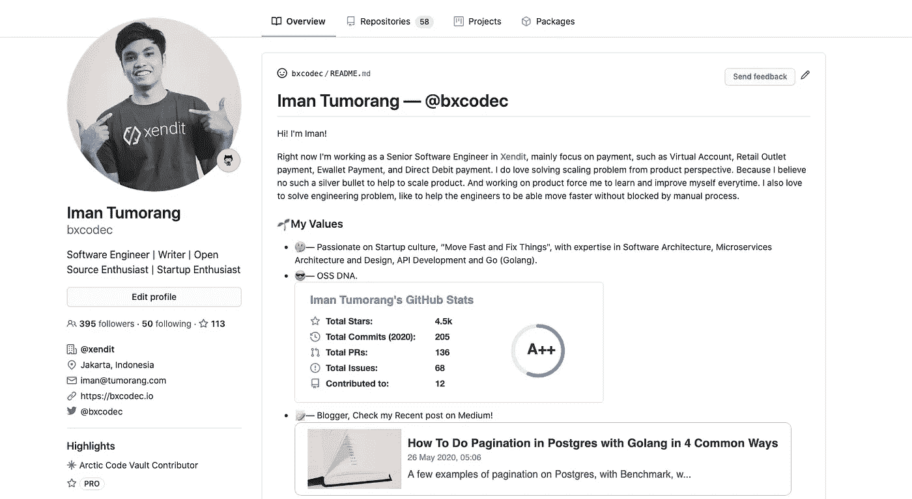

# 如何将您最近发表的媒体文章添加到 GitHub 自述文件中

> 原文：<https://betterprogramming.pub/add-your-recent-published-mediums-article-on-github-readme-9ffaf3ad1606>

## 在 GitHub 上展示你最新的媒体作品


克里斯汀·休姆在 [Unsplash](https://unsplash.com?utm_source=medium&utm_medium=referral) 拍摄的照片。

GitHub 最近发布了一项新功能，允许您创建自述文件，因此您现在可以自定义您的 GitHub 个人资料页面。

你可以在[我的 GitHub 简介](https://github.com/bxcodec)上看到一个例子:



我的 GitHub 个人资料。

这个功能真好看。它让你的 GitHub 简介看起来更专业，内容更丰富。未来，我预计 GitHub 会像 LinkedIn 一样面向开发者。

# GitHub Readme 简介—最近的媒体文章

我见过很多人做的插件，像 GitHub stats 卡，编程语言 stats，甚至游戏(比如这个[网络象棋游戏](https://github.com/timburgan/timburgan)甚至[井字游戏](https://github.com/alfari16/alfari16))。

在[这个自述文件](https://github.com/alfari16/alfari16)中，用户包含了他们最近发表的媒体文章列表。但只能在他们的个人资料上看到。为了达到同样的效果，我需要复制他们的代码，这需要时间。

这就是这个插件背后的最初想法。我创建了一个具有定制功能的独立存储库。然后我把这个函数变得更加通用，这样每个人都可以把他们最近发表的 Medium 文章添加到他们的 GitHub readme 中。

现场演示:GitHub 自述文件—最近的媒体文章

# 步伐

要使用这个插件，您只需要将这个脚本添加到您的 GitHub 自述文件中:

所以格式是:

```
https://github-readme-medium-recent-article.vercel.app/medium/<medium-username>/<article-index>
```

*   `medium-username`:您的中型用户名/档案
*   `article-index`:你最近的文章索引(如`0`表示你最近的文章)

完整的步骤可以在[我的库](https://github.com/bxcodec/github-readme-medium-recent-article)中看到。此外，如果您发现任何问题，只需打开一个问题或直接在该存储库上创建一个 PR。

# 关于此插件的更多信息

*   我使用 [Vercel](https://vercel.com/) 进行静态托管，并使用无服务器功能来检索最近的文章。我也许可以添加一个自定义域，但那是以后的事了。
*   我用的是 Medium 的 RSS。您可以通过输入以下 URL 从 Medium 获取您的 RSS 提要:【https://medium.com/feed/@ 您的 Medium 用户名。
*   然后使用 API RSS to JSON 将其转换为 JSON:

```
[https://api.rss2json.com/v1/api.json?rss_url=https://medium.com/feed/@imantumorang](https://api.rss2json.com/v1/api.json?rss_url=https://medium.com/feed/@imantumorang)
```

*   使它通用，这样每个人都可以使用它。

为了使它通用，人们可以直接将他们的中型用户名传递给无服务器函数:

```
https://github-readme-medium-recent-article.vercel.app/medium/@imantumorang
```

我需要如下创建我的无服务器功能的文件夹:

```
└── medium
    └── [user]
        └── [index].ts
```

需要有`[user]`目录，这样我就可以动态设置用户名。我在做插件的时候就被这个问题卡住了。实际上，我可以像使用`?username=@imantumorang`一样使用 query-param 来创建它，但是根据我的经验和记住 REST，使它成为 path-param 是告诉参数是必需的正确方法。此外，我希望让您的体验与访问您的 Medium 个人资料(例如 Medium . com/@ imanturomang)时一样。

我知道媒体文章中的评论会自动添加到 RSS 中。为了只显示文章，我在函数上添加了一个过滤函数:

```
if (thumbnail.includes("cdn")) {
        fixItem.push(element)    
}
```

所以我只启用了有缩略图的文章。我仍然在寻找一个解决方法，因为如果这篇文章没有任何缩略图，它将被跳过。至少现在，如果你的文章有缩略图，当我们将它导入到你的 GitHub readme 时，它会显示出来。

可能需要一段时间才能让你最近的文章被列出来(对于一篇新文章)，因为 API RSS to JSON 被缓存了。文章在媒体上发布后，请等待大约 1-3 个小时。

# 结论

嗯，我想现在就这样吧。如果你发现任何问题，你可以直接在 GitHub 上打开一个问题。我会尽力帮忙的。