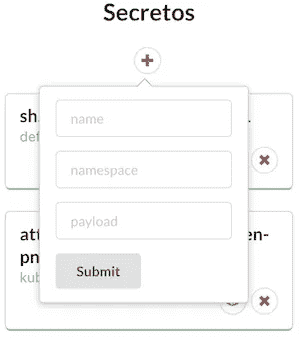
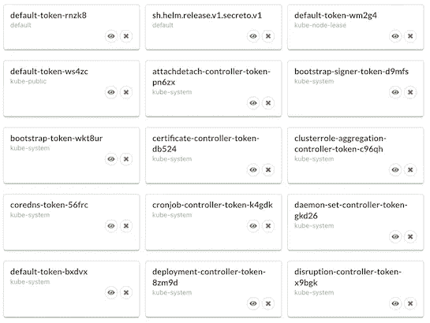
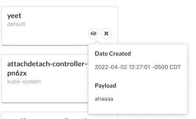
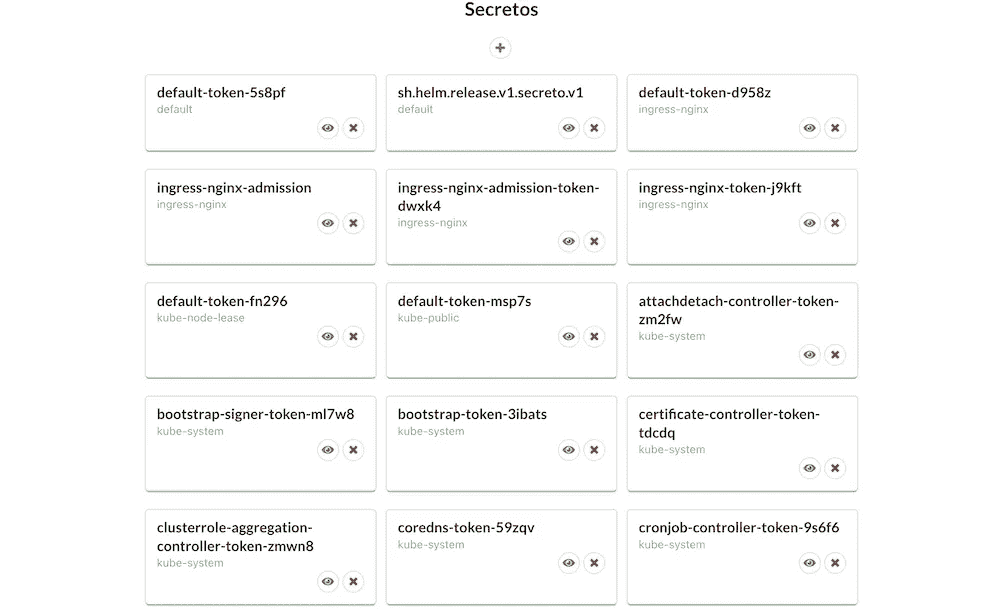

# 向您的 Kubernetes 应用程序添加一个极简的 ReactJS UI

> 原文：<https://betterprogramming.pub/adding-a-minimalistic-reactjs-ui-to-your-kubernetes-application-d4e1859d312b>

## ReactJS 遇到 Go


照片由[劳塔罗·安德烈亚尼](https://unsplash.com/@lautaroandreani?utm_source=medium&utm_medium=referral)在 [Unsplash](https://unsplash.com?utm_source=medium&utm_medium=referral) 上拍摄

我们可以创建许多很酷的服务器应用程序，使用 client-go 与 Kubernetes 进行交互。有时我们想让我们的应用程序在视觉上吸引人，这样我们就可以轻松地执行功能，而不需要通过 curl、postman 等发送请求。

在这篇博文中，我将介绍如何向 Kubernetes 应用程序添加 Web UI。我将在 [Secreto-Server](https://gitlab.com/k2511/secreto-server) 的基础上构建，这可以在我之前的博客文章[中看到，在 Go](https://awkwardferny.medium.com/build-test-and-automate-a-kubernetes-interfacing-application-in-go-da71e4d5aaef) 中构建、测试和自动化一个 Kubernetes 接口应用程序。建议您在继续之前阅读该博客。

我们将讨论 [Secreto-Client](https://gitlab.com/k2511/secreto-client) ，它允许通过 web UI 提供以下功能:

*   创造一个 Kubernetes 的秘密
*   查看所有 Kubernetes 的秘密
*   描述一个库本内特的秘密
*   删除 Kubernetes 的秘密

这些操作可以通过以下方式执行:

## 创造一个秘密

通过点击✚按钮，我们可以看到一个对话框弹出一个表格，用于输入数据，以创建一个秘密。



## 查看所有秘密

应用程序一运行，所有的秘密就显示在卡片上。



## 描述一个秘密

点击按钮可以更详细地描述一个秘密。



## 删除秘密

点击❌按钮可以删除秘密。

[Secreto-Client](https://gitlab.com/k2511/secreto-client) 生成一个 UI，然后根据执行的动作向 [Secreto-Server](https://gitlab.com/k2511/secreto-server) 发送请求。

# 先决条件

我们将构建服务器和客户端。服务器端代码是用 Go 写的，有自己的要求，客户端是用 ReactJS 写的代码。

*   [React-JS](https://reactjs.org/) **:** 一个用于构建用户界面的 JavaScript 库。React-JS 使我们可以很容易地构建一个知道最少节点数的用户界面。
*   Go:谷歌支持的开源编程语言
*   [MiniKube](https://minikube.sigs.k8s.io/docs/) :在 macOS、Linux 和 Windows 上快速建立本地 Kubernetes 集群的工具。您还需要一个虚拟化驱动程序来运行 MiniKube，例如 Docker、HyperV、Podman 等。更多信息可在[这里](https://minikube.sigs.k8s.io/docs/drivers/)找到。你可以使用其他类型的集群(Docker Desktop Kubernetes、GKE、AKS 等。)，我用的是 Minikube，因为很容易上手。
*   Kubernetes 知识:您应该对 Kubernetes 有所了解，以便理解该应用程序的用途。

在我们继续之前，让我们确保 Minikube 正在运行。我们可以通过运行以下命令来实现这一点:

```
$ minikube start😄  minikube v1.25.2 on Darwin 12.3 (arm64)
✨  Using the podman (experimental) driver based on existing profile
👍  Starting control plane node minikube in cluster minikube
🚜  Pulling base image ...
E0321 11:05:07.616563   66007 cache.go:203] Error downloading kic artifacts:  not yet implemented, see issue #8426
🔄  Restarting existing podman container for "minikube" ...
🐳  Preparing Kubernetes v1.23.3 on Docker 20.10.12 ...E0321 11:05:13.251398   66007 start.go:126] Unable to get host IP: RoutableHostIPFromInside is currently only implemented for linux
▪ kubelet.housekeeping-interval=5m
🔎  Verifying Kubernetes components...
    ▪ Using image gcr.io/k8s-minikube/storage-provisioner:v5
🌟  Enabled addons: storage-provisioner, default-storageclass
💡  kubectl not found. If you need it, try: 'minikube kubectl -- get pods -A'
🏄  Done! kubectl is now configured to use "minikube" cluster and "default" namespace by default
```

现在让我们确保 minikube 节点准备好了。

```
$ minikube kubectl get nodesNAME       STATUS   ROLES                  AGE     VERSION
minikube   Ready    control-plane,master   3m50s   v1.23.3
```

# 正在加载 Secreto 服务器

后端可以通过以下方式加载:

1.  将应用程序克隆到您的 [GOPATH](https://go.dev/doc/gopath_code)

```
$ git clone [git@gitlab.com](mailto:git@gitlab.com):k2511/secreto-server.gitgit clone [git@gitlab.com](mailto:git@gitlab.com):k2511/secreto-server.git
Cloning into 'secreto-server'...
remote: Enumerating objects: 235, done.
remote: Counting objects: 100% (232/232), done.
remote: Compressing objects: 100% (121/121), done.
remote: Total 235 (delta 97), reused 177 (delta 69), pack-reused 3
Receiving objects: 100% (235/235), 282.99 KiB | 3.11 MiB/s, done.
Resolving deltas: 100% (97/97), done.$ cd secreto-server
```

2.构建应用程序可执行文件

我创建了一个 Makefile，这使它变得容易。一旦运行这个命令，应该会创建一个名为***secreto-server***的新可执行文件。

```
$ make buildgo mod download
GOOS=darwin GOARCH=arm64 go build -o secreto-server .
chmod +x secreto-server
```

**注意:**如果您没有在 M1 Mac 上运行，您可能需要在 [Makefile](https://gitlab.com/k2511/secreto-server/-/blob/main/Makefile) 中更改 GOOS 和 GOARCH 变量。更多详情[此处](https://www.digitalocean.com/community/tutorials/building-go-applications-for-different-operating-systems-and-architectures)。

3.在本地运行应用程序

这是通过在运行可执行文件时传递`-local`标志来实现的。在没有`-local`标志的情况下运行它，将要求应用程序在 Kubernetes 集群中运行，因为它使用不同的 [auth 方法](https://github.com/kubernetes/client-go/tree/master/examples/in-cluster-client-configuration)。

```
$ ./secreto-server -local2022/03/20 16:18:30 KubeClient running with local configuration
2022/03/20 16:18:30 Starting server on the port 8080
```

你也可以在执行程序前通过设置`SECRETO_PORT`环境变量来改变端口。

现在应用程序正在运行。让我们继续下去，并确认它的工作。我们可以通过打开另一个终端并向服务器发送请求来获得它的版本。

```
$ curl [http://localhost:8080/api/secreto/version](http://localhost:8080/api/secreto/version){"version":1}
```

我们现在有一个工作的服务器了！现在让我们继续部署客户端。

# 加载 Secreto 客户端

可以通过以下方式加载客户端:

1.  克隆存储库

```
$ git clone [git@gitlab.com](mailto:git@gitlab.com):k2511/secreto-client.gitCloning into 'secreto-client'...
remote: Enumerating objects: 109, done.
remote: Total 109 (delta 0), reused 0 (delta 0), pack-reused 109
Receiving objects: 100% (109/109), 6.20 MiB | 5.46 MiB/s, done.
Resolving deltas: 100% (58/58), done.
```

2.下载依赖项

```
$ npm install --silent
$ npm install react-scripts -g --silent
```

3.运行应用程序

```
$ npm start

Compiled successfully!

You can now view client in the browser.

  Local:            http://localhost:3000/
  On Your Network:  http://192.168.3.7:3000/

Note that the development build is not optimized.
To create a production build, use npm run build.
```

当访问应用程序页面时，您应该会看到下面的屏幕， [localhost:3000](http://localhost:3000/) :



在我的浏览器中运行的 Secreto 客户端

**注意:**你屏幕上显示的秘密可能会很不一样。我一直在摆弄我的 Minikube 集群，所以它对我来说看起来有点不同。

如果您想要在不同的端口上运行应用程序，只需将环境变量`PORT` 设置为您想要运行的端口，例如:

```
$ PORT=3001 npm startCompiled successfully!You can now view client in the browser.Local:            [http://localhost:3001/](http://localhost:3001/)
  On Your Network:  [http://192.168.86.24:3001/](http://192.168.86.24:3001/)Note that the development build is not optimized.
To create a production build, use npm run build.
```

# 使用语义用户界面创建视觉效果

语义界面让我开始创建一个极简且视觉上吸引人的页面变得非常简单。Semantic 是一个开发框架，它使用对人友好的 HTML 帮助创建漂亮的、响应性强的布局。

一个例子是生成一个弹出窗口，如下所示，这是创建一个秘密的形式。请注意以下事项:

*   弹出式菜单是使用可读的 HTML 定义的
*   可以通过点击图标来触发弹出窗口，这可以通过图标的触发和点击时弹出窗口的加载来看出
*   弹出窗口中显示的内容可以指向一个可以加载更多布局的功能。在这个弹出窗口的例子中，我们加载一个表单来输入数据以生成一个新的密码。

```
<Popup        
  trigger={
    <Icon 
       circular name='add'
       color='grey'
     />
   }

   content={() => this.renderSubmitForm()}
   size='large'
   on='click'
   position='bottom center'>
</Popup>
```

语义有这么多不同类型的对象，有这么多不同的配置。我建议看一下他们的[文档](https://react.semantic-ui.com/)。

# 使用 Axios 发送请求

Axios 是另一个伟大的工具，它帮助我建立了这个界面。Axios 是一个基于 [*承诺的*](https://javascript.info/promise-basics) HTTP 客户端，用于`[node.js](https://nodejs.org/)`和浏览器。我使用它是为了根据 ReactJs 语义 UI 中采取的动作向`secreto-server`发送请求。

使用 Axios 的示例如下所示:

*   从状态中获取变量，这些变量由输入到用于生成秘密的表单中的内容填充
*   Axios 向我定义的全局端点发送 post。它使用从状态中获取的数据(*名称空间*)来填充 URI 的其余部分
*   一个主体作为第二个参数被传递，包含秘密的*名称*和*有效载荷*
*   标头作为第三个参数传递
*   我们记录响应并重新加载包含我们刚刚生成的新秘密的秘密

```
 createSecret = () => {
      const {name, namespace, payload} = this.state

      axios.post(this.endpoint + "/api/secreto/" + namespace,
        {
          "name": name, 
          "payload": payload
        },
        {
          headers: {
            "Content-Type": "application/x-www-form-urlencoded",
          },
        },
        ).then(res => {
          console.log(res);
          this.getSecrets();
      })
    }
```

这就是 Kubernetes 界面应用程序的极简 UI。请随意检查这两个项目的源代码并深入研究！

感谢阅读，我希望这篇博客能让你开始为你的`web-server`添加一个很酷的极简 UI。

```
**Want to Connect?**You can find me on twitter [@awkwardferny](https://twitter.com/awkwardferny)
```