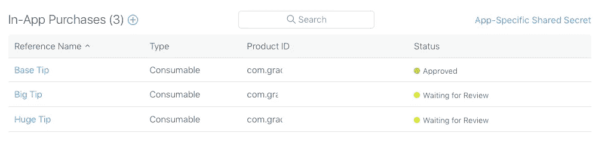
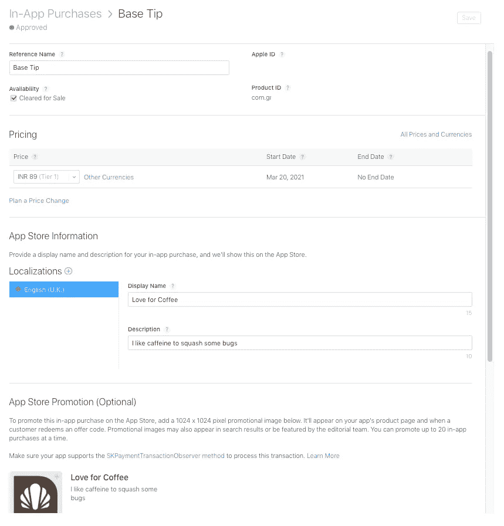
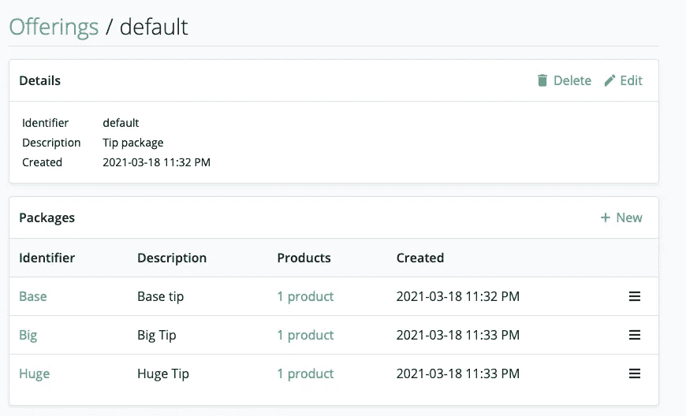
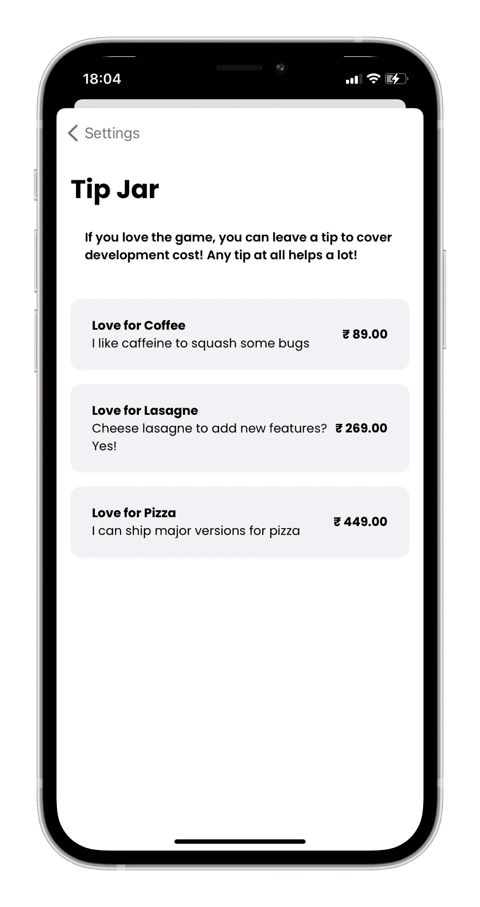

# 使用 RevenueCat 在 SwiftUI 中添加小费罐

> 原文：<https://betterprogramming.pub/adding-a-tip-jar-with-revenuecat-in-swiftui-717a0d4b60c>

## 掌握整合应用内购买的流程

萨姆·丹·张在 [Unsplash](https://unsplash.com?utm_source=medium&utm_medium=referral) 上拍摄的照片。

我想玩玩 [RevenueCat](https://www.revenuecat.com/) ，我认为创建一个小费罐将是一个完美的开始。所以我昨天午夜坐下来，通读了托马斯·里库德的这篇文章:

 [## SwiftUI、应用内购买和 RevenueCat

### 如何在 SwiftUI 应用中实施应用购买和订阅

medium.com](https://medium.com/swlh/swiftui-in-app-purchases-and-revenuecat-abfe0478ca71) 

在阅读了它以及 RevenueCat 的文档之后，我可以给我的渐变游戏添加一个提示罐了！

# 灵感

我从 Apollo 的提示屏幕开始灵感——最好的 Reddit 客户端。

基于此，我决定创建三层技巧:

*   对咖啡的热爱——基本建议
*   喜欢千层面——一个大建议
*   对披萨的热爱——巨额小费

# App Store 连接

我将它们添加到 App Store Connect 应用程序的应用内购买部分:

小费的 IAP

我必须为审查过程提供参考名称、产品 ID、定价、显示名称、描述和屏幕截图(强制)。

为 IAP 提供信息

请注意，您必须首先创建一个 IAP，通过将其添加到构建中来获得批准，然后添加更多的 IAP。我犯了第一次添加所有内容的错误，我的应用程序被拒绝，因为第一个没有被批准。

在获得第一个 IAP 批准后(撰写本文时已上线)，我添加了更多。

这就结束了 App Store 连接端。是时候进入 RevenueCat 了！

# RevenueCat

创建账号登录后，我添加了渐变游戏作为 app。在“产品”下，使用与 App Store Connect 上相同的标识符添加它。现在，为它们添加授权，并将它们附加到相应的产品。

在此之后，我对是否应该添加“供品”感到困惑。在文档中，例子是订阅。我下载了样本 SwiftUI 项目以了解他们是如何做的，然后基于此，我也创建了一个产品。

我创建了一个默认产品，并向其中添加了三个包，每个包对应于我之前制作的产品。

RevenueCat 上的产品屏幕

此时，我已经完成了 App Store Connect 和 RevenueCat 上的 IAP 处理。我们写点代码吧！

# SwiftUI 和一些代码

我从一个名为`IAPManager`的单例类开始(类似于上面提到的文章中出现的内容):

我配置了购买框架，并获得了所有可用的产品。我添加了一个方法来根据用户的选择购买特定的包。

对于视图，我循环查看了包，并显示了基于包的描述:

就是这样！我成功地在我的应用中添加了一个小费罐！

# 结论

与 StoreKit 相比，使用 RevenueCat 是一件轻而易举的事情。对于添加一个普通的可消耗/不可消耗的 IAP，没有太大的区别。但对于订阅，我会选择 RevenueCat。过去，我在使用 StoreKit 的可更新订阅时做了一些噩梦，我希望有人来处理收据，而我则致力于为这种经常性订阅提供最佳价值。

我希望你喜欢这篇文章！如果你有任何问题，可以在评论区留言。