# 为现有的 iOS 应用程序构建 SwiftUI watchOS 天气应用程序

> 原文：<https://betterprogramming.pub/adding-a-watch-app-to-your-existing-ios-application-xcode-13-d229dd9422c5>

## 将 watchOS 目标添加到现有 iOS 项目中

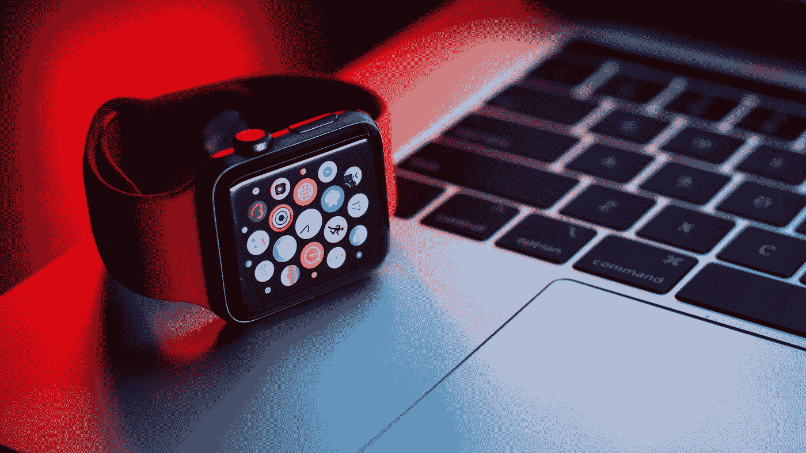

照片由 [Raagesh C](https://unsplash.com/@raagesh?utm_source=medium&utm_medium=referral) 在 [Unsplash](https://unsplash.com?utm_source=medium&utm_medium=referral) 上拍摄

该演示将继续建立在之前的[文章](/simple-weather-app-with-swiftui-ac41200a9d4d)中创建的应用之上。

在这一部分，我们将:

*   在我们现有的 iOS 项目中创建一个新的 watchOS 目标。
*   在手表上运行现有的应用程序
*   使用 iPhone 和手表模拟器在 Xcode 上启动并运行应用程序

和以前一样，我在这个演示中使用 Xcode13.2。

# 向现有 iOS 项目添加 watchOS 目标

我们将从第 1 部分的[处开始。所以在 Xcode 中打开你的项目。](https://medium.com/@bahalek/simple-weather-app-with-swiftui-ac41200a9d4d)

要将 WatchOS 目标添加到项目中:

1.  选择文件->新建->目标
2.  在“模板”窗口中，从 WatchOS 标签中选择“iOS 应用程序的观察应用程序”,然后点按“下一步”。

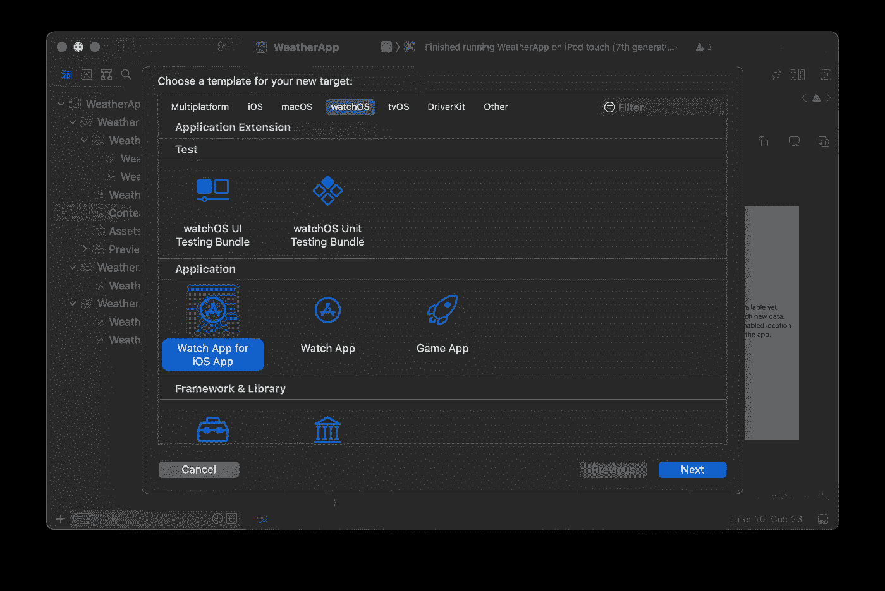

3.选择产品名称，然后单击“完成”。

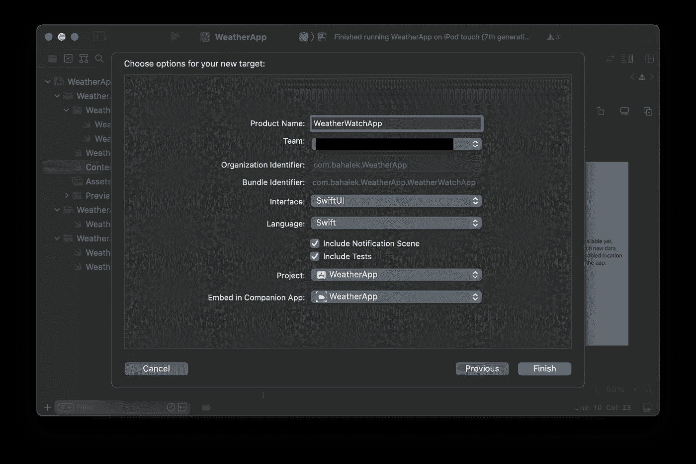

4.在下一个询问您是否要激活 WatchApp 复杂功能方案的弹出窗口中，请随意选择“取消”,因为我们不会在本教程中使用它。

完成这些步骤后，您应该得到下面的项目结构和添加的新文件。

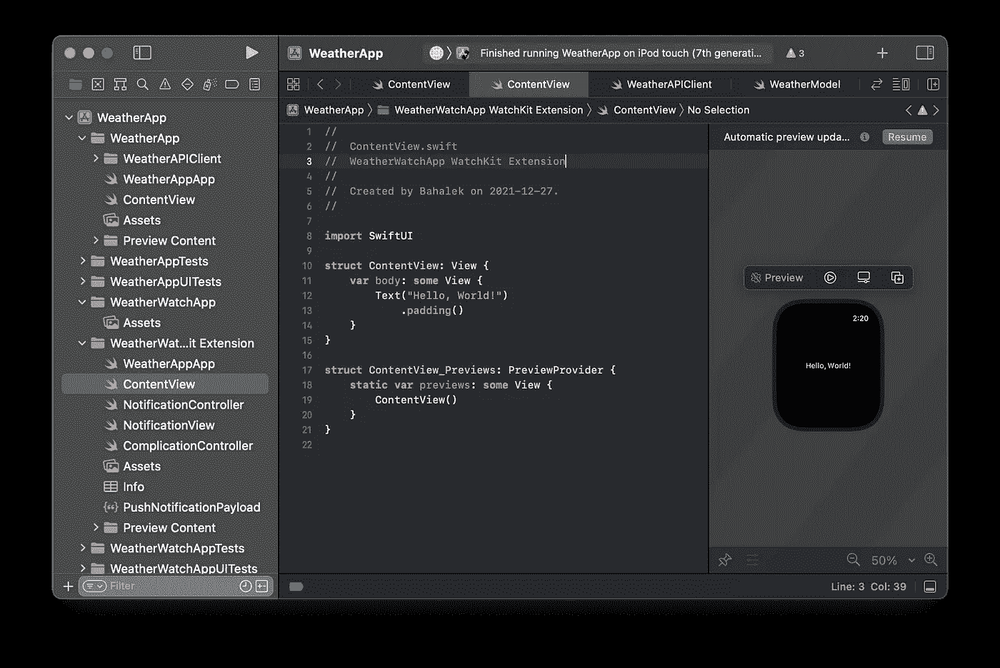

# 在手表上运行您的应用

从手表应用目标中删除`WeatherAppApp.swift`和`ContentView.swift`文件，因为我们将重用 iOS 应用中的文件。

为了能够在两个目标之间共享文件，选择`WeatherAppApp.swift`、`ContentView.swift`、`WeatherModel.swift`、`WeatherAPIClient.swift`，并从文件检查器选项卡将它们添加到`WeatherWatchApp` WatchKit 扩展中。

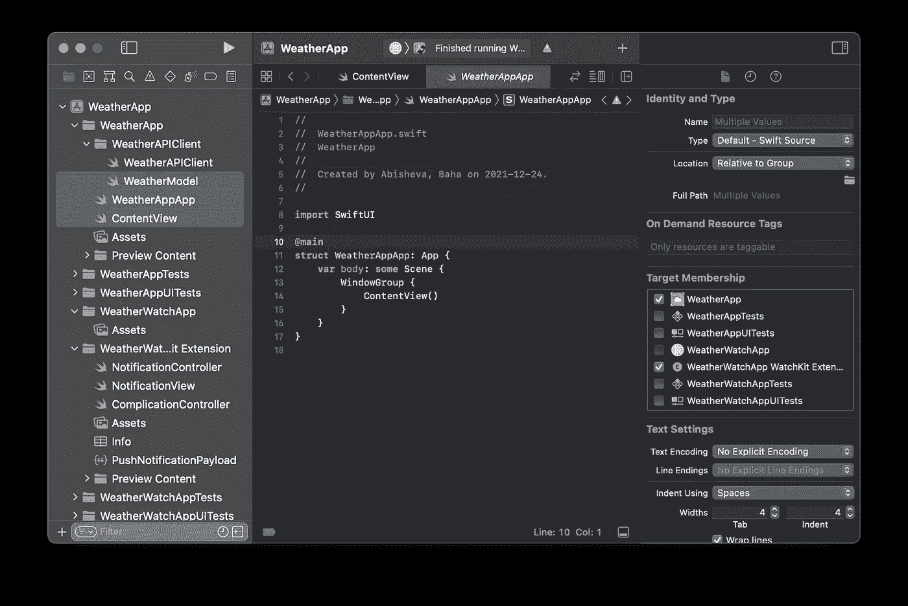

如果你运行新创建的`WeatherWatchApp`方案，你会看到 Xcode 会自动将一个电话模拟器附加到你的手表模拟器上。

如果您想将手表连接到特定的模拟器，您可以通过“窗口->设备和模拟器”来完成。

选择您喜欢的模拟器，点击配对手表窗格上的+图标，添加手表模拟器。

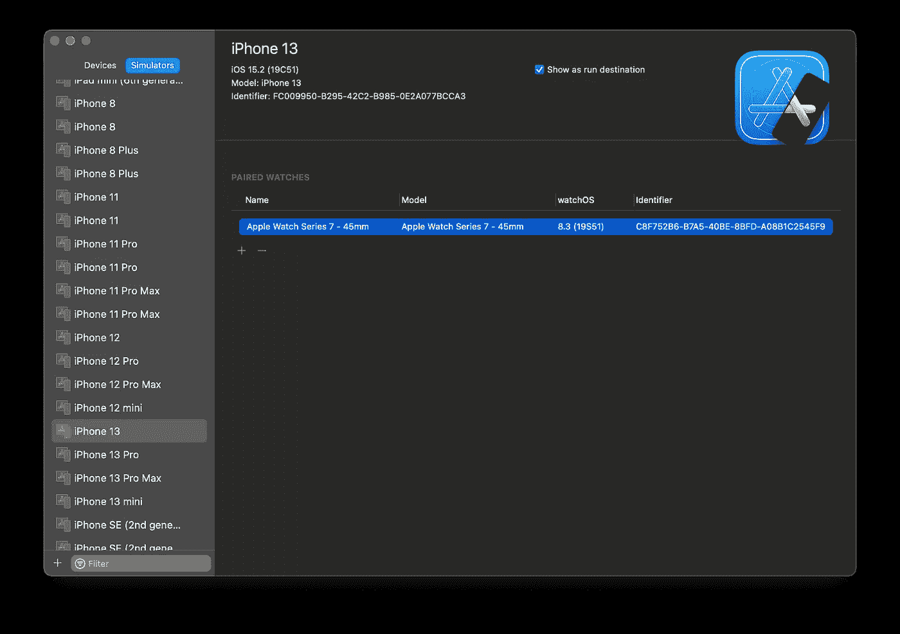

如果您不想在运行手表应用程序时总是启动手机模拟器，请选择您的手表应用程序扩展目标，并在“通用设置”中选择“支持在不安装 iOS 应用程序的情况下运行”。

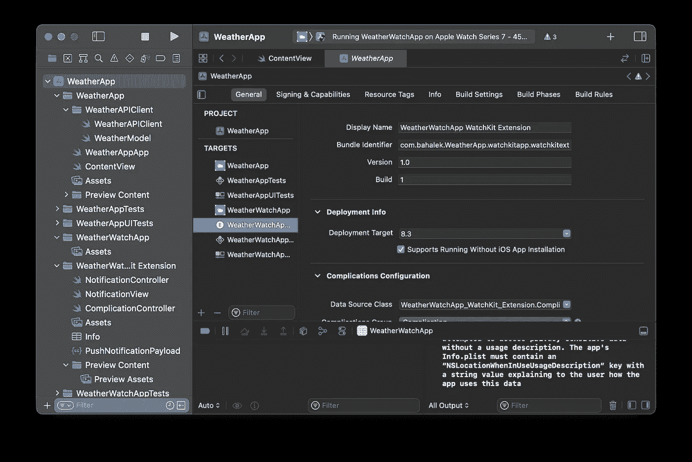

如果你现在运行`WeatherWatchApp`方案，你会看到它只在手表模拟器上启动，而不会在手机模拟器上安装应用。

但是，您会看到您将进入默认屏幕*(下图中)*，因为该应用程序尚未启用位置权限。

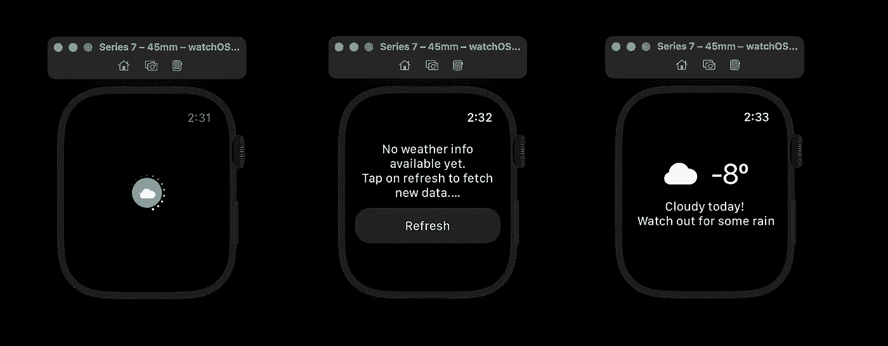

要启用 watch 应用程序的位置权限，请将与 iOS 应用程序目标相同的位置跟踪权限添加到 watch 应用程序扩展目标，如下所示，下次运行应用程序时，您应该会看到应用程序要求您启用位置服务。

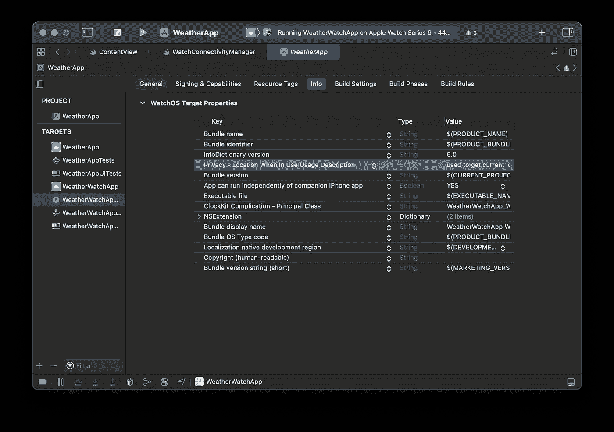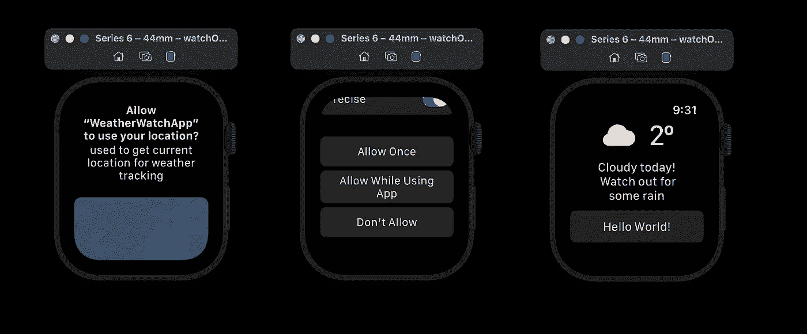

为了确保 UI 适合手表，更新`ContentView.swift`文件以将主`VStack`包装在`ScrollView`中，如下所示:

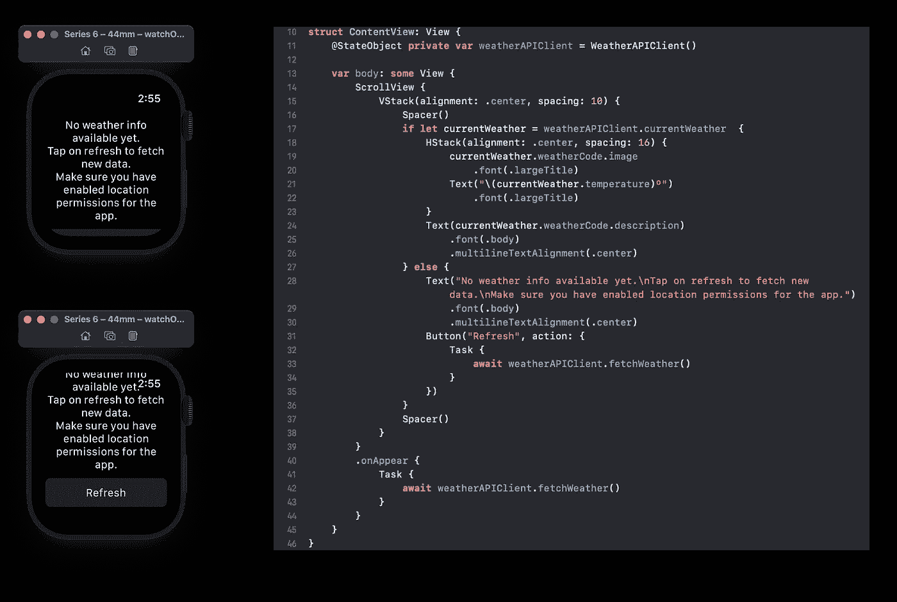

# 结论

现在你有了一个既能在 Apple watch 上运行又能在 iPhone 上运行的应用程序。

在[下一部分](https://medium.com/@bahalek/sending-data-between-watchos-and-ios-apps-cf924e21b3c2)中，我将介绍如何建立手表连接，以便在 iPhone 和手表之间来回发送数据，从而更新用户界面并显示通知。

编码快乐！