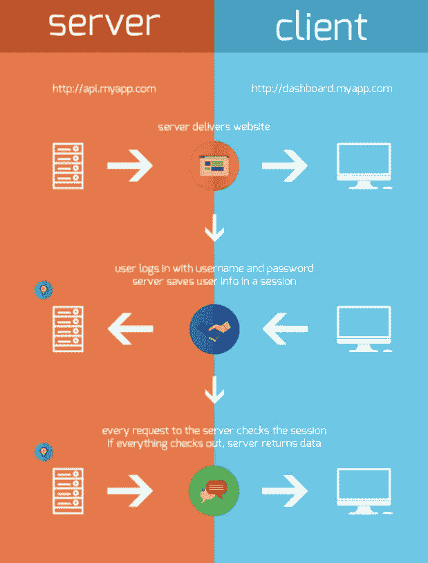

# 使用 BCrypt 和 JWT 为您的应用程序添加身份验证

> 原文：<https://betterprogramming.pub/adding-authentication-to-your-application-with-bcrypt-and-json-web-tokens-8bf449de3b2b>

## 好的应用程序是安全的应用程序


照片来自[美第奇](https://gomedici.com/future-of-authentication-what-will-replace-login-password-pairs)。

在最近的一次软件工程面试中，出现了关于认证的问题。这是一个严酷的警钟，让我意识到我在这方面已经生疏了。我最近习惯于在我的项目中完全跳过身份验证，因为它们的规模相对较小，并且包含没有敏感信息的虚拟种子数据。在过去和紧迫的最后期限下，我被告知不要太担心身份验证，因为许多公司将这一过程完全外包给网络安全专业服务。

也就是说，这些绝不是忽略身份验证的好借口。每个软件工程师都需要知道用户认证的基本概念和实现。

在我的采访中断之后，本着成长的精神，我决定回到这个主题，使用`BCrypt`和 JSON Web 令牌创建一个带有身份验证的应用程序的小演示。

# 构建 Rails 服务器

首先，我们将使用以下命令创建一个 Rails 项目:

```
rails new <project_name> --api --database=postgresql
```

这里，我们使用 [PostgreSQL](https://www.postgresql.org/) 作为数据库，并向 Rails 表明这将是一个带有`--api`标志的 API。如果没有这个标志，我们会生成许多额外的不必要的文件，包括完整的 MVC 框架。

我们将安装`jwt`和`active_model_serializers`宝石:

```
bundle add jwt && bundle add active_model_serializers
```

接下来，导航到`Gemfile`并取消注释`gem 'rack-cors'`，允许我们在 API 中建立跨源资源共享(CORS)。我们还将取消对`gem 'bcrypt'`的注释。最后，在终端中运行`bundle install`来安装这些库。

要启用 CORS，转到`config/initializers/cors.rb`并取消以下注释:

现在，将`'example.com'`改为`'*'`。这将允许所有域向我们的 API 发出请求。这涉及到安全问题，所以对于除了演示之外的任何东西，我建议将访问权限限制在您的前端领域。

接下来，我们将使用以下命令创建用户模型、控制器和序列化程序:

```
rails g model User username password password_digest bio avatar
rails g controller api/v1/users
rails g serializer user
```

在生成模型时，可以随意在模式中包含任何您喜欢的列。`username`、`password`和`password_digest`大约是最低要求。

要创建数据库，请运行:

```
rails db:create
rails db:migrate
```

太好了！我们现在有了一个基本的 API 后端，可以开始实现身份验证逻辑了。

# BCrypt

在我们的应用程序中，我们使用`BCrypt`来存储用户的明文密码。salt 是添加到用户密码中的一点随机数据。加盐密码然后通过散列函数运行。哈希函数实际上是一个单向过程，因为不可能解析哈希来确定原始密码。多亏了`BCrypt`，我们现在有了可以安全存储在数据库中的“摘要”密码。不要在数据库中存储明文密码。

我们可以在用户模型中创建一个`authenticate`方法来比较用户的明文密码和密码摘要。它看起来会像这样:

不过我们会用内置的`ActiveModel#has_secure_password`。我们将把它添加到用户模型中，并进行一些验证来检查用户名的唯一性:

```
class User < ApplicationRecord
  has_secure_password
  validates :username, uniqueness: { case_sensitive: false }
end
```

# 创建用户

我们将首先关注创建新的有效用户。在`UsersController`中，我们将定义一个`create`方法以及一些强参数:

这里，我们使用了 Rails 内置的状态代码符号，`status: :created`和`status: :not_acceptable`。这些将分别抛出 201 和 406 代码。我们将在`UserSerializer`中添加我们希望在客户端显示的属性:

```
class UserSerializer < ActiveModel::Serializer
  attributes :username, :avatar, :bio
end
```

导航到`config/routes.rb`添加我们的服务器所需的路线。我们需要路由来处理两个动作。当现有用户登录并发送请求以查看其个人资料时。这两个操作都需要一个 JSON Web 令牌，稍后会详细介绍。

此时，我们的后端已经准备好处理对`api/v1/users`端点的 POST 请求。我建议快速编写一个普通的 JavaScript 或者 React 前端来测试你是否可以成功地创建新用户。使用`fetch`，请求看起来像这样:

# JSON Web 令牌(JWT)

jwt 提供了一种将信息作为 JSON 对象安全传递的方式。它们允许我们使用无状态身份验证，这意味着当前用户的任何信息都不会存储在服务器上。用户数据用 JWT 编码，该令牌存储在客户端(浏览器)。然后，它会随每个经过身份验证的数据请求一起发送。下图很好地总结了这一过程:



图片来自 [scotch.io](https://scotch.io/tutorials/the-ins-and-outs-of-token-based-authentication) 。

jwt 有一个由句点分隔的三个字符串组成的通用结构，每个字符串携带编码数据。它们看起来像这样:

```
xxxxxxxxxxx.yyyyyyyyyyyyyy.zzzzzzzzzzzzz
```

第一个字符串携带头数据。这包括令牌类型`jwt`，以及用于对有效负载进行数字签名和验证的签名算法:

```
{
  "alg": "HS256",
  "typ": "JWT"
}
```

中间的字符串包括有效负载。在我们的例子中，这是与用户相关的信息(用户名、ID 等。).

第三个字符串代表签名。它是通过组合报头、编码的有效载荷、秘密和报头中指定的算法来创建的。该签名验证数据在请求过程中未被更改或篡改，还可以确认 JWT 的发送者就是他们所说的那个人:

```
HMACSHA256(
  base64UrlEncode(header) + "." +
  base64UrlEncode(payload),
  secret)
```

jwt 有两个关键方法:`encode`和`decode`。`encode`接受要编码的有效负载的三个参数，您选择的应用程序秘密，以及可选的要使用的散列算法。此方法返回 JWT 字符串。`decode`接受类似的 JWT 字符串的三个参数，一个应用程序秘密，以及可选的散列算法。

## JWTs 和应用程序控制器

由于其他控制器需要认证和授权用户的能力，我们将把这一功能放在`ApplicationController`的顶层。首先，我们将创建一个用令牌对请求负载进行编码的方法，以及一个对随后续请求发送的令牌进行解码的方法:

当用户请求访问受授权保护的路由或资源时，用户需要发送 JWT。令牌包含在使用承载模式`Authorization: Bearer <token>`的`fetch`请求的报头中。实际上，这看起来像是:

这允许我们修改我们的`decoded_token`方法，期望授权头包含 JWT:

上面，我们使用了`begin/rescue`语法，它允许我们在服务器被传递了无效令牌的情况下拯救出一个异常。服务器不会崩溃，而是会返回`nil`。

我们还将编写一个`current_user`方法，每当出现一个令牌进行授权时，该方法将获取相关的用户。我们还可以定义一个`logged_in?`方法，它将根据`current_user`方法的返回返回一个布尔值:

最后，我们将定义一个提示用户授权的方法，并使用`before_action`在任何路由或资源请求之前要求授权:

## 在用户控制器中分配令牌

既然我们已经有了在`ApplicationController`中创建和读取 jwt 的功能，让我们调用`UsersController`中的`encode_token`在用户注册时自动分配一个令牌。我们还必须确保在创建用户之前跳过授权。注册或创建用户是唯一不需要用户登录即可访问的操作:

## 登录时创建令牌

不仅需要在用户注册时创建令牌，而且现有用户每次登录时都必须创建新令牌。为了处理这个问题，我们将创建一个`AuthController`:

```
rails g controller api/v1/auth
```

在我们的控制器中，我们将编写一些方法来为登录用户以及一些强参数创建身份验证:

使用从`ApplicationController`继承的`encode_token`方法，我们通过在有效载荷中包含现有用户的 ID 来创建令牌。然后我们返回这个新的 JWT 和用户数据。然后，用户的数据可以存储在前端的 state 中(如果使用 React 或 Redux)，令牌可以存储在客户端。

在我们的前端，一个执行登录动作的`fetch`请求将包含一个到`/api/v1/login`端点的 POST 方法。正如我们在路线中指定的，这将调用`AuthController`中的`create`方法:

## 访问用户的简档

之前，我们讨论了 JWT 必须如何包含在授权头中才能访问受保护的路由和资源，例如用户的配置文件。让我们为登录的用户构建查看其个人资料的功能。我们将在`UsersController`中编写一个`profile`方法，它将发送一个包含用户数据的 JSON 对象，前提是用户已经被授权:

这就结束了我们的 Rails 服务器的认证和授权！正如我所说的，我发现在基本的前端测试所有东西是有帮助的。虽然本文没有讨论，但是您可以在我的 GitHub 上找到我的[前端存储库](https://github.com/MACorman/medium_blog_auth_frontend/pull/4)。

# 参考

[](https://scotch.io/tutorials/the-ins-and-outs-of-token-based-authentication) [## 基于令牌的身份验证的来龙去脉

### 引言如今，基于令牌的认证在网络上随处可见。几乎每个网络公司都使用…

scotch.io](https://scotch.io/tutorials/the-ins-and-outs-of-token-based-authentication) [](https://developer.mozilla.org/en-US/docs/Web/HTTP/Status) [## HTTP 响应状态代码

### HTTP 响应状态代码指示特定的 HTTP 请求是否已成功完成。回答是…

developer.mozilla.org](https://developer.mozilla.org/en-US/docs/Web/HTTP/Status) [](https://github.com/codahale/bcrypt-ruby) [## codahale/bcrypt-ruby

### 保护用户密码安全的简单方法。如果您明文存储用户密码，那么窃取…

github.com](https://github.com/codahale/bcrypt-ruby) [](https://jwt.io/introduction/) [## JWT。IO — JSON Web 令牌简介

### 新:免费获得 JWT 手册，深入学习 jwt！JSON Web Token (JWT)是一个开放标准(RFC 7519 ),它…

jwt.io](https://jwt.io/introduction/) [](https://blog.angular-university.io/angular-jwt/) [## JWT:JSON Web 令牌完全指南

### 这篇文章是一个分两部分的分步指南的第一部分，该指南从一个角度介绍了如何实现基于 JWT 的认证

blog.angular-university.io](https://blog.angular-university.io/angular-jwt/)