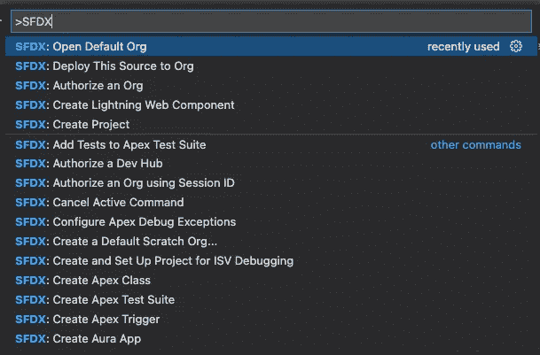
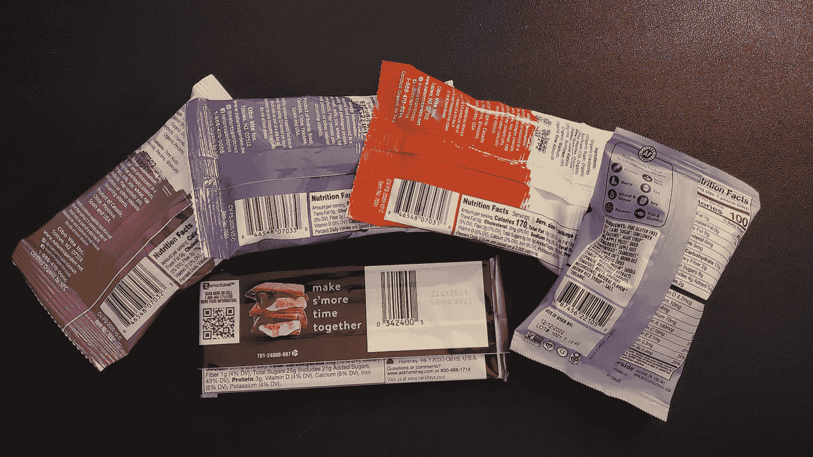
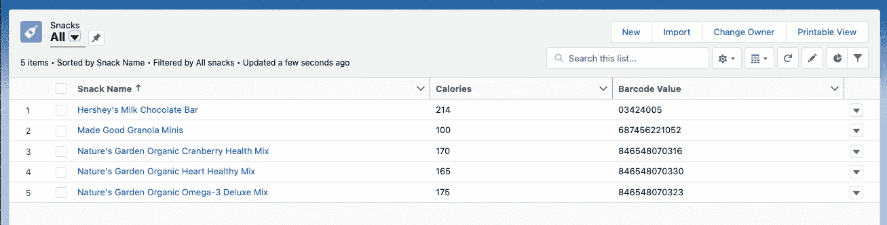
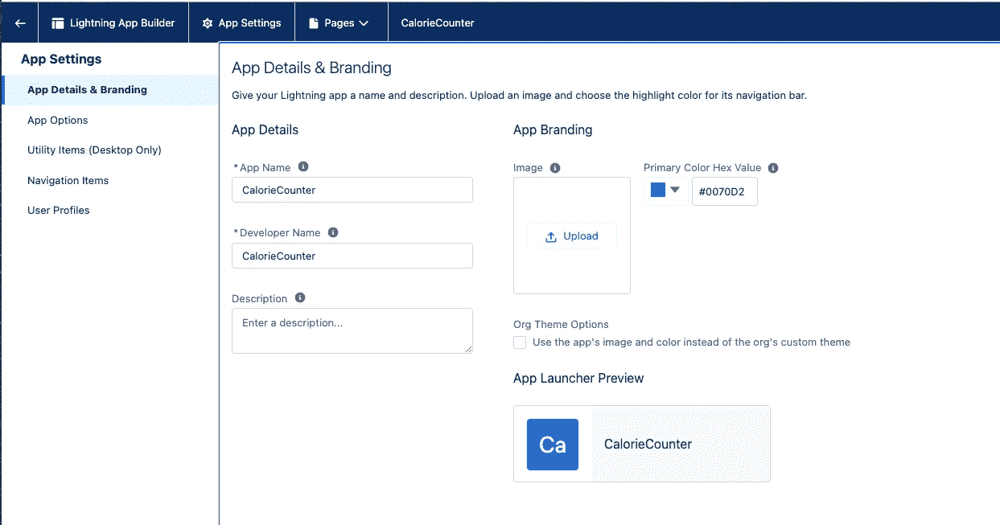
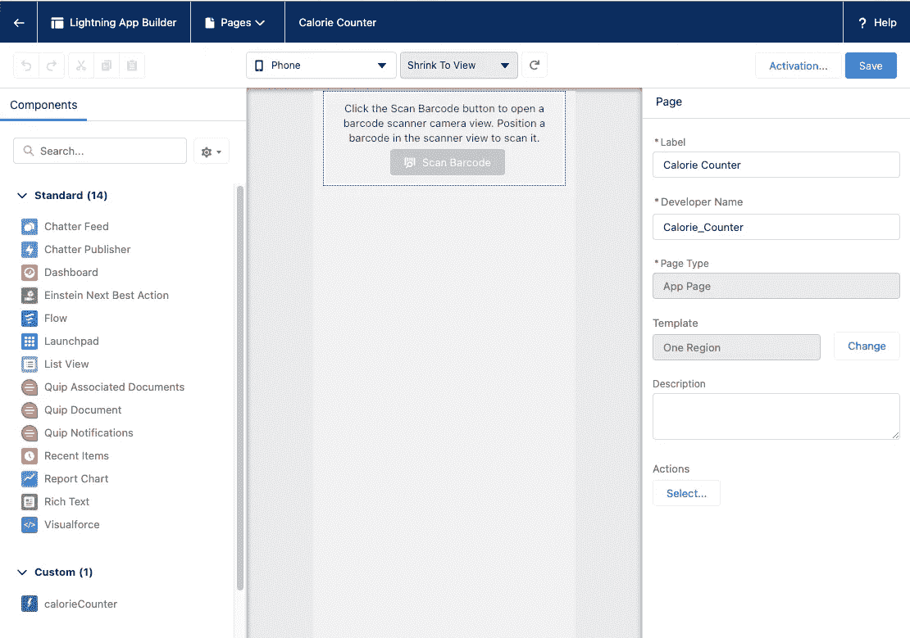
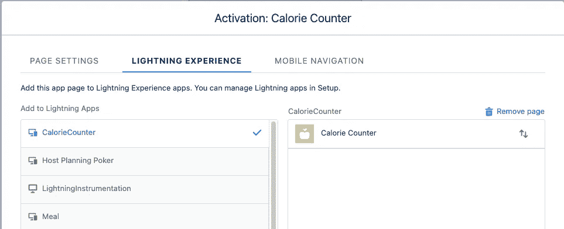
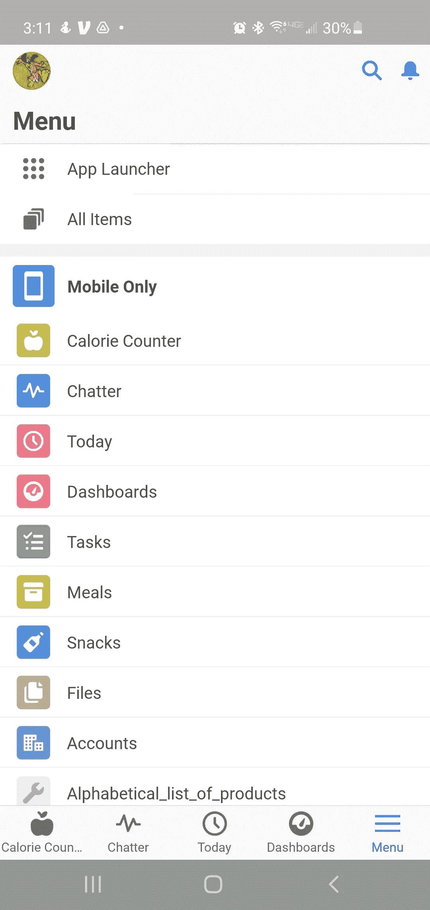
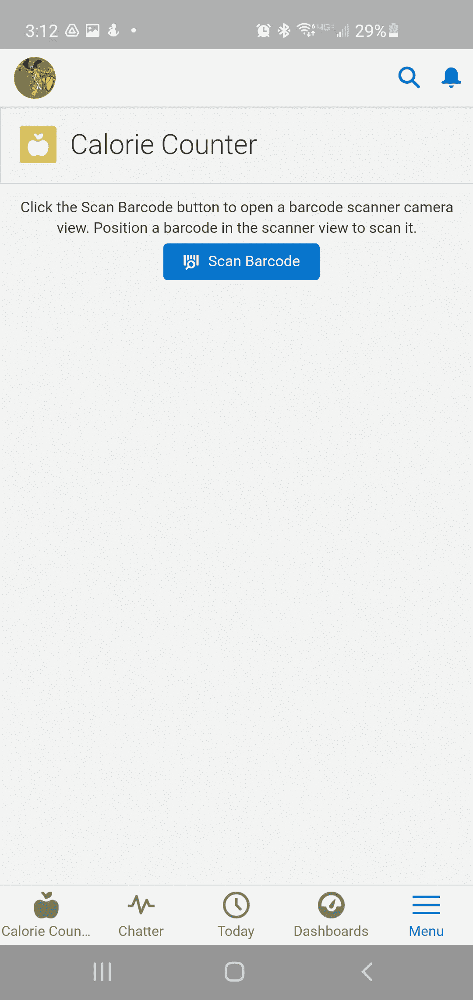
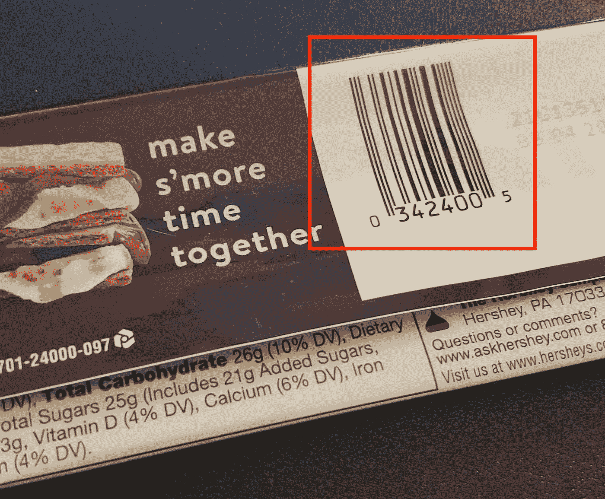
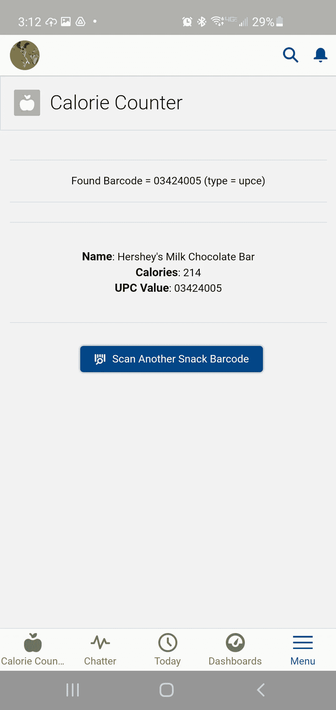

# 向 Salesforce 移动应用程序添加条形码支持

> 原文：<https://betterprogramming.pub/adding-barcode-support-to-a-salesforce-mobile-application-7ddebfb4c5ae>

## 在他的妻子质疑他的零食消费水平后，John 决定创建一个 Salesforce 移动应用程序来扫描零食的条形码


移动设备已经成为我们生活的核心部分。当然，这可能是一件好事，也可能是一件坏事。然而，出于本文的目的，我将关注移动设备丰富我们生活的积极方式。

事实上，当我上大四的儿子 Eric 来访时，我们的谈话经常会让 Eric 使用他的手机来定位和验证与我们的讨论相关的信息。最疯狂的是:无论我们谈论什么，他最喜欢的搜索引擎和语音转文本的技能几乎可以立即给出答案。

我对技术的使用甚至延伸到了节俭购物的方式，我可以扫描感兴趣的产品的条形码，看看同样的产品是否有更好的价格。这让我想知道如何轻松地将条形码技术实现到定制的应用程序或组件中。

# Salesforce 移动应用程序中的条形码支持

Salesforce 的工程团队知道，对于移动设备用户来说，条形码是一种快速简便的信息定位方式。UPC 条形码和 QR 码已经存在了几十年，它们的使用并没有减少。

使用 Salesforce 移动客户端和移动设备上的摄像头，条形码可以通过[条形码扫描器 API](https://developer.salesforce.com/docs/component-library/documentation/en/lwc/lwc.reference_lightning_barcodescanner) 轻松集成到应用程序中。以下是创建包含 BarcodeScanner API 的 Lightning Web 组件(LWC)的一些常见用例:

*   使用条形码作为主键，在 Salesforce 中执行查找。
*   通过读取二维码中的联系人数据自动填充表单数据。
*   使用条形码数据进行外部系统调用，例如通过第三方 API 跟踪货物。

在本文中，我将探索第一个选项，其中扫描的条形码对存储在 Salesforce 中的数据执行查找。

# Salesforce DX 和 VS 代码

Salesforce DX 使 Salesforce 平台上的开发变得简单、开放、集成和协作。借助 Salesforce DX，开发人员可以共同构建并持续交付。当与 [Visual Studio (VS)代码](https://code.visualstudio.com/)和 [Salesforce 扩展包](https://marketplace.visualstudio.com/items?itemName=salesforce.salesforcedx-vscode)结合使用时，与 Salesforce 一起工作就变成了无缝操作。

例如，Command-Shift-P 或 Windows-Shift-P 快捷键提供了对 SFDX 命令的快速访问，如下所示:



亲眼看到这些增强让我有机会使用 VS 代码和 Salesforce 扩展包为 Salesforce 平台构建一些东西。

# 卡路里计数器用例

我的热心读者可能还记得，我有机会在一个 100%远程的角色中工作。在这一周的大部分时间里，我和妻子妮可以及我们蹒跚学步的儿子芬尼一起住在家里。妮可非常认真地保持良好的饮食习惯，我对零食的热爱是我们之间的敏感话题。这基本上是 Nicole 认为我吃太多零食的一种很好的表达方式。

我注意到这些小吃中的每一种…


…有自己独特的条形码。



鉴于我目前的场景，我决定为名为卡路里计数器的 Salesforce 移动应用程序创建一个 Lightning Web 组件(LWC)。这个应用程序将使用 BarcodeScanner API 来读取 UPC，并为我选择的零食提供卡路里数。

从长远来看，我可以用这个逻辑来跟踪我的零食消费，帮助我保持在一个可接受的范围内。然而，现在，我们先走后跑。

# 创建小吃对象

为了简单起见，我在 Salesforce DX 中创建了一个`Snack__c`对象，它包含以下属性:

*   **名称**(已经存在于 Salesforce 中)来描述小吃
*   **卡路里**(如`Calories__c`)记录每份食物的卡路里
*   **条形码**值(如`UPC__c`)作为每个小吃的唯一键

使用我的零食(如上图),我可以快速输入这个用例的预期数据:



# 创造卡路里计数器体验

了解了我的数据结构和简单用例后，我概述了接下来的步骤:

1.  创建一个 LWC 来与 BarcodeScanner API 集成。
2.  如果条形码结果存在，则使用扫描值调用 Salesforce 中的 Apex 控制器。
3.  Apex 控制器使用条形码值调用`Snack__c`对象。
4.  如果扫描值存在`Snack__c`结果，则将对象数据返回给 LWC。
5.  LWC 在发出请求的设备上显示数据。

## 创建 Lightning Web 组件(LWC)

在 VS 代码中，可以使用 SFDX: Create Lightning Web 组件选项创建一个新的 LWC。我用了`calorieCounter`这个名字。

首先，我想确保我的新组件可以在 Salesforce 生态系统中的任何地方使用。我更新了`calorieCounter.js-meta.xml`如下图:

```
<?xml version="1.0" encoding="UTF-8"?>
<LightningComponentBundle ae mk" href="http://soap.sforce.com/2006/04/metadata" rel="noopener ugc nofollow" target="_blank">http://soap.sforce.com/2006/04/metadata">
    <apiVersion>53.0</apiVersion>
    <isExposed>true</isExposed>
    <targets>
        <target>lightning__AppPage</target>
        <target>lightning__RecordPage</target>
        <target>lightning__HomePage</target>
    </targets>
</LightningComponentBundle>
```

使用包含在[条形码扫描器 API 文档](https://developer.salesforce.com/docs/component-library/documentation/en/lwc/lwc.use_barcodescanner_in_a_lightning_component)中的以下信息，将条形码扫描器 API 添加到我的新组件中:

```
import { getBarcodeScanner } from 'lightning/mobileCapabilities';
```

接下来，我添加了以下方法来确定使用该组件的客户端是否可以扫描条形码:

```
 connectedCallback() {
        this.myScanner = getBarcodeScanner();
        if (this.myScanner == null || !this.myScanner.isAvailable()) {
            this.scanButtonDisabled = true;
        }
    }
```

最后，我添加了`handleBeginScanClick()`方法来从设备摄像头捕获条形码。然后，如果成功，结果将被传递到 Salesforce 中的 Apex 控制器，以尝试定位小吃。我还添加了简单的错误处理。

```
handleBeginScanClick(event) {
        // Reset scannedBarcode to empty string before starting new scan
        this.scannedBarcode = '';
        this.resultsFound = false;
        this.snackFound = false;// Make sure BarcodeScanner is available before trying to use it
        // Note: We _also_ disable the Scan button if there's no BarcodeScanner
        if (this.myScanner?.isAvailable()) {
            const scanningOptions = {
                barcodeTypes: [ 
                    this.myScanner.barcodeTypes.UPC_E
                ]
            };
            this.myScanner
                .beginCapture(scanningOptions)
                .then((result) => {
                    this.resultsFound = true;
                    this.scannedBarcode =  result.value;
                    this.scannedBarcodeType = result.type;findSnackByUpcEquals({ upcId: this.scannedBarcode })
                    .then((snack) => {
                        this.snackFound = true;
                        this.snackName = snack.Name;
                        this.snackCalories = snack.Calories__c;
                        this.snackUPC = snack.UPC__c;
                        this.error = undefined;
                        this.buttonLabel = 'Scan Another Snack Barcode';
                    })
                    .catch((error) => {
                        throw error;
                    });
                })
                .catch((error) => {
                    // Handle cancellation and unexpected errors here
                    console.error(error);
                    this.snackFound = false;
                    this.buttonLabel = 'Scan Barcode';// Inform the user we ran into something unexpected
                    this.dispatchEvent(
                        new ShowToastEvent({
                            title: 'Barcode Scanner Error',
                            message:
                                'There was a problem scanning the barcode: ' +
                                JSON.stringify(error) +
                                ' Please try again.',
                            variant: 'error',
                            mode: 'sticky'
                        })
                    );
                })
                .finally(() => {// Clean up by ending capture,
                    // whether we completed successfully or had an error
                    this.myScanner.endCapture();
                });
        } else {
            // BarcodeScanner is not available
            // Not running on hardware with a camera, or some other context issue
            // Let user know they need to use a mobile phone with a camera
            this.dispatchEvent(
                new ShowToastEvent({
                    title: 'Barcode Scanner Is Not Available',
                    message:
                        'Try again from the Salesforce app on a mobile device.',
                    variant: 'error'
                })
            );
        }
    }
```

简单组件 UI 的模板如下所示:

```
<template>
    <div if:false={resultsFound} class="slds-align_absolute-center slds-text-align_center 
        slds-text-color_weak">
        Click the Scan Barcode button to open a barcode scanner camera view. Position a barcode in the scanner view to scan it.
    </div><div if:true={resultsFound} class="slds-var-m-vertical_large slds-var-p-vertical_medium 
        slds-text-align_center slds-border_top slds-border_bottom">
        <p>Found Barcode = {scannedBarcode} (type = {scannedBarcodeType})</p>
    </div><div if:true={snackFound} class="slds-var-m-vertical_large slds-var-p-vertical_medium 
        slds-text-align_center slds-border_top slds-border_bottom">
        <div class="slds-m-around_medium">
            <p><span class="slds-text-title_bold">Name</span>: {snackName}</p>
            <p><span class="slds-text-title_bold">Calories</span>: {snackCalories}</p>
            <p><span class="slds-text-title_bold">UPC Value</span>: {snackUPC}</p>
        </div>
    </div><div class="slds-text-align_center slds-p-top_xx-small">
        <lightning-button variant="brand" class="slds-var-m-left_x-small" disabled={scanButtonDisabled}
            icon-name="utility:cases" label={buttonLabel} title="Scan a Snack"
            onclick={handleBeginScanClick}>
        </lightning-button>
    </div>
</template>
```

## 使用 Apex 控制器访问卡路里数据

卡路里计数器组件使用的 Apex 控制器设计也很简单，基本上包含一个 Salesforce 查询:

```
public with sharing class SnackController {
    [@AuraEnabled](http://twitter.com/AuraEnabled)(cacheable=true)
    public static Snack__c findSnackByUpcEquals(String upcId) {
        return [
            SELECT Name, Calories__c, UPC__c  
            FROM Snack__c 
            WHERE UPC__c = :upcId 
            LIMIT 1
        ];
    }
}
```

控制器从组件接收`upcId`，并将该值包含在`Snack__c`对象的查询中。结果集限于一条记录，该记录返回给组件。

# 通过 Salesforce Mobile 提供卡路里计数器

一旦准备就绪，我就可以使用 **Command-Shift-P** 和**SFDX:Deploy This Source to Org**命令将我的代码推送到我的 Salesforce 开发组织。这使得零食对象、卡路里计数器组件和 Apex 控制器可以在 Salesforce 中使用。

接下来，我在 Salesforce 中打开了**设置**透视图，并导航至**应用程序|应用程序管理器**页面。我点击了**新建 Lightning 应用**按钮，创建了一个名为`CalorieCounter`的新应用:



然后，我导航到**用户界面| Lightning App Builder** 屏幕。在这里，我创建了一个名为`Calorie Counter`的新**闪电页面**，它被设计成一个具有单一区域的**应用页面**。

在屏幕左侧，我可以在自定义部分看到我的`calorieCounter` LWC。我所要做的就是将该组件拖放到基于 Lightning 的页面的单个区域中。



保存组件后，我使用激活过程向客户展示 Lightning 页面。在激活阶段，我在`CalorieCounter`应用中添加了卡路里计数器闪电页面:



最后，我访问了**设置|应用程序|移动应用程序| Salesforce 导航**，并在所选应用程序顶部附近添加了**卡路里计数器**应用程序:


# 卡路里计数器在工作

下载并启动我的 Salesforce 移动应用程序后，我可以看到我刚刚创建的卡路里计数器应用程序:



接下来，我点击卡路里计数器应用程序，它显示了以下带有我的自定义 LWC 的屏幕:



我点击**扫描条形码**按钮，扫描好时巧克力的通用产品代码:



我的移动设备上的条形码扫描仪很快识别了条形码，并更新了卡路里计数器应用程序，如下所示:



几秒钟之内，我就能查到好时巧克力的卡路里，并决定这是不是我想吃的零食。(我是，我也是。)

# 结论

从 2021 年开始，我一直努力按照以下使命宣言生活，我觉得这可以适用于任何 IT 专业人士:

> *“将您的时间集中在提供扩展您知识产权价值的特性/功能上。将框架、产品和服务用于其他一切。”
> ——j·维斯特*

当使用 Lightning Web Components (LWC)和 BarcodeScanner API 时，将条形码支持引入定制应用程序的能力是非常简单的。在不到一个小时的时间里，我对条形码的了解从一个普通的扫描仪变成了一个开发人员，他只是将条形码集成到一个功能应用程序中。很明显，Salesforce 的工程团队正在开发解决方案，为常见挑战提供现实世界的价值……它们还帮助我实现了当前的使命。

在当今世界，消费者被他们在移动设备上能做什么和不能做什么所驱动。如果条形码技术有办法给你带来竞争优势，那么提供可靠条形码 API 的应用平台(如 Salesforce)应该在你的供应商候选名单上。

如果您对本文的源代码感兴趣，只需导航到 GitLab 上的以下资源库:

[https://gitlab.com/johnjvester/lwc-calorie-counter](https://gitlab.com/johnjvester/lwc-calorie-counter)

祝你今天过得愉快！