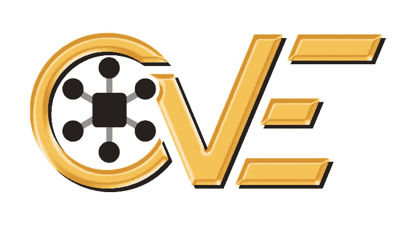
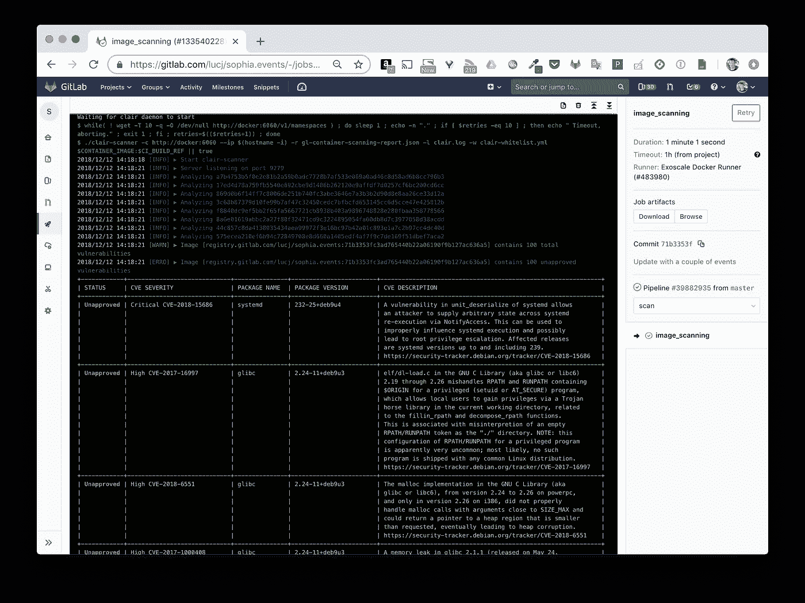
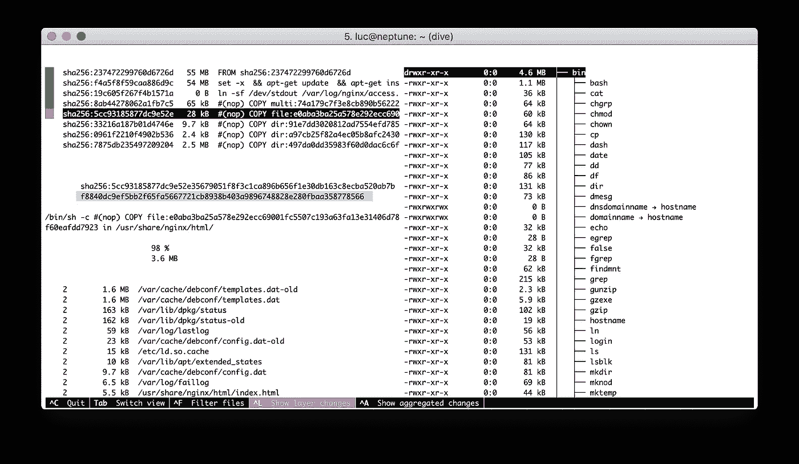
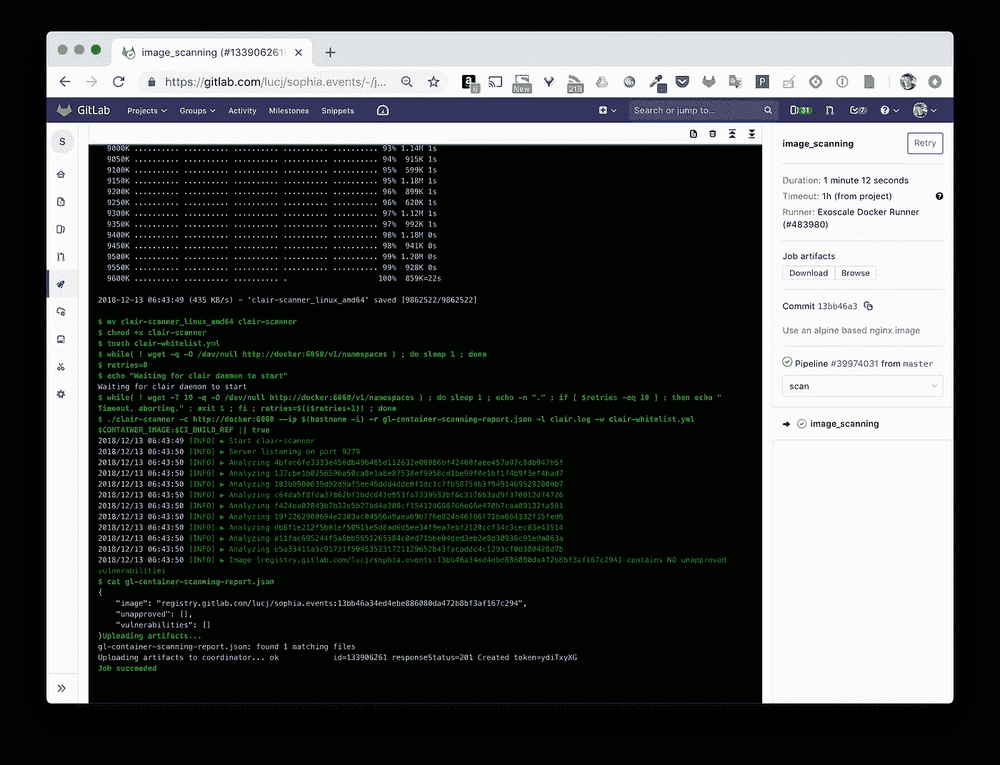
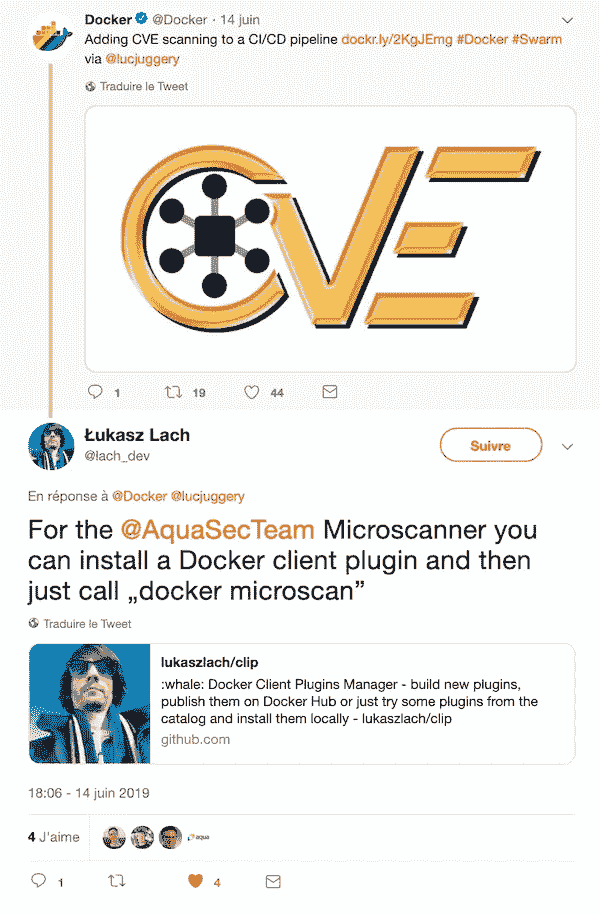
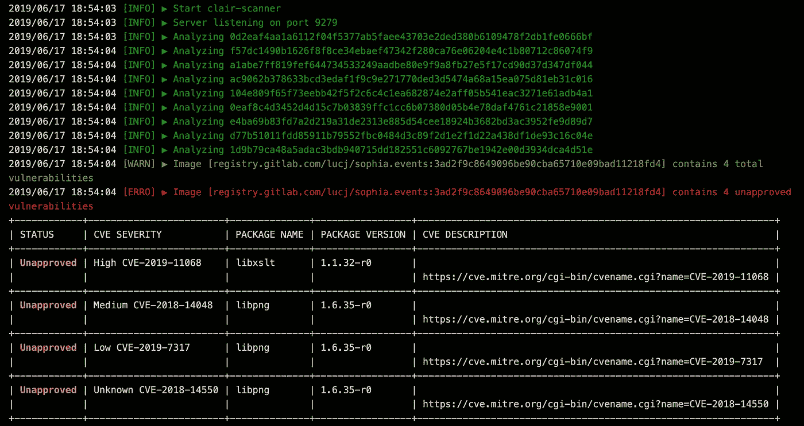
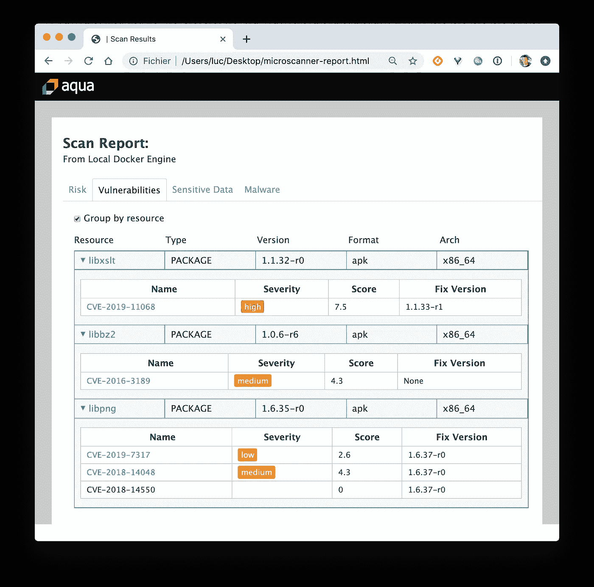

# 将 CVE 扫描添加到 CI/CD 管道

> 原文：<https://betterprogramming.pub/adding-cve-scanning-to-a-ci-cd-pipeline-d0f5695a555a>

图片来源——【https://cve.mitre.org/ 

# TL；速度三角形定位法(dead reckoning)

Docker 映像包含一个应用程序及其所有依赖项。因为它还包含操作系统的许多二进制文件和库，所以确保其根文件系统中不存在漏洞非常重要——至少没有关键或主要的漏洞。扫描 CI/CD 管道中的映像可以确保这一额外的安全级别。

# 一个简单的项目

在之前的一篇文章中，我详细介绍了我如何使用 [GitLab](https://medium.com/u/68f5136d3254?source=post_page-----d0f5695a555a--------------------------------) 、 [Portainer](https://portainer.io) 和 [Docker Swarm](https://docs.docker.com/engine/swarm/) 在一个非常简单的项目上建立 CI/CD 管道。

 [## 即使最小的次要项目也值得拥有 CI/CD 管道

### TL；速度三角形定位法(dead reckoning)

medium.com](https://medium.com/lucjuggery/even-the-smallest-side-project-deserves-its-ci-cd-pipeline-281f80f39fdf) 

该管道中定义了三个阶段:

*   第一个在 Node.js 代码上运行一些测试。
*   第二个构建一个 Docker 映像，并在 GitLab 注册表中发布它。
*   最后一个阶段使用 Portainer 的 webhook 特性在 Docker Swarm 上部署新映像。

TK *entrails*在此过程中构建的 Docker 映像是基于 Nginx 1.14 的，并且在没有对其内部进行任何验证的情况下立即部署。这可能是危险的，所以让我们看看我们如何能改善这一点。

# 向流水线添加图像扫描阶段

有几种图像扫描解决方案；商业和开源。在本文中，我们将使用[克莱尔](https://github.com/coreos/clair)和[克莱尔扫描仪](https://github.com/arminc/clair-scanner)；两个开源工具。

[git lab 的这份文件](https://docs.gitlab.com/ce/ci/examples/container_scanning.html)提供了添加一个专用于图像扫描的附加平台的所有说明。它基本上运行一个 Clair 服务器，提供现有的 CVEs，然后 clair-scanner 二进制检查在管道的前一阶段构建的图像的每一层。

我已经将附加内容添加到项目的`[.gitlab-ci.yml](https://gitlab.com/lucj/sophia.events/blob/master/.gitlab-ci.yml)`文件中。

注意:我只对文档中定义的阶段做了一些小的修改，所以它适合我的 GitLab runner 的版本(这在进行`artifact`上传时是需要的)。

添加了这个新的阶段后，让我们通过运行一个新的管道来看看它是如何进行的。下面的截图显示了这个新的 image_sanning 阶段的部分输出。

GitLab 管道的图像扫描阶段

我们可以在顶部看到，图像的每一层都进行了分析。

注:如果你想更多地了解一幅图像的内部，并以一种冷静的方式探索每一层，我强烈建议你看看[潜水](https://github.com/wagoodman/dive)。

 [## 瓦格德曼/潜水

### 探索 docker 图像中每一层的工具。通过在…上创建帐户，为 wagoodman/dive 发展做出贡献

github.com](https://github.com/wagoodman/dive) 

在 CI/CD 管道中构建的映像上运行 dive

回到 GitLab 输出，我们可以看到检测到 100 个漏洞。太多了！他们危险吗？嗯，根据*严重性*栏中的一些条目判断，可能是严重/高。

# 我们有很多弱点…现在怎么办？

嗯，除非你是一个安全人员，否则那些漏洞可能不会告诉你太多。尽管知道应用程序存在漏洞会引发很多问题:

*   我现在运行这个应用程序安全吗？
*   哪些漏洞我可以忽略，哪些我要认真对待？
*   我的应用程序不是面向用户的，和那些简历放在一起应该是安全的，对吗？即使是对重要的人？
*   如果我忽略这些简历，我的老板会知道吗？
*   我可以做些简单的事情来降低潜在的风险吗？

在某些情况下，实际上有一些简单的步骤会有很大的帮助，我们将在下面看到。

# 首先检查基础图像

我考虑的例子是一个简单的网站，发布了官方的`nginx:1.14`图片——在我写这篇文章的时候最后一个稳定的版本。由于 Dockerfile 使用多阶段构建，所以最终的映像不包含许多用于构建 web 资产的不必要的 Node.js 内容。docker 文件如下所示。

多阶段构建已经是一个很好的起点，因为它有助于减少图像的攻击面。但是，最终的`nginx:1.14`图像是基于 [Debian](https://www.debian.org/) 的，所以让我们改变它，使用`nginx:1.14-alpine`来代替。

注意: [Alpine Linux](https://alpinelinux.org/) 是一个小型发行版，它专注于安全性，暴露的攻击面非常小。使用从 Alpine 构建的基础图像可能是一个好的举措——我们将对此进行验证。

我们的多阶段 docker 文件的第二部分现在替换为以下内容。

让我们触发一个新的构建，看看它如何进行。

嗯，根据上面的截图，一切都很顺利。扫描阶段现在报告… 0 个漏洞！

# 更新:使用 Aquasec Microscanner

正如[ukasz Lach](https://twitter.com/lach_dev)在下面的 Twitter feed 中指出的， [Aquasec](https://www.aquasec.com/) 提供了自己的 CVE 扫描仪: [Aqua Microscanner](https://github.com/aquasecurity/microscanner) ，并且非常容易使用。谢谢你！

Microscanner 可以用不同的方式扫描图像:在图像创建过程中，或者在图像创建后。

## 构建图像时扫描

需要在 Dockerfile 中进行一些更改，以添加并运行 microscanner 二进制文件，这样它就可以分析已经构建的映像文件系统。

更新了 Dockerfile 文件以添加扫描步骤

该 Dockerfile 文件中的最后两条指令专用于扫描:

*   构建指令中需要提供一个令牌(官方文档 [Aqua Microscanner](https://github.com/aquasecurity/microscanner) 详细说明了如何获得这个令牌)。
*   microscanner 二进制文件被下载并针对正在创建的映像的文件系统运行。

这里使用了几个附加选项:

*   `--html`生成扫描的 html 报告
*   `--continue-on-failure`如果发现 CVE，不会返回错误代码，也不会停止 CI 工具的管道

## 图像建立后立即扫描

这可以通过添加专用于扫描的 done 文件来完成。下面提供了此 Dockerfile 文件的一个示例。

Dockerfile.microscanner

`FROM`指令指定将要扫描的图像的名称。接下来的两条指令与第一种方法中使用的指令相同(构建图像时扫描)。

为了说明第二种方法，我们将在 CI 流程中添加以下步骤。

微扫描器步骤。gitlab-ci.yaml

> **注意**:在同一管道中进行多次图像扫描是没有意义的，这里的目的只是为了说明如何进行这一次扫描，这也有助于在扫描解决方案之间做出选择。

然后我们可以触发一个新的图像构建，一旦图像构建完成，Clair 和 Microscanner 都会扫描它。

克莱尔扫描仪的结果

Aqua Microscanner 的结果

> **注意**:由于这个版本是在本文第一版发布几周后运行的，所以会发现一些以前没有的 CVE。

有趣的是:扫描的结果是不同的。克莱尔发现了 4 个 CVE，而水微扫描器发现了 5 个。这说明 CVE 扫描器的工作方式并不完全相同，例如，它们可能不能在相同版本的 CVE 数据库上运行，并且可能不能同样好地工作。

注意:为了更容易使用 microscanner，我们可以使用 Docker 客户端插件管理器(CLIP)。

 [## lukaszlach/clip

### whale: Docker 客户端插件管理器——构建新的插件，在 Docker Hub 上发布它们，或者从……

github.com](https://github.com/lukaszlach/clip) 

使用该工具，不再需要使用专用的 docker 文件进行扫描，因为安装 microscan 插件后，只需简单的" *docker microscan"* 命令即可触发该文件。

# 摘要

这篇短文说明了在现有的 CI/CD 管道中添加一个简单的图像扫描阶段并不复杂。这提供了额外的信息，例如图像包含的漏洞的数量和 id。

根据这些信息，仍然很难知道如何处理它们，但是使用从 Alpine 构建的基础映像是增强应用程序安全性的第一步，不需要了解太多关于 CVE 的信息。