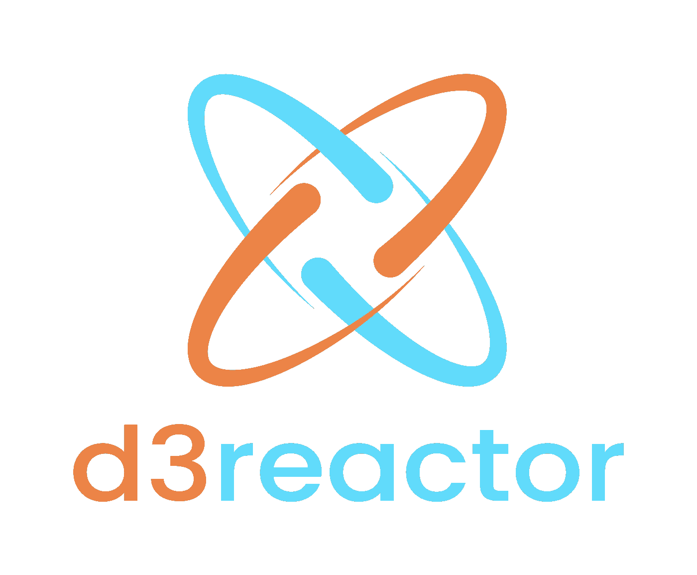
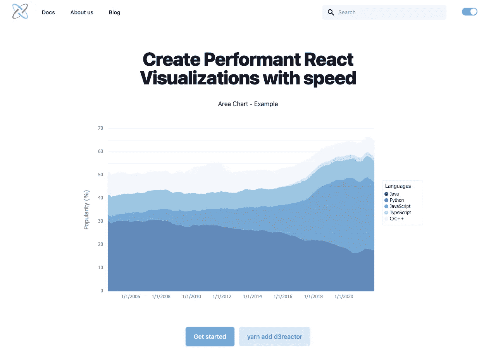
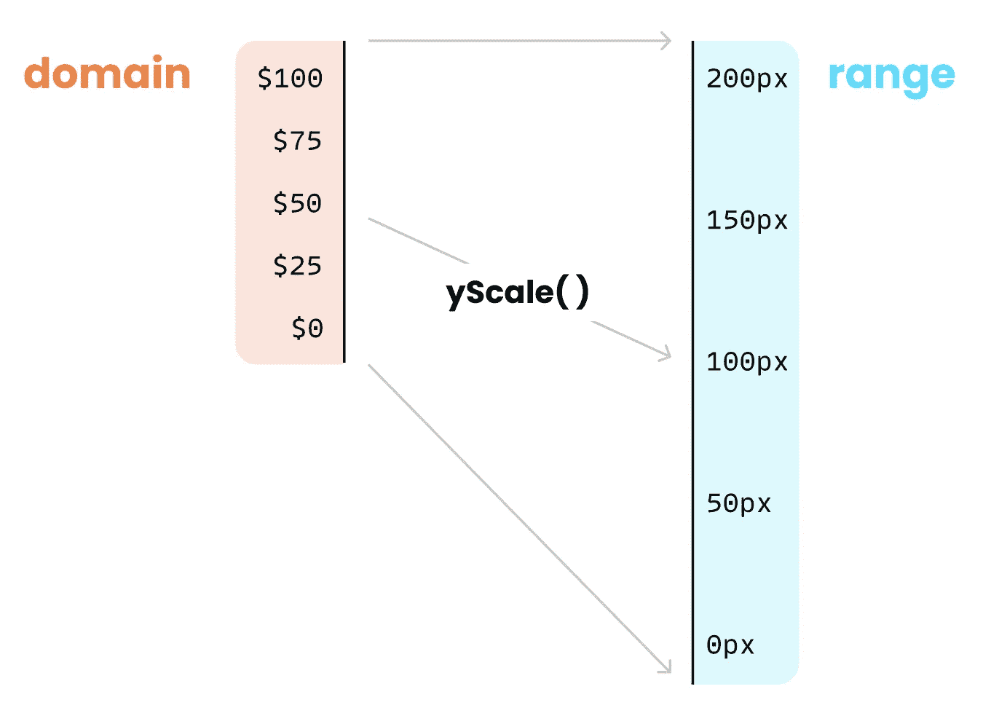
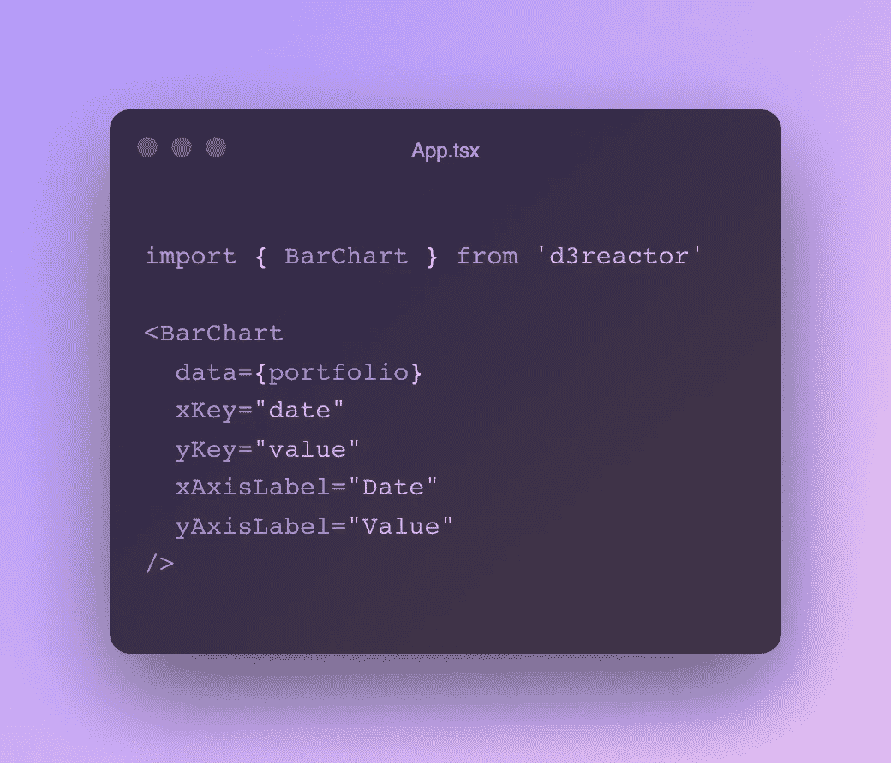
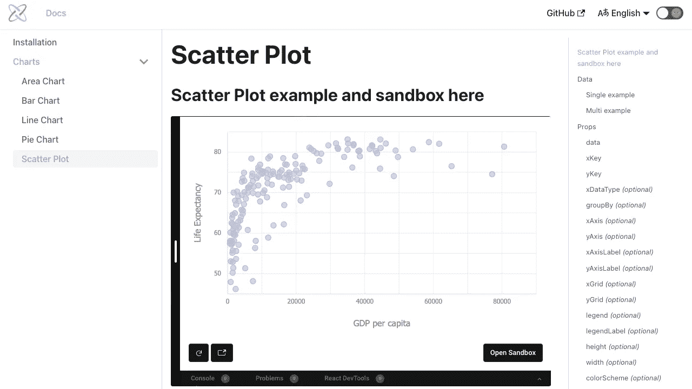
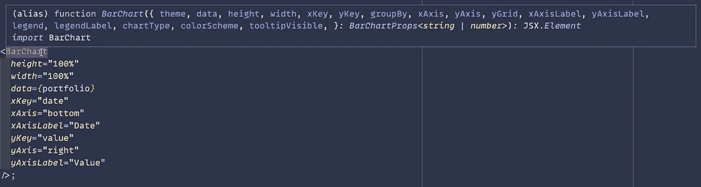

# 将 D3 数据可视化添加到 React 应用程序从未如此简单

> 原文：<https://betterprogramming.pub/adding-d3-data-visualizations-to-your-react-app-has-never-been-easier-2e80c9f2c712>

## D3Reactor 库初探

在过去的三个月里，一个由五名工程师组成的小组:[德米特里·伊尔绍夫](https://www.linkedin.com/in/dmitri-leroy/)、[欧查普](https://www.linkedin.com/in/eceiozalp/)、[特拉维斯·洛科特](https://www.linkedin.com/in/irbopia/)、[埃里克·马尔赫恩](https://www.linkedin.com/in/eric-mulhern/)和 [I](https://www.linkedin.com/in/robertcrocker/) 一直在努力开发一个新的开源数据可视化库，名为 [d3reactor](https://www.d3reactor.com/) 。

[D3 反应堆现场](https://www.d3reactor.com/)

这个新的 React + D3 库的灵感来自之前的 [OS Labs](https://opensourcelabs.io/) 项目 [React D3 库](https://react-d3-library.github.io/)。虽然受到之前工作的启发，但这是一个全新的尝试！今天我们很高兴与你分享🚀

> d3reactor 采用了 React 和 D3 (v6+)的最新特性，使得所有开发人员(不仅仅是数据可视化专家)都可以更容易地访问现代的、视觉上吸引人的和高性能的图表。

# 这一次有什么不同？

## 看不到类组件

Hooks 是在 3 年多前于 2018 年 10 月的 React Conf 上推出的。此时，他们已经完全被 React 团队和社区所接受。

虽然之前的项目仅仅依赖于类组件，但是采用功能组件的需求是显而易见的，因为钩子的[规则之一是它们只能在功能组件中使用。](https://reactjs.org/docs/hooks-rules.html)

通过完全包含功能组件，核心团队和贡献者可以利用钩子，将更多的周期花在保持同步的内容上，而不是如何保持同步。

钩子还帮助我们创建一个更容易理解的代码库，与类组件相比样板文件要少得多。再次，为我们的贡献者改善开发者体验。

此外，钩子允许我们将相关的代码组织在一起，并将每个组件中的关注点分开。

## 发挥每个图书馆的优势

因为 D3 和 React 都可以有效地生成、更新和删除节点，所以库的解耦是一个挑战。但是如果 React 是您的堆栈的一部分，您可能不希望其他库控制 DOM。

虽然 D3 通过它的 enter、update 和 exit 方法在更新 DOM 方面做得很好，但是 [React](https://reactjs.org/) 却因为能够让开发人员在应用程序状态改变时高效地更新和呈现正确的组件而声名大噪。

那么如果 React 在管理 DOM，D3 负责什么呢？

[D3](https://d3js.org/) 可以说是最流行的 web 数据可视化库。虽然我们目前只使用了 D3 提供的一小部分，但我们充分利用了 D3 的缩放功能。这些函数使得将抽象数据映射到像素位置甚至十六进制代码变得简单。

受 Fullstack D3 和数据可视化的启发— Amelia Wattenberger

我们还继续利用 D3 的[生成器](https://github.com/d3/d3-shape)和[数组](https://github.com/d3/d3-array)方法来从结构上转换数据，并将数据翻译成 SVG 元素的定义。

要不要负责写下图中返回“d”属性的函数？

谢天谢地，D3 优雅地处理了这个操作，对此我们永远心存感激🙏

# 有什么好激动的？

## 一开始就有 10 张图表

我们的发布有一个强大的功能丰富的图表核心，如:

*   [酒吧](https://www.docs.d3reactor.com/docs/Charts/bar-chart)
*   堆积条形图
*   [线](https://www.docs.d3reactor.com/docs/Charts/line-chart)
*   多线
*   [区域](https://www.docs.d3reactor.com/docs/Charts/area-chart)
*   堆叠区域
*   [散点图](https://www.docs.d3reactor.com/docs/Charts/scatter-plot)
*   多散点图
*   [馅饼](https://www.docs.d3reactor.com/docs/Charts/pie-chart)
*   油炸圈饼

## 声明性组件

在 React 风格中，我们的图表完全是声明性的。你把道具传进去，剩下的就交给图书馆了。

创建带轴和工具提示的条形图所需的所有代码是:

而要从条形图变成面积图，你要做的就是把“条形图”改成“面积”。

其他数据可视化库要么让您编写 D3 代码复制并粘贴到 React 组件中，要么要求您从它们各自的子组件中合成图表。

通过将 D3 代码复制并粘贴到 React 应用程序中，您很可能会遇到哪个库控制 DOM 的冲突。这比通读文档来学习子组件是如何组成的要严重得多，但是我们希望全面改善体验。

在你用 d3reactor 创建了一些图表之后，你可能甚至不需要[文档](https://www.docs.d3reactor.com/docs/intro)，这要感谢我们组件的声明性和直观的道具。

[d3reactor docs 网站](https://www.docs.d3reactor.com/docs/intro)

## 完全用打字稿写的

现在很清楚，我们是考虑到开发人员社区才创建这个库的。

在 React with D3 中使用 [TypeScript](https://www.typescriptlang.org/) 的少数人知道这个堆栈会造成多大的压力，但是我们认为这对这个开源项目的寿命是最好的。

通过从一开始就完全采用 TypeScript，我们被迫仔细考虑传递给图表组件的数据的类型和结构。另外，您可以获得开箱即用的类型注释的全部好处。

条形图类型注释

## 更多

我们的图表不仅简单明了，类型齐全，而且:

*   应答的
*   表演的
*   SSR 友好，支持在基于 React 的框架中使用，如 Gatsby 和 Next.js
*   自带工具提示和图例
*   15 种颜色可供选择
*   Jest 和 Cypress 测试已经就绪
*   为黑暗做主题🔦和灯光模式😎

# 接下来会发生什么？

d3reactor 团队将维护这个库，并夯实最初的基础。虽然毫无疑问有代码需要清理，但基本内容还是不错的。

我们将:

*   通过渲染到画布提高大型数据集的性能
*   提高图表对更动态 UI 的响应能力
*   添加附加图表
*   允许用户添加自定义配色方案
*   使用样式化组件进行表面主题化
*   添加动画。交互式样式和渐变
*   …以及更多

把这看作是对你的邀请，让你贡献、尝试、提供反馈、公开问题，并帮助指导这个新的 React + D3 库的未来开发；`d3reactor`。

感谢您的阅读。