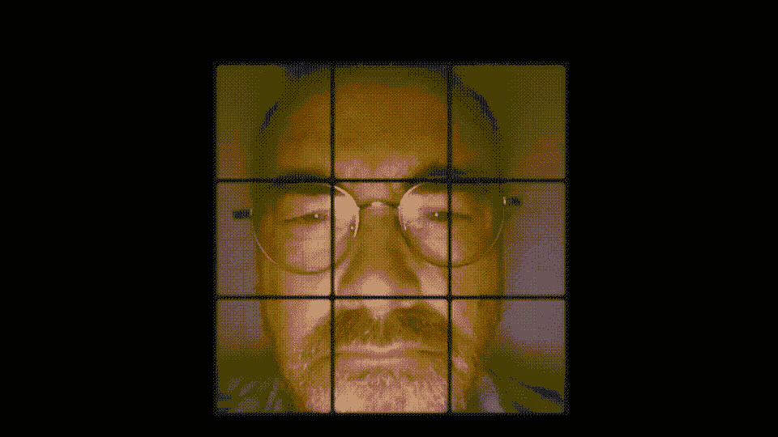
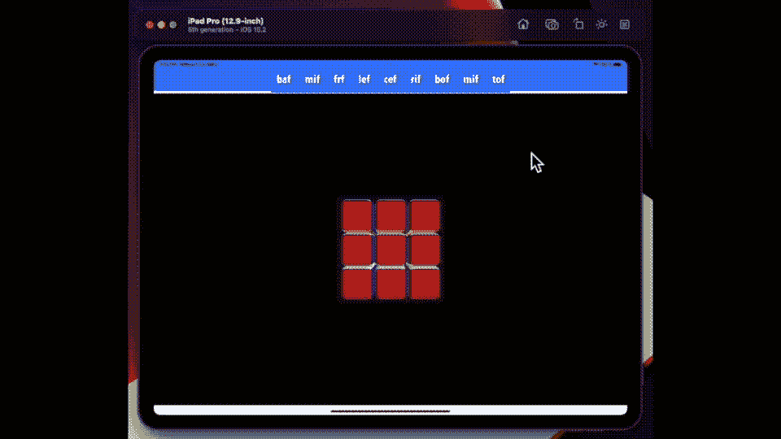
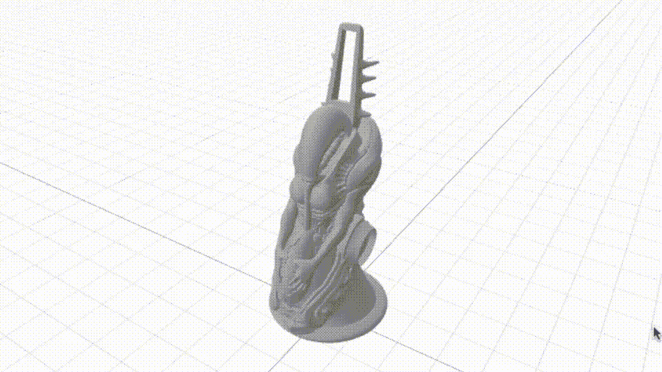

# 向 SwiftUI Rubik Cube 应用程序添加手势

> 原文：<https://betterprogramming.pub/adding-gestures-to-your-swiftui-rubik-cube-app-12ed853ce0aa>

## 构建魔方系列的第 3 部分



一个魔方，你的魔方真实地映射到每个面上，在这个项目中变得越来越模糊…图片由作者提供

最后一个挑战——我的目标是尝试引入一种更自然的方法，使用手势而不是按钮来解魔方，就像我在上一篇文章中结束的那样。我花了一个多星期才适应的长途旅行。
我想我体会到了托马斯·爱迪生(他发现了一千种不做电灯泡的方法)试图把事情做好的感觉，他提出了四种几乎行得通但行不通的解决方案。

# 挑战和解决方案

## 阻力

因为我想在 SwiftUI 中使用 SceneView，所以第一个挑战是让`CameraOrbit`工作。

我最初使用一个带有一些共享属性的 singleton 来启动和运行它。但是在这样做的时候，我发现自己看到了来自控制台的一连串警告。

关于访问视图上未安装的`StateObjects`的警告。我需要的是推而不是拉。

我用一个订阅解决了这个问题，这个订阅通过一个使用 Combine 框架的方法发送值来移动相机的轨道。我用这三条线做了一个设置。

```
let passDrag = PassthroughSubject<(CGPoint,CGSize),Never>()
var sub2: AnyCancellable!sub2 = passDrag.sink(receiveValue: { (translation ) in
  self.setCamera(translation: translation)
})
```

更改摄像机位置视图本身的实际代码如下所示。

我试着旋转立方体本身，因为我觉得数学可能会简单一点。但是它有一个不幸的副作用，破坏了我在本系列第二部分中概述的解决方案，在我这样做之后，节点位置的匹配失败了。

我还需要向应用程序发出信号，表明我没有旋转立方体，而是要求它旋转其中的元素——这是由 lockView 变量指示的状态。我使用一个已发布的对象或通过订阅再次尝试，最终发现后者更好。发布的对象有点太慢了。

## 热门歌曲

我偶然发现的这个解决方案。问题是，由于我没有在我的`Scene`中使用触摸事件，我需要利用一种方法通过拖拽获得位置。为了解决这个问题，我使用了一个 singleton 来存储点击。然后，我设置了一个计时器来定期检查事件队列——这是我的目标——阻止应用程序让界面上的事件超载。

## 动作

让手势自然地工作是这个项目最具挑战性的方面——当然，我有使用阴影节点来制作运动动画的解决方案——但是我还需要更多。几天过去了，我才意识到我在尝试一件不可能的事情。你看——你在每个角落有六个动作，但只有三个面。最初，我尝试使用拖动方向；但是因为你可以向任何方向移动立方体的轴，这是一个昂贵的(浪费时间)错误。我试着标记立方体来追踪你击中了哪个，但是它也没有通过轴测试。

我试着研究欧拉角视角。尽管如此，这是一个不直观的解决方案，也是一个次等的解决方案——有后效——给人的印象是只有一半的时间在工作。

我想这是第四天——当我想到如果我让用户拖动一个盒子的两边，我可以决定他们希望盒子向哪个方向移动时，我几乎准备好承认失败了。我早在几天前就应该想到一个显而易见的解决方案。

我遇到的唯一问题是几何指数，手册页会告诉你你击打的哪一侧似乎不太可靠。幸运的是，我在 SO 上找到了这个替代方案[和我的阴影解决方案一样，只有在不旋转使用它的节点时才有效]。

现在我开始工作了——我需要做的就是查看命中数组中的第一个和最后一个条目，以检查立方体中的哪些盒子是您开始拖动的，然后结束拖动的——然后我平移两边，我必须移动正确的盒子集合。
通过拖动多个面来确定我需要旋转哪个节点。

现在我开始工作了——我需要做的就是查看命中数组中的第一个和最后一个条目，以检查立方体中的哪些盒子是您开始拖动的，然后结束拖动的——然后我平移两边，我必须移动正确的盒子集合。



使用在多个面上拖动来测试我需要在哪个节点上旋转

## 最后一招

但是等等——这里有一个我没有提到的技巧——一个对 SceneKit 有效的技巧，但是我知道我会对 SwiftUI 失败。当然，这是一个可怕的轴问题，事实上，当你开始在立方体内旋转盒子时，你碰到的边缘的读数停止工作——当然，这就是为什么魔方如此难以解决。

诀窍是创建另一个阴影立方体，它比我第一次击中的略大，一个我没有移动任何东西的立方体——也就是说，我可以确定如果我击中红色的脸，它上面的那个将是白色的脸。当然，在引擎盖下，我会使用这些信息来移动可见的立方体。所以以一种迂回的方式，同样的事情来解决轴的问题，找出我需要在哪个节点上旋转。

这就把我带到了这篇文章的结尾，实际上是魔方系列，至少现在是这样。如果你还没有读完第 1 和第 2 部分，你应该回去读一下[这里](/build-a-rubik-cube-using-sceneview-and-swiftui-dea9e622ef43)和[这里](/adding-realistic-movement-to-your-rubik-cube-da287dfaf69b)。

## 表面

在立方体的表面上使用你的只是一个合适的乐趣，虽然非常费时。为了做到这一点，我给每个盒子一套自己的材料，将我的六张照片切成 9x9 的小块，并分别映射到每个盒子上。这是一个问题，我相信我可以编码一个真正的解决方案；我的映射是用试错法完成的。

无论如何，现在足够的魔方，保持密切合作；我的下一个任务是建立一个基于 SceneKit 的外星人象棋游戏，使用我从这个网站下载的这些优秀的 Giger 风格的模型。这个是女王。



一个国际象棋模型，从 cgtrader 下载，由 [themerces](http://2@gmail.com) 设计

一个国际象棋模型，从 cgtrader 下载，由 [themerces](http://2@gmail.com/) 设计