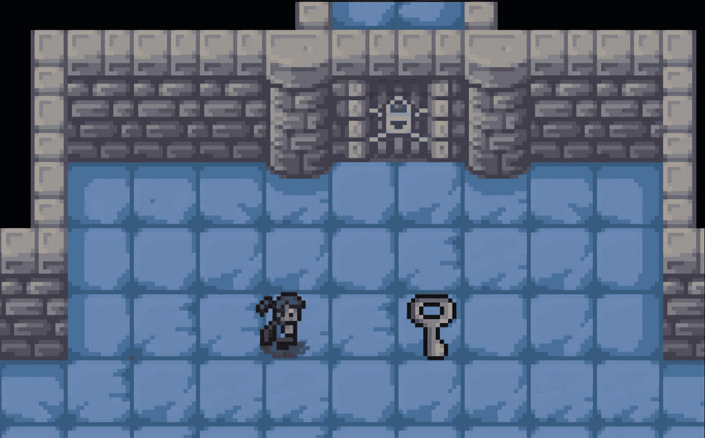
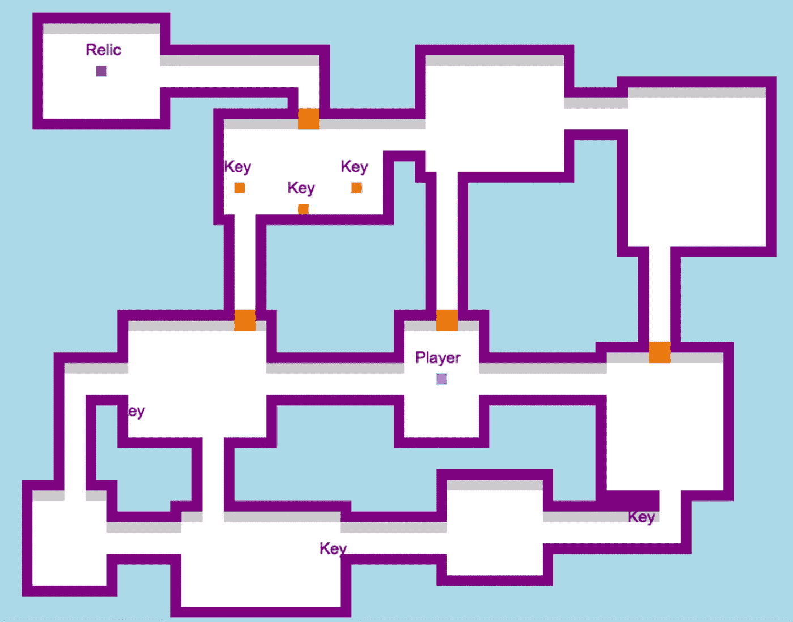
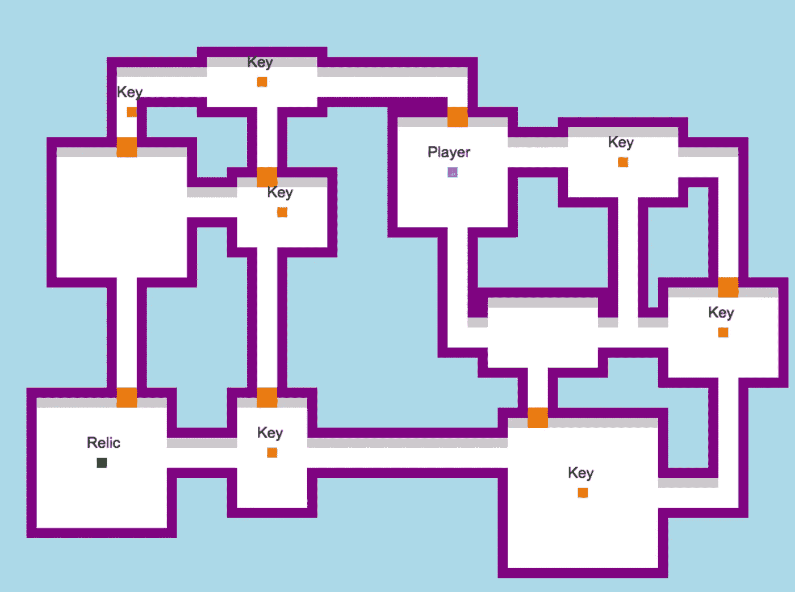
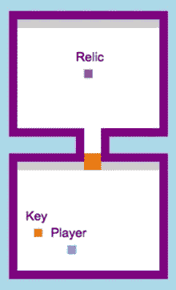
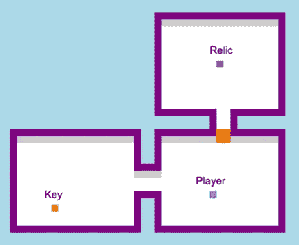
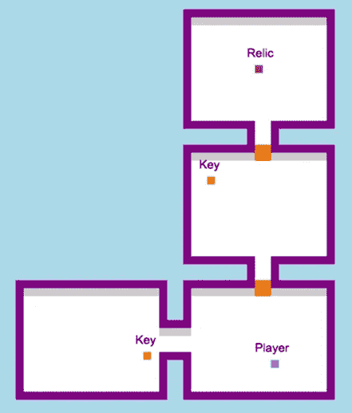
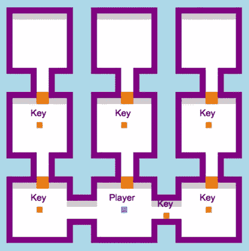
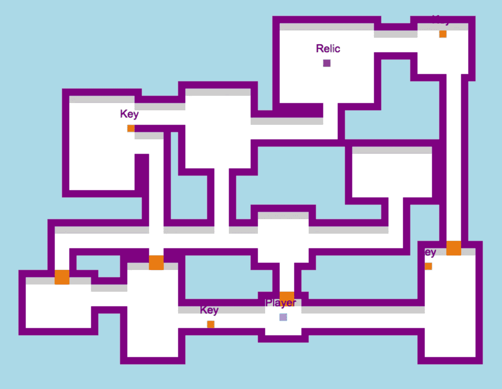
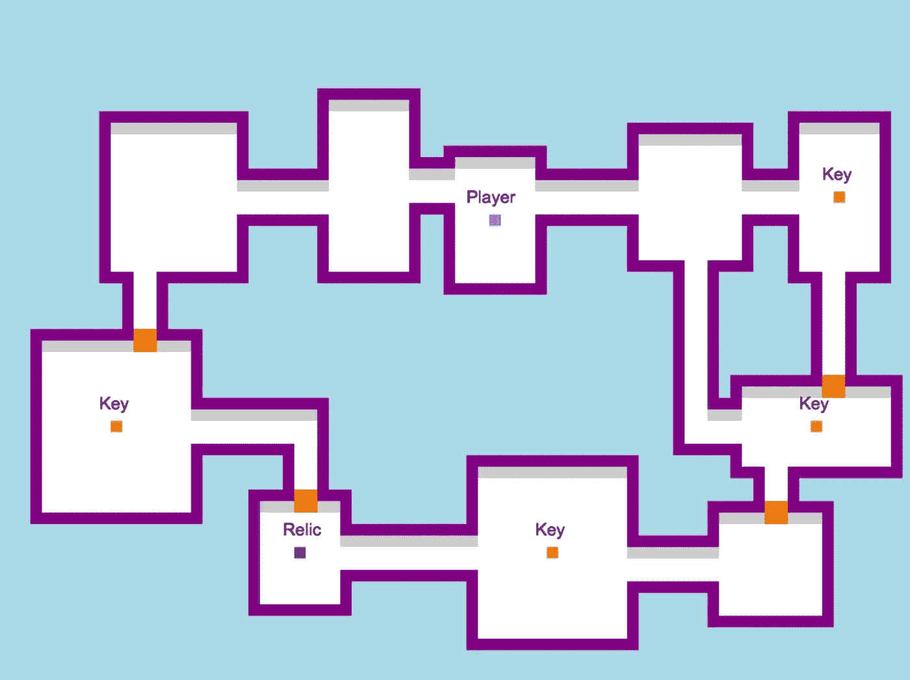

# 将按键位置添加到 JavaScript 脚本中

> 原文：<https://betterprogramming.pub/adding-key-placement-to-a-javascript-roguelike-755892968303>

## 我们能不能写一个算法，让所有房间都无障碍？

[杰森·D](https://unsplash.com/@jasondeblooisphotography?utm_source=unsplash&utm_medium=referral&utm_content=creditCopyText)在 [Unsplash](https://unsplash.com/s/photos/skeleton-key?utm_source=unsplash&utm_medium=referral&utm_content=creditCopyText) 上的照片

在大多数电子游戏中，任何关卡都应该允许玩家达到目标。虽然这听起来很明显，但在 roguelike 中说起来容易做起来难，因为级别是按程序生成的。虽然在建造*朗达尔的盗贼*的早期阶段，让每个关卡变得可解从来都不是问题，但在添加了门和钥匙之后，这就成了一个挑战。本文讨论了一系列的测试和改进，这些最终导致了我目前的密钥放置算法。

# 了解方向

下面是正在进行的游戏的快速截图。

至少这把钥匙很容易找到。

到目前为止，这个游戏中的每个关卡都是按程序生成的，包括以下内容:

*   由走廊相连的房间
*   锁着的门
*   小钥匙
*   敌人
*   一个遗迹，必须找到它来完成

游戏中的钥匙被称为“小钥匙”，因为任何钥匙都可以打开任何一扇门，而且每把钥匙只能使用一次。下面是玩家用两把钥匙开门的快速剪辑。

快速游戏动画

因为玩家最初被锁定在许多区域之外，所以算法不能随机放置这些钥匙——否则，钥匙可能会出现在太多尚未进入的房间中，玩家可能无法完成这一关。

在玩了几个玩家被锁定的关卡后，我决定写一个按键位置不那么随机的逻辑。我的目标是把钥匙放在一个无论开门和收钥匙的顺序如何都能进入所有房间的地方。这种方法需要(1)鸟瞰地牢和(2)大量的测试。

# 地图生成器

除了测试实际的游戏，我还建立了一个地牢地图生成器，让我一眼就能看到一个总体水平。这张地图有游戏控制和碰撞检测，所以我可以通过移动玩家来测试给定的等级，并试图将自己锁在特定的房间之外。

如下图所示，玩家在收集到一把钥匙后可以打开一扇门。当玩家触摸门时，门通过消失打开，玩家的钥匙数减一。

用地图生成器测试等级。

在整个游戏开发过程中，这个工具已经成为调试关卡和找到算法需要处理的边缘情况的有力盟友。例如，在测试了下面的地图后，我可以用特定门上的 up 键把自己锁在外面。结果我没能完成关卡，所以我知道我必须调整算法。

被封锁的场景。没有金色瓷砖的“钥匙”标签表明钥匙曾经在哪里。

经过大量的开发和测试，我的关卡开始看起来更像下面的一个，这里的键以一种防止锁定的方式分布。

一张样本地牢地图。

# 单元测试

因为给定的钥匙可以用在任何门上，所以我必须编写钥匙放置逻辑，以便玩家可以按任何顺序收集钥匙和开门，同时仍然能够完成游戏。

虽然游戏每次都会生成不同的关卡，但我写了一些测试关卡，按键放置逻辑会根据这些关卡进行操作。这样，我可以在相同的情况下重复测试按键的位置。由于玩家的起始位置决定了最初可以使用的钥匙和门，所以每次将玩家放在相同的位置也变得很有帮助。

下面是我运行的几个关键测试，从简单开始，逐渐变得复杂。

## 双室测试

在下面的两个房间的测试中，我只是把一把钥匙放在玩家可以直接拿到的地方。为了战胜这一关，玩家必须获得钥匙，打开门，并获得圣物。这个简单的关卡帮助我测试基本的按键布局。

两个房间的测试。

## 用洪水填充放置钥匙

为了放置这个键，我从一个简单的算法开始，这个算法通常被称为 flood fill。这种淹没填充操作是递归的，因为它涉及一个调用自身的函数。下面是它的工作原理:

1.  从玩家的位置开始。
2.  直接选择上面、下面、左边和右边的瓷砖。
3.  检查每个瓷砖。如果给定的瓷砖是地板砖，将其坐标添加到可能放置钥匙的瓷砖列表中。如果没有，停止。
4.  对于找到的每块地砖，以地砖的坐标为起点，重复步骤 2。

最后，该算法有一个很好的列表，玩家可以从中选择所有可以访问的瓷砖。

在通过了两个房间的测试后，我又扩展到了三个房间的测试，注水法又一次奏效了。

三间房测试。

下面的四个房间的测试有点棘手，因为仅仅使用播放器作为起点是不够的。我想把第二把钥匙放在新进入的房间的某个地方，而不是最初的两个房间，所以我需要算法来识别玩家在打开第一扇门后会在哪里。

四个房间的测试。

## 按位置对门进行分类

下面是我如何调整自己的逻辑通过上面的测试。

1.  我把玩家放在两个底层房间中的一个里，并按从低到高的顺序对门进行排序。
2.  为了放置最低门的第一把钥匙，我将基于玩家的起始位置运行 flood fill。
3.  为了找到上面的下一个键，我会在第一扇门的另一边选择一个起始位置，然后再次运行 flood fill 来找到一组有效的坐标。

对于上面这样的简单关卡，这种方法根据玩家能够到达的区域给了我放置钥匙的可能区域。但现在不是过于自信的时候。一旦关卡变得更加复杂，我就需要一个不依赖于每扇门的 y 坐标的更复杂的算法。

下面的测试，被称为叉子测试，从一张纸上开始。我想试着做一个分支成三条路径的地牢，并且有一些对齐的门。由于增加了复杂性，让键放置在这里工作需要做一些更改。

## 外出工作

最终用于 fork 测试和其他复杂关卡的算法有一个重要的区别:它不是首先选择最低的门，而是选择玩家可以立即进入的门并向外工作。和洪水填充操作一样，这个过程也是递归的，但是作用于整个地下城，而不是一个特定的区域。

1.  用玩家的位置作为你的起点。
2.  运行洪水填充，收集(1)该区域所有可进入地板砖的列表和(2)所有可进入上锁门的列表。
3.  对于发现的每个上锁的门，检查是否有钥匙。
4.  如果门需要一把钥匙，从列表中选择一个可使用的地砖来放置钥匙。
5.  将该门的`hasKey`变量设置为`true`。
6.  在这门的*另一侧*设置一个起点。
7.  重复这个过程，寻找可接近的瓷砖和附近的门。
8.  继续操作，直到每扇门都有一把钥匙。

这让我可以把玩家放在任何地方，而不是总是放在底部，为关卡类型提供了更多的可能性。

左边的钥匙不需要这么近！

# 风雅

因为给定键的坐标是从可用的自由空间集合中随机选择的，所以这些键经常离玩家太近——所以最终我引入了几个对远处房间的偏好，房间中央的键，以及每个房间一个键。

为了将关键点放在更具挑战性的位置，我编写了尝试将关键点放在离起点最远的瓦片上的逻辑。这一步的方法如下:

1.  获取可用图块坐标的列表。
2.  将这些坐标从离起点最远到最近排序。
3.  迭代坐标。对于每一个，确定它所在的房间。
4.  如果那个房间还没有玩家、钥匙或遗物，把钥匙放在中间。
5.  如果找不到房间，对走廊重复这个过程。
6.  如果找不到没有物品的走廊，只需选择列表中最远的第一个瓷砖。

在下面的地图中，你可以看到算法努力将最容易接近的钥匙放在离玩家相对较远的房间中。因为在前两个锁上的门之后，可用的房间更少，所以其他的钥匙更容易拿到。

# 后续步骤

说实话，有些钥匙还是很容易找到的。因此，为了让游戏更具挑战性，下面是一些塞尔达启发的想法，告诉你接下来该怎么做。

*   将钥匙交给房间里的敌人或非玩家角色(NPC)。无论哪种方式，玩家都必须付出更多的努力来获得它。
*   把钥匙藏在一个容器里，比如箱子或罐子。
*   当房间里的所有敌人都被击败，或者当房间里的一个谜题被解决时，使钥匙出现。
*   限制给定地牢中钥匙的数量，这样它们就可以在不同的等级间均匀分布。

我现在有一个算法，它通常在避免锁定的同时放置密钥，有时，很难找到密钥。

我希望你喜欢这篇开发日志，并从中获得一些可以用于编程或游戏开发的东西。日安！

## 信用

*   玩家和门精灵是由 [o_lobster](https://o-lobster.itch.io/) 的塞尔达精灵包中的精灵进化而来的。
*   地牢瓷砖来自 [TMT Art](https://www.facebook.com/TMT-Art-collection-405885289760848/) 的瓷砖套装。

 [## 建造一个更好的地下城关卡

### 我如何更新算法以更好地匹配图形。

better 编程. pub](/building-a-better-dungeon-level-b04d133a6ca)