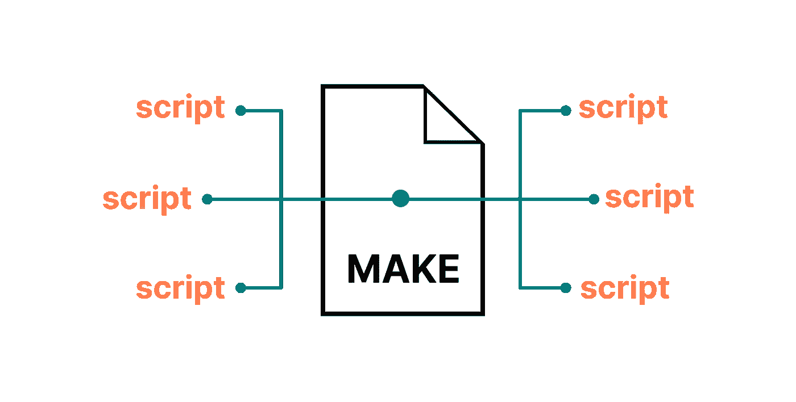
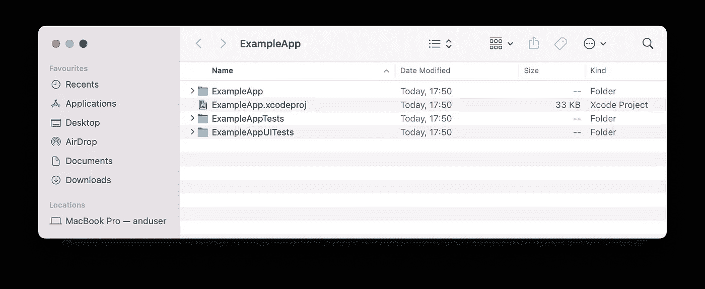
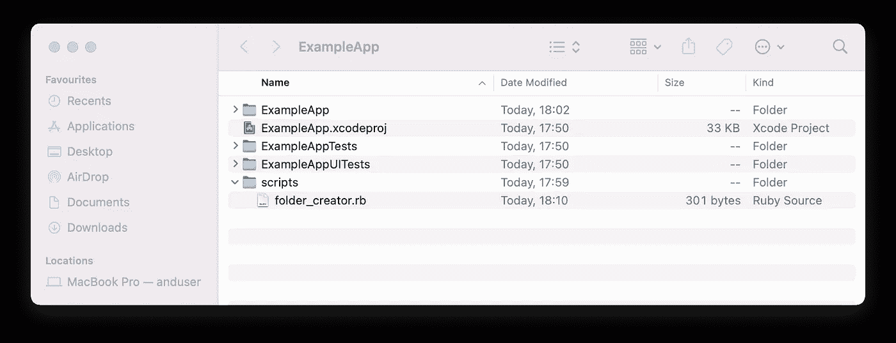
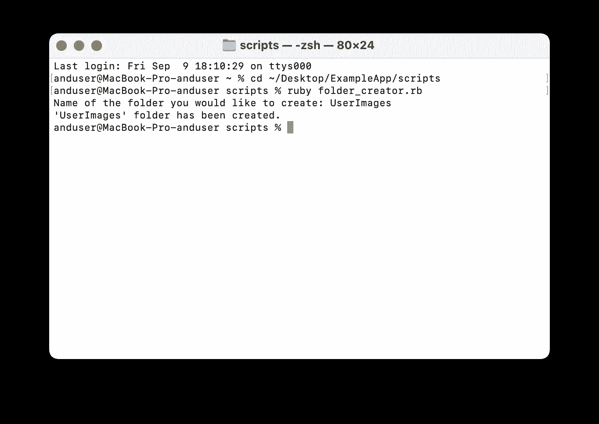
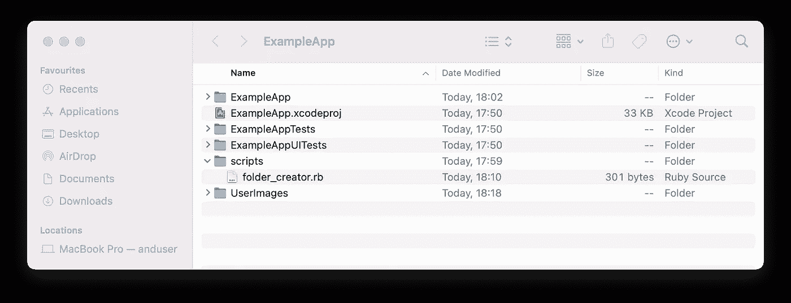
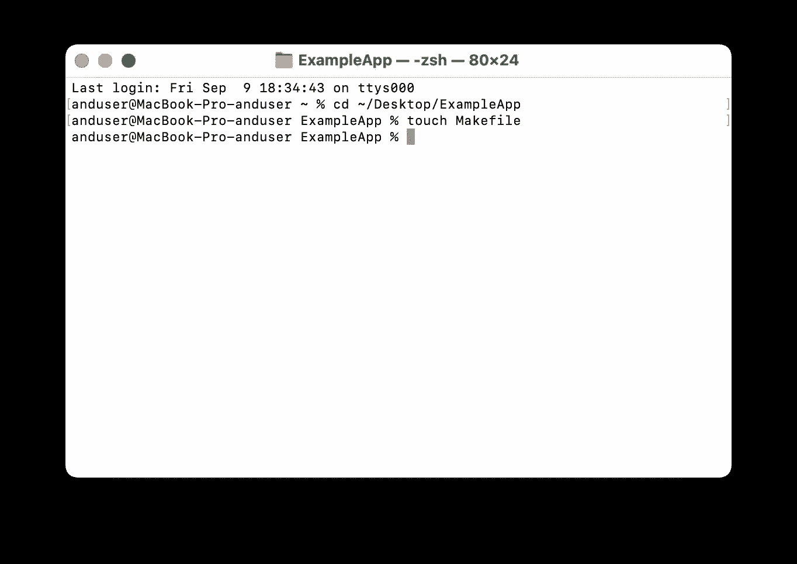
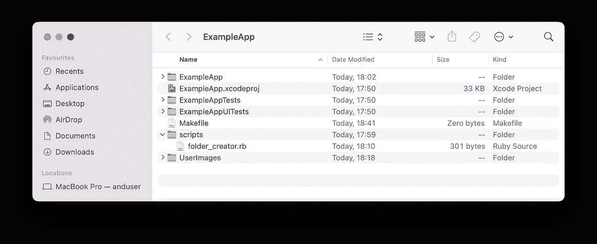
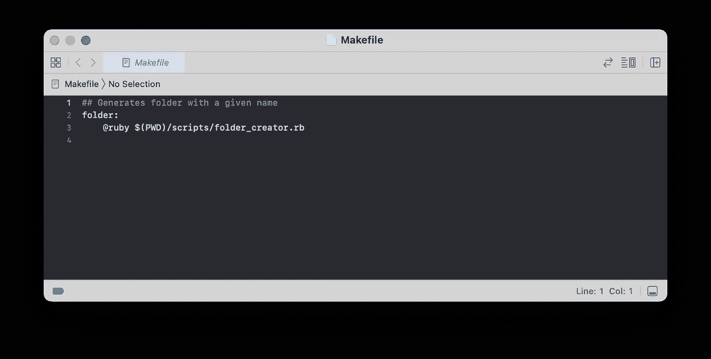
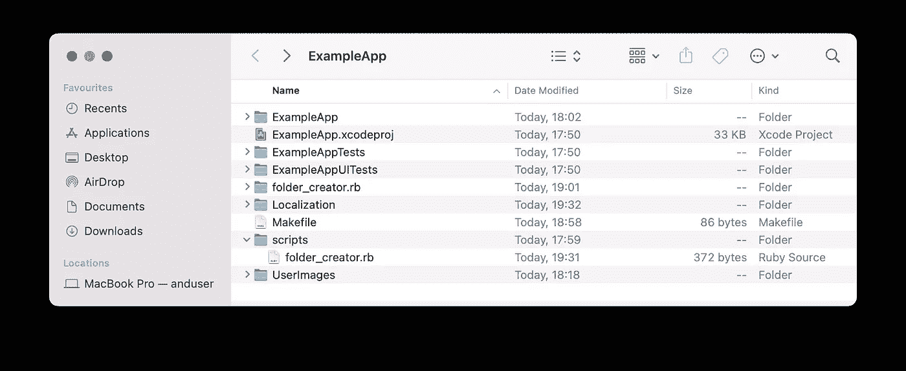

# 如何将 Makefile 添加到您的 iOS 项目中

> 原文：<https://betterprogramming.pub/adding-makefile-to-your-ios-project-802ac98fbe71>

## 通过创建 Makefile 来增加项目终端命令的可读性。

作为一名软件开发人员，您总是有一些可以通过脚本自动化的例行任务。无论是为相同类型的模块创建文件、版本控制操作，还是收集一些性能统计数据，所有这些操作都可以放入一个特定调用下的一组命令中。这样做，你可以避免重复做同样的事情，从而节省大量时间。

在 iOS 开发中，最常见的脚本语言是 Shell 和 Ruby——它们已经默认安装在 Mac 上，因此很容易集成到项目中。所以，要创作一个剧本，你需要制作。rb 或者。sh 文件。然而，由于本文不是关于创建和编写脚本，而是关于通过向您的项目添加 Makefile 来使它的使用变得有用，所以我们不会触及脚本主题本身。

让我们深入一个例子，这样我们可以看到它是如何工作的。

我们从一个普通的 Xcode 项目开始:

让我们假设您有一个 Ruby 程序，它只是在您的项目文件夹中创建一个目录，不多也不少。它采用您想要创建的文件夹的名称，然后生成它。当然，在现实生活中你不需要遇到这样的脚本，因为这个任务非常简单，只有一个步骤。但是为了简单起见，我们将把它作为一个例子来运行:

现在，要使用您的脚本生成一个文件夹，您需要进入程序所在的项目目录，并使用“ruby”命令调用文件夹创建者:

现在`UserImages`文件夹生成如下图所示:

我知道，一个脚本调用看起来并不复杂，也不难实现，但是如果你有一个很长的脚本文件夹路径，想象一下记住并输入这个路径中的所有目录，同时还会出现拼写错误和巨大的伤害。

为了避免上面提到的所有情况，可以将`Makefile`添加到您的项目中。它将帮助您结构化您的脚本调用，并使它更容易，用户友好，和人类可读。你需要做的只是创建一个名为`Makefile`的文件(就像那样！)放在您的。xcodeproj 文件位于:

现在一切都准备好了:

如您所见，它的大小为零字节。所以是全新的，完全是空的。将它添加到项目中后，您需要对其进行配置。Makefile 只理解 Shell 语言，所以您必须使用它来做所有的安排。但是不要担心，搜索您的流程可能需要的任何命令一点也不困难。

在这个特殊的例子中，我们有一个单独的 Ruby 脚本，把我们需要的所有东西放在一起。我们需要做的就是调用这个脚本。为了做到这一点，您必须按照以下方式配置 Makefile(tab 键很重要):

让我解释一下那里发生了什么。

在第 1 行中，我们只是在注释中加入了命令的作用。我们总是在 Makefile 中用##表示注释(类似于 Swift 中的//)。

在第 2 行中，我们给出了执行命令的名称。我建议总是检查你的命令名是否与“make”字兼容，这样当你键入你的调用时，它会看起来很好并且可读。您和您的同事将从终端运行这个命令，所以请尽可能将其命名为有意义的名称。在我们的例子中,“创建文件夹”说明了这个指令的所有功能。

第 3 行包含 Shell 命令本身。Makefile“监听”该命令，以便执行所需的操作。让我们把它分成几部分:

*   `@ruby` -要执行的终端命令
*   `$(PWD)` -返回 Makefile 所在文件夹的路径。这是一个 Shell 命令，为了正确构建脚本的路径，需要执行这个命令。
*   `…/scripts/folder_creator.rb` —脚本的剩余路径(可以更深，但应该指出 Makefile 所在文件夹的路径，因为我们有一个由上面的命令生成的路径)。

因此，从现在开始，为了用脚本创建一个文件夹，您需要进入您的项目文件夹(Makefile 所在的位置)并调用“make folder”命令:

而且，正如我们所看到的，`Localization`文件夹已经被创建:

在 Makefile 中还可以做很多改进。它还可以用于直接在其中执行 Shell 代码，而不是调用另一个脚本，所以我建议您深入研究这个主题，并将所有的例行操作转换成自动化的方式。使用上面的方法，你的项目的所有终端命令将是人类可读和易于理解的。

感谢您的阅读。