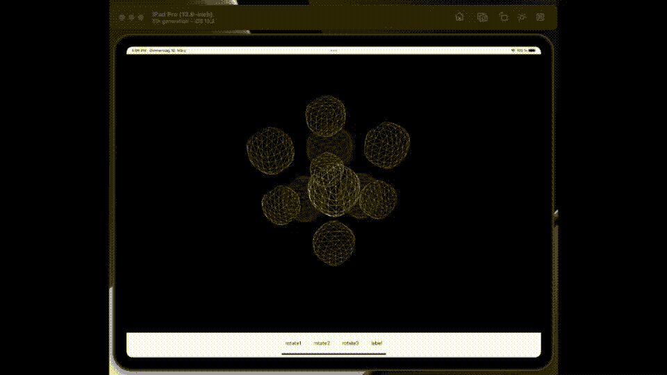
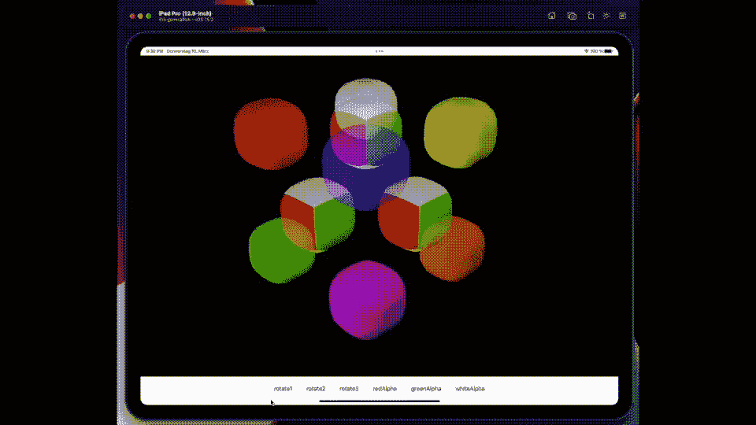

# 使用 SceneView 和 SwiftUI 为您的魔方添加逼真的运动效果

> 原文：<https://betterprogramming.pub/adding-realistic-movement-to-your-rubik-cube-da287dfaf69b>

## 定制我们的魔方


照片由 [aaron boris](https://unsplash.com/@aaron_boris?utm_source=medium&utm_medium=referral) 在 [Unsplash](https://unsplash.com?utm_source=medium&utm_medium=referral) 拍摄

前几周，我发表了一篇关于使用 SceneKit 和 SwiftUI 构建[魔方的文章。我在那篇文章里说过它还没有完成。完成后，我花了几天时间在接下来的一周开始工作。这是这项工作的第二部分。](/build-a-rubik-cube-using-sceneview-and-swiftui-dea9e622ef43)

在本文的第一部分，我描述了基本的构建，摄像机视图，以及实现改变人脸方向所需的手势的方法。在这篇文章中，我研究了如何让立方体像真实的一样移动。

# 挑战

*   我想让我的立方体像魔方一样移动，当我重新排列面时倾斜整个侧面。
*   我希望能够通过摇动设备来扰乱我的立方体，并在理想的世界中重置它。

# 现实主义运动

这并不容易。这是一个挑战，因为所讨论的立方体需要以九个为一组作为一个整体旋转——连接到一个以上的中心，这取决于你想要旋转的边缘。在一个标准的 54 方块的每个角上有三条边，所以你至少需要考虑 48 个方向。

现在围绕单边旋转一个节点很简单——你可以使用和我在相机上做的一样的技术。我将所有节点连接到中心节点，然后旋转它。所以像这样编码。代码将构建我的魔方的一部分。

```
let centerCube = addBox(xAxis: 0, yAxis: 0, zAxis: 0)
greenCube = addColorBox(xAxis: 1, yAxis: -1, zAxis: 0, color:UIColor.green)
whiteCube = addColorBox(xAxis: 1, yAxis: 1, zAxis: 0, color:UIColor.white)
redCube = addColorBox(xAxis: -1, yAxis: 1, zAxis: 0, color:UIColor.red)
blueCube = addColorBox(xAxis: -1, yAxis: -1, zAxis: 0, color:UIColor.blue)
centerCube.addChildNode(whiteCube)
centerCube.addChildNode(greenCube)
centerCube.addChildNode(redCube)
centerCube.addChildNode(blueCube)
```

然而，真正的挑战是由线框立方体子集的动画 GIF 来说明的。



观看白色立方体穿过三个平原，围绕着魔方中的红色中心节点。问题是，本质上，使用我展示的代码，立方体被绑定到一个方向。这是一个很大的问题，因为，如你所见，它需要在三个完全不同的平面上运动。现在我确信，如果我有一个数学博士学位，我可以想出一个性感的公式来做这件事——但是我的数学远没有那么好。

# 解决方案

正如我在第一篇论文中所说的，这确实需要一些创新思维。我通过创建阴影结构解决了这个问题，我将在这张 GIF 中展示。每个平面都有一组立方体的阴影，在这个动画 GIF 中用线框来表示。如果你仔细看，你会看到框架——一个白色的，一个红色的和一个绿色的。

但是，我承认，这里还有一个复杂的问题。因为我必须列出整个场景中的所有节点来寻找阴影，所以我需要区分阴影和立方体的方法。我通过用这段代码子类化`SCNNode`解决了一个复杂问题。

你可以在这里看到结果，这次我用一些颜色填充了立方体。中间的立方体是多色的。



专注于白色立方体。你可以看到它跟我之前展示的路径一样。但是等等——你能发现线框的窍门吗？看到我忏悔并不容易。

我已经为每一边创建了节点的阴影版本。当我点击旋转按钮时，它运行一个`SCNAction`来旋转线框。同时同步包含在这些线框中的盒子的位置。

因此，我把所有的数学工作都留给了 SceneView 框架，这是理所应当的。我并行运行第二个定制`SCNAction`来完成这项工作。这些代码看起来像这样。

## 价格

做完这些后，我发现使用手势要困难得多，我决定在第三篇论文中讨论这项任务。

# 争夺

Bon，我闭着眼睛完成了这个挑战的最后一部分。为了实现这一点，我创建了一个订阅，并将调用附加到该订阅上，以便向一个方向或另一个方向移动立方体。

所有这些都让我想到了这篇文章的结尾。我希望你发现阅读和写作一样令人愉快。我计划在接下来的一周继续研究在 SceneKit 上编写游戏。订阅 medium 并关注我，获取更多关于我与 SceneKit 的冒险的更新，以及魔方挑战的最终更新。