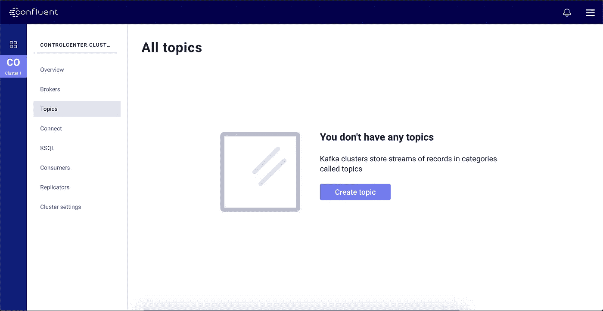
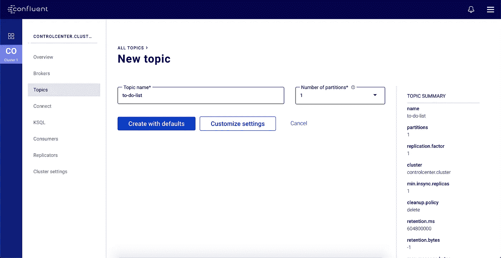
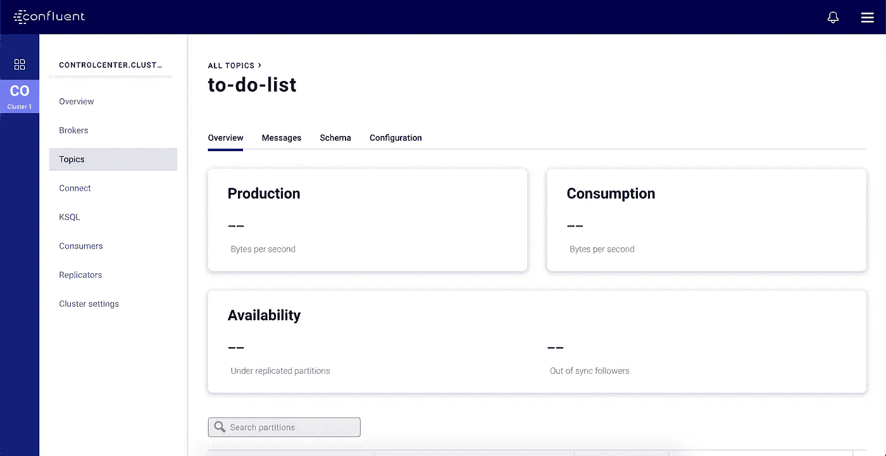
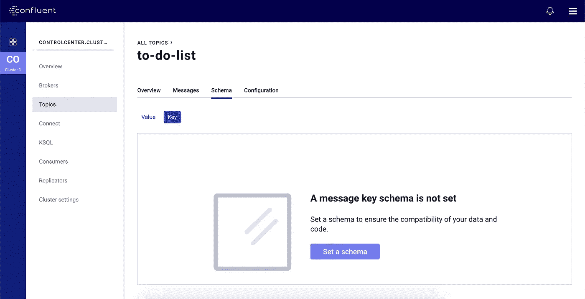
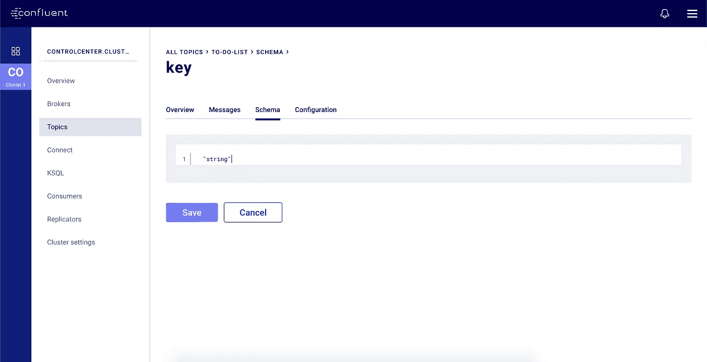
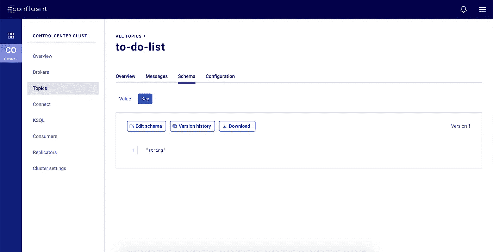
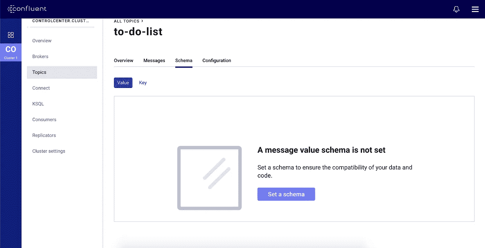
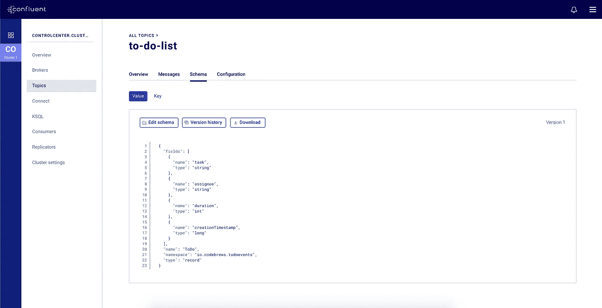

# 在本地 Docker 环境中向 Kafka 添加模式注册表

> 原文：<https://betterprogramming.pub/adding-schema-registry-to-kafka-in-your-local-docker-environment-49ada28c8a9b>

## Schema Registry 有助于维护 Kafka 主题中生产者和消费者消息数据结构之间的契约

照片由 [Unsplash](https://unsplash.com?utm_source=medium&utm_medium=referral) 上的 [Dmitry Ratushny](https://unsplash.com/@ratushny?utm_source=medium&utm_medium=referral) 拍摄

# 介绍

在事件驱动应用程序的世界中，一个关键的事情是确保发布到主题或队列的消息能够被所有参与者理解，即生产者和消费者。

这意味着强烈建议拥有一个数据结构或模式。

[汇流](https://www.googleadservices.com/pagead/aclk?sa=L&ai=DChcSEwi56dOTudznAhXDNSsKHbjFBp4YABAAGgJzZg&ohost=www.google.com&cid=CAESQOD23T5PvKzBGpFSTI7Vj28Qh7DhsjZ1O61KLQkwyvBli56-Erws_XzVSJVTP_J-mnDvXb9Q1BDNjN1V9TqtAU4&sig=AOD64_2oBTf100voCcBMoUPOnzRWjKKjfA&q=&ved=2ahUKEwjV_suTudznAhVm7nMBHVxYBEQQ0Qx6BAgREAE&adurl=)，即[卡夫卡](https://kafka.apache.org/)背后的公司，在其平台上推荐并支持 [Avro](https://avro.apache.org/) 连载。其他一些序列化库包括[节俭](https://thrift.apache.org/)和[协议缓冲](https://developers.google.com/protocol-buffers)。

在事件驱动的生态系统中拥有定义好的数据模式的好处是清晰的数据结构、类型和含义，以及更高效的数据编码。

在本教程中，我们将向我们的 Kafka 环境添加 Schema Registry，它是作为本[教程](https://medium.com/better-programming/your-local-event-driven-environment-using-dockerised-kafka-cluster-6e84af09cd95)的一部分构建的。

强烈建议您在开始学习本教程之前先学习那个教程[。](https://medium.com/better-programming/your-local-event-driven-environment-using-dockerised-kafka-cluster-6e84af09cd95)

# 为什么是模式注册？

我们都明白，我们的 Kafka 生产者向 Kafka 主题发布消息，我们的 Kafka 消费者从这些主题中读取消息。Schema Registry 充当第三方，确保生产者发布的消息可以被消费者阅读。

随着时间的推移，我们的模式可能会包含更多或更少的字段，或者某些字段的数据类型会发生变化。Schema Registry 有助于兼容性检查，因此使用者仍然可以阅读消息。它确保生产者-消费者契约保持有效。

# 将模式注册表和控制中心映像添加到 docker-compose 文件

我们将把 Schema Registry 和 Control Center 的 Docker 映像添加到现有的`docker-compose.yml`文件中。

将要添加的图像如下:

*   `confluentinc/cp-schema-registry:5.4.0`
*   `confluentinc/cp-enterprise-control-center:5.4.0`

控制中心棒极了。它为我们创建主题、查看主题中的消息、查看主题的模式等等提供了一个简单的 UI。

不管怎样，让我们继续将图像添加到合成文件中。

docker-compose.yml

# 旋转码头集装箱

转到您的终端并转到包含`docker-compose.yml`文件的目录。让我们启动所有的容器，这样我们就可以玩它们了。

如果我们看到上面的输出，我们很好。如果没有，请在下面的评论中发布任何错误或日志，我们可以一起调试和讨论解决方案。

# 创建一个主题

在前面介绍中提到的[教程](https://medium.com/better-programming/your-local-event-driven-environment-using-dockerised-kafka-cluster-6e84af09cd95)中，我们通过 Kafka CLI 工具创建了主题。但是现在，我们将使用合流控制中心来创建主题，因为它更容易和更快。

打开浏览器，导航到 [http://localhost:9021。](http://localhost:9021.)您应该会看到控制中心用户界面。然后，导航至左侧的*集群 1* 并转至*主题*。见下面截图。

现在，点击*创建主题*。您应该会看到下面的屏幕。让我们创建一个名为`to-do-list`的主题，并使用默认设置。继续点击*用默认值创建。*

太棒了。我们可以看到我们的话题被创造出来了。注意，在主题视图上，我们有*消息*和*模式*选项卡。

这些选项卡允许我们查看主题中的消息以及消息的键和值的 Avro 模式。很棒的东西，对吧？

# 定义主题模式

## 关键模式

让我们从定义消息的键模式开始。一般来说，我们希望我们的键是唯一的，以便从 Kafka 的主题分区中受益最大。请记住，领导者会根据消息的关键字将消息放在一个分区中。

如果多个消息的键具有相同的值，则这些消息将进入相同的分区。当处理的顺序很重要时，我们希望这种行为，否则，我们希望消息均匀地分布在可用数量的分区上。

对于我们的`to-do-list`主题，它不关心顺序，因为列表中的项目无论如何都需要完成。换句话说，本质上没有优先级。

考虑到这个假设，我们将使用`UUID`作为消息的密钥。这意味着，消息键的 Avro 模式将是字符串类型。

汇合控制中心为我们提供了直接在 UI 上设置模式的能力。所以，让我们利用它。现在，继续导航到*模式*选项卡，然后是*键*选项卡，如下图所示。

如前所述，我们将简单地将键模式设置为`"string"`。继续并*保存*它。

就是这样！我们刚刚为消息的键设置了模式。很简单，是吧？

## 价值模式

现在，我们将定义消息值的模式。这个更有趣，因为我们将看到 Avro 模式的美丽之处。

在我们做任何事情之前，让我们讨论一下`to-do-list`主题中包含的消息应该是什么。从待办事项列表中的一个项目中了解什么是有用的？

这里有几件事:

*   任务本身。
*   受让人或负责完成工作的人的姓名。
*   完成任务的估计持续时间。
*   将任务添加到待办事项列表的时间戳。

看起来很不错，不是吗？好吧，让我们从那里开始。

在 Avro 模式中，这是上述数据的表示方式。

`task`和`assignee`将是`string`类型，而持续时间将以秒为单位，因此是`int`类型。最后，`creationTimestamp`将以毫秒为单位，这就是为什么它是`long`类型。

请注意，在 Kafka 消息中添加`creationTimestamp`可能是有用的，特别是当我们想要围绕时间做一些逻辑时，例如，已经闲置了一段时间的任务可能应该首先完成。当我们的消费者对基于时间戳的消息顺序感兴趣时，这也很关键。

不管怎样，让我们继续为我们的消息值设置模式。在同一个*模式*选项卡上，点击*值*选项卡。

继续点击*设置一个模式*。复制上面的 Avro 模式并将其粘贴到编辑器中，最后，单击*保存*。您应该看到您的 Avro 模式已经注册。

干得好！

我们现在已经建立了一个完整的 Kafka 环境，并准备好让我们的应用程序以事件驱动的方式使用。

# 包裹

当我们读到这一节时，我们将对 Kafka 和 Schema Registry 如何协同工作有一个基本的了解。我们还看到了使用合流控制中心来管理我们的 Kafka 和模式注册表是多么方便。

既然我们已经准备好了一个完整的 Kafka 环境，我们就可以编写一些生产者代码，并基于上面定义的模式发布一条消息。我们还可以编写消费者代码来读取消息。有许多 Kafka 客户端库可供选择，如汇合文档中列出的[。](https://docs.confluent.io/current/clients/index.html)

我鼓励您根据您最熟悉的编程语言来选择 Kafka 客户端库。这样，您可以专注于学习 API 如何工作，并能够立即试用它。

关于如何设置一个本地 Kafka Docker 容器的教程，请访问这篇[文章](https://medium.com/better-programming/your-local-event-driven-environment-using-dockerised-kafka-cluster-6e84af09cd95)。

# 参考

*   [融合模式注册教程](https://docs.confluent.io/current/schema-registry/schema_registry_tutorial.html)