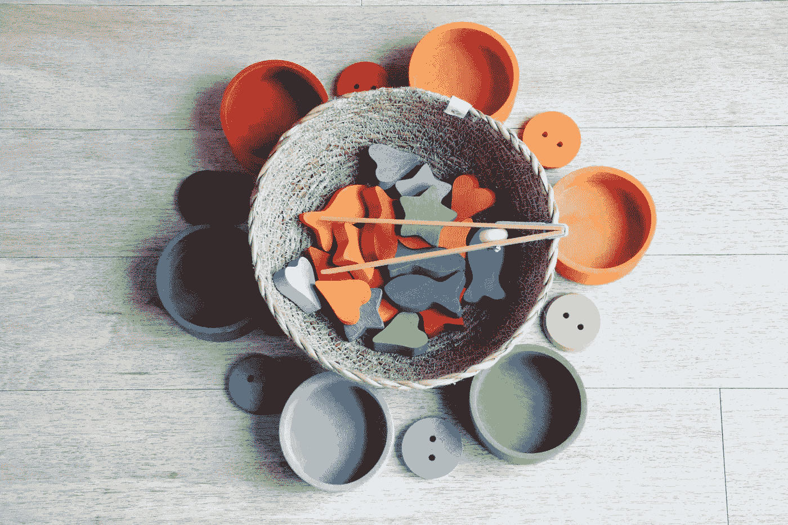
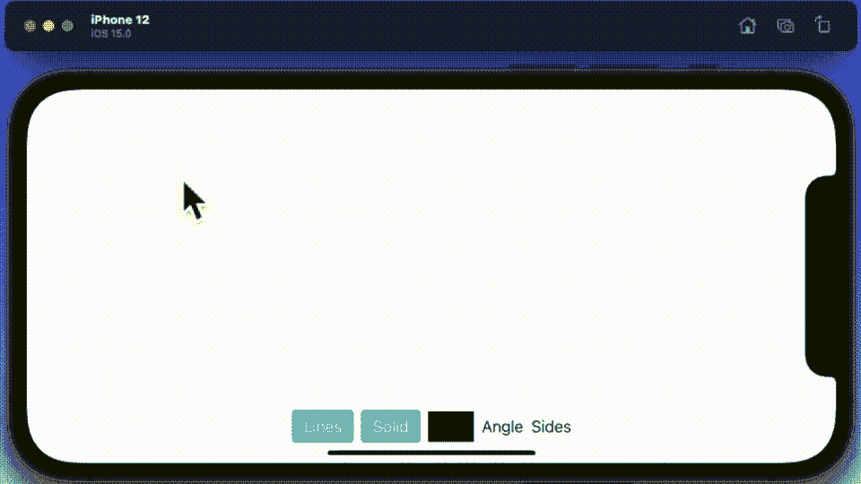

# 向 SwiftUI 绘画应用程序添加形状和颜色

> 原文：<https://betterprogramming.pub/adding-shapes-and-colors-to-your-swiftui-painting-app-751dbb6fdce3>

## 继续我们构建 iOS 画图应用的旅程

照片由[苏拉娅·欧文](https://unsplash.com/@traxing?utm_source=unsplash&utm_medium=referral&utm_content=creditCopyText)在 [Unsplash](https://unsplash.com/s/photos/shapes?utm_source=unsplash&utm_medium=referral&utm_content=creditCopyText) 拍摄

我相信你已经阅读了这个简短系列的第一部分，我希望开发一个简单的绘画应用程序。如果你还没有，那么你应该先停下来读一读。

 [## 用 SwiftUI 在 iOS 15 中搭建绘画 App

### 使用新的画布视图构建一个简单的绘画应用程序

better 编程. pub](/build-a-painting-app-in-ios-15-with-swiftui-bb757a925f6a) 

bon——感谢回来——和我一起继续在 iOS 15 下开发绘画应用程序。这是我在哪里的最新消息。

## 案情摘要

在这篇文章中，我做了以下修改。在本文中，我计划将三个数组的数据结构合并成一个结构。我计划更新画布绘图，以便它创建一个多边形。我计划引入一些基本的控件，这样我们可以给我们的形状本身和/或我用来画它的线条上色。我计划添加控件来管理多边形的角度和边数。最后——anNice to have 附录——将增加根据标尺或彼此排列形状的功能。

## 编码

首先，我需要修改数据结构，使它不是数组的集合，而是具有属性集合的单一结构。

现在，这里有很多东西需要考虑——我添加了 unused 属性来修复以前版本中的一个错误，在以前的版本中，您在数组中创建了空的形状。我从版本一得到的`Cord`、`Size`和`Selected`。`Sides`是指多边形的边数，角度是指开始绘图的时间(所有形状都是由圆构成的)。最后，线和固体是控制填充/线条颜色的变量。

接下来，我想看看如何将控制形状的代码从标准的椭圆/正方形更改为多边形。可以指定边数的多边形(已经添加到结构中)。

这个变化看起来比实际更复杂。我简单地添加了模板代码，用更少的点画了一个圆——所以默认是三个点——最终结果是它默认画了一个三角形。

接下来，我想研究建立一种方法来指定物体的颜色。所以用新的多边形和颜色选择控件替换了调试界面。在它里面，我添加了两个 iOS 15 风格的切换按钮和一个颜色形状。长按，它将形状+线条颜色设置为盒子的颜色。只需轻轻一点，它就会移动到下一种颜色。双击，它会回到以前的颜色。如果你不想给形状本身上色，你可以关闭这个开关。线也是一样。

接下来，因为我添加了为我们的多边形设置特定角度和边数的功能，所以我添加了一些控件，以便用户可以管理所述变量。

最后，这是 paint 应用程序的第二版`ContentView`。除了简单地更新对新数据结构的引用之外，这里与以前发布的版本几乎没有什么变化。

完成后，我们的应用程序的第二个版本如下所示。

我相信你同意，它正在成形--。自己尝试一下代码。你会注意到有几个需要注意的特征——例如，选择多个形状，然后尝试给它上色。它不会像你预期的那样工作。

但是，好吧——这是一项正在进行的工作——下次见。感谢阅读。