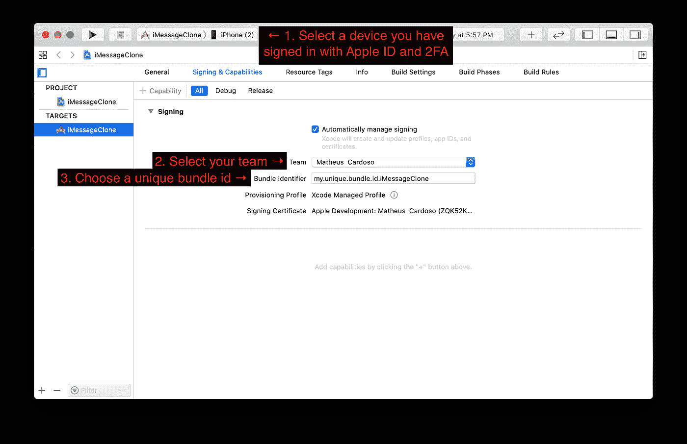
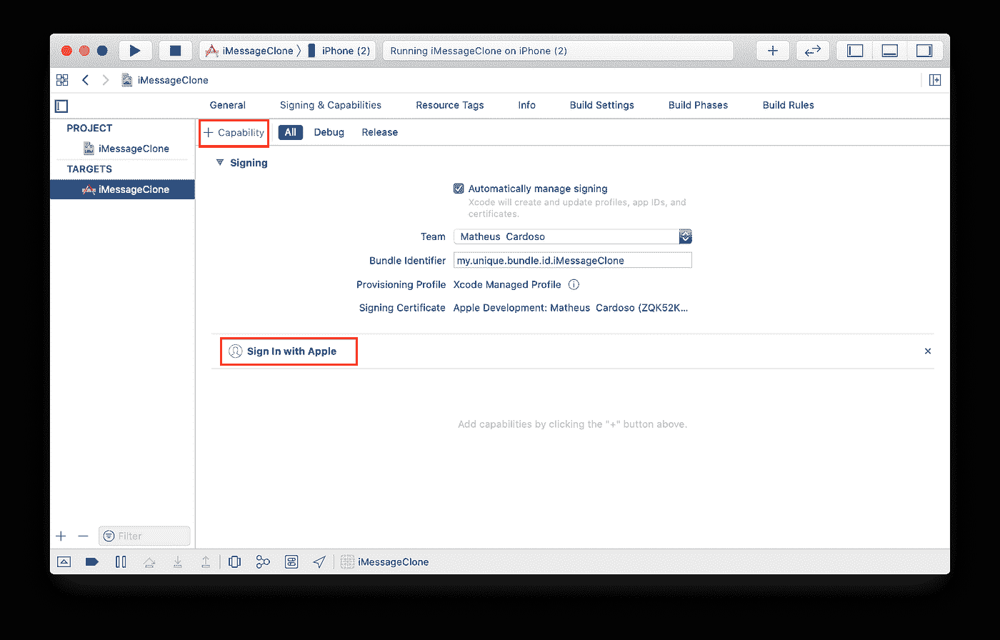
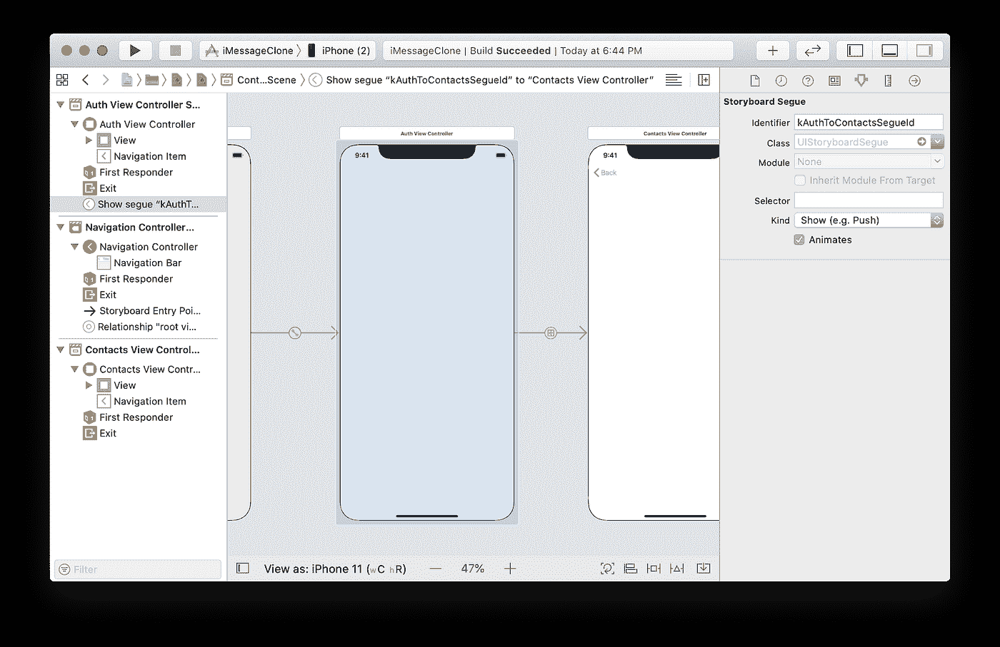
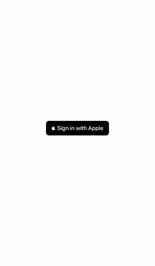

# 如何将登录 Apple 添加到您的 iOS 应用程序

> 原文：<https://betterprogramming.pub/adding-sign-in-with-apple-to-your-ios-app-569e326b3e48>

## 让您的用户能够隐私登录

在 [Unsplash](https://unsplash.com/collections/3577927/computing-and-it?utm_source=unsplash&utm_medium=referral&utm_content=creditCopyText) 上 [NeONBRAND](https://unsplash.com/@neonbrand?utm_source=unsplash&utm_medium=referral&utm_content=creditCopyText) 拍摄的照片

自 2020 年 4 月以来，所有使用第三方或社交登录服务的应用程序都需要向苹果公司提供登录服务，如果它们想被应用商店接受的话。

在本教程中，我们将通过添加苹果的[登录到 iMessage 克隆的步骤。](https://developer.apple.com/sign-in-with-apple)

如果你在这个教程中迷路了，你可以在这个 [GitHub repo](https://github.com/GetStream/sign-in-with-apple-swift-example) 中查看已经完成的项目。如果您遇到任何错误，可以查看 repo 自述文件末尾的故障排除部分。

## 什么是登录苹果？

> “使用 Apple 登录使用户可以使用他们的 Apple ID 轻松登录您的应用程序和网站。他们不用填写表格、验证电子邮件地址和选择新密码，而是可以使用“登录 Apple”来设置帐户并立即开始使用您的应用程序。所有帐户都受到双重身份验证的保护，安全性更高，苹果不会跟踪用户在你的应用程序或网站上的活动。"
> 
> [*—苹果开发者门户:登录苹果*](https://developer.apple.com/sign-in-with-apple/)

## 你需要什么

*   iOS 13+版本
*   Xcode 11+
*   Node.js 10+
*   一个[流](https://getstream.io/accounts/signup/)账户
*   参加[苹果开发者计划](https://developer.apple.com/programs/)

# 1.配置客户端项目

如果你的应用程序仍处于开发初期，或者正在使用 [iMessage 克隆项目](https://github.com/GetStream/stream-imessage-clone)，请遵循下图中的步骤。如果您的应用程序已经在生产中，您可以跳到下一个图像。

现在，您需要在目标的“Signing & Capabilities”选项卡中添加具有 Apple 功能的登录。

# 2.添加登录按钮

为了添加登录按钮，我们将使用 [AuthenticationServices](https://developer.apple.com/documentation/authenticationservices) 框架，它提供了所有需要的功能，包括 UI 元素。

我们还需要添加身份验证屏幕，它将出现在联系人屏幕之前。让我们创建一个`AuthenticationViewController.swift`文件并粘贴以下代码:

现在，让我们将这个新屏幕添加为故事板中的第一个屏幕。如果您使用的是 iMessage 克隆项目，它应该是导航控制器的根视图控制器。最后，设置一个从它到 ID 为`kAuthToContactsSegueId`的联系人屏幕的序列:

现在，运行该项目，您应该有一个按钮，当按下时，导致联系人屏幕。

当然，这里还没有真正的认证。我们将在接下来的步骤中研究这个问题。

# 3.设置后端

在我们将真正的身份验证构建到客户端之前，我们需要一个后端，当给定 Apple ID 凭证时，它可以生成一个流令牌。如果你已经有了一个后端，你可以使用 Stream 的[服务器端聊天库](https://getstream.io/chat/docs/tokens_and_authentication/?language=js)进行类似的设置。

简而言之，我们将构建一个简单的 Node.js/Express 后端，只有一个端点:`/authenticate`。我们还将使用`node-persist`包在新用户第一次认证时保存他们的数据。如果您对自己构建后端不感兴趣或者有问题，您可以在[资源库](https://github.com/GetStream/sign-in-with-apple-swift-example)中获得完整的代码。

在终端中，运行以下命令:

下面的代码片段可以按顺序复制到`index.js`文件中。

让我们通过导入我们需要的对象来开始编码我们的`index.js`:

现在，使用您在流仪表板中获得的凭据配置流聊天客户端:

配置 Apple 授权客户端:

有关填写这些参数的详细信息，请阅读`apple-auth`的 [SETUP.md](https://github.com/ananay/apple-auth/blob/master/SETUP.md#create-a-key) 。

如果您在后端使用 Node.js 之外的东西，那么这个库也有其他语言的版本，比如 [Go](https://github.com/BillSJC/appleLogin) 。如果你不能为你喜欢的后端栈找到它，你将不得不通读`apple-auth`的源代码，然后[登录苹果的 API 规范](https://developer.apple.com/documentation/sign_in_with_apple/generate_and_validate_tokens)来从头实现类似的东西。

初始化 Express 和`node-persist`存储器:

现在，让我们开始为`/authenticate`端点构建处理程序，从请求中提取我们需要的参数:

现在，我们使用`apple-auth`验证苹果服务器的`appleAuthCode`，并从响应中提取用户的电子邮件地址:

如果我们有一封电子邮件，并且在身份验证请求中提供了姓名，我们需要将该信息存储在我们的永久存储中:

除了 Apple UID 和授权码之外的信息只能保证在用户第一次尝试登录时由 Apple 提供。我们使用这个事实来确定何时注册用户，这就是为什么我们需要保存信息并在每个身份验证响应中重新提供它。

现在，让我们通过从本地存储中获取用户数据并在响应中传递它来完成处理程序:

最后，让我们配置 Express 应用程序监听端口`4000`:

现在，我们可以用下面的命令关闭`index.js`并让后端运行:

如果这是可行的，在你的浏览器中打开`localhost:4000/authenticate`将会显示`Cannot GET /authenticate`，这是可以的，因为我们将在客户端应用程序中使用`POST`。

# 4.使用 Apple ID 请求授权

让我们回到 Xcode。

首先，我们需要编写函数来与我们刚刚创建的`/authenticate`端点接口。让我们创建一个名为`Authentication.swift`的文件，并从定义请求和响应结构开始。

多亏了`Codable`，我们可以轻松地将这些对象转换成 JSON，这很方便，因为我们通过发送`AuthRequest`和接收`AuthResponse`来定义与`/authenticate`交互的实际函数:

**提醒:**使用 Apple 登录只能在真实设备上运行。确保将`[your local ip]`替换为 Mac 的本地网络 IP 地址，而不是`localhost`或`127.0.0.1`。要找出答案，请在 Mac 的终端上运行以下命令:

现在，为了向 Apple 验证用户，让我们回到`AuthViewController.swift`并编辑按钮的 press 处理程序来添加这个行为:

这个实现将使得按下用苹果登录按钮触发用苹果屏幕登录。

然而，它还不能编译，因为我们还没有使`AuthViewController`符合几个必需的协议。

我们需要让`AuthViewController`与`ASAuthorizationControllerPresentationContextProviding`保持一致，以告知苹果公司在哪个窗口呈现流:

最重要的是，我们还需要符合`ASAuthorizationControllerDelegate`，这将让我们在用户完成登录流程后接收苹果凭证。然后，我们可以使用它进行身份验证，然后配置我们的流客户端，并转到 contacts 屏幕:

最后，我们有一个苹果实现的功能登录:

由于是新用户，我们没有显示任何联系人。

后端日志应该如下所示:

# 包扎

恭喜你！现在，您可以在任何 iOS 应用程序中内置 Apple 认证登录。请务必阅读苹果公司的[指南和文档](https://developer.apple.com/sign-in-with-apple/get-started/)以了解最新的要求和公告。

感谢您的阅读，祝您编码愉快！