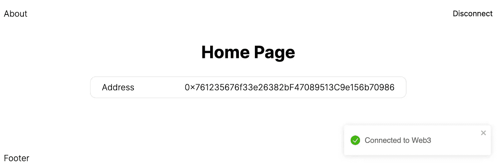
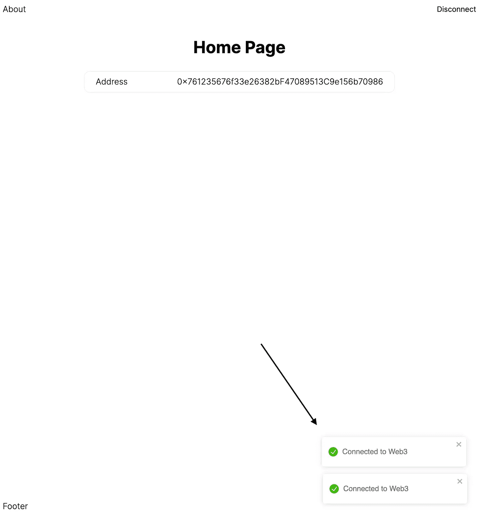
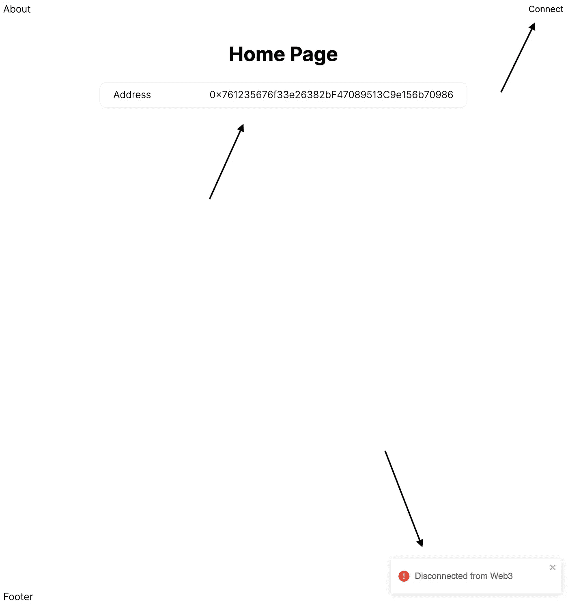

# 将 Web3 添加到我们的 NextJS TypeScript 项目中

> 原文：<https://betterprogramming.pub/adding-web3-to-our-nextjs-typescript-project-861e9ed5feaf>

## 将 web3 集成到您的应用中



如果你还没有看到我最近的两篇建立我们项目的帖子，请查看一下[第一部分](https://wk0.medium.com/create-a-typescript-nextjs-project-with-jest-cypress-adbbcf237747) & [第二部分](https://wk0.medium.com/adding-tailwind-to-a-nextjs-typescript-project-d1eba5699c4d)。我们将在这里的一个新的 web3-eth 分支上使用[相同的回购](https://github.com/wk0/boilerplate-next)。

如果你不熟悉[以太坊](https://ethereum.org/en/what-is-ethereum/)或[元面具](https://metamask.io/)，一定要去看看。Metamask 是一个浏览器钱包，让你与 EVM 兼容的区块链互动。如果你有大量的资金，我强烈建议你买一个[分类账](https://shop.ledger.com/products/ledger-nano-x?r=94dd9b6b6f3a)——然后[把它和你的元掩码](https://www.ledger.com/academy/security/the-safest-way-to-use-metamask)连接起来，方便使用 dApps。

在开始之前，请确保您的浏览器中安装了 Metamask 扩展。

如果你想看我们正在制作的快速演示，请点击这里查看。

让我们安装一些工具来处理 Web3 与我们项目的集成:

```
yarn add [@walletconnect/web3-provider](http://twitter.com/walletconnect/web3-provider) ethers web3modal
```

[walletconnect](https://docs.walletconnect.com/) 让我们通过开放协议将钱包连接到我们的应用程序。

ethers 是一个现代的 javascript/typescript Web3 库。比起像 [web3.js](https://web3js.readthedocs.io/en/v1.7.0/) 这样的其他选择，我更喜欢它

最后，[web 3 mode](https://github.com/Web3Modal/web3modal)是一个库，它允许我们以一种通用的方式支持不同的钱包提供者，如 Metamask、WalletConnect 或比特币基地钱包(还有许多其他的)。如果你以前用过 dApp，你可能已经作为用户和它交互过了。

我们还需要一个 Infura API 密钥。这将让我们通过简单的 API 访问以太坊节点。

*趣闻:Metamask 居然在幕后使用 Infura。*

如果你还没有账户，请在这里注册:[https://infura.io/](https://infura.io/)

然后“创建新项目”，选择“以太坊”，然后复制你的`PROJECT_ID`在我们的应用程序中使用。

如果你想限制访问，还有一个安全标签，你可以启用 JWT 认证，秘密，允许列表，或速率限制。我们暂时跳过这一步。

因为我们现在有了一些秘密，并且 [NextJS 为 env 变量](https://nextjs.org/docs/basic-features/environment-variables)提供了一些内置支持，所以创建一个 env 文件来存储这些。

`touch .env.local`

```
NEXT_PUBLIC_INFURA_ID=PASTE_YOUR_ID_HERE
```

我们将利用一个缩减器把我们的 Web3 连接器构造成一个钩子，并把它放在一个上下文中。这是相当多的移动部分，但值得深思熟虑地管理状态。

这里有一个不错的模板我们可以在它的基础上构建一个更加成熟的应用程序。

继续在下一个应用程序中初始化三个文件夹:

```
mkdir hooks
mkdir reducers
mkdir context
```

在`reducers`中，初始化一个包含三个不同部分的`Web3Provider.ts`文件:

## 1.状态(初始状态)

`null`和`undefined`可能看起来有点奇怪，但是我们从一个‘空白’的初始状态开始，并且 Web3 变量在某些场景中可能是未定义的。例如，当元掩码本身被注入到浏览器`window`中，但没有特定地址连接时的`address`变量。当我们讨论 ethers 的签名者和提供者功能时，这一点会变得更加清楚。

## 2.行动

## 3.还原剂

动作和减少器相当简单，所以我将继续在`reducers/index.ts`中导出它们:

```
export type { Web3ProviderState, Web3Action } from './Web3Provider'
export { web3InitialState, web3Reducer } from './Web3Provider'
```

接下来，我们将首先使`/hooks/Web3Client.ts`中的钩子上升，我们将初始化`web3modal`:

这里实际上只有两件事，`providerOptions`让你使用不同类型的 Web3 钱包。这里有一个完整的内置提供者列表[这里](https://github.com/Web3Modal/web3modal#provider-options)，你甚至可以按照这里的文档[添加自定义提供者。](https://github.com/Web3Modal/web3modal#custom-provider)

需要注意的是`null`和检查`window`的 if 语句，后者只处理服务器端的渲染条件。如果我们使用 vanilla React 而不是 Next，我们可以排除它。

现在让我们进入主钩…

这有点长，但是这主要是样板文件，在用我们上面定义的每个动作更新 reducer 时，保持状态与提供者同步。当我们从用户的角度来看时，会更容易理解。

让我们来看看这个钩子是如何工作的。

在组件中，创建一个`components/Web3Button.tsx`，让我们在应用程序中使用钱包的连接和断开功能。

另外，在`components`中创建一个`Web3Address.tsx`，这样我们就可以看到一个读取一些基本状态的例子:

然后编辑我们的`index.tsx`来添加按钮和地址组件:

现在我们有一个漂亮的小 dApp。在我们发布这个东西之前，让我们添加 [react-tostify](https://fkhadra.github.io/react-toastify/introduction) 来更深入地了解我们的提供商的状态。

```
yarn add react-toastify
```

然后像这样把它丢进我们的`_app.tsx`:

最后，为我们的`Web3Client.ts`干杯:

```
import { toast } from 'react-toastify'... // before 'SET_WEB3_PROVIDER' in connect
toast.success('Connected to Web3')// before 'RESET_WEB3_PROVIDER' in disconnect
toast.error('Disconnected from Web3')// before 'SET_ADDRESS' in handleAccountsChanged
toast.info('Changed Web3 Account')// before 'window.location.reload()' in handleChainChanged
toast.info('Web3 Network Changed')
```

那就启动吧！

如果你觉得完全不同步，你可以在这里查看当前状态[。](https://github.com/wk0/boilerplate-next/tree/f65e9cf60114de45d94ab3a59bbb3bb4b694dfb4)

注意到什么了吗？(除了样式和被忽略的关于页面…)



双连！



不同步！

祝酒词可能看起来有点多余，但它说明了关于使用钩子的一个很好的教训。使用钩子时，您可以看到我们正在多次重新连接——在每次使用钩子时重新触发连接逻辑。

我们还可以看到我们断开了连接，但是我们的`Web3Address.tsx`组件没有注意到我们没有连接的地址！

上下文增加了一点额外的代码，但是让这个存储的状态保持同步并对我们的下游组件可用是很好的(甚至是必要的)。

所以…让我们在`/context/Web3Context.tsx`中初始化一个上下文:

我们对`web3InitialState`会有一点问题，因为`connect` & `disconnect`函数需要一个初始状态。

在`reducers/Web3Provider.ts`更新中:

```
export type Web3ProviderState = {
    ...
    connect: (() => Promise<void>) | null
    disconnect: (() => Promise<void>) | null
}export const web3InitialState: Web3ProviderState = {
    ...
    connect: null,
    disconnect: null,
}
```

在我们的组件中，切换到使用`useWeb3Context()`而不是`useWeb3()`钩子。

最后，确保用`Web3ContextProvider`包裹`_app.tsx`


那么我们应该准备好了——并且您的本地版本应该已经修复了过时的状态问题。

如果您要部署，不要忘记将您的 Infura `PROJECT_ID`添加到 Vercel 的 env 中！

感谢阅读。查看演示，网址:[https://boilerplate-next-eth-context . vercel . app](https://boilerplate-next-eth-context.vercel.app)我们最新的分支:[https://github.com/wk0/boilerplate-next/tree/web3-eth](https://github.com/wk0/boilerplate-next/tree/web3-eth)

```
**Want to Connect?**Also check out my website: [https://wk0.dev](https://wk0.dev/)
```