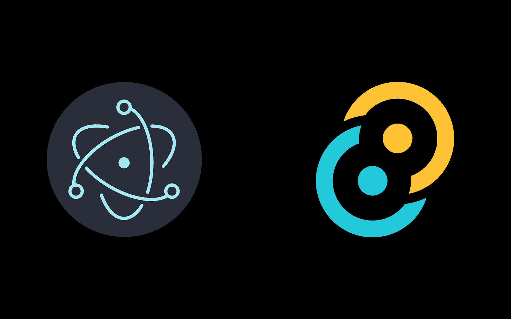
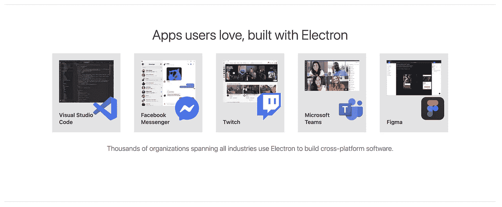
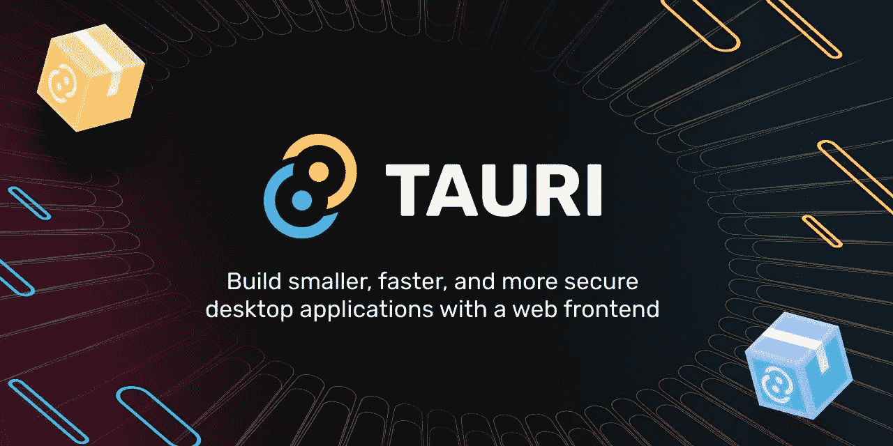
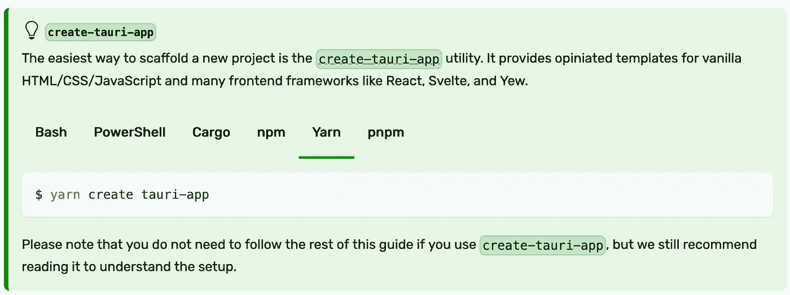
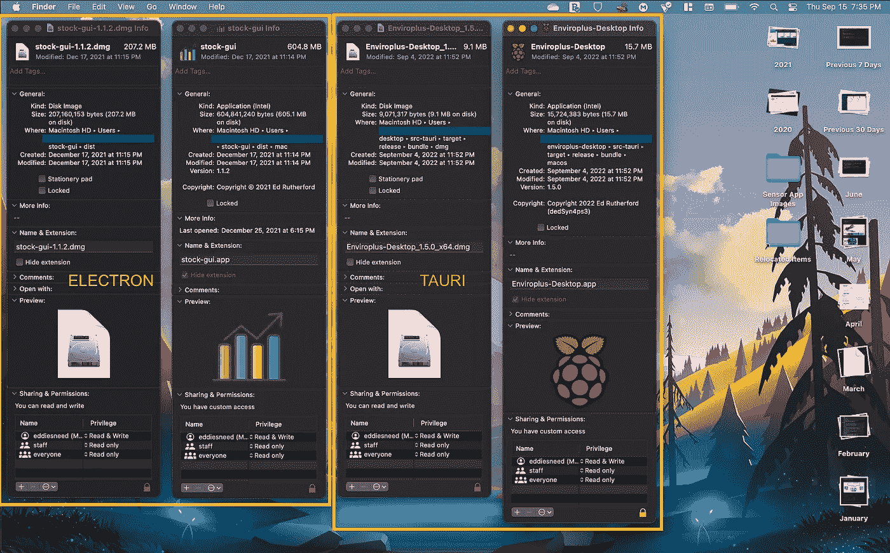
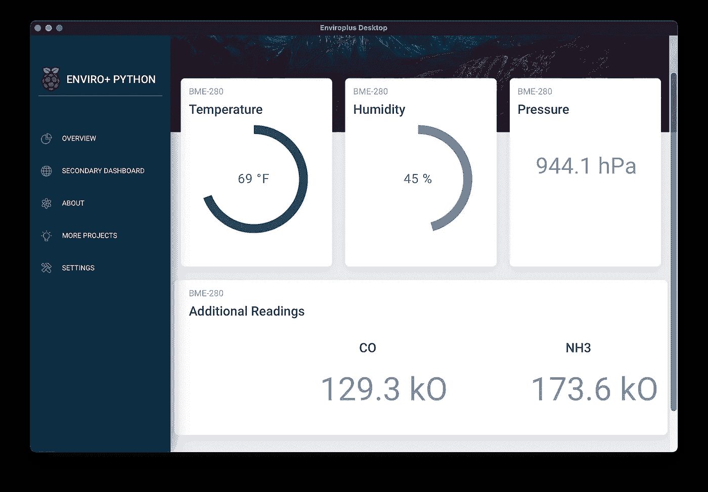

# 再见电子。你好，托里

> 原文：<https://betterprogramming.pub/adi%C3%B3s-electron-a-rust-powered-alternative-has-arrived-and-its-lovely-bd26262dcf1a>

## 利用 Rust-powered 后端框架和 React 前端，提供无浏览器体验



阿迪奥斯电子。作者图片

许多开发人员可以告诉你他们对 JavaScript GUI 框架的爱恨情仇，该框架帮助许多桌面应用程序的开发方式发生了革命性的变化。事实是，我们今天使用的许多应用程序，无论是开发、社交媒体、通信……都是使用电子框架构建的。

如果你好奇的话，可以从他们的[网站](https://www.electronjs.org/apps)查看使用电子的应用程序列表。

关键是，Electron 为有 web 开发经验的开发人员提供了为多种平台创建独立桌面应用程序的机会……所有这些都不需要学习任何新的编程语言！它提供了使用我们许多人一直在使用的相同 JavaScript、CSS 和 HTML 的能力，这当然非常棒！

简单总结一下 Electron 是如何做到这一点的:

> Electron 是一个使用 JavaScript、HTML 和 CSS 构建桌面应用程序的框架。通过将 Chromium 和 Node.js 嵌入到二进制文件中，Electron 允许您维护一个 JavaScript 代码库，并创建在 Windows、macOS 和 Linux 上工作的跨平台应用程序——不需要本地开发经验。



电子影响一瞥

使用电子构建桌面应用程序的最大缺点之一，正如你们中的一些人可能已经在 Stack Overflow 和其他论坛上看到的……就是产生的二进制文件往往非常大！以至于即使一个中等大小的代码库也可能产生大约 60MB 的最终二进制文件。

在亲身经历了这种挫败感之后，我开始想知道是否有一个神奇的解决方案来解决这个问题…事实证明，Rust 恰好提供了一个！



向 Tauri 问好！

> Tauri 是一个工具包，帮助开发人员为主要的桌面平台开发应用程序——使用几乎任何现有的前端框架。核心是用 Rust 构建的，CLI 利用 Node.js 使 Tauri 成为创建和维护优秀应用程序的真正多语言方法。

对于一些人来说，学习使用 Rust 编写代码可能是一项令人望而生畏的任务，尤其是如果他们不熟悉静态类型语言的话。我开始重新编写一些我自己的更小的 Python 脚本，看看我能做出什么样的性能改进。有些事情最终值得努力，有些则不那么值得。

尽管如此，我还是很好奇，开始钻研 Tauri 提供的文档。令我兴奋的是，他们的命令行搭建工具使用熟悉的前端框架创建了您需要启动和运行的所有 Rust 文件。不仅如此，一旦我准备好向后端添加我自己的函数供 UI 使用，Tauri 就可以让一切无缝地协同工作！



快速轻松地开始

我决定让 Tauri 尝试为我计划参与的社区项目创建一个新的桌面仪表板应用程序，剧透一下…它没有让人失望！

正如我前面提到的，开始相当简单:

*   确保您的系统安装了 Rust
*   如果在 Windows 或 Linux 上，请确保安装相关的依赖项
*   运行一个简单的命令来设置您的项目

之后，就是把所有的前端源文件放在一起，当我需要一些关于 UI 和后端之间进程间通信的指示时，偶尔会参考 Tauri 的文档。

使用 Tauri 创建我的仪表板的好处是，我不再需要为了能够正确地利用进程间通信而创建一个单独的`preload.js` 文件。

所有需要做的就是在我想从 UI 调用的函数上方的`main.rs`中添加适当的注释，并在我的 React `jsx`文件中添加一个简单的导入行:

```
**import** { invoke } **from** '@tauri-apps/api/tauri'
```

Tauri 构建的应用程序的力量最终归结于其后端利用 Rust 的事实。这使得像我这样的开发人员能够将他们的最终产品构建成一个本地运行的二进制文件，其大小只是许多电子构建的应用程序的一小部分。

一旦我的项目的最后部分就绪，我所要做的就是运行构建脚本并等待`cargo`完成它的工作。我的仪表板的最终二进制文件的大小:`~13.6MB`。好奇一个几乎相同的项目在使用电子建造后有多大吗？试试`58.2MB`，那甚至不是最终的磁盘安装文件(对于 macOS)。下面是这些类似项目的截图对比；两者都使用 React 作为前端:



快速比较

很明显，至少对我来说，Tauri 肯定有潜力继续发展，直到它取代 Electron 成为占主导地位的“前端”GUI 框架。尽管由于构建于 Rust 之上，可能会有一些令人畏惧的因素，但是花少量的时间来理解它的内部机制是非常值得的！

我鼓励任何希望开始前端 GUI 开发之旅的人去看看 Tauri 框架，并抵制住立即将电子作为直接解决方案的冲动…我向你保证，你会感到惊喜的！

为了完整起见，您可以在我的 Gitlab 上找到我的社区项目的完整代码库。如果您正在为自己的项目寻找任何想法，请查看它！



最终结果

[](https://gitlab.com/dedSyn4ps3/enviroplus-desktop) [## Ed Rutherford / Enviro Plus 桌面 GitLab

### GitLab.com

gitlab.com](https://gitlab.com/dedSyn4ps3/enviroplus-desktop)