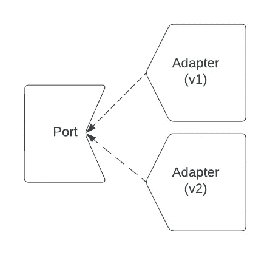

# 在 Kotlin 中采用六角形架构的新 API 版本

> 原文：<https://betterprogramming.pub/adopt-new-api-versions-with-hexagonal-architecture-353e3d8fd64c>

## 保持最新状态，不破坏任何东西


图像由[斯蒂夫·约翰森](https://unsplash.com/@steve_j)在 [Unsplash](https://unsplash.com/photos/WkJPu3rEeJE) 上拍摄

当你已经习惯于长期使用旧的 API 时，采用新的 API 版本可能会很麻烦；尤其是如果你从来没有为它设计过。在本指南中，我将向您展示一种采用全新迭代的方法，对代码的改动最小。

# 我们现有的应用程序

假设我们是一家兽医诊所，我们有一个应用程序，它从我们的 API 获取一些数据，将其格式化为 HTML，然后打印到控制台。你可以从这个大纲中推断出我们如何构建一个功能完整的网络或移动应用。

当我们设计这个应用程序时，我们对它的外观有一个非常具体的想法，所以我们围绕这些要求设计了我们的模型和 API。它非常适合我们，我们对此非常满意。

# 新要求

但是现在我们有了新的要求:我们必须展示猫最喜欢的食物。后端团队已经支持这一点，但它只在他们的新 API 版本中可用。让我们看看他们发给我们的新方案:

原来他们对新模式做了很多改动，有几个问题:

*   我们不想支持`breed`的新值，他们用`CamelCase`而不是我们想要的`snake_case`。
*   `colours`是一组枚举，而不是我们想要的`grey`和`brown`布尔
*   `id`和`ownerId`是 UUIDs，而不是我们想要的整数
*   `appointments`从猫模式中缺失；它们只能从完全不同的 API 操作中获得

想象一下我们的应用程序是巨大的:如果我们采用这个新模式作为我们的模型，变化将是巨大的，并且需要大量的回归测试。当我们想要的只是增加一个新的属性时，我们无法证明所付出的努力是值得的。

# 通过六边形让生活更美好

如果我们采用[六边形架构](https://netflixtechblog.com/ready-for-changes-with-hexagonal-architecture-b315ec967749)的一些原则(特别是端口和适配器)，我们可以将我们的应用程序与这些问题隔离开来。我们可以采用新的 API 版本，添加新的特性，并对现有代码做很少的修改。所有这些都可以通过一个适配器来实现，该适配器可以将新模式转换成我们熟悉的模型。



您可以设计许多不同的适配器来适应单个端口

## 港口

在软件术语中，端口是定义我们想要完成的契约的接口。

```
fun interface Horn {
  fun honk()
}
```

## 适配器

适配器是端口接口的实现。可以有几个版本，可以根据需要换入换出，甚至可以动态地换入换出，或者用函数式编程分层。

```
class CarHorn: Horn {
  override fun honk() {
    println("Beep")
  }
}class TruckHorn: Horn {
  override fun honk() {
    println("BURRRRRRRRRP")
  }
}
```

## 定义我们的港口

那么，我们如何使用端口和适配器来帮助我们呢？如果我们的目标是使用和以前一样的`Cat`模型，那么端口真正需要做的就是通过它的 id 获得一个`Cat`。但是首先我们需要调和旧整数`id`和新整数`UUID`之间的差异。谢天谢地，这两个可以很容易地表示为一个`String`，所以我们的端口将使用它。我们可以通过更新我们的`Cat`模型来使用字符串`id`来进行一个小小的妥协。

## 实现 v1 适配器

现在，让我们拿出一个 v1 适配器来实现我们的端口。这非常简单，因为它所做的只是将任务委托给`ClientV1`。

## **实现 v2 适配器**

接下来，我们需要为`ClientV2`创建一个适配器。这个有点复杂，因为它需要进行两次 API 调用，并将结果合并到原始的`Cat`模型中。我们还将借此机会从`CatDtoV2`中获取新的`favouriteFood`字段。

# 使用新端口

为了实际使用这个新的`CatsDao`端口，我们必须更新我们的`CatUi`来使用它而不是`ClientV1`。然后我们必须更新我们的`main`方法来注入一个适配器。然后，我们可以安全地渲染来自任一 API 的猫，以及最喜爱的食物(如果存在的话)。

# 安全迁移到 V2

因此，现在我们已经成功地采用了一个全新的用户界面，用户流失最小。但是我们为什么要维护 V1 适配器呢？

## 原因一:安全

仍然支持旧的 API 并使用特性标志来缓慢推出更新或在出现问题时快速回滚通常是有价值的。

## 原因 2:遗留数据

如果`v2` API 不能访问所有的旧数据，那么我们需要一种方法来返回到`v1`。

为了解决这些问题，我们现在有 2 个新的适配器。`toggled`适配器使用一个特征标志来决定我们是委托给`v1`还是`backCompat`适配器，而`backCompat`将试图从`v2`获取`Cat`，如果没有找到，返回到`v1`。

# 额外收获:安全地迭代内部模型

我们最初的应用程序有一个问题，到目前为止的改进并没有改变这一点。在成功发布对`favouriteFood`的支持后，我们现在想要支持`v2`模式中所有可用的新颜色。`Cat`模型不支持这一点，但是更新它会使我们的`ClientV1`变得复杂。

在以前，这将是一个巨大的问题。但是现在我们有了将我们的内部模型与新的 API 版本隔离的工具，我们可以更进一步，通过让`ClientV1`返回一个新的`CatDtoV1`，并更新适配器以从`CatDtoV1`转换为`Cat`，将它与(现在的)遗留`v1`模式隔离。一旦这样做了，支持这个新特性就安全多了，同时仍然支持两个 API 版本。

不要忘记对`v2`适配器进行相应的更新。

# 包扎

有了这个指南，您应该能够采用新的 API 版本，而对现有代码的改动最小。它所需要的只是用一个端口取代您对客户机的直接依赖，这个端口由一个适配器实现，该适配器可以从新的模型转换成您喜欢的模型。请让我在评论中知道这是否有助于你解决一个繁重的迁移。祝你好运！

完整的源代码，请参见下面的回购:

[](https://github.com/oharaandrew314/hexagonal-api-clients) [## GitHub-oharaandrew 314/hexagon-API-clients

### 此时您不能执行该操作。您已使用另一个标签页或窗口登录。您已在另一个选项卡中注销，或者…

github.com](https://github.com/oharaandrew314/hexagonal-api-clients)