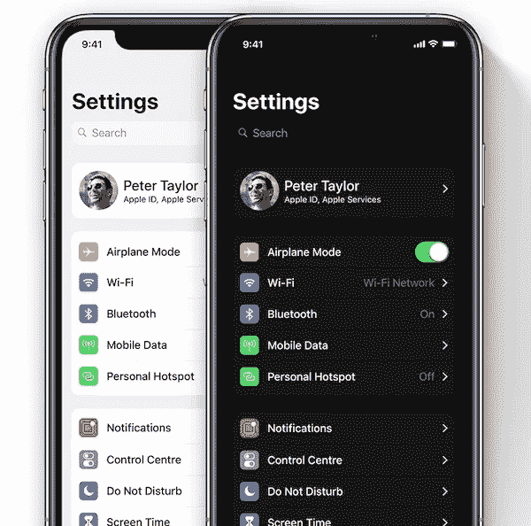
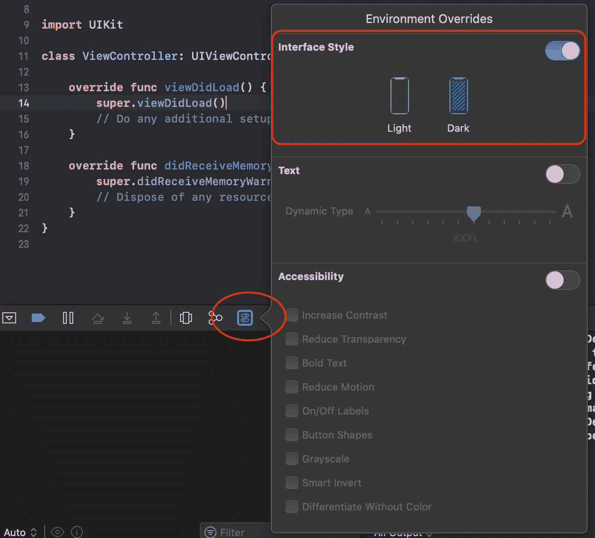
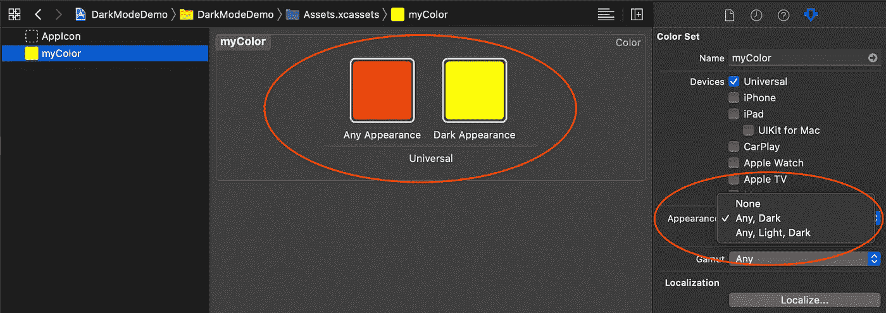

# 采用 iOS 黑暗模式

> 原文：<https://betterprogramming.pub/adopting-ios-dark-mode-e2970482aa5a>

## iOS 13 黑暗模式下的默认和自定义颜色和图像



iOS 13 黑暗模式

简而言之，为了在 iOS 中采用深色模式，你需要准备两套颜色或者图像。一个用于白天模式，一个用于夜晚模式。

看起来工作量很大，但是真的要看情况。如果你的应用程序没有为黑暗模式定制的图标、颜色或图像，那就很简单了。否则，这将需要一些工作，但我会告诉你一些方法来帮助你。

在进入细节之前，我们先来看看 iOS 13 中的黑暗模式是如何工作的。

# 用户界面元素颜色(语义颜色)

[UI 元素颜色](https://developer.apple.com/documentation/uikit/uicolor/ui_element_colors?changes=latest_minor)是一组新的标准颜色对象，用于标签、文本、背景、链接等等。仅在 iOS 13、tvOS 13 及更高版本上可用。

这意味着苹果还为所有系统 UI 组件准备了两套颜色。棘手的是，一个颜色名称实际上映射到两种颜色——一种用于白天模式，一种用于夜晚模式。例如:

```
lable.textColor = .label
```

`UIColor.label`实际上是白天模式下的黑色，夜晚模式下的白色。只要您使用元素颜色，当您的用户在白天模式和夜晚模式之间切换时，系统将为您处理颜色变化。

# 采用默认颜色的用户界面

如果项目中的一些 UI 组件使用默认的系统颜色，您可以简单地将它们更改为新的 UI 元素颜色。

## 程序化

```
self.label.textColor = .label
self.view.backgroundColor = .systemBackground
```

## 界面生成器


# 如何在模拟器中切换黑暗模式？

当您打开 Xcode 11 beta 或更高版本，在模拟器中运行应用程序时，会出现一个新的小环境覆盖图标。点击它，然后你可以在模拟器中切换黑暗模式。



# 采用定制颜色的用户界面

## 程序化

在 iOS 13 中，引入了一个新的`UIColor`初始化器:

```
init(dynamicProvider: @escaping ([UITraitCollection](https://developer.apple.com/documentation/uikit/uitraitcollection?changes=latest_minor)) -> [UIColor](https://developer.apple.com/documentation/uikit/uicolor?changes=latest_minor))
```

您可以根据`UITraitCollection`中的`userInterfaceStyle`属性自定义自己的颜色:

你可以简单地从`Assets`创建一个新的颜色集，然后在检查器面板下，将`Appearance`改为暗模式，然后你就可以设置两种颜色了。



在`Assets`中设置好颜色后，你可以在任何地方使用这个名称，当然，当黑暗模式切换时，系统会为你处理颜色变化。

# 采用带有定制图像的用户界面

与彩色相似，深色模式的图像也可以在`Assets`中设置。

在`Assets`中设置颜色或图像的好处是它是向后兼容的。这意味着你不需要在你的代码中说`if #available(iOS13, *)`。对于运行 iOS 12 及之前版本的应用，系统会自动使用白天模式的颜色或图像。