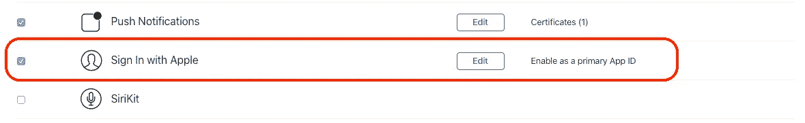
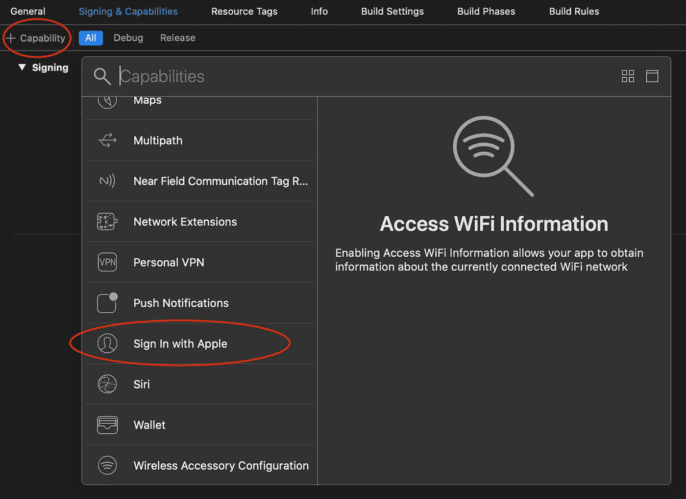
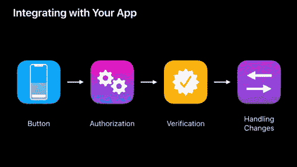

# 采用苹果登录

> 原文：<https://betterprogramming.pub/adopting-sign-in-with-apple-f75988ece191>

## 创建登录按钮，验证数据并处理用户授权更改


由 micha Kubalczyk 在 [Unsplash](https://unsplash.com/search/photos/apple?utm_source=unsplash&utm_medium=referral&utm_content=creditCopyText) 上拍摄的照片

随着苹果公司最近在 WWDC 宣布与苹果公司签约，作为一名开发者，你可以给你的用户一个全新的选择来创建一个帐户并登录你的应用程序。让我们深入了解一下如何在你的应用中加入苹果登录功能。

# 启用通过 Apple 登录到您的应用捆绑包 ID

登录您的开发者帐户。在你的应用标识符设置->功能下，勾选登录 Apple。



检查登录 Apple

# 启用从 Xcode 登录 Apple

打开 [Xcode 11](https://developer.apple.com/documentation/xcode_release_notes/xcode_11_beta_release_notes) beta 或更新版本。在项目设置中，选择【目标-】签约&功能，添加苹果签约。



添加从 Xcode 登录 Apple

# 实施概述



1.  创建一个“使用 Apple 登录”按钮。
2.  要求用户授权。
3.  根据您存储的数据验证用户数据(本地或来自服务器)。
4.  处理用户授权变更。

# 1.使用苹果按钮创建登录

# 2.要求用户授权

*   在`handleAuthorization`中，它通过`user name`和`email`信息请求来请求用户授权。
*   创建`AsAuthorizationController`时，需要同时提供`delegate`和`presentationContextProvider`。
*   `delegate`提供授权请求状态——失败(错误)或成功。
*   `presentationContextProvider`请求一个窗口来显示授权 UI。

# 3.根据您存储的数据验证用户数据(本地或来自服务器)。

在第 2 步，您将得到一个用户`credential`。

```
if let credential = authorization.credential as? ASAuthorizationAppleIDCredential
```

来自`credential`的一些信息值得一提:

*   用户邮箱:`credential.email`
*   用户名:`credential.fullName`
*   用户标识符:`credential.user`
*   授权状态:`credential.state`
*   刷新令牌:`let code = credential.authorizationCode, let codeStr = String(data: code, encoding: .utf8)`
*   访问令牌:`let idToken = credential.identityToken, let tokeStr = String(data: idToken, encoding: .utf8)`

# 4.处理用户授权变更

用户可以随时更改他们对应用程序的授权。我们的工作是尽早了解变化，并处理变化。

为了处理变更，我们需要存储从步骤 3 接收到的`user identifier`
信息。

然后，在`AppDelegate`，我们只需通过`user identifier`到`ASAuthorizationAppleIDProvider`进行验证，您可能会收到以下状态:

*   `authorized`
*   `revoked`
*   `notFound`

请注意，用户可以随时从 iOS 设置页面移除某个应用的授权，因此我们需要定期检查。