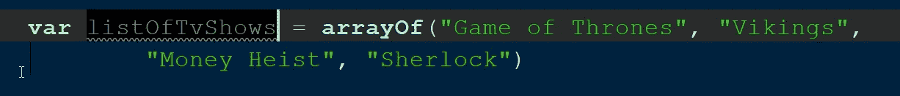
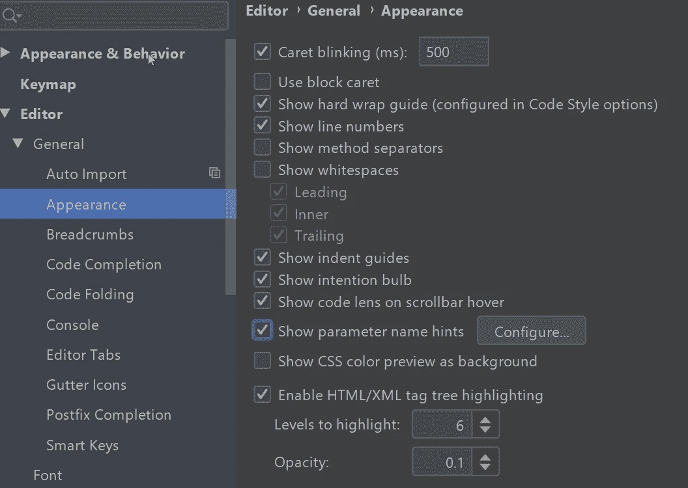
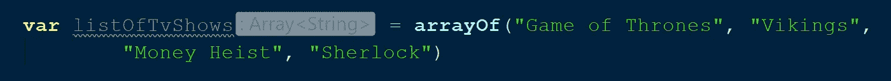
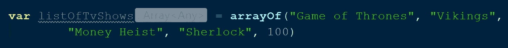
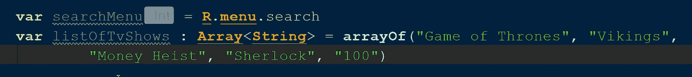
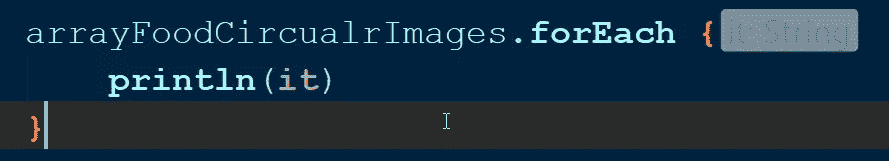
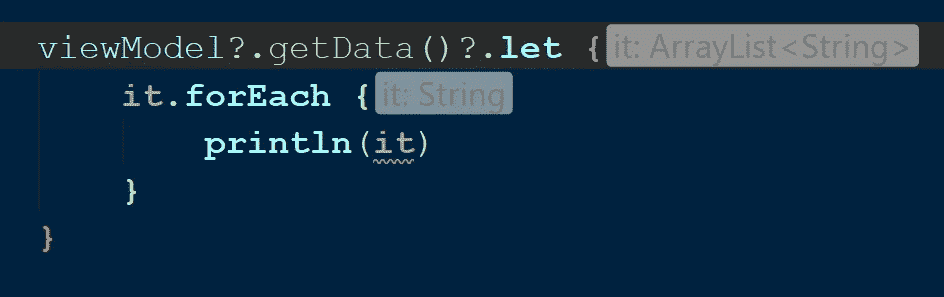
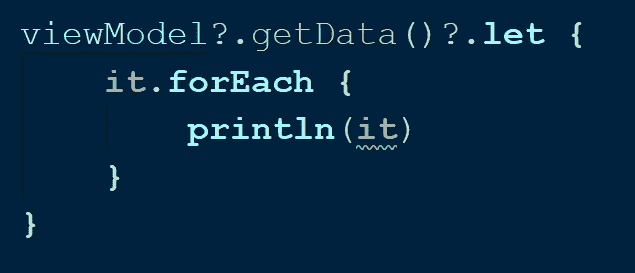
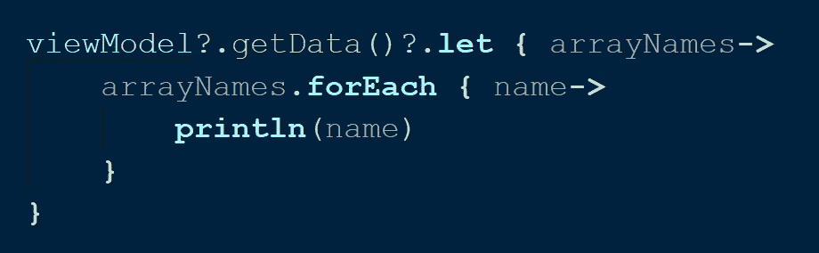

# Kotlin 中的高级 Android 编程(第 4 部分)

> 原文：<https://betterprogramming.pub/advanced-android-programing-in-kotlin-part-4-187b88fea048>

## 了解在 Kotlin 代码中应该避免什么

与 Java 不同，我们需要编写所有内容，Kotlin 编译器可以理解代码，并在幕后编写样板代码。例如，它可以推断变量声明中的类型。这提高了生产率并节省了时间。

如果你在网上搜索，你会发现 Kotlin 解决 Java 的许多棘手问题的许多方法，以及 Kotlin 的特性如何使开发更有趣。

## 从文章中摘录

有了 Kotlin 很酷的特性和性感的语法，很容易在这个过程中迷失方向，并以一种他们不打算使用的方式更拼命地使用它们(这可能不是一个错误，但肯定不会是理想的代码)。从长远来看，这可能会给你的团队带来严重的问题。因此在本文中，您将学习如何以更好的方式使用 Kotlin 独有的特性。

# 类型

先从`val`和`var`这样的基础东西说起吧。如果您以前是 Java 开发人员，您可能会觉得使用`val`和`var`比一直提到数据类型更好。

在 Kotlin 中声明数组列表

如果能看到变量`listOfTvShows`的类型不是更好吗？我们可以通过在 Android Studio 中启用提示来做到这一点。

如下导航:设置>编辑器>通用>外观—您需要选中“显示参数名称提示”

在 Android Studio 中启用提示选项

之后，您将看到没有用数据类型声明的变量的提示。启用提示选项后，看一下`listOfTvShows` 变量。

在 Kotlin 中声明数组列表(带提示)

这在很多情况下都很有用。但是如果你的团队中有人在列表中添加了一个整数呢？看一看。

在 Kotlin 中声明数组列表(带提示)

现在它不会显示任何错误，但是它会将列表的类型从`String` 更改为`Any`，并且您对它没有任何控制。所以只对简单的声明使用不带数据类型的`val`和`var`，但是当遇到这种情况时，最好花点时间提及数据类型。

基于上下文声明带有和不带有数据类型的变量

Kotlin 还提供了带有 lambdas 的函数，您可以编写函数体并返回结果，而不用提及返回类型是什么。看一看。

这很好，但是对于复杂的函数来说却不是这样；你必须检查上下文，选择合适的格式来使用。这些类型的 Kotlin 特性旨在简化您的开发，而不是从长远来看操纵我们。

请记住，代码应该不言自明，所以我建议您花点时间明确指定类型。有时候这个工具不会给你提示——比如在公关审查中。

# “它很棒，但重命名‘它’会很棒

功能在科特林是一等公民；你可以用一个函数作为参数，用它作为一个高阶函数来携带一组代码，并在其他地方执行它们，你可以返回值，以及一百个其他的东西。

为了在这个处理函数的世界里给你一点帮助，创建者想通过提供参数`it`来简化单参数 lambda 函数，这样你就不需要明确地提到它。看一看。

以“it”为参数的 Kotlin lambda 函数

这是一个很好的功能，我推荐使用它。但是你应该记住它不会总是有帮助的。看看下面的代码。

嵌套“it”示例

在这段代码中，`let`、`it`是一个`ArrayList`，但是在`for` 循环中，它是一个`String`。有点混乱，对吧？现在，让我们看看没有提示的相同代码。

没有提示的嵌套“it”示例

太疯狂了，对吧？没有可读性。当你对过多使用 Kotlin 感到绝望时，就会发生这种情况。

可维护性和可读性是代码的两个主要方面，所以要注意它们。为了即兴创作代码，我们必须用一个合适的名字重命名`it`。看一看。

重命名参数后的 Kotlin lambda 函数

同样，您不需要在`forEach`循环中重命名`it`，但这是您的选择。不要被太多的清晰或杂乱所困扰。这种类型的编码将帮助你的团队成员更快地理解上下文。

# 范围函数

Kotlin 中的作用域函数是另一个超级性感的特性——您可以使用它们让您的代码看起来像函数式编程。它们在类似于空检查的`let`、`viewholders`等情况下也很方便。我不打算讨论最有争议的话题——在哪里使用特定的范围函数；相反，我想谈谈如何不使用它们。

让我们来看一段代码，在这段代码中，我们没有使用任何 Kotlin 特性。看一看。

这很好——也许就像几年前我们在 Java 中做的那样，用所有重复的代码和东西。让我们用我们科特林的天性来活跃气氛。看一看。

编写这种类型的代码背后总是有一个好的意图，比如确定事情的范围和最小化样板代码。但是嵌套 scope 函数不是 Kotlin 风格的准则之一。即使在我的企业级编码中，我也编写嵌套作用域，因为我希望编写 Kotlin 风格的代码。

然而，我们需要极度控制使用范围函数的冲动。看看这段重写的代码，它具有简单的 Kotlin 特性。

这可能不是最简洁的代码，但在我看来，这是目前最好的不嵌套任何作用域函数的方法。用 Kotlin 写代码并不意味着你必须一直使用 Kotlin 的特性。

# 扩展功能很棒，但是不要过度扩展

当我第一次在演示中听说 Kotlin 中的扩展函数时，它非常棒；就好像我在一个神奇的地方，在那里我可以在我正在做的任何东西上写我自己风格的代码。但是我错了——让我们看看为什么。

> Kotlin 提供了用新功能扩展类的能力，而不必从类继承或使用设计模式。这些函数可以像原始类的方法一样以通常的方式调用。这种机制叫做*扩展函数。”
> ——*科特林的创造者

事实证明，扩展函数并不意味着使您的语法变得有趣(并不意味着这样做是错误的)，但主要目的是在一个类上实现额外的功能，从而在不创建新类的情况下实现特性。

在编写更简洁的代码的意义上，很容易赶上扩展函数；我也做这个。有时候我在把远程模型转换成本地数据库模型的过程中，把所有的功能都做成了扩展功能，一时没有实现。

不知何故，我在 KotlinConf 2019 上看到了 Huyen Tue Dao 的一个演讲，我在本文结尾提到了这个演讲。她向我展示了我对有效使用扩展的痴迷程度。

# 更新

要了解更多关于 Kotlin 的内容，请阅读 Kotlin 高级编程系列中的其他文章:

*   [“用科特林](https://medium.com/better-programming/advanced-android-programming-with-kotlin-5e40b1be22bb)进行高级编程”
*   [“kot Lin 高级编程—第二部分](https://medium.com/android-dev-hacks/advanced-android-programming-with-kotlin-part-2-aae2a15258b0)”
*   [“使用 Kotlin 进行高级编程—第 3 部分](https://medium.com/better-programming/advanced-programming-in-kotlin-2e01fbc39134)”
*   [“使用 Kotlin 进行高级编程—第 5 部分”](https://medium.com/better-programming/advanced-programming-in-kotlin-part-5-b674ce9e692f)

要了解更多关于 Kotlin 协同例程和 Kotlin 的其他高级特性，请阅读以下文章:

*   [科特林协程，从基础到高级](https://medium.com/better-programming/kotlin-coroutines-from-basics-to-advanced-ad3eb1421006)
*   [科特林的密封班](https://medium.com/@sgkantamani/sealed-classes-in-kotlin-e48e072daca8)
*   [新 Kotlin 流的异步数据加载](https://medium.com/better-programming/asynchronous-data-loading-with-new-kotlin-flow-233f85ae1d8b)

# 结论

在我们结束之前，我要感谢呼延屠刀。我从她在 KotlinConfig 2019 上的演讲中学到了我在这里提到的许多概念。如果你有兴趣，看看吧:

感谢您的阅读。