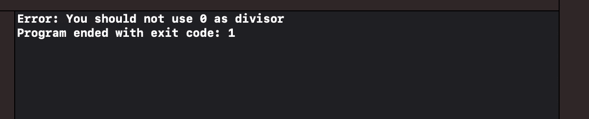
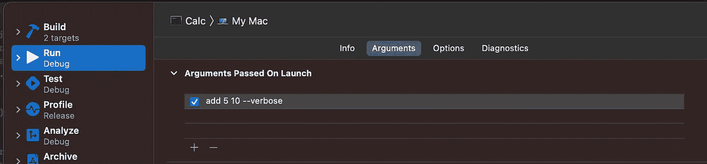
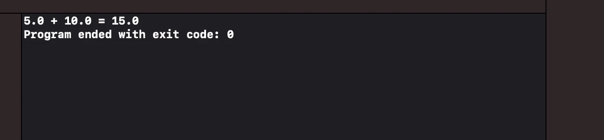
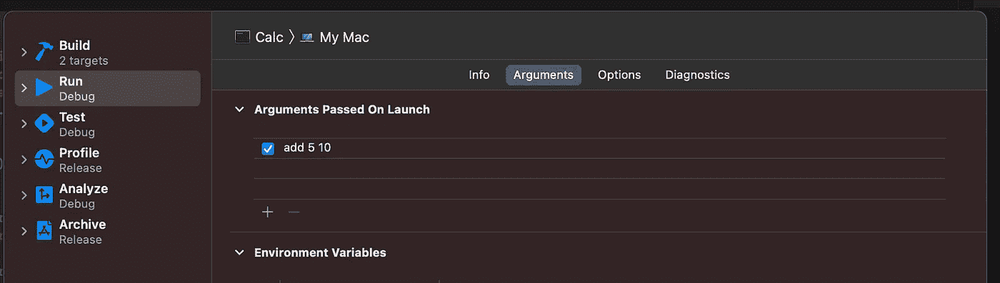
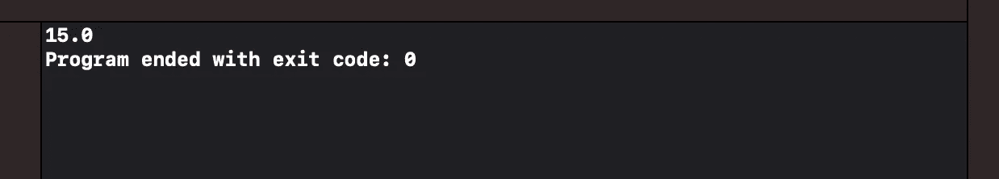
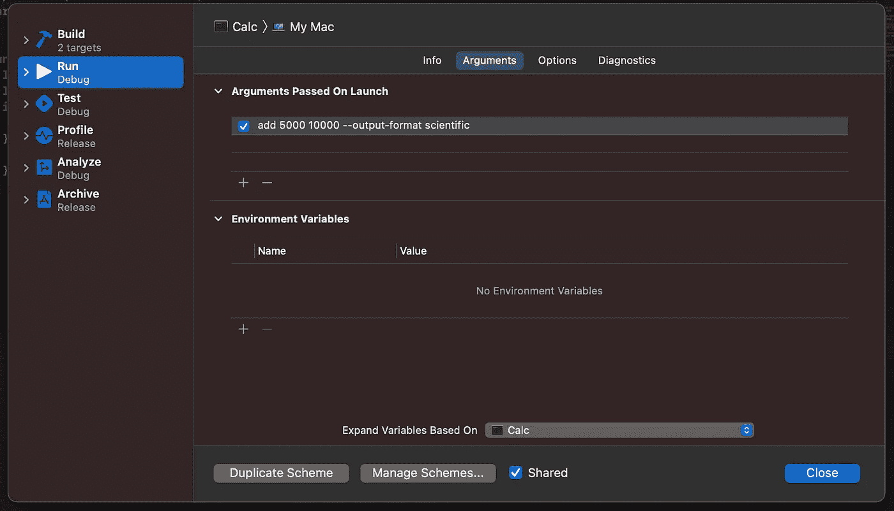
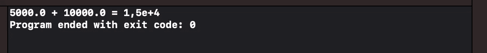

# 基于 Swift 的 CLI 应用程序的高级参数解析

> 原文：<https://betterprogramming.pub/advanced-argument-parsing-for-a-swift-based-cli-application-6f42ac09e838>

## 如何在我们的 CLI 应用程序中指定不同类型的参数并利用类型安全


由[汉娜·约书亚](https://unsplash.com/@hannahjoshua?utm_source=medium&utm_medium=referral)在 [Unsplash](https://unsplash.com?utm_source=medium&utm_medium=referral) 上拍摄的照片。

上周，我们开始了一个新项目，从命令行实现了一个非常基本的计算器应用程序。

我们开发这个项目是为了探索由苹果公司提供的 [ArgumentParser](https://github.com/apple/swift-argument-parser) 库，它为我们提供了从标准输入中读取用户输入的自动化。

本周，我们将深入探讨一些更高级的功能。在开始之前，我建议快速浏览一下上周的代码，以刷新一些概念。

# 验证:实现 Div 命令

我们的应用程序使用 Comand 模式作为主要的架构风格。每当我们需要添加一个新命令时，我们知道我们必须用一个定义新命令的新结构来扩展`Command`名称空间。

这个结构最重要的需求是实现`[ParsableCommand](https://github.com/apple/swift-argument-parser/blob/main/Sources/ArgumentParser/Parsable%20Types/ParsableCommand.swift)`协议，该协议让我们定义命令的`configuration`，并要求我们实现`run()`方法来实际执行一些工作。

我们可以实现另一种方法:T4 方法。这种方法允许我们清楚地将验证代码与执行代码分开。

在下面的代码中，我们实现了执行除法的`Div`命令。当除数为`0`时，不定义该操作。这是利用`validate()`方法验证这一条件的绝佳机会:

像往常一样，记住将这个新命令添加到`Main`的`subcommand`属性中。否则，`Calc`应用程序无法识别该命令。

这是用`Div`命令更新的新`main`:

现在，如果我们运行将零作为除数的`Calc`应用程序，我们会得到以下错误消息:



您可以看到应用程序如何自动使用`LocalizedError`协议的`errorDescription`属性。

# 命令属性包装:标志

上周，我们看到了如何为命令定义参数。这些参数是我们的命令将用来执行其操作的参数。

我们可以使用其他属性包装器来定制命令的行为方式。最简单的是`@Flag`包装。我们可以指定一个新的属性，并用这个属性包装器对其进行注释。

然后，我们指定一个默认值:如果在执行时没有指定，这就是标志所采用的值。一旦定义了属性，我们可以在`command`方法中处理它来改变命令行为。下面的代码显示了如何添加一个`verbose`标志以及如何在`run()`方法中使用它:

第 18 行到第 20 行定义了新标志。它还允许我们添加一个`help`属性来记录它的用法。在第 26 行，我们访问标志的值并基于它执行不同的操作。

我们可以通过进入常用的`Edit Scheme...`屏幕来指定是否要在启用标志的情况下运行应用程序。在下面的例子中，我们传递标志。所以它的值会是`true`。



当我们运行应用程序时，我们获得以下输出:



相反，如果我们决定不传递标志或禁用它，我们可以从传递给应用程序的参数列表中删除它。在这种情况下，将使用标志的默认值(`false`)。



正如所料，我们将获得以下非详细输出:



# 命令属性包装:选项

我们可以使用第二个属性包装器来修改命令的行为方式。这个属性包装器是`@Option`包装器，通常在值可以采用不同的值时使用——可能来自`enum`或者可以是来自用户的自定义输入(例如文件路径)。

争论有一个好处:它们带有一个标签。这可以帮助我们在使用它们时理解它们的含义。例如，我们可以考虑实现一个选项来改变我们计算的输出格式。我们可能想用`standard`符号或使用`scientific`符号来查看它们。

首先，让我们实现格式化选项:

我们扩展了`Command`名称空间来添加`Format`枚举。这里，我们将一个`scientificFormatter`实现为一个`static`属性，该属性只在第一次访问格式化程序时计算一次。然后我们继续使用第一次创建的格式化程序(第 3 到 9 行)。

之后，我们创建了两个我们想要处理的不同案例，并实现了一个基于枚举值提供不同输出的方法。

从 ArgumentParser 的角度来看，最重要的信息是`[ExpressibleByArgument](https://github.com/apple/swift-argument-parser/blob/main/Sources/ArgumentParser/Parsable%20Types/ExpressibleByArgument.swift)`协议。该协议使用户插入的文本能够被自动解析为可用选项之一。

最后，我们可以更新`Add`命令，根据这个选项产生不同的输出。

让我们定义一个用`@Option`属性包装器注释的属性。我们还可以为`help`参数添加一个漂亮的描述，这样我们就可以免费获得一些文档。请注意我们如何将默认值传递给属性。在这种情况下，如果我们省略`--output-format`选项，将使用默认值。

然后，在`run()`方法中，我们可以利用指定的选项，基于它计算不同的输出。以下代码显示了如何使用输出格式`option`修改`Add`结构:

现在，从`Edit Scheme...`中，我们可以更新我们的参数，用`scientific`选项传递新的`--output-format`选项:



如果这样做，我们将获得以下输出:


请注意，我们甚至可以无缝地将标志和选项混合在一起。例如，如果我们传递以下参数:

```
add 5000 10000 --verbose --output-format scientific
```

我们获得以下输出:



# 命令属性包装:OptionGroup

我想谈的最后一个包装器是`@OptionGroup`。当我们必须找出不同命令之间共享的一些属性时，这个包装器就派上了用场。

例如，`verbose`和`outputFormat`属性不仅对`Add`命令有意义，对`Div`命令也有意义。我们要尽可能遵循[干](https://en.wikipedia.org/wiki/Don%27t_repeat_yourself)的原则。因此，我们希望重用那些共享的属性。

实现这一点的第一步是创建一个独立的结构，并使其符合`[ParsableArgument](https://github.com/apple/swift-argument-parser/blob/main/Sources/ArgumentParser/Parsable%20Types/ParsableArguments.swift)`协议。然后我们可以从`Add`命令中剪切并粘贴两个属性:

一旦我们完成了这些，我们就可以简单地修改`Add`和`Div`命令，添加一个`CommandArgs`类型的属性并用`@OptionGroup`包装器对其进行注释。

我们需要稍微修改一下`run`方法来访问新字段中的属性。这是最后一个`Add`命令:

通过一行代码，我们可以共享不同共享参数的定义。从现在开始，我们可以在任何需要的地方添加选项组。

# 结论

在今天的文章中，我们探索了 [ArgumentParser](https://github.com/apple/swift-argument-parser) 库的一些高级功能。我们学习了如何传递[标志](https://github.com/apple/swift-argument-parser/blob/main/Sources/ArgumentParser/Parsable%20Properties/Flag.swift)和[选项](https://github.com/apple/swift-argument-parser/blob/main/Sources/ArgumentParser/Parsable%20Properties/Option.swift)以及如何构建我们的代码，这样我们就不会一遍又一遍地重复相同的参数。

对于 ArgumentParser 库，我们可以做更多的事情。它让我们传递一系列参数、可选参数、带有子命令的命令等等。如果你感兴趣或者你需要一些更高级的特性，我建议你看一下库本身提供的各种[例子](https://github.com/apple/swift-argument-parser/tree/main/Examples)。

我相信你会找到你想知道的一切。我希望这些文章能说服您用 Swift 编写工具。如果你想知道如何在你的公司内部署你的工具，我[写了另一篇关于这个主题的文章](https://medium.com/swlh/export-swift-cli-apps-f9aaaca08772)。