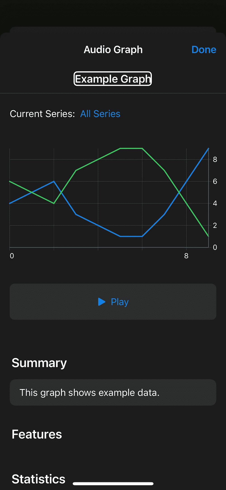
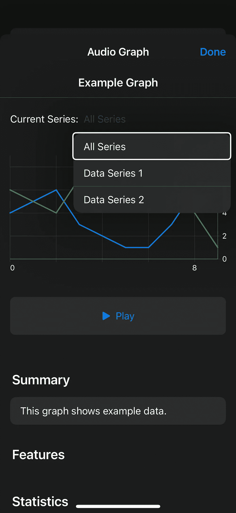
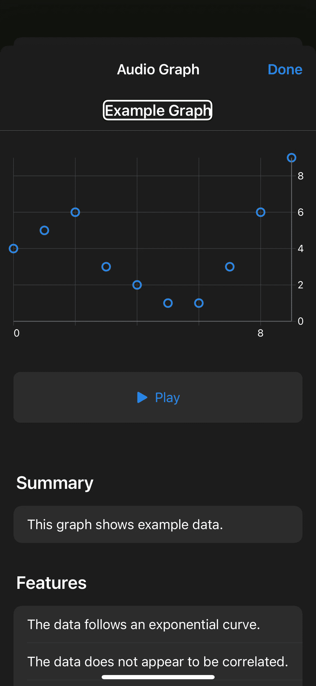
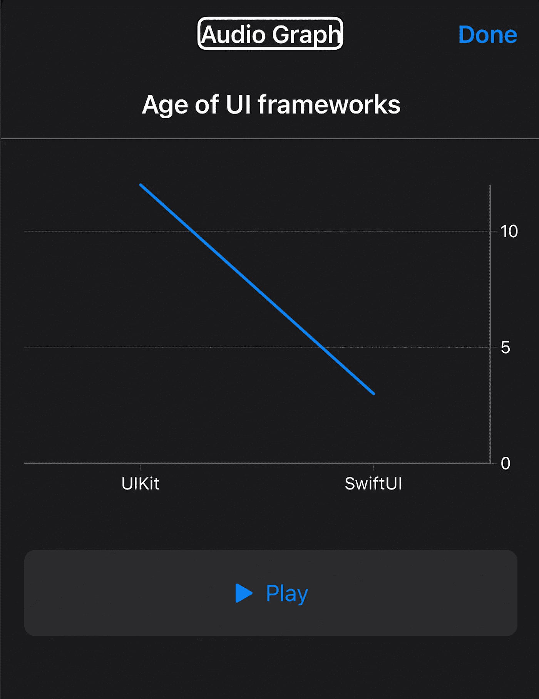
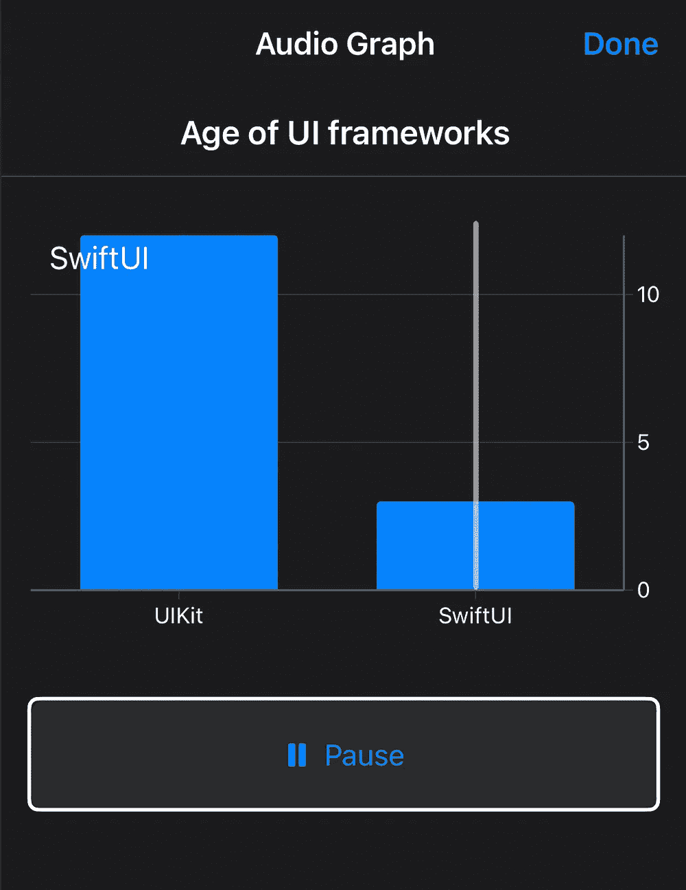
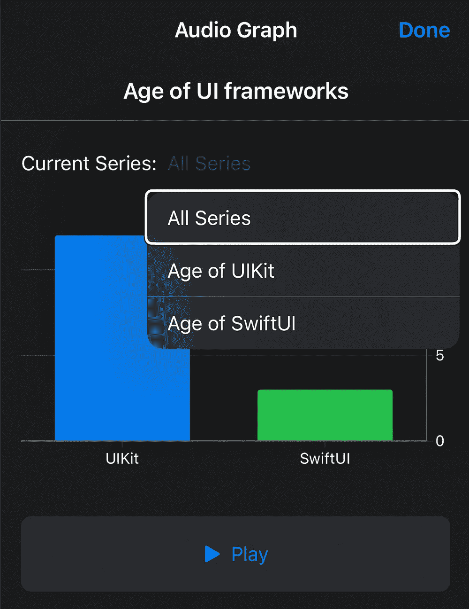
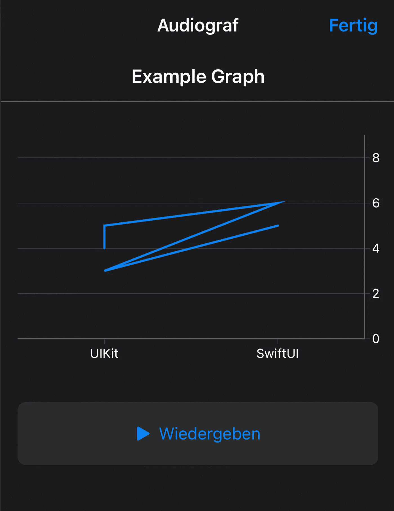

# Swift 中的高级音频图表

> 原文：<https://betterprogramming.pub/advanced-audio-graphs-in-swift-e43e048840cd>

## 使图形和图表易于访问

Pawel Czerwinski 在 [Unsplash](https://unsplash.com/?utm_source=unsplash&utm_medium=referral&utm_content=creditCopyText) 上拍摄的照片

在第一部分[Swift 和 iOS 15 中的音频图入门](/getting-started-with-audio-graphs-in-swift-7502979494f6)中，我们看了如何创建一个基本的音频图。在这一部分，我们将更进一步，看看如何在一个图表中呈现多个数据系列，并使用不同类型的轴。

在本教程结束时，您将准备创建更复杂的音频图，这将极大地提高您的应用程序对视力受损用户的可用性。

正如苹果在会议上所说的 [*在你的应用程序中加入图表的可访问性*](https://developer.apple.com/videos/play/wwdc2021/10122/) *:*

> 你看不到的图表没有价值

所以让我们开始吧！

# 添加其他数据系列

在第一部分中，我们已经看到了如何在音频图中显示一个数据系列。让我们通过添加另一个系列来改变这一点，并检查这将是什么样子:

`// 1` —数据序列是由 x 和 y 值组成的`AXDataPoint`对象的数组。就像以前一样，我们使用一个由代表 y 值的`Double`值组成的数组，并将它们映射到数据点。通过使用`enumerated`，我们可以方便地访问值及其索引。

`// 2` —这次我们不是只创建一个数据系列，而是创建第二个数据系列，就像我们在第一步中所做的那样。我们再次使用一组`Double`值，并将它们转换成一组`AXDataPoint`值。

`// 3`—在创建`AXChartDescriptor`时，我们已经传入了一个`AxDataSeriesDescriptor`的数组。但是这次，我们创建并返回两个包含两个数据系列的描述符。在真实的应用程序中，请确保使用有意义的名称，因为它们显示在音频图表详细信息页面上。

使用 VoiceOver 打开“音频图表详细信息”页面，选择图表并向下滑动，直到听到图表详细信息。

如果您需要如何方便地激活和使用 VoiceOver 的快速提示，请查看[第一部分](/getting-started-with-audio-graphs-in-swift-7502979494f6)。

这一次，我们可以在详细信息页面上看到这两个数据系列。用户可以选择一次收听所有系列或者只收听一个特定系列。

传递给`AXDataSeriesDescriptor`的名称显示在下拉菜单中，以更改所选系列。

音频图表详细信息页面如下所示:

但是要注意，在播放音频图而不显示详情页的时候，所有的数据序列都会一次播放完。

这使得很难理解发生了什么。

用户需要转到详细页面并更改当前选择的系列，以便更好地理解。

# 显示不连续的数据系列

接下来，我们来看看非连续数据序列。从上一个示例开始，再次删除第二个数据系列。

此外，对于剩余的数据系列，将`isContinuous`的值更改为`false`。

您的`series`属性应该如下所示:

打开音频图表详细信息页面，查看图表。不再是折线图了。

相反，它由不以任何方式连接的独立数据点组成。

按下播放按钮，您将听到不同的音调，每个数据点一个音调。

# 对 x 轴使用类别

在前面的例子中，我们使用了一个数字 x 轴。还有第二种类型的轴:分类轴。让我们看看这是如何工作的！

`// 1` —分类轴以`Strings`作为 x 轴的标题。为了防止输入错误并使使用类别更容易，我们创建了一个名为`Category`的新枚举。在本例中，我们将比较 *UIKit* 和 *SwiftUI* 的年龄，因此这些是我们的类别。

注意:您不需要创建这样的枚举，使用`Strings`由您决定。但是我喜欢创建一个枚举，这样我就可以使用自动补全并防止输入错误。

`// 2` —在下面的步骤中创建`AXCategoricalDataAxisDescriptor`时，我们需要按照 x 轴上显示的类别顺序传递。因此，我们将订单定义为`Category`内部的静态变量。在这种情况下，我们希望首先呈现 UIKit，其次是旁边的 SwiftUI。

接下来，我们创建两个轴。x 轴是我们之前没用过的一个`AXCategoricalDataAxisDescriptor`。代替参数 an `AXNumericDataAxisDescriptor`，它只需要一个标题和我们在上一步中定义的顺序。y 轴是一个`AXNumericDataAxisDescriptor`，就像我们之前看到的一样。

`// 4` —我们想要在音频图中显示的每个数据点都需要有一个 x 值的类别和一个 y 值的数字。我们可以很容易地将数据准备成一个元组数组，其中第一项是类别，第二项是数字。UIKit 已经 12 岁了，SwiftUI 已经存在 3 年了，因此这些是我们的 y 值。

`// 5` —最后，我们将`Category`和`Double`的元组映射到一个`AXDataPoints`的数组。我们使用类别`rawValue`作为 x 轴值，数字作为 y 轴值。创建`AXDataSeriesDescriptor`和`AXChartDescriptor`的工作方式与之前相同。

再次启动应用程序并导航至音频图表详细信息页面。它应该是这样的:

不出所料，我们可以看到左边是 UIKit，右边是 SwiftUI。用分类轴代替数字轴不是很容易吗？

除了使用连续数据系列，我们还可以使用非连续数据系列。这将产生左侧音频图，其中两个条形表示类别的值。

另一种方法是创建多个数据系列，每个类别一个。这产生了第二个音频图。这样，用户可以通过更改当前系列来专注于一个类别。

但是注意不要为同一个类别增加多个点。否则，您可能会得到一个非常奇怪的图形，如下图所示:

前两个点属于 *UIKit* ，然后是 *SwiftUI* 的一个数据点，再次是 *UIKit* 的一个数据点，最后是 *SwiftUI* 的一个数据点。

视觉外观和播放的声音都没有多大意义，因此在使用分类 x 轴时要小心。

# 音频图还没完成？

毫无疑问，音频图是惊人的！它们让视障人士能够以一种很好的方式理解图表。

但是在玩和探索的过程中，我发现一些事情似乎并不像预期的那样工作。两个例子是`AXNumericDataAxisDescriptor`的`gridlinePositions`和`AXChartDescriptor`初始化器中的`additionalAxes`。

当创建轴的描述符时，我们可以为参数`gridlinePosition`传入一个数组`Double`。这个名字表明我们可以改变网格线的位置，但是不管用什么数字，我都看不到变化。苹果文档没有进一步的信息。

同样适用于`additionalAxes`，它是一个`AXDataAxisDescriptor`的数组。

创建更多的分类轴或数轴似乎对显示的音频图表详细信息页面没有影响。

对这些附加轴的唯一提示是*统计*部分中的信息。

如果你想给一个数据点添加额外的值以在`additional axes`中显示它们，它们在这里列出[。](https://developer.apple.com/documentation/accessibility/axchartdescriptor/3747415-additionalaxes)

总之，音频图是伟大的，但也许仍然需要一些时间来充分发挥作用。如果你有其他经历或更多信息，请在评论中或通过 [Twitter](https://twitter.com/HeyDaveTheDev) 告诉我。期待您的反馈！

# **何去何从**

在本教程中，我们已经看到了音频图表是多么灵活。显示多个数据系列甚至使用不连续的数据集是非常容易的。我们还讨论了如何使用分类轴而不是数字轴。

还有很多内容要讲。甚至还有一个名为`AXLiveAudioGraph`的音频图的实时更新版本。看到苹果在改善 iOS 的可访问性上投入这么多精力，真是令人惊讶。但是，使用给定的工具并让每个人都能使用我们的应用程序，这取决于我们开发人员。

如果您有任何问题或意见，请在评论中告诉我，或者通过 [Twitter](https://twitter.com/HeyDaveTheDev) 联系我。

# 资源

 [## Apple 开发者文档:音频图表

### 在图表中提供数据的声音表示。

developer.apple.com](https://developer.apple.com/documentation/accessibility/audio_graphs)  [## 让您的应用中的图表具有可访问性— WWDC21 —视频— Apple Developer

### 图表是理解数据的重要工具，对于理解我们自己、我们的健康、我们的财务状况至关重要…

developer.apple.com](https://developer.apple.com/videos/play/wwdc2021/10122/)  [## SwiftUI 中的音频图形

### 就可访问性而言，图表是复杂的事物之一。幸运的是，iOS 15 有了一个新功能…

swiftwithmajid.com](https://swiftwithmajid.com/2021/09/29/audio-graphs-in-swiftui/)